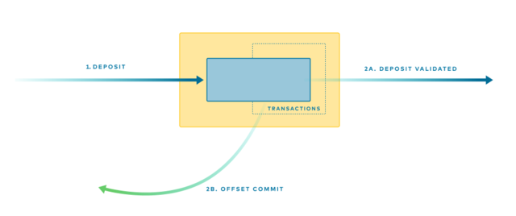
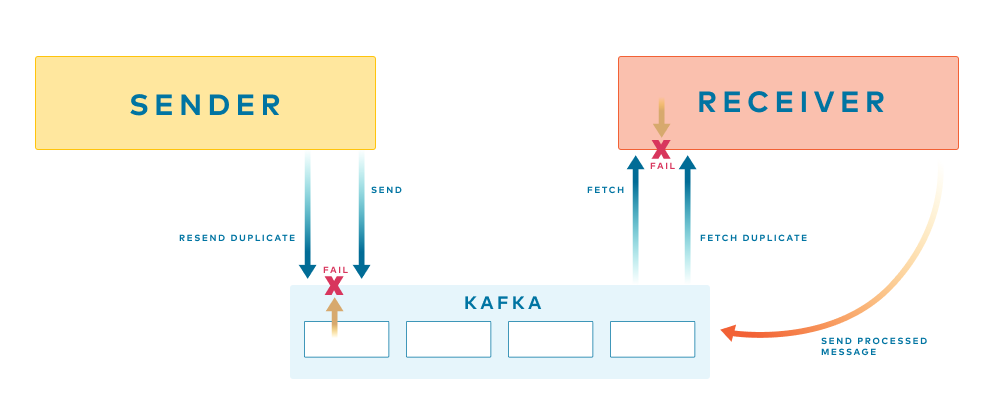
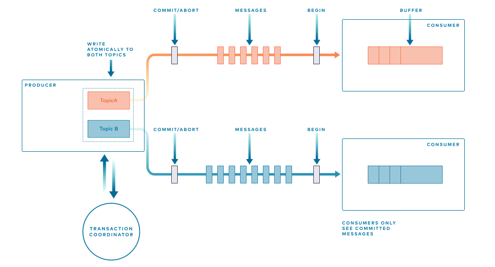
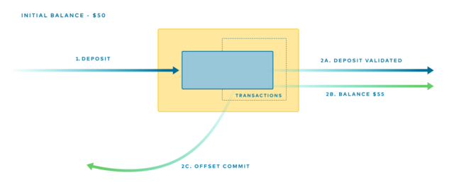

# 카프카 트랜잭션

## 참고자료

- [Building Systems Using Transactions in Apache Kafka®](https://developer.confluent.io/learn/kafka-transactions-and-guarantees/)
- [Distributed Snapshots: Determining Global States of Distributed Systems](https://blog.acolyer.org/2015/04/22/distributed-snapshots-determining-global-states-of-distributed-systems/)

----

## 1. 카프카의 트랜잭션

- 카프카는 Built-in 트랜잭션을 제공한다.
- 구현 방식은 데이터베이스의 트랜잭션과 사뭇 다르지만 결국 달성하고자 하는 목표는 비슷하다.
  - 실패하더라도 예측 가능하고 반복 가능한 결과를 생성하도록 보장하는 것.

### 카프카 트랜잭션이 하는 3가지 중요한 작업

1. 서로 다른 토픽에 메시지가 원자적으로 전송될 수 있도록 한다.
2. 많은 스트링밍 작업이 잘못된 결과를 얻게 하는 중복을 제거한다.
3. Kafka Streams와 스트리밍 데이터베이스 ksqlDB는 상태 저장소를 사용하면, 상태 저장소는 Kafka 토픽에 의해 지원된다. exactly-once 상태 저장 처리를 위해 여러 작업이 원자적으로 발생해야 한다. (상태 저장소에 쓰기, 백킹 토픽에 쓰기, 출력 쓰기, 그리고 오프셋 커밋)

## 다중 토픽 쓰기를 위한 트랜잭션 API

- Kafka는 각 컨슈머가 처리한 진행 상황을 `__consumer_offsets`이라는 특수 토픽에 오프셋으로 저장하여 기록한다.



- 정확히 한 번만(exactly-once) 저장하기 위해 
1. `2A` "입금 유효성 검사 완료" 메시지를 Kafka로 다시 보내느 작업
2. `2B` 적절한 오프셋을 `__consumer_offsets` 토픽에 커밋하는 작업
- 위 2가지 작업이 `단일 원자적 작업 a single atomic unit`으로 처리되야 한다.

```
//Read and validate deposits validated
Deposits = validate(consumer.poll(0))

//Send validated deposits & commit offsets atomically
producer.beginTransaction() 
producer.send(validatedDeposits) 
producer.sendOffsetsToTransaction(offsets(consumer)) 
producer.endTransaction()
```

---

## 2. 중복 발생

- 중복 이벤트는 브로커와 상호 작용할 때 발생하는 장애로 인해 토픽에 종종 유입된다.
  - ex1) producer가 쓰기에 대한 ack를 받는 것에 실패하면 재시도 => 중복된 이벤트 발생 가능성
  - ex2) consumer가 실패 모드로 인해 컨슈머 오프셋을 증가시키는 것에 실패 => 중복 소비 가능성 



- 트랜잭션이 이 문제를 해결해준다.
- 각 생산자마다 고유 식별자를 부여하고, 메시지에는 시퀀스 번호를 부여한다.
- 브로커는 고유한 시퀀스 번호를 통해 메시지가 이미 로그에 있는지 확인하고 있다면 해당 메시지를 폐기한다. => 중복 쓰기 방지
- 읽기 측면에서는 간단하게 중복 제거를 할 수 있지만, 카프카 트랜잭션은 데이터베이스와 유사한 보장을 하기 위해 전송된 모든 메시지를 `single atomic commit`으로 묶는다.
  - `멱등성 idempotence`은 브로커에 내장되어 있으며, 그 위에 원자적 커밋은 계층화되어 있다. 

----

## 3. 카프카 트랜잭션 내부 동작 원리

- 겉보기에는 DB 트랜잭션과 유사해 보이지만, 스트리밍 환경에 맞게 설계되었기 때문에 근본적으로 다르다.
- 핵심 차이는 여러 스트림을 통해 전파되는 `마커 메시지 Marker Messages`의 사용에 있다.

### 마커 메시지 작동 원리

- 마커 메시지는 `Snapshot Marker Model` 아이디어를 적용해 Chandy와 Lamport가 도입햇다.



#### (1) 트랜잭션 과정

1. 트랜잭션이 시작되면 관련된 각 토픽에 시작 마커 전송
2. 실제 트랜잭션에 포함된 메시지들이 전송
3. 트랜잭션의 모든 메시지가 기록된 후, 커밋 또는 중단 마커가 각 토픽에 플러시되며 트랜잭션을 마무리

#### (2) Consumer의 역할 및 커밋된 데이터 보장

- 트랜잭션의 목적은 커밋된 데이터만 다운스트림 프로그램에서 볼 수 있도록 보장하는 것이다.
- Consumer가 시작 마커를 받으면 커밋 마커가 도착할 때까지 메시지 처리를 막고 내부적으로 버퍼링을 시작한다.
- 커밋 마커가 도착한 후에는 버퍼링된 메시지들이 Consumer 프로그램에 `release`된다.

#### (3) 효율성을 위한 최적화

- 버퍼링 위치 이동: 메시지 버퍼링이 Consumer에서 브로커로 옮겨져 컨슈머의 메모리 부하가 줄어든다.
- 시작 마커 생략: 다음 트랜잭션을 위한 시작 마커는 커밋/중단 마커가 암시적으로 드러난다.

### 트랜잭션 코디네이터와 원자성 보장

- `트랜잭션 코디네이터 Transaction Coordinator`는 각 카프카 브로커에서 전용으로 실행되며, 커밋 마커를 전송하는 작업을 한다.
  - 토픽, 파티션, 브로커 위치에 관계없이, 트랜잭션에 참여하는 모든 메시지 배치에 대해 커밋 마커가 원자적으로 추가되도록 보장하기 위해 필요하다.
- 트랜잭션을 궁극적으로 확정하며(`ultimate arbiter`), 이를 위해 카프카에 저장되는 영구적인 트랜잭션 로그를 유지 관리한다.
  - 이 단계에서 `two-phase commit`을 구현한다고 한다.

### 성능 오버헤드

- 메시지 하나마다 커밋해야 한다면 성능 저하가 눈에 띄겠지만, 실제로는 배치 내의 모든 메시지에 걸쳐 평균화되어 오버헤드가 최소화된다.
  - 이를 통해 `최악의 경우 지연 시간 worst-case latency` 사이의 균형을 맞출 수 있다.
- ex) 100ms마다 커밋하고 메시지 크기가 1KB인 배치의 경우, `최소 한 번 at-least-once` 전송 방식 대비 오베헤드가 3% 수준으로 측정된다.
- 그 외에도 실패 복구, 좀비 프로세스 차단, ID 할당 등과 관련된 많은 미묘한 세부 사항이 있다고 함.

----

## 4. 다중 작업 커밋 Multi-Operation-Commits

### 메시징과 상태 관리를 원자적으로 연결

- 카프카 트랜잭션이 가진 가장 강력한 특징 중 하나
- 메시징과 상태 관리를 `single atomic unit`으로 묶는 기능을 제공한다.
- Kafka Streams에서 가장 흔히 사용되는 데이터 저장 수단은 상태 저장소인데, 이는 디스크 기반 해시 테이블이며 Kafka Topic에 의해 내구성이 보장된다.
- 트랜잭션을 사용하면 상태 저장소에 대한 쓰기와 다른 출력 토픽에 대한 쓰기를 함께 묶어 처리할 수 있다.

### 예시

1. 초기 잔액 50$ 
2. 5$ 입금
3. 서비스는 5$가 입금되었다는 사실을 기록
4. 또한 업데이트된 잔액(55$)을 기반으로 로그 기반 상태 저장소에 기록하여 저장



- 위의 예시의 경우 총 3가지 메시지가 원자적으로 전송된다.

1. 입금 메시지 (a deposit)
2. 잔액 업데이트 메시지 (a balance update)
3. 승인 메시지 (the acknowledgment)


- Kafka Streams에서 트랜잭션을 활성화하면, 이 모든 작업은 자동으로 트랜잭션에 래핑된다.
  - 이는 잔액이 입금 내역과 항상 원자적으로 동기화되도록 보장한다.
- 이러한 방식을 통해 이벤트를 수신하고, 처리하며, 새로운 이벤트를 생성할 뿐만 아니라 현재 잔액과 같은 상태도 Kafka 내에서 관리하는 메시징과 상태 관리를 개념을 융합할 수 있따.

-----

## 5. 한계

- 카프카 트랜잭션은 오직 입력은 Kafka에서 오고, 출력은 Kafka Topic에 기록되는 상황에서만 작동한다는 것이 한계다.
- 외부 시스템과의 상호작용은 트랜잭션 보장의 범위 밖이다.
  - ex) 외부 서비스 호출, 데이터베이스 업데이트
- 즉 카프카 트랜잭션은 XA와 같은 기술이 제공하는 `시스템 간 inter-system` 트랜잭션이 아니다.

