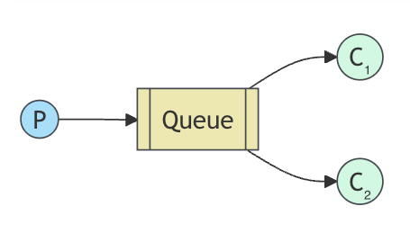
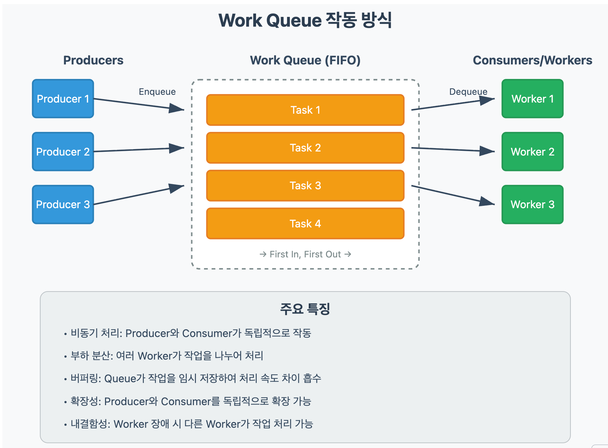
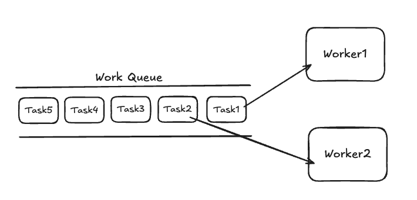
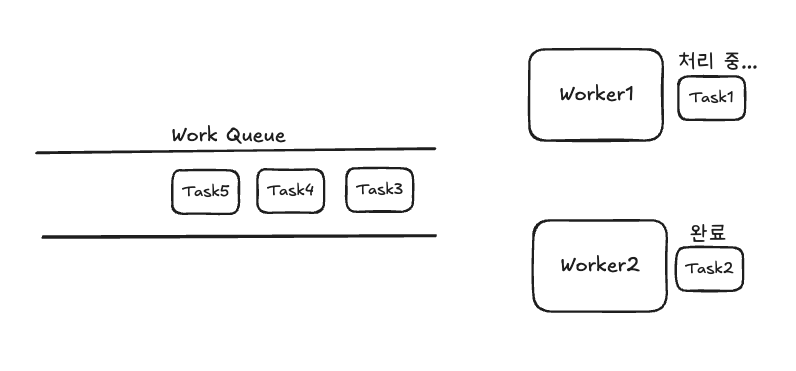
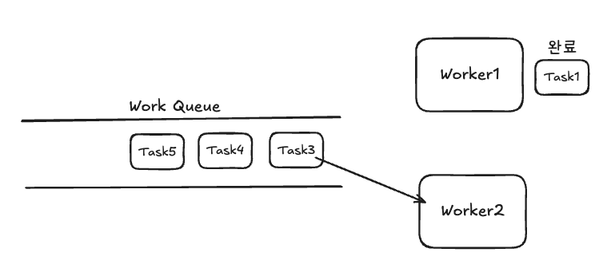
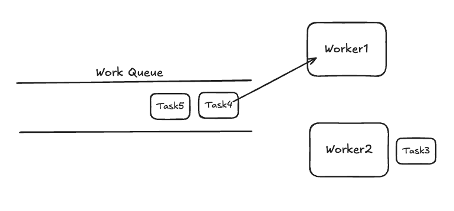
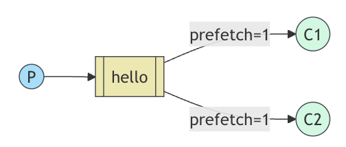

# RabbitMQ tutorial - Work Queues

- [링크](https://www.rabbitmq.com/tutorials/tutorial-two-spring-amqp)

- 이전 예시에서는 named queue로부터 메시지를 수신하는 프로그램을 작성했다. 이번엔 시간이 많이 소요되는 작업을 분배할 때 사용하는 `작업 대기열 Work Queue`를 생성할 것이다.
- `Work Queue`는 리소스 집약적인 작업을 즉시 수행하지 않고 완료될 때까지 기다리지 않는다.
  - 대신 나중에 작업을 수행하도록 예약한다. 작업을 메시지로 캡슐화하여 대기열로 보낸다.
  - 백그라운드에서 실행되는 작업자 프로세스가 작업을 꺼내면(pop) 작업을 실행한다.
  - 많은 `workers`를 실행하면 작업이 공유된다.



## 작동 방식



- Work Queue는 Worker가 작업을 마치는대로 순차적으로 Task를 가져와 처리한다.






## 메시지 확인 Acknowledgement

- 긴 작업을 시작했다가 일부만 완료한 채로 중단되면 어떻게 될까?
- Spring AMQP는 기본적으로 메시지 확인에 대해 보수적인 접근 방식을 취한다.
- 만약 리스터가 예외를 던지면 컨테이너는 다음 메소드를 호출한다.

```java
channel.basicReject(deliveryTag, requeue);
```

- 명식적으로 다음과 같이 설정하지 않는 한 `requeue`는 기본적으로 `true`다.

```java
defaultRequeueRejected=false
```

- 또는 리스너가 `AmqpRejectAndDontRequeueException`를 던질 수도 있다.
  - 일반적으로 기대되는 동작
- 이 모드에서는 Acknowledgement를 잊어버리는 것에 대해서 걱정할 필요가 없다고 한다.
  - 메시지를 처리한 후 리스너는 아래 메소드를 호출한다.

```java
channel.basicAck();
```

- Acknowledgement는 전달받은 것과 동일한 채널에서 전송되어야 한다.
  - 다른 채널을 사용하여 확인을 시도하면 채널 수준의 프로토콜 예외가 발생한다.
- Spring AMQP가 일반적으로 이것을 처리하지만, RabbitMQ Java 클라이언트를 직접 사용하는 코드가 있다면 이 점을 명심해야 한다.

> #### 잊어버린 확인 (Forgotten acknowledgment)
> - RabbitMQ Java 클라이언트를 사용하면 `basicAck()`를 놓칠 수 있다.
>   - 클라이언트가 종료될 때 메시지가 재전송될 것이며, RabbitMQ는 `확인되지 않은 unacked` 메시지를 해체할 수 없으므로 점점 더 많은 메모리를 소비하게 될 것이다.
> - 이 문제를 디버깅하기 위해 `rabbitmqctl`을 사용하여 `messages_unacknowledged` 필드를 출력할 수 있다.
> ```bash
> sudo rabbitmqctl list_queues name messages_ready messages_unacknowledged
> ```

##  메시지 영속성 Message persistence

- Spring AMQP는 메시지가 기본적으로 영속성을 가진다.
  - 메시지가 최종적으로 들어갈 큐 또한 `내구성 durable`이 있어야 한다.
  - 내구성이 없다면 브로커 재시작 시, 큐가 사라지게 되고 메시지 또한 날아가게 된다.
- 메시지 영속성을 더 세밀하게 제어하려면, `RabbitTemplate#convertAndSend(...)` 메소드에서 `MessagePostProcessor` 파라미터를 활용해야 한다.
  - `MessagePostProcessor`는 메시지가 실제로 전송되기 전에 콜백을 제공하므로, 메시지의 `페이로드 payload`나 `헤더 header`를 수정하기 좋은 지점이다.

> #### 메시지 영속성 참고사항
> - 메시지 영속성을 가지고 있다고 해도 메시지가 손실되지 않는다고 완전히 보장할 수는 없다.
>   - RabbitMQ에게 메시지를 디스크에 저장하라고 지시하지만, RabbitMQ가 메시지를 수신한 후 아직 저장하지 않은 짧은 시간의 공백이 여전히 존재한다.
> - 또한 RabbitMQ는 모든 메시지에 대해 `fsync(2)`를 수행하지 않는다.
>   - 메시지가 디스크에 실제로 쓰이지 않고 캐시에만 저장될 수 있다는 말이다.
>   - 영속성 보장은 약간 모자라 보일 수 있지만, 간단한 작업 큐로는 충분하다.
>   - 더 강력한 보장이 필요하다면 `발행자 확인 publisher confirms`를 사용할 수 있다. (링크: [Consumer Acknowledgements and Publisher Confirms](https://www.rabbitmq.com/docs/confirms))

## 공정한 분배(Fair dispatch) vs 라운드 로빈 분배(Round-robin dispatching)

- 기본적으로 RabbitMQ는 각 메시지를 순서대로 다음 `소비자 consumer`에게 보낸다.
  - `라운드 로빈`을 사용하면 평균적으로 모든 소비자는 동일한 수의 메시지를 받게 된다. => 하지만 메시지의 크기가 다 다르기 때문에, 100% 정확히 공평하게 분배된다고 볼 수 없다.
  - RabbitMQ는 소비자의 `확인되지 않은 unacknowledged` 메시지 수를 보지 않고, 그저 맹목적으로 n번째 메시지를 n번째 소비자에게 분배할 뿐이다.
- Spring AMQP의 기본 설정은 `공정한 분배 Fair dispatch`이다.
- `AbstractMessageListenerContainer`는 `DEFAULT_PREFETCH_COUNT` 값을 250으로 설정한다.
  - 만약 `DEFAULT_PREFETCH_COUNT`가 1로 설정되었다면, 라운드 로빈처럼 동작할 것이다.



> #### prefetchCount
> - 대부분의 경우 `prefetchCount`를 1로 설정하는 것은 너무 보수적이며 소비자의 처리량을 심각하게 제한할 수 있다.
> - 몇 가지 사례: [prefetchCount](https://docs.spring.io/spring-amqp/reference/amqp/containerAttributes.html#prefetchCount)
> - 더 자세한 내용: [Channel Prefetch Setting (QoS)](https://www.rabbitmq.com/docs/confirms#channel-qos-prefetch)

- `prefetchCount`가 기본값인 250으로 설정되어 있으면, RabbitMQ에게 한 번에 한 워커에게 250개 이상의 메시지를 주지 말라고 지시한다.
  - 확인되지 않은 메시지 수가 250개라면 해당 워커에게 새 메시지를 보내지 않는다는 얘기다.
  - 대신 아직 바쁘지 않은 다음 워커에게 메시지를 보낸다.
- `prefetchCount`는 `AbstractMessageListenerContainer.setPrefetchCount(int prefetchCount)`를 통해 설정할 수 있다.

> #### 큐 크기
> - 만약 모든 워커가 바쁘다면, 큐가 가득 찰 수 있다.
> - 이 점을 주시하고, 워커를 더 추가하거나 다른 전략을 세워야 한다.

- Spring AMQP를 사용하면 메시지 확인 및 공정한 분배에 대해 합리적인 값들이 기본으로 설정된다.
  - 큐의 기본 내구성과 메시지 영속성은 RabbitMQ가 재시작되더라도 메시지가 살아남도록 해준다.

