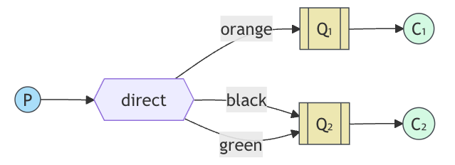
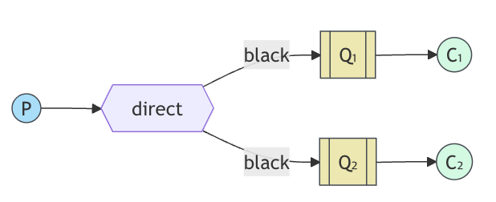

# Routing

- 메시지의 일부에만 구독하는 기능

## Bindings

- 바인딩은 `Exchange`와 `Queue`의 관계이다.
  - "해당 `Queue`가 이 `Exchange`로부터 오는 메시지에 관심이 있다."
- 바인딩은 추가적으로 `바인딩 키 binding key` 파라미터를 가질 수 있다.
  - Spring AMQP는 이 관계를 명확하게 만들기 위해 `Fluent API`를 사용한다. (`BindingBuilder`)

```java
@Bean
public Binding binding(DirectExchange direct, Queue queue) {
  return BindingBuilder.bind(queue)
      .to(direct)
      .with("bindingKey");
}
```

- 바인딩 키의 의미는 익스체인지 타입에 따라 달라진다.
  - 반면 `Fanout`은 이 값을 무시한다.

## Direct Exchange

- 필터링
  - ex1) 메시지를 색상 유형에 따라 필터링
  - ex2) 로그 메시지 중 경고나 정보 로그 메시지는 제외하고 심각한 오류만 수신
- `DirectExchange` 사용 예시.
  - 다이렉트 익스체인지의 라우팅 알고리즘은 간단하다.
  - 메세지는 바인딩 키가 메시지의 "라우팅 키와 정확히 일치"하는 큐로 전달한다.



## Multiple bidings



- 여러 큐를 동일한 바인딩 키로 바인딩하는 것은 가능하다.
  - 위 예시에서 `black` 라우팅 키를 가진 메시지는 `Q1`, `Q2`가 모두 수신한다.

## 발행과 구독

- 위의 예시에서 봤던 것처럼 익스체인지와 큐를 만들고 바인딩을 등록하면 된다.

```java
@Bean
public DirectExchange direct() {
    return new DirectExchange("tut.direct");
}

@Bean
public Queue queue() {
  return new Queue("tut.queue");
}

@Bean
public Binding binding1a(DirectExchange direct, Queue queue) {
    return BindingBuilder.bind(autoDeleteQueue1)
        .to(direct)
        .with("routingKey");
}
```
