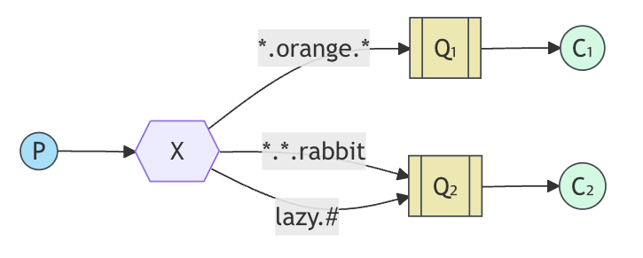

# Topics

- `DirectExchange`는 여러 기준에 따라 라우팅을 할 수 없다는 단점이 존재한다.
- 우리는 메시징 시스템에서 라우팅 키뿐만 아니라 메시지를 생성한 `source` 기반으로도 큐를 구독하고 싶을 수 있다.
  - 이러한 유연성을 구현하려면 `TopicExchange`를 사용해야 한다.

## TopicExchange

- 토픽 익스체인지로 전송되는 메시지는 임의의 `routingKey`를 가질 수 없으며, 반드시 점으로 구분된 단어들의 목록이어야 한다.
  - 단어는 무엇이든 될 수 있지만, 보통 메시지와 관련된 일부 기능을 명시한다.
  - ex) `stock.usd.nyse`, `nyse.vmw`
  - 라우팅 키에는 255바이트 제한까지 원하는 만큼 많은 단어를 포함할 수 있다.
- 바인딩 키 또한 같은 형태여야 한다.
  - 로직은 다이렉트 익스체인지와 유사하다. 특정 라우팅 키로 전송된 메시지는 일치하는 바인딩 키로 바인딩된 모든 큐에 전달된다.
- 바인딩 키 특수 문자
  - `*`: 정확한 한 단어를 대체
  - `#`: 0개 이상의 단어를 대체



- 라우팅 키 규칙은 다음과 같다. `<속도>.<색상>.<종>`
- 위의 큐는 아래와 같이 설명할 수 있을 것이다.
  - `Q1`은 `orange` 색 동물에 관심이 있다.
  - `Q2`는 토끼에 대한 모든 것과, 게으른 동물에 대한 모든 것에 관심이 있다.
- 예시
  - `quick.orange.rabbit` 라우팅 키를 가진 메시지 => `Q1`, `Q2`
  - `lazy.orange.elephant` 라우팅 키를 가진 메시지 => `Q1`, `Q2`
  - `quick.orange.fox` 라우팅 키를 가진 메시지 => `Q1`
  - `lazy.brown.fox` 라우팅 키를 가진 메시지 => `Q2`
  - `lazy.pink.rabbit` 라우팅 키를 가진 메시지 => `Q2` (라우팅 키가 2개 겹쳐 두 번 전달될 것 같지만 정확히 한 번만 전달된다.)

> #### 참고
> - 큐가 `#` 바인딩 키로 바인딩되면, 라우팅 키와 상관없이 모든 메시지를 수신하게 된다. => `fanout`과 동일
> - `*`와 `#`가 바인딩에 사용되지 않으면 토픽 익스체인지는 다이렉트 익스체인지처럼 동작한다.

## 실습

```java
@Bean
public TopicExchange topic() {
  return new TopicExchange("tut.topic");
}

@Bean
public Queue queue1() {
  return new Queue("tut.first.queue");
}

@Bean
public Queue queue1() {
  return new Queue("tut.second.queue");
}

@Bean
public Binding binding1a(TopicExchanage topic, Queue queue1) {
  return BindingBuilder.bind(queue1).to(topic).with("*.orange.*");
}

@Bean
public Binding binding2a(TopicExchanage topic, Queue queue2) {
  return BindingBuilder.bind(queue2).to(topic).with("*.*.rabbit");
}

@Bean
public Binding binding2b(TopicExchanage topic, Queue queue2) {
  return BindingBuilder.bind(queue2).to(topic).with("lazy.#");
}
```


