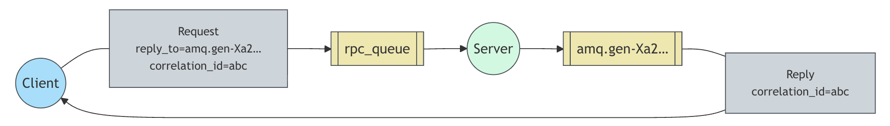

# Remote procedure call(RPC)

- 원격 프로시저 호출
- 만약 원격 컴퓨터에서 함수를 실행하고 그 결과를 기다려야 한다면 어떻게 해야 할까?

> #### RPC에 대한 참고사항
> - RPC는 컴퓨팅에서 매우 흔한 패턴이지만, 종종 비판을 받기도 한다.
>   - 프로그래머가 함수 호출이 로컬 호출인지, 아니면 느린 RPC인지 인지하지 못할 때 문제가 발생한다.
>   - 이러한 혼동은 예측 불가능한 시스템을 초래. 디버깅 복잡성.
>   - 잘못 사용된 RPC는 소프트웨어를 단순화하는 게 아니라 유지보수가 불가능한 스파게티 코드를 낳는다.
> - 아래 내용을 염두에 두자.
>   - 어떤 함수 호출이 로컬이고 어떤 것이 원격인지 명확하게 만들라.
>   - 시스템을 문서화하라. 컴포넌트 간의 의존성을 명확히 하라.
>   - 오류 상황을 처리하라. RPC 서버가 오랫동안 다운되었을 때 클라이언트는 어떻게 반응해야 할까?
>   - 확신이 없다면 RPC를 피하라. 가능하다면 비동기 파이프라인을 사용해야 한다. (RPC와 같은 Blocking 방식 대신, 비동기 전달 방식 사용)

## Callback Queue

- RabbitMQ의 `요청-응답 request-reply` 패턴은 서버와 클라이언트 간의 간단한 상호작용을 포함한다.
- 클라이언트는 요청 메시지를 보내고 서버는 응답 메시지로 회신한다.
  - 응답을 받기 위해서는 요청과 함께 '콜백' 큐 주소를 보내야 한다.
  - Spring AMQP의 `RabbitTamplate`는 `convertSendAndReceive()` 메소드를 사용할 때 이 콜백 큐를 대신 처리해준다.

## Message Properties

- `AMQP 0-9-1` 프로토콜은 메시지와 함께 전송되는 14개의 속성 집합을 미리 정의한다.
- 대부분의 속성은 거의 사용되지 않지만, 다음 속성들은 예외다.
  - `deliveryMode`: 메시지 `영속성 persistent`(`2`의 값) 또는 `임시성 transient`(그 외의 값)으로 표시한다.
  - `contentType`: 인코딩 `mime-type`을 설명하는 데 사용. ex) JSON: `application/json`
  - `replyTo`: 일반적으로 콜백  큐의 이름을 지정하는 데 사용
  - `correlationId`: RPC 응답과 요청을 서로 연관시키는 데 유용

## 상관관계 ID (Correlation ID)

- Spring AMQP를 사용하면 작업 중인 메시지 스타일에 집중하고, 이 스타일을 지원하는 데 필요한 메시지 처리의 세부 사항을 숨길 수 있다.
  - ex) 일반적으로 네이티브 클라이언트는 모든 RPC 요청마다 콜백 큐를 생성한다. -> 이는 매우 비효율적이므로 대안은 클라이언트당 하나의 콜백 큐를 만드는 것.
- 하지만 이 또한 새로운 문제를 야기한다.
  - 해당 큐에서 응답을 받았을 때, 그 응답이 어떤 요청에 대한 것인지 명확하지 않다는 점이다.
  - 바로 이때 `correlationID` 속성이 사용된다.
  - Spring AMQP는 모든 요청에 대해 고유한 값을 자동으로 설정한다. 또한, 응답이 올바른 `correlationID`와 일치시키는 세부적인 처리를 담당한다.
- Spring AMQP가 RPC 스타일을 더 쉽게 만드는 이유 중 하나는, 때때로 콜백 큐에 있는 알 수 없는 메시지를 오류로 처리하는 대신 무시하고 싶을 수 있기 때문이다.
  - 서버 측에서 `경쟁 상태 race condition`가 발생할 가능성 때문.
  - 드물지만 RPC 서버가 우리에게 답장을 보낸 직후, 요청에 대한 `확인 acknowledgment` 메시지를 보내기 전에 다운될 수 있다. => 재시작된 RPC 서버는 해당 요청을 다시 처리하게 된다.
  - Spring AMQP 클라이언트는 중복된 응답을 정상적으로 처리하며, 이상적으로 RPC는 `멱등성 idempotent`을 가져야 한다.

## 작동 예시



1. `DirectExchange`와 클라이언트 설정이 되어 있는 상태
2. 클라이언트는 `convertSendAndReceive` 메소드를 활용하여 `Exchange` 이름, `routingKey`, 그리고 메시지를 전달한다.
3. 요청을 RPC 큐로 전달
4. RPC 워크(즉, 서버)는 해당 큐에서 요청을 기다린다. 요청이 들어오면 작업을 수행하고, `replyTo` 필드에 지정된 큐를 사용하여 결과가 담긴 메시지를 클라이언트에게 다시 보낸다.
5. 클라이언트는 콜백 큐에서 데이터를 기다린다. 메시지가 나타나면 `correlationId` 속성을 확인한다. 만약 이 값이 요청 시의 값과 일치하면, 응답을 애플리케이션에 반환한다. 이 과정 역시, `RabbitTemplate`를 통해 자동으로 처리된다.

### 코드 예시

### 클라이언트 코드

### 서버 코드

```java
@Configuration
public class ServerConfig {
  
  @Bean
  public Queue queue() {
    return new Queue("tut.rpc.requests");
  }
  
  @Bean
  public DirectExchange exchange() {
    return new DirectExchange("tut.rpc");
  }
  
  @Bean
  public Binding binding(DirectExchange exchange, Queue queue) {
    String routingKey = "rpc";
    return BindingBuilder.bind(queue)
        .to(exchange)
        .with(routingKey);
  }
  
  @Bean
  public MyServer myServer() {
    return new MyServer();
  }
}
```

- `MyServer`
  - 리스너 메소드를 지정하고 수신 대기할 큐를 정의
  - payload 파라미터인 `n`을 사용해 `fib(n)`을 호출하고 결과를 반환.

```java
public class MyServer {
  
  @RabbitListener(queues = "tut.rpc.requests")
  public int service(int n) {
    return fib(n);
  }

  private int fib(int n) {
    return n == 0 ? 0 : n == 1 ? 1 : (fib(n - 1) + fib(n - 2));
  }
}
```

### 클라이언트 코드

```java
@Configuration
public class ClientConfig {
  
  @Bean 
  public DirectExchange exchange() {
    return new DirectExchange("tut.rpc");
  }
  
  @Bean
  public MyClient myClient() {
    return new MyClient();
  }
}
```

```java
@RequiredArgsConstructor
public class MyClient {
  
  private static final String routingKey = "rpc"; 
  
  private final RabbitTemplate rabbitTemplate;
  private final DirectExchange exchange;
  
  int start = 0;
  
  @Scheduled(fixedDelay = 1000, initalDelay = 500)
  public void send() {
    Integer response = (Integer) template.convertSendAndReceive(exchange.getName(), routingKey, start++);
  }
}
```

## 요약

### 장점

- RPC 서버가 느릴 때, 다른 서버 하나를 추가하는 것만으로도 확장이 가능하다. (`scale-out`)
- 클라이언트 측에서 RPC는 단 하나의 메소드로 메시지 하나를 보내고 받기만 하면 된다.
  - `qeueuDeclare`와 같은 동기적 호출이 필요없다.
  - 결과적으로 RPC 클라이언트는 단일 RPC 요청에 대해 한 번의 네트워크 `왕복 round-trip`만 필요하다.

### 더 복잡하고 중요한 문제

- 실행 중인 서버가 없을 때 클라이언트는 어떻게 반응해야 하는가?
- 클라이언트는 RPC에 대한 타임아웃을 설정해야 할까?
- 서버가 오작동하여 예외를 발생시키면, 클라이언트에게 전달되어야 할까?
- 처리하기 전에 들어오는 유효하지 않은 메시지로부터 보호하는 방법

