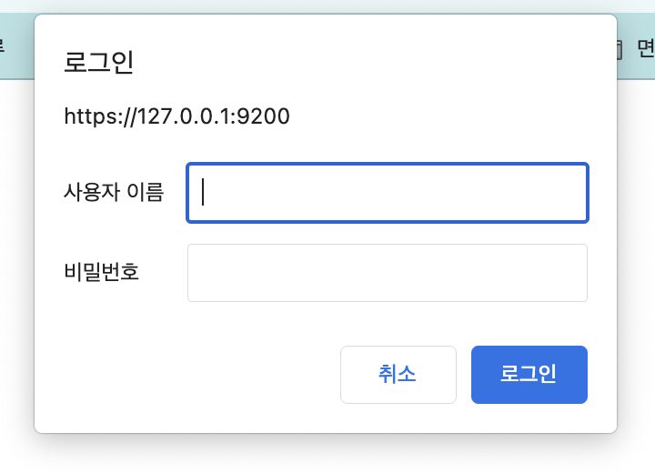

# Settings

## 설치 및 실행

### 설치

- 홈페이지에서 알맞은 버전의 ElasticSearch를 설치한다.
- [다운로드 링크](https://www.elastic.co/kr/downloads/past-releases#elasticsearch)

### 실행

- 설치된 폴더를 원하는 디렉토리로 옮긴다. `bin` 폴더가 있는지 확인하자.
- 해당 디렉토리로 들어가 아래 명령어를 입력하면 ElasticSearch가 실행된다.

```bash
$ bin/elasticsearch
```

- 아래와 같은 문구가 뜬다. Node가 build되고 started되는 것을 확인할 수 있다.
- 추가적으로 샤드도 started가 뜬다.

```
[2023-04-19T17:45:55,297][INFO ][o.e.n.Node               ] [bagjonghyeog-ui-MacBookAir.local] version[8.7.0], pid[26526], build[tar/09520b59b6bc1057340b55750186466ea715e30e/2023-03-27T16:31:09.816451435Z], OS[Mac OS X/13.3.1/aarch64], JVM[Oracle Corporation/OpenJDK 64-Bit Server VM/19.0.2/19.0.2+7-44]

...

[2023-04-19T17:46:01,423][INFO ][o.e.n.Node               ] [bagjonghyeog-ui-MacBookAir.local] started {bagjonghyeog-ui-MacBookAir.local}{1oYsFf3OQj-pCIRIo5clSA}{tjjw4ADmT_Kl2phx_RTWyg}{bagjonghyeog-ui-MacBookAir.local}{127.0.0.1}{127.0.0.1:9300}{cdfhilmrstw}{8.7.0}{xpack.installed=true, ml.allocated_processors_double=8.0, ml.max_jvm_size=8589934592, ml.allocated_processors=8, ml.machine_memory=17179869184}

...

[2023-04-19T17:46:10,764][INFO ][o.e.c.r.a.AllocationService] [bagjonghyeog-ui-MacBookAir.local] current.health="GREEN" message="Cluster health status changed from [YELLOW] to [GREEN] (reason: [shards started [[.security-7][0]]])." previous.health="YELLOW" reason="shards started [[.security-7][0]]"
```

- 정상적으로 실행되면 아래와 같은 결과값이 뜬다.

```
✅ Elasticsearch security features have been automatically configured!
✅ Authentication is enabled and cluster connections are encrypted.

ℹ️  Password for the elastic user (reset with `bin/elasticsearch-reset-password -u elastic`):
  3RrB+dlR_FFmci1AvY9G

ℹ️  HTTP CA certificate SHA-256 fingerprint:
  43865fa349a3c28066d86fa819a3a4082820590e11240d81ed18bf71e7be7eff

ℹ️  Configure Kibana to use this cluster:
• Run Kibana and click the configuration link in the terminal when Kibana starts.
• Copy the following enrollment token and paste it into Kibana in your browser (valid for the next 30 minutes):
  eyJ2ZXIiOiI4LjcuMCIsImFkciI6WyIxNzIuMTYuMC43OjkyMDAiXSwiZmdyIjoiNDM4NjVmYTM0OWEzYzI4MDY2ZDg2ZmE4MTlhM2E0MDgyODIwNTkwZTExMjQwZDgxZWQxOGJmNzFlN2JlN2VmZiIsImtleSI6IlBRYXhtSWNCSksyQ0dLaDdVcktwOjAyRkh6eEZYU2xTSlpwUHB3My10V0EifQ==

ℹ️  Configure other nodes to join this cluster:
• On this node:
  ⁃ Create an enrollment token with `bin/elasticsearch-create-enrollment-token -s node`.
  ⁃ Uncomment the transport.host setting at the end of config/elasticsearch.yml.
  ⁃ Restart Elasticsearch.
• On other nodes:
  ⁃ Start Elasticsearch with `bin/elasticsearch --enrollment-token <token>`, using the enrollment token that you generated.
```

- 이제 Node가 실행될 당시 보여준 `127.0.0.1:9200` 주소로 접속해보자.
- 9300포트는 뭔지 모르겠다. => 공부해봐야함.

```
[2023-04-19T17:46:01,422][INFO ][o.e.h.AbstractHttpServerTransport] [bagjonghyeog-ui-MacBookAir.local] publish_address {172.16.0.7:9200}, bound_addresses {[::]:9200}

...

[2023-04-19T17:46:01,149][INFO ][o.e.t.TransportService   ] [bagjonghyeog-ui-MacBookAir.local] publish_address {127.0.0.1:9300}, bound_addresses {[::1]:9300}, {127.0.0.1:9300}
```

- 여기서 유의사항 ElasticSearch는 TLS/SSL 사용이 기본이기 때문에 로컬로 접속할 때도 `https`를 꼭 붙여줘야한다.
- ssl 설정을 없애주면 `http`로 접속하는 것도 가능하다.

```
https:127.0.0.1:9200
```

- 위 주소로 접속하면 아래와 같이 로그인을 하라는 창이 뜬다. 결과값에서 뜬 비밀번호를 입력해주면 된다!! (아이디 기본값은 `elastic`이다.)



- 접속하면 아래와 같이 엘라스틱서치의 클러스터 이름과 버전 정보가 나타난다.

```
{
  "name" : "bagjonghyeog-ui-MacBookAir.local",
  "cluster_name" : "elasticsearch",
  "cluster_uuid" : "ICZznEmnSoeC25w69kp7yg",
  "version" : {
    "number" : "8.7.0",
    "build_flavor" : "default",
    "build_type" : "tar",
    "build_hash" : "09520b59b6bc1057340b55750186466ea715e30e",
    "build_date" : "2023-03-27T16:31:09.816451435Z",
    "build_snapshot" : false,
    "lucene_version" : "9.5.0",
    "minimum_wire_compatibility_version" : "7.17.0",
    "minimum_index_compatibility_version" : "7.0.0"
  },
  "tagline" : "You Know, for Search"
}
```

- cluster_name은 엘라스틱서치 클러스터를 구분하는 중요한 속성이다. 아무런 설정도 하지 않으면 위와 같이 "elasticsearch"로 자동 설정된다.
- 엘라스틱서치 서버는 `Ctrl+C`를 눌러 종료할 수 있다.

<br/>

## ElasticSearch 설정하기

- 엘라스틱서치를 설정 정보를 변경해줘야한다. 설정 정보는 설치 디렉토리의 config 디렉토리 아래의 elasticsearch.yml 파일을 수정해 변경할 수 있다.
- 초기에는 아래와 같이 주석처리 되어있다.

```yaml
# ======================== Elasticsearch Configuration =========================
#
# NOTE: Elasticsearch comes with reasonable defaults for most settings.
#       Before you set out to tweak and tune the configuration, make sure you
#       understand what are you trying to accomplish and the consequences.
#
# The primary way of configuring a node is via this file. This template lists
# the most important settings you may want to configure for a production cluster.
#
# Please consult the documentation for further information on configuration options:
# https://www.elastic.co/guide/en/elasticsearch/reference/index.html
#
# ---------------------------------- Cluster -----------------------------------
#
# Use a descriptive name for your cluster:
#
#cluster.name: my-application
#
# ------------------------------------ Node ------------------------------------
#
# Use a descriptive name for the node:
#
#node.name: node-1
#
# Add custom attributes to the node:
#
#node.attr.rack: r1
#
# ----------------------------------- Paths ------------------------------------
#
# Path to directory where to store the data (separate multiple locations by comma):
#
#path.data: /path/to/data
#
# Path to log files:
#
#path.logs: /path/to/logs
#
# ----------------------------------- Memory -----------------------------------
#
# Lock the memory on startup:
#
#bootstrap.memory_lock: true
#
# Make sure that the heap size is set to about half the memory available
# on the system and that the owner of the process is allowed to use this
# limit.
#
# Elasticsearch performs poorly when the system is swapping the memory.
#
# ---------------------------------- Network -----------------------------------
#
# By default Elasticsearch is only accessible on localhost. Set a different
# address here to expose this node on the network:
#
#network.host: 192.168.0.1
#
# By default Elasticsearch listens for HTTP traffic on the first free port it
# finds starting at 9200. Set a specific HTTP port here:
#
#http.port: 9200
#
# For more information, consult the network module documentation.
#
# --------------------------------- Discovery ----------------------------------
#
# Pass an initial list of hosts to perform discovery when this node is started:
# The default list of hosts is ["127.0.0.1", "[::1]"]
#
#discovery.seed_hosts: ["host1", "host2"]
#
# Bootstrap the cluster using an initial set of master-eligible nodes:
#
#cluster.initial_master_nodes: ["node-1", "node-2"]
#
# For more information, consult the discovery and cluster formation module documentation.
#
# ---------------------------------- Various -----------------------------------
#
# Allow wildcard deletion of indices:
#
#action.destructive_requires_name: false
```

- 클러스터 이름, 노드 이름, 로그 경로, 데이터 경로 등 다양한 설정을 지정할 수 있다. 하나씩 알아보자.

> ### cluster.name
>
> - 클러스터로 여러 노드를 하나로 묶을 수 있는데, 여기서 클러스터 명을 지정할 수 있다.
>
> ### node.name
>
> ### path.data
>
> ### path.logs
>
> ### path.repo
>
> ### network.host
>
> ### http.port
>
> ### transport.port
>
> 과거 `transport.tcp.port`는 `transport.port`로 변경되었다.
>
> ### discovery.zen.ping.unicast.hosts
>
> ### discovery.zen.minimum_master_nodes
>
> ### node.master & node.data
>
> - node.master와 node.data 대신 node.roles를 사용하여 노드의 역할을 지정할 수 있다.

- ElasticSearch 8.7.0 기준 아래와 같이 설정할 수 있다.

```yaml
cluster.name: javacafe-cluster
node.name: javacafe-node1
network.host: 0.0.0.0
http.port: 9200
transport.port: 9300
node.roles: ['master', 'data']
path.repo:
  ['{절대경로값}/elasticsearch/book_backup/search_example', '{절대경로값}/elasticsearch/book_backup/agg_example']
discovery.type: single-node
xpack.security.enabled: false
```

> 위와 같이 `xpack.security.transport.ssl.enabled` 설정을 `false`로 지정해주면 SSL 설정이 제대로 되어있지 않아도 에러가 발생하지 않습니다.
> 하지만, 만약에 SSL을 사용하고자 한다면, SSL에 대한 설정도 함께 추가해주어야 합니다.

### 스냅샷 생성

- 아래와 같이 실행해보자
- `-H "Content-Type: application/json"`를 넣어주지 않아면 에러가 발생한다. `{"error":"Content-Type header [application/x-www-form-urlencoded] is not supported","status":406}`

- search_example

```
curl -XPUT 'http://localhost:9200/_snapshot/javacafe' \
-H "Content-Type: application/json" \
-d '{"type": "fs", "settings": {"location": "{절대경로값}/elasticsearch/book_backup/search_example", "compress":true}}'
```

- agg_example

```
curl -XPUT 'http://localhost:9200/_snapshot/apache-web-log' \
-H "Content-Type: application/json" \
-d '{"type": "fs", "settings": {"location": "{절대경로값}/elasticsearch/book_backup/agg_example", "compress":true}}'
```

### 스냅샷 실행

- 명령어를 치면 아래와 같은 결과가 나온다.
- search_example

```
curl -XGET 'http://localhost:9200/_snapshot/javacafe/_all'
```

```json
{
  "snapshots": [
    {
      "snapshot": "movie-search",
      "uuid": "Kz5k4fusS7KBZy55wLeZ0Q",
      "repository": "javacafe",
      "version_id": 6040399,
      "version": "6.4.3",
      "indices": ["movie_search"],
      "data_streams": [],
      "include_global_state": false,
      "state": "SUCCESS",
      "start_time": "2019-03-23T16:01:04.910Z",
      "start_time_in_millis": 1553356864910,
      "end_time": "2019-03-23T16:01:05.342Z",
      "end_time_in_millis": 1553356865342,
      "duration_in_millis": 432,
      "failures": [],
      "shards": {
        "total": 5,
        "failed": 0,
        "successful": 5
      },
      "feature_states": []
    }
  ],
  "total": 1,
  "remaining": 0
}
```

- agg_example
- 결과적으로 `apache-web-log`, `apache-web-log-applied-mapping` 인덱스가 있는 것을 확인할 수 있다.

```
curl -XGET 'http://localhost:9200/_snapshot/apache-web-log/_all'
```

```json
{
  "snapshots": [
    {
      "snapshot": "default",
      "uuid": "yzmzEx6uSMS55j60z4buBA",
      "repository": "apache-web-log",
      "version_id": 6040399,
      "version": "6.4.3",
      "indices": ["apache-web-log"],
      "data_streams": [],
      "include_global_state": false,
      "state": "SUCCESS",
      "start_time": "2019-03-23T16:03:50.351Z",
      "start_time_in_millis": 1553357030351,
      "end_time": "2019-03-23T16:03:50.604Z",
      "end_time_in_millis": 1553357030604,
      "duration_in_millis": 253,
      "failures": [],
      "shards": {"total": 5, "failed": 0, "successful": 5},
      "feature_states": []
    },
    {
      "snapshot": "applied-mapping",
      "uuid": "SgXhqApiSHiauC6fbjSHMw",
      "repository": "apache-web-log",
      "version_id": 6040399,
      "version": "6.4.3",
      "indices": ["apache-web-log-applied-mapping"],
      "data_streams": [],
      "include_global_state": false,
      "state": "SUCCESS",
      "start_time": "2019-03-23T16:05:46.038Z",
      "start_time_in_millis": 1553357146038,
      "end_time": "2019-03-23T16:05:46.364Z",
      "end_time_in_millis": 1553357146364,
      "duration_in_millis": 326,
      "failures": [],
      "shards": {"total": 5, "failed": 0, "successful": 5},
      "feature_states": []
    }
  ],
  "total": 2,
  "remaining": 0
}
```

- 일단 파일로 제공한 인덱스 스냅샷을 사용할 준비까지 모두 끝났다. 하지만 당장 스냅샷을 사용할 필요는 없고! 나중에 인덱스 복구가 필요할 때 사용하면 된다.

<br/>

## +a

### xpack 간단한 설정

```yaml
xpack:
  security:
    enabled: true
    enrollment:
      enabled: true
    http.ssl:
      enabled: true
      keystore.path: certs/http.p12
    transport.ssl:
      enabled: true
      verification_mode: certificate
      keystore.path: certs/transport.p12
      truststore.path: certs/transport.p12
```

### xpack 설정하지 않고 사용하는법!!

- Set

```yaml
xpack.security.enabled: false
xpack.security.transport.ssl.enabled: false
xpack.security.http.ssl.enabled: false
```

- and then start Elasticsearch.

- Run

```bash
bin/elasticsearch-keystore remove xpack.security.transport.ssl.keystore.secure_password
bin/elasticsearch-keystore remove xpack.security.transport.ssl.truststore.secure_password
bin/elasticsearch-keystore remove xpack.security.http.ssl.keystore.secure_password
```

Set

```yaml
xpack.security.enabled: false
```

## 참고자료

- 엘라스틱서치 실무 가이드: 한글 검색 시스템 구축부터 대용량 클러스터 운영까지
- [설정: 공식문서(한글버전)](https://esbook.kimjmin.net/02-install/2.3-elasticsearch/2.3.2-elasticsearch.yml)
- [Configuration](https://www.elastic.co/guide/en/elasticsearch/reference/current/settings.html)

- [xpack 설정 문제: 공식사이트](https://discuss.elastic.co/t/invalid-configuration-for-xpack-security-transport-ssl/297989/3)
- [xpack 설정 문제: Stack overflow](https://stackoverflow.com/questions/73127698/elasticsearchsecurityexception-invalid-configuration-for-xpack-security-transpo)

- [enable security 설정](https://gihyun.com/138)
- [ssl 설정](https://discuss.elastic.co/t/invalid-configuration-for-xpack-security-transport-ssl-xpack-security-transport-ssl-enabled/302761)

- [8.x 버전에서 disabled가 되지 않는 문제](https://discuss.elastic.co/t/cannot-disable-security-in-8-1/299857)
- ["Native controller process has stopped - no new native processes can be started"](https://stackoverflow.com/questions/60182669/elastic-search-error-native-controller-process-has-stopped-no-new-native-pro)
