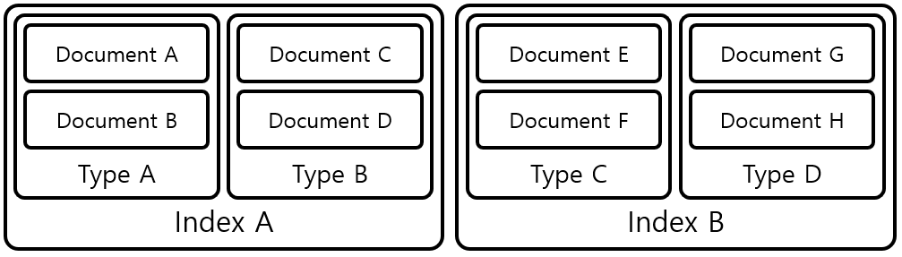
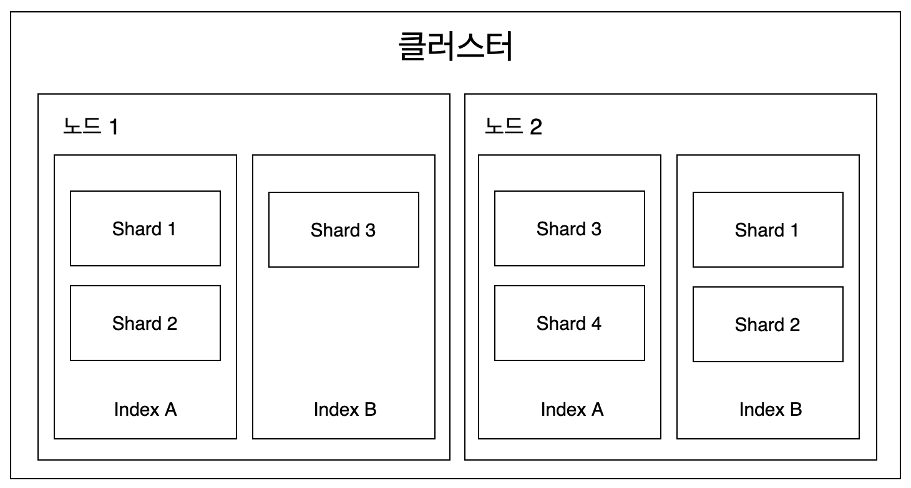
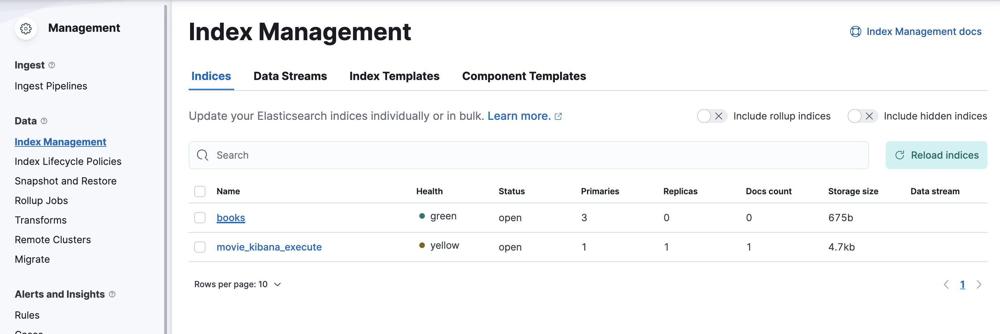
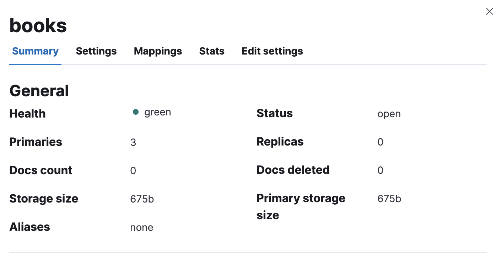

# ElasticSearch

## 엘라스틱 서치란?

- 빅데이터와 분산 시스템에 적합한 검색엔진
- 실시간에 가까운 전문 검색, 멀티테넌시 지원, NoSQL 저장소 역할까지!
- 단순한 검색엔진이 아니라 데이터 수집, 저장, 분석, 시각화에 이르는 다양한 분야의 데이터 분석 도구로 사용되고 있다.

<br/>

## 개념

- 엘라스틱서치의 데이터 구조는 아래와 같다. 인덱스, 타입, 문서, 필드 구조로 구성된다. 여기서 필드는 그림상 나오진 않지만, Document를 구성하는 요소로 알아두면 된다.



### 인덱스 Index

- 인덱스는 데이터 저장공간이다. (6.1버전 이후부터) 하나의 인덱스는 하나의 타입만을 가지며 하나의 물리적인 노드에 여러 개의 논리적인 인덱스를 생성할 수 있다.
- 검색 시 인덱스 이름으로 문서 데이터를 검색하며, 여러 개의 인덱스를 동시에 검색하는 것도 가능하다.
- 엘라스틱서치를 분산 환경으로 구성하면 하나의 인덱스가 여러 노드에 분산 저장되어 관리된다. 따라서 분산 처리에 따른 여러 이점을 누릴 수 있게 된다.
- 보통 인덱스 생성 시 기본적으로 5개의 프라이머리 샤드(Primary Shard)와 1개의 레플리카 샤드(Replica Shard) 세트를 생성한다. 각각의 샤드 수는 인덱스를 생성할 때 옵션을 이용해 변경할 수 있다.
- 인덱스의 이름은 모두 소문자여야 하며 추가, 수정, 삭제, 검색은 RESTFul API로 수행할 수 있다. 만약 인덱스가 없는 상태에서 데이터가 추가된다면 데이터를 이용해 인덱스가 자동으로 생성된다.

### 샤드 Shard

- 색인된 문서는 하나의 인덱스에 담긴다. 인덱스 내부에 색인된 데이터는 물리적인 공간에 여러 개의 파티션으로 나뉘어 구성되는데, 이 파티션을 샤드(Shard)라고 부른다.
- 엘라스틱 서치는 다수의 샤드를 분산 저장해 데이터 손실 위험을 최소화하고 있다.

### 타입 Type

- 타입(Type)은 인덱스의 논리적 구조를 의미하며, 인덱스의 속성에 따라 분류하기도 한다.

### 문서 Document

- 엘라스틱서치에서 데이터가 저장되는 최소 단위이다. 기본적으로 JSON 포맷으로 데이터가 저장된다. 데이터베이스와 비교하면 테이블의 행이 문서에 해당한다고 볼 수 있다.
- 하나의 문서는 다수의 필드로 구성되어 있고, 각 필드는 데이터 형태에 따라 용도에 맞는 데이터 타입을 정의해야 한다.
- 문서는 중첩이 가능해, 문서 안에 문서를 넣는 것도 가능하다.

### 필드 Field

- 필드는 문선를 구성하기 위한 속성이다. 데이터베이스의 열(Column)에 해당한다고 볼 수 있으나, Column은 정적인 데이터 타입인 반면, 필드는 동적인 데이터 타입이다.
- 하나의 필드가 목적에 따라 여러 타입을 가질 수 있다는 의미이다.

### 매핑 Mapping

- 문서의 필드와 필드의 속성을 정의하고 그에 따른 색인 방법을 정의하는 프로세스다. 인덱스의 매핑 정보에는 여러 가지 데이터 타입을 지정할 수 있지만 필드명은 중복해서 사용할 수 없다.

<br/>

## 노드

### 클러스터?

- 클러스터는 물리적인 노드 인스턴스들의 모임이라고 할 수 있다. 클러스터는 모든 노드의 검색과 색인 작업을 관장하는 논리적인 개념이라고 할 수 있다.
- 분산 처리를 위해서는 다양한 형태의 노드를 조합해 클러스터를 구성해야한다. 마스터 노드는 클러스터를 관리하고, 데이터 노드가 데이터를 관리하는 형식으로 말이다.

### 노드의 종류

- 노드의 종류는 아래와 같다.

1. 마스터 노드
2. 데이터 노드
3. 코디네이팅 노드
4. 인제스트 노드

- 하나씩 알아가보자.

### 마스터 노드 Master Node

- 인덱스를 생성, 삭제하는 등 클러스터를 관리하는 작업을 담담한다.
- 따라서 네트워크 속도가 빠르고 지연이 없는 노드를 마스터 노드로 정해야 한다.
- 만약 노드를 마스터 노드 전용으로 설정하고자 한다면 엘라스틱서치 서버의 conf 폴더 안의 elasticsearch.yml을 아래와 같이 설정해주자!

```yaml
node.master: true
node.data: false
node.ingest: false
search.remote.connect: false
```

### 데이터 노드 Data Node

- 문서가 실제로 저장되는 노드다. 데이터가 분산 저장되는 물리적 공간인 샤드가 배치되는 노드이기도 하다.
- 색인 작업은 CPU, 메모리, 스토리지 같은 컴퓨팅 리소스를 많이 소모하기 때문에 리소스 모니터링이 필요하다.
- 마스터 노드와 분리하는 것이 좋지만 색인할 문서의 수가 적으면 함께 구성해도 상관없다. 아래와 같이 elasticsearch.yml 설정해주면 데이터 노드 전용으로 구성할 수 있다.

```yaml
node.master: false
node.data: true
node.ingest: false
search.remote.connect: false
```

### 인제스트 노드 Ingest Node

- 색인에 앞서 데이터를 전처리하기 위한 노드다. 데이터의 포맷을 변경하기 위해 스크립트로 전처리 파이프라인을 구성하고 실행할 수 있다.

```yaml
node.master: false
node.data: false
node.ingest: true
search.remote.connect: false
```

### 코디네이팅 노드 Coordinating Node

- 데이터 노드, 마스터 노드, 인제스트 노드의 역할을 하지 않고, 들어온 요청을 단순히 라운드로빈 방식으로 분산시켜주는 노드다.
- 위와 다르게 모두 false로 두면 된다.

```yaml
node.master: false
node.data: false
node.ingest: false
search.remote.connect: false
```

<br/>

## 클러스터, 노드, 샤드



- 위 그림처럼 하나의 엘라스틱서치 클러스터에 총 2개의 물리적 노드가 존재한다고 해보자. 클러스터는 인덱스의 문서를 조회할 때 마스터 노드를 통해 2개의 노드를 모두 조회해서 각 데이터를 취합한 후 결과를 하나로 엮어 제공한다.
- 고유한 이름을 가진 여러 개의 클러스터를 연결해 구성할 수 있다. 만약 이름을 정해주지 않는다면 클러스터의 이름이 임의의 문자열로 지정된다.
- 클러스터에 있는 노드는 실시간으로 추가, 제거가 가능하기 때문에 가용성이나 확장성이 매우 좋고 유연하다.

### 클러스터 Setting

- 샤드의 수는 curl 명령어나 키바나 dev tool 콘솔에서 아래와 같이 지정해줄 수 있다.
- curl 명령어 사용(인덱스 생성)

```bash
$ curl -XPUT "http://localhost:9200/{index_name}" -H 'Content-Type: application/json' -d '
{
  "settings": {
    "number_of_shards": {number_of_shard}, # 프라이머리 샤드
    "number_of_replicas": {number_of_replicas} # 레플리카 샤드
  }
}'
```

- dev tool 콘솔 이용(인덱스 생성 및 수정)

```json
PUT {index_name}
{
  "settings": {
      "number_of_shards": {number_of_shard}, # 프라이머리 샤드
      "number_of_replicas": {number_of_replicas} # 레플리카 샤드
  }
}
```

- 아래와 같이 `index`로 묶어서 생성해도 된다.

```json
PUT {index_name}
{
  "settings": {
    "index": {
      "number_of_shards": {number_of_shard}, # 프라이머리 샤드
      "number_of_replicas": {number_of_replicas} # 레플리카 샤드
    }
  }
}
```

### 예시

- 콘솔에 아래와 같이 입력하면 books라는 인덱스가 생성된다.

```json
PUT books
{
  "settings": {
      "number_of_shards": 3,
      "number_of_replicas": 0
  }
}
```

- 결과값

```json
{
  "acknowledged": true,
  "shards_acknowledged": true,
  "index": "books"
}
```

- Management에서 해당 인덱스의 노드를 확인할 수 있다. 프라이머리 샤드가 3개 있는 것을 확인할 수 있다.




<br/>

## 출처

- 엘라스틱서치 실무 가이드: 한글 검색 시스템 구축부터 대용량 클러스터 운영까지
- [엘라스틱서치 가이드북](https://esbook.kimjmin.net/03-cluster/3.2-index-and-shards)
