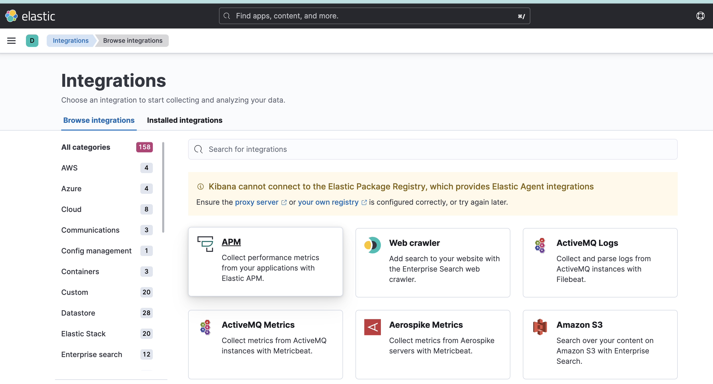
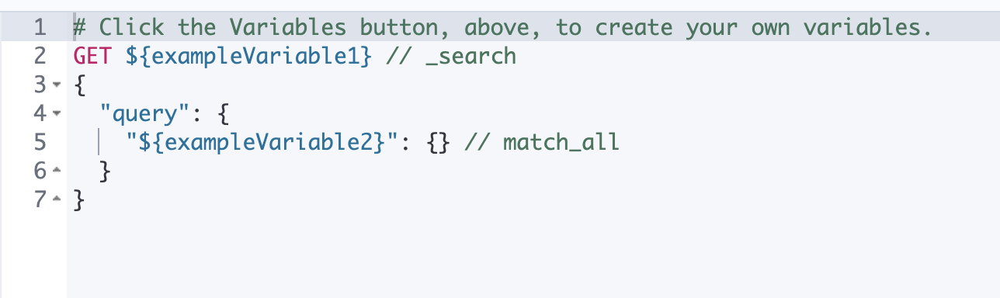
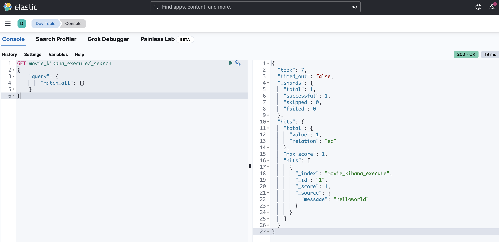

# What is Kibana

## 설치

- kibana를 설치하자.
- [다운로드 링크](https://www.elastic.co/kr/downloads/kibana)

<br/>

## 설정

- config 디렉토리에 들어가자.
- kibana.yml에 아래 문구를 추가해주자.
  > cf) `elasticsearch.url`에서 `elasticsearch.hosts`로 변경되었다.

```yaml
elasticsearch.hosts: ['http://localhost:9200']
```

- 기본적으로 localhost에 있는 9200번 포트를 엘라스틱 서치가 사용하고 있다면 상관없다.
- 실무에서는 엘라스틱서치가 설치된 장비의 IP주소와 포트번호로 변경해줘야한다.

<br/>

## 실행

### 유의사항

- macOS에서 발생하는 SIP(System Integrity Protection) 보안 기능 때문에 오류가 발생할 수 있다. SIP는 macOS 시스템 파일 및 디렉토리를 보호하여 시스템 보안을 강화하는 기능이다.
- `{절대경로}/kibana/node_modules/re2/build/Release/re2.node` 경로에 있는 라이브러리를 로드하려고 할 때, 시스템 보안 정책에 의해 허용되지 않는다는 메시지가 뜰 수 있다.
- 이 때의 해결법으로는 임시적으로 SIP을 해제하거나, Kibana를 실행하는 사용자 계정이 해당 파일에 대한 엑세스 권한을 가져야 한다.
- 웬만하면 SIP을 유지하고 해당 파일을 Kibana가 엑세스할 수 있게 만드는 것이 좋다. 아래는 해당 명령어이다.

```bash
$ codesign -v {절대경로}/kibana/node_modules/re2/build/Release/re2.node
{절대경로}/kibana/node_modules/re2/build/Release/re2.node: valid on disk
{절대경로}/kibana/node_modules/re2/build/Release/re2.node: satisfies its Designated Requirement
$ xattr {절대경로}/kibana/node_modules/re2/build/Release/re2.node
com.apple.quarantine
$ xattr -d com.apple.quarantine {절대경로}/kibana/node_modules/re2/build/Release/re2.node
```

### 이제 진짜 실행!

- 이제 bin 디렉토리에서 `kibana` 혹은 `kibana.bat`으로 파일을 실행해주자.
- 엘라스틱서치가 실행중이어야한다!
- 그 후에 웹 브라우저에서 `http://localhost:5601` 또는 `https://localhost:5601`에 접소해보자.
- 엘라스틱서치와 정상적으로 연결되었다면 아래와 같은 GUI가 보일 것이다.




<br/>

## Dev Tool 설정

- GUI의 왼쪽 메뉴에 Dev Tool 메뉴를 선택해보자. 주소는 아래와 같다.

```
http://localhost:5601/app/dev_tools#/console
```



- 작성 규칙은 아래와 같다.

```
{요청 전달 방식} {검색쿼리}
{
    "query": {
        "match_all": {}
    }
}
```

- 요청 전달 방식: GET, POST, PUT, DELETE 등을 지정할 수 있다. 대체로 REST HTTP 요청과 엇비슷하다. `curl` 명령어에서 `-X` 옵션에 해당한다.
  - GET: 어떤 변경 없이 쿼리에 대한 결과를 반환받는 용도
  - POST: 변경
  - PUT: 삽입
  - DELETE: 삭제
- 검색쿼리: `curl` 명령에서 `-X` 옵션에 다음으로 지정하는 도메인 부분에 해당한다.
  - `_search`: `_search` 키워드 앞 부분에는 인덱스를 명시해 해당 인덱스로만 범위를 한정해서 검색을 수행할 수 있다. 인덱스를 지정하지 않으면 전체 인덱스를 대상으로 검색이 수행된다.
- 쿼리 본문: `curl` 명령에서 `-d` 옵션에 해당한다.

### 색인 실습

- movie_kibana_execute 인덱스를 생성해서 문서를 하나 색인해보자. 아래 문구를 kibana dev tools의 console에 넣어주자.

```json
PUT movie_kibana_execute/_doc/1
{
  "message": "helloworld"
}
```

- 결과값은 아래와 같다. 문서 색인이 성공적으롱 완료된 것을 볼 수 있다.

```json
{
  "_index": "movie_kibana_execute",
  "_id": "1",
  "_version": 1,
  "result": "created",
  "_shards": {
    "total": 2,
    "successful": 1,
    "failed": 0
  },
  "_seq_no": 0,
  "_primary_term": 1
}
```

- 이제 생성된 문서를 검색해보자.

```json
GET movie_kibana_execute/_search
{
    "query": {
        "match_all": {}
    }
}
```

- 아래 결과값과 함께 색인을 확인할 수 있다.

```json
{
  "took": 7,
  "timed_out": false,
  "_shards": {
    "total": 1,
    "successful": 1,
    "skipped": 0,
    "failed": 0
  },
  "hits": {
    "total": {
      "value": 1,
      "relation": "eq"
    },
    "max_score": 1,
    "hits": [
      {
        "_index": "movie_kibana_execute",
        "_id": "1",
        "_score": 1,
        "_source": {
          "message": "helloworld"
        }
      }
    ]
  }
}
```



<br/>

## 참고자료

- 엘라스틱서치 실무 가이드: 한글 검색 시스템 구축부터 대용량 클러스터 운영까지
- [통합 로그 확인하기](https://jydlove.tistory.com/41)
- [re2.node error](https://github.com/elastic/kibana/issues/83012)
- [re2.node error](https://www.joyk.com/dig/detail/1671626289794362)
- [공식문서: Size Your Shards](https://www.elastic.co/guide/en/elasticsearch/reference/current/size-your-shards.html)
- [Elasticsearch Monitoring Metrics](https://www.elastic.co/guide/en/kibana/current/elasticsearch-metrics.html)
