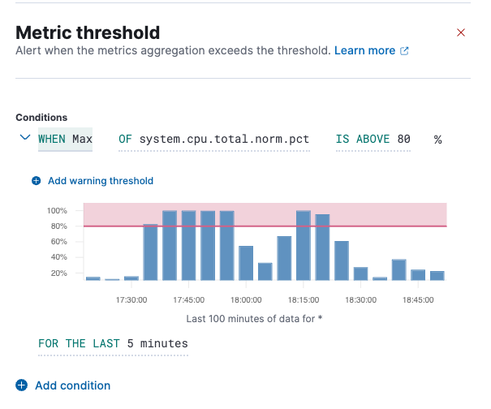
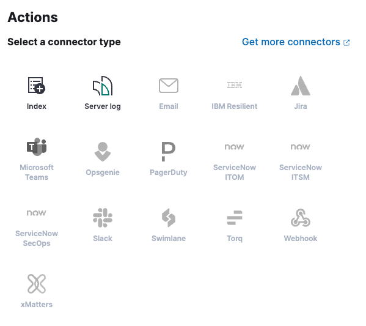

# Alerts

- ElasticSearch의 Alerts 기능을 사용하면 경고를 받을 수 있다.
- 과금을 하면 Slack으로 바로 알림을 받을 수 있겠지만, 무료로 해야 하는 상황이라면 다른 방법을 사용해야 한다.

## 실전

- 왼쪽 메뉴에서 Observability > Alerts를 선택한다.


- 우측 상단의 Manage Rules 버튼을 클릭한다.


- Manage Rules 버튼을 클릭하면 아래와 같이 Create rule 버튼이 열린다. 해당 버튼을 클릭하자.


- `Select rule type`에서 본인이 원하는 설정을 선택한다.
- 현재 수집하고 있는 메트릭을 통해 알림을 받는 것이 목적이기 때문에 `Metric threshold`을 선택하도록 하겠다.


- 이제 Condition을 설정해주면 된다.


- 필드 값을 설정하고 나면 아래와 같이 그래프를 보여준다. 또한 `Add condition`을 통해 조건을 추가할 수 있다.



- 이제 내가 알림 받길 원하는 대상을 설정해보자.
  - `Filter`: 내가 알림 받길 원하는 대상
  - `Group alerts by`: 그루핑 기준 (서로 다른 서비스는 구분되어야 한다.)


- Actions에서는 Index를 선택한다. 
  - 유료 버전을 사용하고 있다면 바로 알림을 받을 수 있는 Slack과 같은 connector type을 사용할 수 있다.



- 해당 작업을 진행하기 위해선 먼저 Index를 생성해야 한다.
  - Index는 Index Management 페이지에서 생성할 수 있다.
- Index Templates 탭을 클릭해 Create Template 버튼을 눌러 진행한다.
  - 이제 자신이 원하는 인덱스를 구성하면 된다.


- 만약 이미 Index Template이 있고, 그 인덱스 템플릿을 활용하고자 한다면 `Add connector` 버튼을 클릭해 Index Connector를 추가해주자.


- Action frequency는 상황에 맞는 값을 선택하면 된다.


- Document to index에 저장하고자하는 값을 넣어주자.
  - 여기서 `date`나 `context.reason`과 같은 값은 Elasticsearch에서 템플릿이나 스크립트 내에서 동적으로 변환되는 변수다.

```shell
{
  "@timestamp": "{{date}}",
  "message": "The alert condition has been triggered: {{context.reason}}"
}
```

- 이제 Save 버튼을 클릭하면 끝이다.

