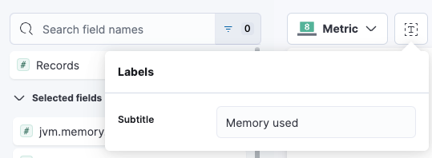

# Dashboards

## 대시보드 추가하기

- 왼쪽 메뉴 탭을 클릭. `Analytics > Dashboard`를 선택.
- 들어간 페이지에서 `Create dashboard` 버튼을 클릭한다.


- 대시보드 생성창에 들어오면 아래와 같은 화면이 뜬다.
- `Create visualization` 버튼을 클릭해보자.


### JVM 메모리 추가하기

> #### 요구사항
> 1. 30초마다 가장 최신의 값을 보여줘야 한다.
> 2. JVM 힙 메모리 최대 크기 대비 JVM 힙 메모리 실제 사용량을 퍼센트 값으로 보여준다. 

#### 서비스 넣기

- 아래 사진처럼 내가 정의한 `service.name` 필드와 `service.environment` 필드에 원하는 값을 넣어 원하는 서비스의 Visualization을 만들 수 있다.


#### Visualization Type 선택

- 그래프 그림같이 생긴 버튼을 누르면 Visualization Type을 변경할 수 있다.


- Visualization의 종류는 아래와 같다.
  - `Table`: 테이블
  - `Bar horizontal`: 수평 형태의 Bar 그래프
  - `Bar vertical`: 수직 형태의 Bar 그래프
  - `Gauge`: 게이지 그래프
  - `Metric`: 

- 위 요구사항에 맞는 Visualization Type은 


#### Subtitle 설정하기

- `Visualization Type`을 설정하는 버튼 옆의 버튼을 클릭하면 Subtitle을 설정할 수 있다.
  - 안 해도 된다.



#### JVM 메트릭 필드 추가하기

- [JVM의 대표적인 3가지 메트릭](https://swmobenz.tistory.com/37)

- 왼쪽 검색 창에 `jvm.memory`라고 검색하면 JVM의 메모리에 관련된 모든 메트릭이 보이게 된다.


- 이 중에서 요구사항에서 보여주길 원했던 아래 2가지의 메트릭을 이용해 그래프를 구성해볼 것이다.
  - JVM 힙 메모리 최대 크기: `jvm.memory.heap.max`
  - JVM 힙 메모리 실제 사용량: `jvm.memory.heap.used`

- 여기서 꼭 필요한 수치는 `Primary metric`과 `Maximum value`이다.


- 만약 수치를 퍼센티지로 설정하고 싶다면 단순히 필드만 넣어서는 안된다.
- Primary metric에서 `Add or drag-and-drop a field`를 클릭해보면 상세 설정을 진행할 수 있다.


- `Quick function`를 사용하면 기존 설정을 쉽게 사용할 수 있고, `Formula`를 선택하면 수치 커스터마이징도 가능하다.
- `Formula`를 사용해 커스텀 값을 만들 것이다. 최대 값 대비 사용량을 퍼센트로 보여줘야 한다.
  - 가장 최신의 값을 보여주기 위해 `Last value` Function을 선택했다.
  - 공식은 아래와 같은 형태를 띈다.

```shell
(last_value(jvm.memory.heap.used, kql='jvm.memory.heap.used: *') / last_value(jvm.memory.heap.max, kql='jvm.memory.heap.max: *'))
```


- 이제 Visualization의 이름과 Value Format 등을 설정해주자.
  - 퍼센트가 요구사항이므로 Value Format을 `Percent`로 선택했다.


- Maximum Value는 당연하게도 백분율을 퍼센티지로 보여줘야 하므로 static value로 `1` 값을 넣어주면 된다.


#### 저장하기

- Save and return 버튼을 클릭하면 저장이 완료된다.


- 여기서 Save to library를 클릭해서 저장하면 해당 형식을 라이브러리로 저장해놓고 나중에 가져다가 사용할 수 있다.


- 위와 같이 설정을 마치고 나면 아래와 같은 결과물이 생성된다.


- 밖에서 Panel settings를 통해 제목을 달아줄 수 있다.


