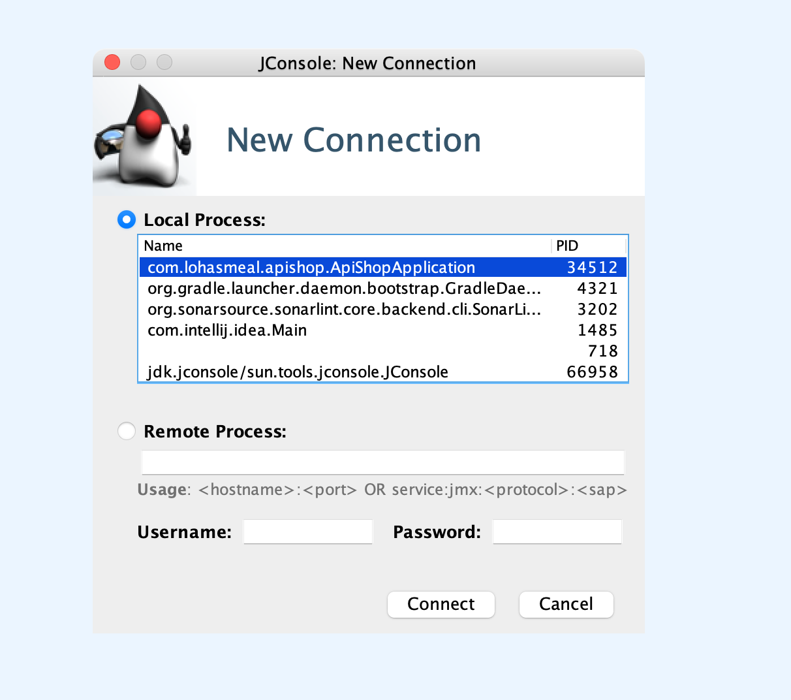

# 톰캣 메트릭 수집?

- 톰캣의 스레드 개수를 확인하고 싶은데, 수집을 할 수가 없다.
- 아래와 같이 Actuator에서 톰캣 메트릭이 활성화되도록 열어줬는데도 수집이 안 된다.

```yaml
server:
  # 톰캣 메트릭 추가
  tomcat:
    mbeanregistry:
      enalbed: true
```

- 사실 Elastic APM Attacher는 Spring Boot Actuator 기반으로 돌아가는 것이 아니다.
  - Actuator에서 아무리 수집할 수 있게 열어준다 한들 Attacher와 아무런 연관이 없기 때문에 아무런 효과가 없는 것이다.

## ChatGPT

> Spring Boot에서 설정한 server.tomcat.mbeanregistry.enabled=true는 톰캣의 MBean 레지스트리를 활성화하여 JMX를 통해 톰캣의 내부 상태(예: 스레드 수, 요청 수, 세션 등)를 노출하도록 설정합니다. 
> 이 설정은 Spring Boot와 JMX 기반 모니터링 도구에서 톰캣 메트릭을 사용할 수 있도록 돕지만, Elastic APM Attacher는 기본적으로 톰캣 MBean 데이터를 직접 수집하지 않습니다.

## JMX configuration options

- 수집할 메트릭에 대한 설정을 직접 넣어주는 수밖에 없다.
- Elastice APM Agent에는 `capture_jmx_metircs`라는 옵션이 존재한다.
- Stack overflow에서 Tomcat의 Thread Pool을 모니터링하기 위해 아래와 같은 name과 type으로 접근하라고 알려주고 있다.
- "Catalina:name="http-nio-8080",type=ThreadPool"

- 아래와 같이 attacher를 설정하는 부분에서 해당 옵션을 추가해주자.

```java
Map<String, String> options = new HashMap<>();
options.put(
  "capture_jmx_metrics",
      "object_name[Catalina:type=ThreadPool,name=\"http-nio-8080\"] "
      + "attribute[currentThreadCount:metric_name=tomcat_current_thread_count] "
      + "attribute[currentThreadsBusy:metric_name=tomcat_busy_thread_count]");
ElasticApmAttacher.attach(options);
```

## 그래도 수집이 안 된다?

- 결국 MBeans를 직접 까보는 수밖에 없다. `JConsole`을 사용해 확인해보자!
- 아래 명령을 실행하면 JConsole이 실행될 것이다.

```shell
$ jconsole
```

- 접속하길 원하는 애플리케이션을 실행하고, JConsole GUI에서 선택해준다.



- 위의 메뉴 중 `MBeans`를 확인해보자. 이 탭에서 `Catalina`의 `http-nio-8080`를 확인할 수 있으면 된다.


- 그런데 없다.

# 참고자료

- [ElasticSearch 공식문서](https://www.elastic.co/guide/en/apm/agent/java/current/config-jmx.html)
- [Stack Overflow](https://stackoverflow.com/questions/7333740/how-can-i-monitor-log-tomcats-thread-pool)
