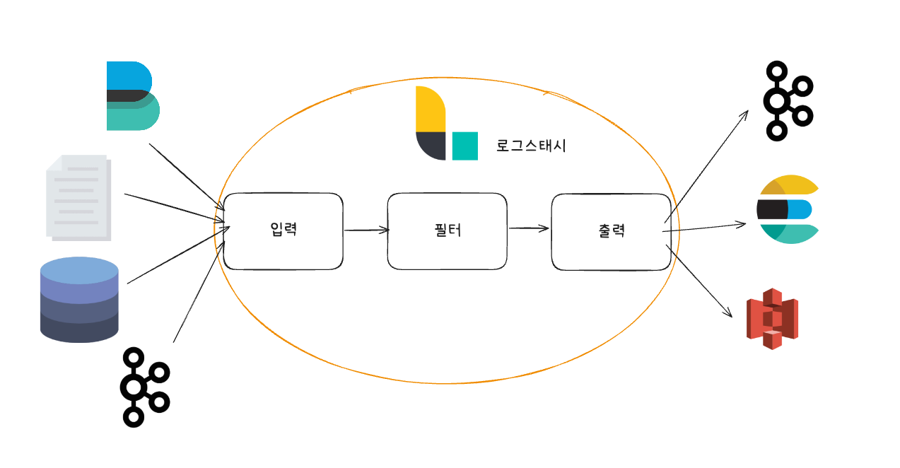

# 01 엘라스틱 스택이란

## 1-1. 엘라스틱서치의 탄생

- `루씬 Lucene`
  - 1999년 더그 커팅이 만든 검색 엔진 라이브러리.
- `솔라 Solr`
  - 기술 잡지를 만들던 CNET 네트워크에서 2004년경 사내 웹사이트 검색을 위해 직접 제작한 검색 엔진 소스 코드를 2006년에 아파치 재단에 기부.
  - 높은 트래픽을 뒷받침하는 고성능의 검색 엔진.
  - 2010년 3월에 루씬과 통합되어 커미터들이 함께 개발 진행.
  - 2021년 2월에는 루씬에서 분리되어 완전히 독립된 아파치 최상위 프로젝트로 자리 잡음.
- `엘라스틱서치 ElasticSearch`
  - 솔라가 개발되고 있을 무렵, 야이 배넌은 검색 엔진 솔루션을 기획.
  - 처음부터 분산 환경을 위한 솔루션 HTTP 상에서 JSON으로 인터페이스를 지원하는 솔루션.
  - 자바 이외에도 다양한 프로그래밍 언어를 지원하는 솔루션.
  - 2010년 2월에 엘라스틱서치를 공개.

---

## 1-2. 엘라스틱 스택으로 발전

- 엘라스틱은 솔라와 다르게 단순 검색 엔진에 머무르는 대신 플랫폼으로 발전하는 길을 택했다.
- 데이터가 점점 늘어나는 상황에서 전문 검색은 대량의 데이터를 저장해서 처리하는 한 가지 방법에 불과했고, 다양한 사용 사례를 유연하게 지원하기 위해서는 검색 엔진을 뛰어넘는 플랫폼이 필요해졌다.
- 하지만 유연성을 확보하려면 데이터를 수집, 가공, 저장, 분석, 시각화하는 일련의 파이프라인을 구성하기 위해 다양한 오픈소스 소프트웨어를 조합해야 하는 불편함이 있었다.
  - 엘라스틱은 사용자의 가려운 곳을 긁어주는 해법을 제시!
  - 스택을 층층이 쌓아 올리기 시작!
- ElasticSearch, LogStash, Kibana를 합친 `엘라스틱 스택 Elastic Stack`을 개발.
- 2015년에 패킷비트라는 회사가 네트워크 데이터를 엘라스틱서치로 보내는 방법을 연구해서 제품을 개발하고 있다는 사실을 엘라스틱 개발팀이 알게 됨.
  - 패킷비트와 연합해 `비츠 Beats`가 탄생

---

## 1-3. 엘라스틱 스택의 구성요소

- 비츠와 로그스태시: 데이터를 수집하고 가공하는 역할.
- 엘라스틱서치: 저장하고 분석하는 역할.
- 키바나: 엘라스틱서치에 저장된 데이터를 시각화하고 모니터링하는 역할을 수행.

### 1-3-1. 분산 검색 엔진

- 엘라스틱서치는 검색 엔진이지만 포털 서비스와는 다르다.
- 검색 엔진은 내부적으로 각 도큐먼트를 인덱싱하고 빠르게 검색하는 데 사용하는 기술이다. 이를 통해 구글, 네이버 같은 서비스를 만들게 된다.
- 엘라스틱서치는 모든 레코드를 JSON 도큐먼트 형태로 입력하고 관리하였으며, 일반적인 데이터베이스와 마찬가지로, 쿼리한 결과에 대해 일치하는 원본 도큐먼트를 반환한다.
  - 또한 텍스트 외에도 숫자, 날짜, IP 주소, 지리 정보 등 다양한 데이터 타입에 대해 최적화되어 있다.
  - 검색 엔진이자 데이터베이스이기도 하고 텍스트 외에 다양한 데이터 타입을 지원. 일종의 NoSQL.
- 텍스트나 도큐먼트의 경우 인덱싱 시점에 분석을 거쳐 용어 단위로 분해되고 역인덱스 사전을 구축.
  - 숫자나 키워드 타입의 데이터들은 엘라스틱서치 집계를 위해 집계에 최적화된 컬럼 기반 자료구조를 저장. 자료구조들을 바탕으로 병렬 처리나 분산 처리 가능.
  - 이론적으로 충분한 크기의 엘라스틱서치 클러스터가 구성되어 있다면 데이터의 양과 무관하게 1초 이내의 응답 속도를 기대할 수 있다.
- 엘라스틱서치가 다른 NoSQL을 압도하는 부분. `스코어링 Scoring`
  - 연관도에 따른 정렬. => 복잡한 문자열 콘텐츠에서 검색을 수행할 때 큰 효과를 보인다.
  - 또한 사용자가 정렬 방식을 다양하게 정의할 수 있다.
- 분산 시스템으로서 엘라스틱서치는 복수의 루씬 인스턴스를 병렬로 배치하고 분산 처리해 검색 속도를 무한히 확장할 수 있게 했다.
  - 또한 노드 간 복제 기능을 통해 일부 노드가 다운되더라도 정상적으로 서비스를 지속할 수 있게 했다.
  - 무엇보다 편리한 점은 모든 통신을 REST API를 이용하도록 만들어 프로그래밍 언어와 무관하게 사용자가 쉽게 접근할 수 있도록  활용성을 높였다는 점이다.
- 물론 단점도 있다.
  - 저장공간이 크게 압축되지 않고 시스템 리소스를 많이 사용한다.
  - DSL(Domain Specific Language) 쿼리를 사용하는데, JOIN 쿼리가 사실상 어렵기 때문에 반정규화를 기본으로 모델링해야 한다.
  - 인덱스가 불변의 자료구조이기 때문에 도큐먼트를 수정하거나 삭제할 경우에 비용이 저렴하지 않다.
- 이러한 단점들은 검색 성능을 끌어올리기 위해 어느 정도 트레이드오프가 이뤄진 것.

### 1-3-2. 키바나: 시각화와 엘라스틱서치 관리 도구

- 엘라스틱서치는 REST API가 잘 설계된 제품이긴 하지만 복잡한 요청을 일일이 작성하기에는 다소 불편할 수 있다.
  - 키바나는 바로 이런 불편함을 해소해준다.
- 키바나는 엘라스틱 스택의 UI를 담당한다.
  - 엘라스틱서치에 대한 대부분의 관리 기능
  - API를 실행할 수 있는 콘솔,
  - 솔루션 페이지들,
  - 스택의 각 구성요소들을 위한 모니터링 페이지
- 하지만 가장 중요한 기능은 시각화와 대시보드라 할 수 있다.
  - 일반적으로 많이 사용되는 라인 차트, 파이 차트, 테이블, 지도 등의 다양한 시각화 요소들을 클릭 몇 번으로 쉽게 구성할 수 있게 해준다.

### 1-3-3. 로그스태시: 이벤트 수집과 정제를 위한 도구

- 대량의 데이터를 검색하기 위해 가장 먼저 선행돼야 할 작업은 데이터를 적재하는 것이다.
  - 빅데이터를 다룰 때 가장 손이 많이 가는 작업.
  - 변경되는 상황에 맞춰 꾸준히 모니터링을 해야 하고 개선도 필요한 부분.
- 로그스태시를 활용하면 로그, 메트릭, 웹 애플리케이션 등 다양한 소스로부터 로그를 수집할 수 있다.
  - 또한 필터 기능을 이용해 비정형이나 반정형 데이터를 분석하기 쉬운 형태로 정제할 수 있고 엘라스틱서치 외에도 다양한 플랫폼으로 정제된 데이터를 내보낼 수 있다.!

- 로그스태시는 형식에 무관하게 데이터를 동적으로 수집, 변환, 전송하는 구조로 되어 있다.
  - 비구조적인 데이터에서 구조를 도출하며, IP 주소에서 위치 정보 좌표를 해독하고, 민감한 필드를 익명화하거나 제외시키는 등의 전반적인 작업을 쉽게 해준다.
- 별도의 코딩 없이 간단한 설정만으로 로그를 가공할 수 있다.
  - 확장 가능한 200개 이상의 플러그인 덕분에 설정의 대부분은 플러그인 사용 방법인데 그 사용법이 크게 어렵지 않다.
- 로그스태시의 진면목은 단순 소스 데이터 정제가 아니다.
  - 엘라스틱서치의 인덱싱 성능을 최적화하기 위한 배치 처리와 병렬 처리가 가능하며, 영속적인 큐를 사용해 현재 처리 중인 이벤트의 최소 1회 전송을 보장해줄 뿐만 아니라, 유동적인 처리 방식으로 인해 수집 중인 데이터양이 급증하는 부하 상황에서도 안정성을 보장해준다.

### 1-3-4. 비츠: 엣지단에서 동작하는 경량 수집 도구

- 이벤트 정보를 수집하기 위해서는 실제 서비스가 동작하는 호스트에 수집기를 설치해야 하는 경우가 많은데 로그스태시는 다양항 필터와 설정을 지원하는 만큼 무겁기 때문에 이러한 목적으로는 활용도가 떨어질 수 있다.
- 엘라스틱 스택은 이를 위해 파일비트, 메트릭비트 등 비츠라고 부르는 경량 수집기가 포함되어 있다.
  - 각 비트는 로그 수집,시스템 지표 수집 등 특정 목적에 최적화된 에이전트이며, 가볍기로 유명한 Golang으로 작성되었다.
  - 또한 로그스태시 수준의 복잡한 이벤트 가공은 지원하지 않아 가벼우므로, 각 서비스 호스트에 비교적 부담 없이 설치할 수 있다.
- 이러한 양쪽의 장점을 활용하기 위해 비츠와 로그스태시를 혼합해 많이 사용한다.
  - 흔히 비츠에서 각 서비스 호스트의 정보를 수집하며, 로그스태시에서 이를 취합하고 가공해 엘라스틱 서치로 전송하는 형태의 아키텍처가 많이 사용된다.

### 1-3-5. 기타 솔루션

- 이 외에도 애플리케이션 성능 모니터링을 위한 APM.
- 보안 이벤트 분석을 위한 SIEM.
- 컨테이너나 다수의 서비스를 쉽게 모니터링하기 위한 인프라 모니터링.

---

## 1-4. 엘라스틱 스택의 용도

### 1-4-1. 전문 검색 엔진

- 전문을 빠르고 정확하게 검색하기 위해 `용어 terms` 단위로 분석해 인덱싱해두고 이를 기반으로 검색을 수행하는 `역인덱싱 inverted indexing` 기법이 많이 활용
- 엘라스틱 스택에는 용어 분석을 위한 다양한 언어별 분석기가 준비되어 있고, 유사도 스코어링을 위해서도 다양한 방법을 제공한다.
  - 그뿐 아니라 로그스태시를 이용해 도큐먼트 수집 단계에서부터 도움을 주며 키바나를 이용해 별도의 UI 없이도 검색 동작을 테스트해볼 수 있다.
- 레거시 관계형 데이터베이스에 대한 외부검색 엔진으로 활용되기도 하는데, 이 경우 엘라스틱서치에는 원문을 저장할 필요가 없기에 큰 용량을 차지하지는 않으면서도 빠른 검색 성능을 기대할 수 있다는 장점.
  - 하지만 굳이 관계형 데이터베이스에 원문을 유지할 필요가 없다면 하나만 사용하는 방식이 관리상 편리하기 때문에 엘라스틱서치로 완전히 전환하는 경우가 많다.

### 1-4-2. 로그 통합 분석

- 로그는 디버깅에 있어 중요한 요소 중 하나.
- 엘라스틱 스택은 여러 장비와 서비스에서 발생하는 로그들을 통합하고 검색하는 데 최적화된 솔루션이라 할 수 있다.
  - 비츠를 사용하면 적은 리소스로 각 장비의 로그들을 빠르게 수집할 수 있고,
  - 로그스태시는 다양한 필터를 통해 일원화된 형태로 가공을 도우며,
  - 엘라스틱서치의 대용량 로그에 대한 빠른 인덱싱 성능과 텍스트 검색 능력은 여러 곳에 흩어진 서비스 로그들을 통합해서 연관 분석을 지원한다.
  - 키바나의 로그 UI나 대시보드는 시계열로 발생하는 로그들을 직관적으로 모니터링할 수 있도록 도와준다.
- 엘라스틱서치에 저장된 데이터들은 손쉽게 교차 분석이나 연관 분석이 가능하다.
  - 관계형 데이터베이스와 다르게 엘라스틱서치는 인덱스 패턴을 이용해 한 번에 여러 인덱스에서 동시에 조회가 가능하다.

### 1-4-3. 보안 이벤트 분석

- `SIEM`(Security Information and Event Management)이나 `ESM`(Enterprise Security Management) 등으로 불리는 솔루션은 조직 내에 속한 다양한 장비들로부터 보안 이벤트를 수집하고 분석할 수 있게 하려는 목적으로 만들어졌다.
  - 공격 방식의 다변화에 따라 이벤트들은 실시간으로 수집됨과 동시에 실시간 검색과 필터링을 통한 연관 분석과 머신러닝을 이용한 이상 징후 탐지까지 연결돼야 한다.

### 1-4-4. 애플리케이션 성능 분석

- 애플리케이션 운영에서 가장 중요한 것 중 하나. 안정적인 서비스 유지.
  - 필연적으로 애플리케이션의 상태를 지속적으로 모니터링해야 한다.
- APM은 프로그래밍 언어별 에이전트를 통해 성능 지표 수집을 돕고 분석을 위한 UI를 제공한다.
  - 그뿐 아니라 메트릭비트와 패킷비트를 사용하면 시스템을 비롯해 여기 연계된 다양한 서비스들의 성능 정보를 수집할 수 있게 도와준다.
  - 다른 도큐먼트와 마찬가지로 인덱스 형태로 저장되기 때문에 일반적인 쿼리와 집계가 가능.
  - 키바나의 시각화와 대시보드를 활용할 수도 있다.

### 1-4-5. 머신러닝

- 유료 라이선스를 구매할 경우 사용할 수 있는 강력한 기능 중 하나.
- 데이터에서 패턴을 발견.
  - 이상 징후를 탐지. 과거 데이터를 기반으로 동향을 예측.

# 참고 자료

- 엘라스틱 스택 개발부터 운영까지, 김준영 & 정상운 지음, 박재호 감수, 펴낸곳: 책만
