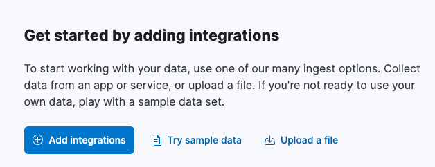
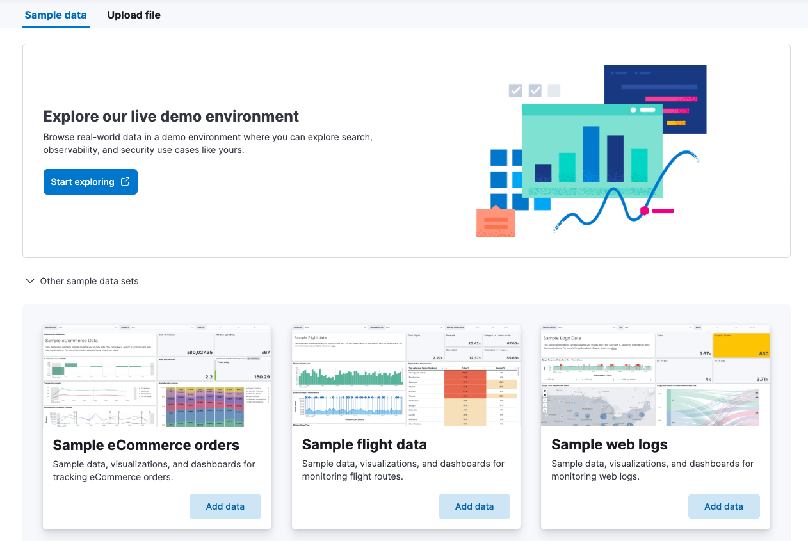
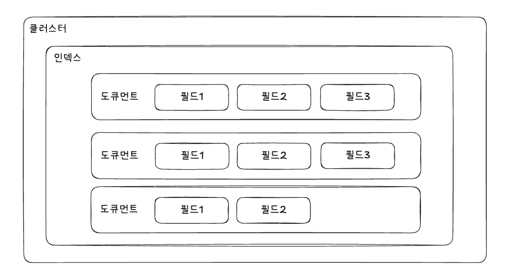
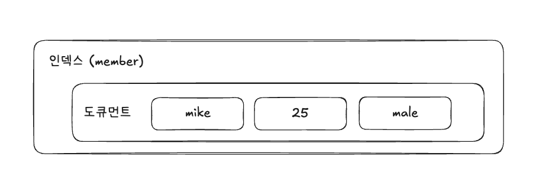

# 03 엘라스틱서치 기본

- ElasticSearch를 제대로 사용하기 위해서는 저장과 인출 방식을 확실히 이해해둬야 한다.
  - 인출을 위해서는 가장 먼저 저장이 필요하며, 저장을 위해서는 스키마를 구성하고 데이터를 집어넣어야 한다.
  - 이 과정에서 데이터 타입을 배우고 전문 검색 내부 동작을 이해해야 한다.
- 저장 과정에 있어 핵심인 인덱스와 도큐먼트 개념.

---

## 1. 준비 작업

- 엘라스틱의 모든 기능은 REST API 형태다.

### 1-1. 엘라스틱서치 요청과 응답

- 모든 요청과 응답은 REST API 형태로 제공한다.

### 1-2. 키비나 콘솔

- 키바나 Dev Tools에 있는 콘솔을 사용해 REST API를 호출할 수 있다.

### 1-3. 시스템 상태 확인

- 엘라스틱서치의 현재 상태를 빠르게 확인하기 위해 `cat` API를 사용한다.
  - 여기서 `cat`은 'compact and aligned text'의 약어다.

```
GET _cat
```

- 귀여운 고양이 이모티콘과 함께 cat API가 지원하는 목록을 확인할 수 있다.

```
=^.^=
/_cat/allocation
/_cat/shards
/_cat/shards/{index}
/_cat/master
/_cat/nodes
/_cat/tasks
/_cat/indices
/_cat/indices/{index}
/_cat/segments
/_cat/segments/{index}
/_cat/count
/_cat/count/{index}
/_cat/recovery
/_cat/recovery/{index}
/_cat/health
/_cat/pending_tasks
/_cat/aliases
/_cat/aliases/{alias}
/_cat/thread_pool
/_cat/thread_pool/{thread_pools}
/_cat/plugins
/_cat/fielddata
/_cat/fielddata/{fields}
/_cat/nodeattrs
/_cat/repositories
/_cat/snapshots/{repository}
/_cat/templates
/_cat/component_templates/_cat/ml/anomaly_detectors
/_cat/ml/anomaly_detectors/{job_id}
/_cat/ml/datafeeds
/_cat/ml/datafeeds/{datafeed_id}
/_cat/ml/trained_models
/_cat/ml/trained_models/{model_id}
/_cat/ml/data_frame/analytics
/_cat/ml/data_frame/analytics/{id}
/_cat/transforms
/_cat/transforms/{transform_id}
```

- 노드, 샤드, 템플릿 등의 상태 정보나 통계 정보를 확인할 수 있다.
- 예시를 확인해보자.

```
GET _cat/indices?v
```

- 파라미터 사용
  - `v`: 컬럼의 이름을 확인할 수 있다.
  - `s`: 정렬
  - `h`: 헤더

- 사실 아래와 같이 `curl` 커맨드를 사용해 터미널에서 키바나 콘솔에서 얻은 것과 같은 결과를 얻을 수 있다.

```shell
$ curl -X GET "http://localhost:9200/_cat/indices?v"
```

### 1-4. 샘플 데이터 불러오기

- 키바나 홈페이지에서 `Try sample data`를 통해 샘플 데이터를 사용할 수 있다.



- 해당 버튼을 누르면 `More ways to add data` 페이지로 진입하는데, 여기서 `Other sample data sets` 토클을 클릭하면 3가지 샘플이 뜬다.



---

## 2. 인덱스와 도큐먼트

- 엘라스틱서치를 이해하기 위해서는 `인덱스 index`와 `도큐먼트 document`가 무척 중요하다.
- 인덱스는 도큐먼트를 저장하는 논리적 구분이며, 도큐먼트는 실제 데이터를 저장하는 단위다.




### 2-1. 도큐먼트

- 도큐먼트는 엘라스틱서치에서 데이터가 저장되는 기본 단위로 JSON 형태며, 하나의 도큐먼트는 여러 `필드 field`와 `값 value`을 갖는다.
- 아래는 JSON 형태의 도큐먼트 파일의 예시이다.

```json
{
  "name": "mike",
  "age": 25,
  "gender": "male"
}
```



- MySQL과 인덱스를 비교해보자면 아래와 같다.

| MySQL  | ElasticSearch |
|:-------|:--------------|
| Table  | Index         |
| Record | Document      |
| Column | Field         |
| Schema | Mapping       |

- 7.x로 넘어오면서 `타입 Type`이 사라짐.
  - 원래 `타입`이라는 개념이 MySQL의 테이블에 가까웠다.

### 2-2. 인덱스

- 도큐먼트를 저장하는 논리적 단위
  - 관계형 데이터베이스의 테이블과 유사한 개념이다.
  - 하나의 인덱스에 다수의 도큐먼트가 포함되는 구조. 동일한 인덱스에 있는 도큐먼트는 동일한 스키마를 갖는다.
  - 그리고 모든 도큐먼트는 반드시 하나의 인덱스를 포함해야 한다.
- 인덱스 이름에는 영어 소문자를 비롯해 `\`, `/`, `*`, `?`, `"`, `<`, `>`, `|`, `#`, 공백, 쉼표 등을 제외한 특수문자를 사용할 수 있으며 255바이트를 넘을 수 없다.

#### 스키마에 따른 그룹핑

- 일반적으로 스키마에 따라 인덱스를 구분한다.
  - ex) 회원 정보 도큐먼트 & 장바구니 도큐먼트 => 성격이 다르기 때문에 데이터 스키마도 다르다.
  - 서로 다른 스키마를 가진 도큐먼트를 하나의 인덱스에 저장하는 방법은 바람직하지 않다.
- 인덱스의 스키마는 매핑을 통해 정의한다.

#### 관리 목적의 그룹핑

- 기본적으로 인덱스는 용량이나 숫자 제한 없이 무한대의 도큐먼트를 포함할 수 있다.
  - 따라서 이론적으로는 하나의 인덱스에 수억 개의 도큐먼트도 저장될 수 있다.
  - 하지만 그만큼 검색 성능이 나빠진다. => 인덱스 용량 제한을 두게 된다.
- 특정 도큐먼트 개수에 도달하거나 특정 용량을 넘어서면 인덱스를 분리한다.
  - 혹은 일/주/월/년 단위 같은 날짜/시간 단위로 인덱스를 분리하기도 한다.

---

## 3. 도큐먼트 CRUD

### 3-1. 인덱스 생성/확인/삭제

- 생성

```http request
PUT index1
```

```json
{
  "acknowledged": true,
  "shards_acknowledged": true,
  "index": "index1"
}
```

- 확인

```http request
GET index1
```

```json
{
  "index1": {
    "aliases": {},
    "mappings": {},
    "settings": {
      "index": {
        "routing": {
          "allocation": {
            "include": {
              "_tier_preference": "data_content"
            }
          }
        },
        "number_of_shards": "1",
        "provided_name": "index1",
        "creation_date": "1744893518790",
        "number_of_replicas": "1",
        "uuid": "d7Dp2HTxTmmQZRksDA1vig",
        "version": {
          "created": "8505000"
        }
      }
    }
  }
}
```

- 삭제

```http request
DELETE index1
```

```json
{
  "acknowledged": true
}
```

### 3-2. 도큐먼트 생성

- 엘라스틱서치에서 도큐먼트를 인덱스에 포함시키는 것을 `인덱싱 indexing`이라고 한다.
- 아래와 같이 명령어를 사용하는 것을 "도큐먼트를 인덱싱한다"라고 말한다.

```http request
PUT index2/_doc/1
{
  "name": "mike",
  "age": 25,
  "gender": "male"
}
```

```json
{
  "_index": "index2",
  "_id": "1",
  "_version": 1,
  "result": "created",
  "_shards": {
    "total": 2,
    "successful": 1,
    "failed": 0
  },
  "_seq_no": 0,
  "_primary_term": 1
}
```

- 존재하지 않았던 `index2`라는 인덱스를 생성하면서 동시에 `index2` 인덱스에 도큐먼트를 인덱싱한다.
  - `index2`: 인덱스 이름
  - `_doc`: 엔드포인트 구분을 위한 예약어
  - `1`: 인덱싱할 도큐먼트의 고유 아이디.
- 이제 인덱스를 확인해보자. 이 중에서도 `mappings`에 집중!

```http request
GET index2
```

```json
{
  "index2": {
    "aliases": {},
    "mappings": {
      "properties": {
        "age": {
          "type": "long"
        },
        "gender": {
          "type": "text",
          "fields": {
            "keyword": {
              "type": "keyword",
              "ignore_above": 256
            }
          }
        },
        "name": {
          "type": "text",
          "fields": {
            "keyword": {
              "type": "keyword",
              "ignore_above": 256
            }
          }
        }
      }
    },
    ...
  }
}
```

- 데이터 타입을 지정하지 않아도 엘라스틱서치는 도큐먼트의 필드와 값을 보고 자동으로 지정하는데, 이런 기능을 `다이내믹 매핑 dynamic mapping`이라고 한다.
- 아래와 같이 `country`라는 새로운 이름의 필드가 추가된 도큐먼트를 인덱싱하면, 문제 없이 추가된다.

```http request
PUT index2/_doc/2
{
  "name": "jane",
  "country": "france"
}
```

- 만약 데이터 타입을 잘못 입력한 도큐먼트를 인덱싱하면 어떻게 될까?

```http request
PUT index2/_doc/3
{
  "name": "kim",
  "age": "20",
  "gender": "female"
}
```

- `age`의 타입이 이미 `"type": "long"`와 같이 설정되어 있기 때문에 3번의 도큐먼트는 인덱싱 과정에서 강제로 숫자 타입으로 변경한다.

### 3-3. 도큐먼트 읽기

- 단일 조회

```http request
GET index2/_doc/1
```

- 인덱스 내의 도큐먼트 검색

```http request
GET index2/_search
```

### 3-4. 도큐먼트 수정

- 1번 도큐먼트의 특정 필드값 변경

```http request
PUT /index2/_doc/1
{
  "name": "park",
  "age": 45,
  "gender": "male"
}
```

- 아래와 같이 업데이트가 잘 되었음을 확인할 수 있다.

```json
{
  "_index": "index2",
  "_id": "1",
  "_version": 2,
  "result": "updated",
  "_shards": {
    "total": 2,
    "successful": 1,
    "failed": 0
  },
  "_seq_no": 3,
  "_primary_term": 1
}
```

- update API를 이용해 특정 도큐먼트의 값을 업데이트할 수도 있다.
  - 아래는 1번 도큐먼트의 `name`을 `lee`로 변경

```http request
POST index2/_update/1
{
  "doc": {
    "name": "lee"
  }
}
```

- 엘라스틱서치 도큐먼트 수정 작업은 비용이 많이 들기 때문에 권장하지 않는다.
  - 특히 엘라스틱서치를 로그 수집 용도로 사용한다면 개별 도큐먼트는 수정할 일은 거의 없다.
  - 개별 도큐먼트 수정이 많은 작업이라면 엘라스틱서치가 아닌 다른 데이터베이스를 사용하는 것이 좋다.

### 3-5. 도큐먼트 삭제

- 특정 도큐먼트를 삭제하기 위해서는 인덱스명과 도큐먼트 아이디를 알고 있어야 한다.

```http request
DELETE index2/_doc/2
```

- `index2` 인덱스에서 도큐먼트 아이디가 `2`인 도큐먼트가 삭제된다.
- 도큐먼트 수정과 마찬가지로 개별 도큐먼트 삭제 또한 비용이 많이 들어가는 작업인 만큼 사용 시에 주의하자.

---

# 참고 자료

- 엘라스틱 스택 개발부터 운영까지, 김준영 & 정상운 지음, 박재호 감수, 펴낸곳: 책만
