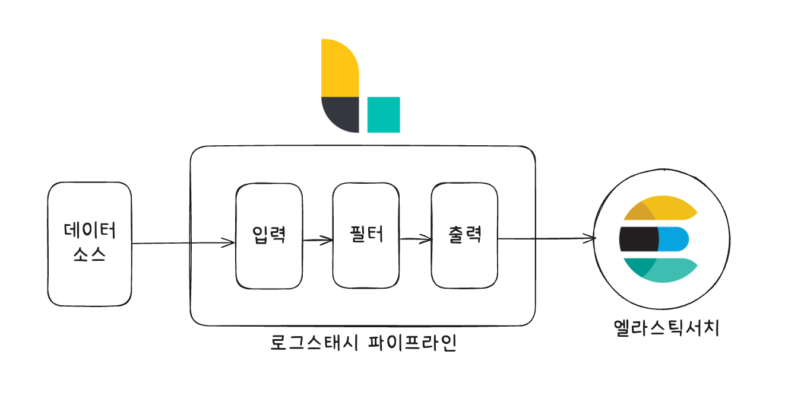

# 06 로그 스태시

- 단어 그대로 `로그 log`를 `저장한다 stash`
- 로그 형태를 강제할 방법이 없기 때문에 결국 로그를 수집하는 쪽에서 로그 형태를 분석하고 시스템에서 인식할 수 있도록 로그르 정제하는 방법이 필요한데, 로그스태시는 이 과정을 쉽고 편하게 할 수 있도록 지원한다.

## 1. 소개

- 로그스태시는 플러그인 기반 오픈소스 데이터 처리 파이프라인 도구다.
- 다소 복잡하고 귀찮은 데이터 전처리 과정을 비교적 간단한 설정만으로 수행할 수 있다.

### 1-1. 로그스태시 특징

- `플러그인 기반`: 파이프라인을 구성하는 각 요소들은 전부 플러그인 형태로 만들어져 있다. 플러그인 개발을 위한 프레임워크를 포함하고 있고 플러그인을 관리할 수 있는 기능도 제공한다.
- `모든 형태의 데이터 처리`: 기본 제공되는 플러그인 조합만으로 대다수의 데이터 소스 처리 가능. 특히, 이벤트 데이터, 즉 시간에 따라 발생하는 데이터를 처리하는 데 최적화되어 있다. 
- `성능`: 파이프라인 배치 크기 조정을 통해 병목 현상 방지. 성능 최적화.
- `안정성`: 장애 상황에 대응하기 위한 재시도 로직. 오류가 발생한 도큐먼트를 따로 보관하는 `데드 레터 큐 dead letter queue`를 내장.

----

## 2. 설치

- 책과 달리 docker-compose 사용.

----

## 3. 파이프라인

- 가장 중요한 부분이다. 파이프라인은 데이터를 입력받아 실시간으로 변경하고 이를 다른 시스템에 전달하는 역할을 로그스태시의 핵심 기능이다.
- 파이프라인은 `입력`, `필터`, `출력`이라는 세 가지 구성요소로 이뤄진다.
  - 입력과 출력은 필수, 필터는 옵션.



- 각 단계에서 복수의 플러그인을 포함시킬 수 있다.

#### 실행

- 아래처럼 로그스태시를 명령어로 실행할 수 있다.

```shell
$ ./bin/logstash -e "input { stdin { } } output { stdout { } }"
```

- 로그스태시 확인

```shell
$ ps -ef | grep logstash
```

### 3-1. 입력

- 자주 사용하는 입력 플러그인
1. `file`: 리눅스의 tail -f 명령처럼 파일을 스트리밍하여 이벤트를 읽어 들인다.
2. `syslog`: 네트워크를 통해 전달되는 시스로그를 수신
3. `kafka`: 토픽에서 데이터 읽어옴.
4. `jdbc`: JDBC 드라이버로 지정한 일정마다 쿼리를 실행해 읽어옴.

```config
input {
 file {
   path => "/usr/share/logstash/my/my.log"
   start_position => "beginning"
 }
}

output {
 stdout { }
}
``` 

- 그리고 `my.log` 파일을 수정해보자. 그러면 아래와 같이 stdout(표준 출력)이 나오게 된다.

```shell
2025-05-23 22:15:18 [2025-05-23T13:15:18,861][INFO ][logstash.agent           ] Pipelines running {:count=>1, :running_pipelines=>[:main], :non_running_pipelines=>[]}
2025-05-23 22:15:18 {
2025-05-23 22:15:18       "@version" => "1",
2025-05-23 22:15:18          "event" => {
2025-05-23 22:15:18         "original" => "gwgewgwe"
2025-05-23 22:15:18     },
2025-05-23 22:15:18        "message" => "gwgewgwe",
2025-05-23 22:15:18     "@timestamp" => 2025-05-23T13:15:18.875222512Z,
2025-05-23 22:15:18            "log" => {
2025-05-23 22:15:18         "file" => {
2025-05-23 22:15:18             "path" => "/usr/share/logstash/my/my.log"
2025-05-23 22:15:18         }
2025-05-23 22:15:18     },
2025-05-23 22:15:18           "host" => {
2025-05-23 22:15:18         "name" => "c931d43ff892"
2025-05-23 22:15:18     }
2025-05-23 22:15:18 }
2025-05-23 22:15:18 {
2025-05-23 22:15:18       "@version" => "1",
2025-05-23 22:15:18          "event" => {
2025-05-23 22:15:18         "original" => "fewgew"
2025-05-23 22:15:18     },
2025-05-23 22:15:18        "message" => "fewgew",
2025-05-23 22:15:18     "@timestamp" => 2025-05-23T13:15:18.873133346Z,
2025-05-23 22:15:18            "log" => {
2025-05-23 22:15:18         "file" => {
2025-05-23 22:15:18             "path" => "/usr/share/logstash/my/my.log"
2025-05-23 22:15:18         }
2025-05-23 22:15:18     },
2025-05-23 22:15:18           "host" => {
2025-05-23 22:15:18         "name" => "c931d43ff892"
2025-05-23 22:15:18     }
2025-05-23 22:15:18 }
```

### 3-2. 필터

- 입력 플러그인이 받은 데이터를 의미 있는 데이터로 구조화하는 역할을 한다.
  - 옵션이긴 하지만, 필터 없는 파이프라인은 그 기능을 온전히 발휘하기 힘들다.
- 자주 사용되는 필터 플러그인
1. `grok`: grok 패턴을 사용해 메시지를 구조화된 형태로 분석한다.
2. `dissect`: 간단한 패턴을 사용해 메시지를 구조화된 형태로 분석한다.
3. `mutate`: 필드명을 변경하거나 문자열 처리 등 일반적인 가공 함수들을 제공한다.
4. `date`: 문자열을 지정한 패턴의 날짜형으로 분석한다.

> #### 참고 sincedb 데이터베이스 파일
> - 파일을 어디까지 읽었는지 기록하는 파일
> - `beginning`은 파일의 처음부터 읽어오고, `end`는 파일의 끝에서부터 읽어온다.
> - `start_position`은 파일을 불러들이는 최초에 한 번만 적용된다.

#### 3-2-1. 문자열 자르기

- 데이터나 로그는 대부분 길이가 길기 때문에 우리가 원하는 형태로 분리해야 한다.

```config
input {
 file {
   path => "/usr/share/logstash/my/my.log"
   start_position => "beginning"
   sincedb_path => "null"
 }
}

filter {
  mutate {
    split => { "message" => " " }
  }
}

output {
 stdout { }
}
```

- `split` 옵션을 사용하면 문자열이 공백을 기준으로 구분되어 배열 형태의 데이터가 된다.

```shell
2025-05-23 22:26:18 {
2025-05-23 22:26:18     "@timestamp" => 2025-05-23T13:26:18.767238554Z,
2025-05-23 22:26:18            "log" => {
2025-05-23 22:26:18         "file" => {
2025-05-23 22:26:18             "path" => "/usr/share/logstash/my/my.log"
2025-05-23 22:26:18         }
2025-05-23 22:26:18     },
2025-05-23 22:26:18        "message" => [
2025-05-23 22:26:18         [0] "2020/01/02",
2025-05-23 22:26:18         [1] "14:19:25",
2025-05-23 22:26:18         [2] "ID2",
2025-05-23 22:26:18         [3] "2124214124",
2025-05-23 22:26:18         [4] "warn",
2025-05-23 22:26:18         [5] "-",
2025-05-23 22:26:18         [6] "busy",
2025-05-23 22:26:18         [7] "server"
2025-05-23 22:26:18     ],
2025-05-23 22:26:18           "host" => {
2025-05-23 22:26:18         "name" => "c931d43ff892"
2025-05-23 22:26:18     },
2025-05-23 22:26:18          "event" => {
2025-05-23 22:26:18         "original" => "2020/01/02 14:19:25 ID2 2124214124 warn - busy server"
2025-05-23 22:26:18     },
2025-05-23 22:26:18       "@version" => "1"
2025-05-23 22:26:18 }
```

- 필터 플러그인 공통 옵션
1. `add_field`: 새로운 필드를 추가할 수 있다.
2. `add_tag`: 성공한 이벤트에 태그를 추가할 수 있다.
3. `enable_metric`: 메트릭 로깅을 활성화하거나 비활성화할 수 있다.
4. `id`: 플러그인의 아이디를 설정한다. 모니터링 시 아이디를 사용해 특정 플러그인을 쉽게 찾을 수 있다.
5. `remove_field`: 필드를 삭제할 수 있다.
6. `remove_tag`: 성공한 이벤트에 붙은 태그를 제거할 수 있다.

```conf
filter {
  mutate {
    split => { "message" => " " }
    add_field => { "id" => "%[message][2]}" }
    remove_field => { "message" }
  }
}
```

----

# 참고 자료

- 엘라스틱 스택 개발부터 운영까지, 김준영 & 정상운 지음, 박재호 감수, 펴낸곳: 책만
