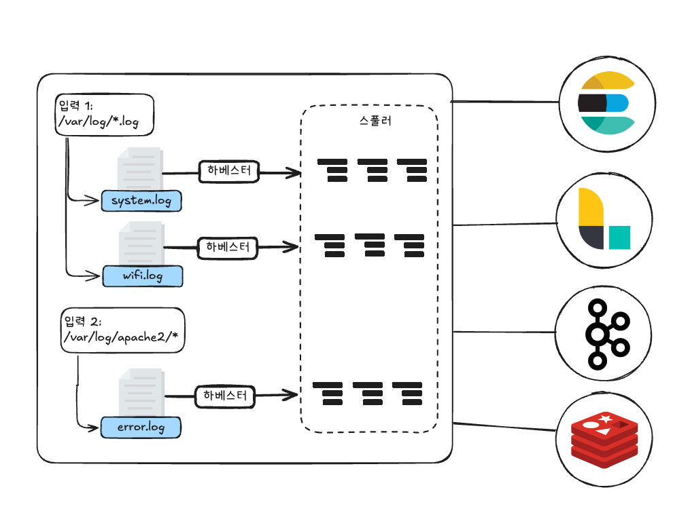

# 07 비츠 

- 가볍고 사용하기 쉬운 데이터 수집기.
- Go 언어로 작성되어 굉장히 가볍다.

## 1. 소개

- 가벼운 프로그램 지향 => 하나의 목적만 수행.
  - 따라서 목적별로 다양한 비츠들이 존재.
- 데이터를 수집하는 것에 특화. 로그스태시와 비슷해 보임.
  - `LogStash`: 다양한 플러그인을 포함해 범용성이 높다. => 무겁다.
  - `Beats`: 범용성 포기. 특정 목적만 수행 => 성능에 영향 거의 없다.
- 이벤트 가공을 완전히 지원하지 않는 것도 아니므로 간단한 수집이라면 로그스태시보다 비츠를 쓰는 것이 성능상 유리하다.
  - 로그스태시와 비츠는 서로 공생 관계라고 생각하면 된다.
- 비츠의 종류는 매우 많으며, 자세한 내용은 문서를 참고!!

----

## 2. 비츠 설치

- 도커 이미지로 설치

----

## 3. 파일비트

### 3-1. 파일비트 아키텍처



- 구성요소
  - `입력 input`: 설정 파일에서 하베스터에 대한 입력 소스를 정한다. 파일비트 하나 혹은 여러 개의 입력을 가질 수 있다.
  - `하베스터 harvester`: 입력에 명시된 파일을 직접 수집하는 주체. 파일은 하나의 하베스터를 가지며, 하베스터는 파일을 한 줄씩 읽고 내보내는 역할을 한다. 또한 파일을 열고 닫는 역할도 한다. 하베스터가 실행되는 동안에는 파일 디스크립터가 열려 있다.
  - `스풀러 spooler`: 하베스터가 수집한 이벤트를 엘라스틱서치나 로그스태시 같은 장소로 전달한다.

### 3-2. 설치

### 3-3. 파일비트 실행

- 파일 비트 설정하기 (`filebeat.yml`)

```yaml
filebeat.inputs:
  - type: log
    enabled: true
    paths:
      - /var/log/*.log

output.elasticsearch:
  hosts: ["localhost:9200"]

setup.kibana:
  host: "localhost:5601"
```

- 파일비트 인풋 타입
  - `log`: 파일시스템의 지정한 경로에서 로그 파일을 읽어 들인다.
  - `container`: 도커 같은 컨테이너 로그를 수집하기 위한 입력.
  - `s3`: s3 버킷에 위치한 파일 읽음
  - `kafka`: 카프카 토픽 읽음
- 파일비트 아웃풋 타입
  - `elasticsearch`: 엘라스틱서치로 직접 인덱싱
  - `logstash`: 인덱싱 리퀘스트의 양이 많거나, 비츠나 인제스트 노드 수준에서 처리하기 어려운 가공 작업이 필요할 때 별도의 로그스태시를 구축한 후 수집한 이벤트를 전송한다. 벌크로 묶어 개선 가능.
  - `kafka`: 1차적으로 수집한 이벤트를 카프카로 전송. 카프카는 좀 더 안정적인 수집 파이프라인을 구성할 때 신뢰할 만한 중간 저장소/큐다.
  - `console`: 시스템 콘솔에 출력

### 3-4. 파일비트 설정

#### 3-4-1. 유용한 설정

- `ignore_older`: 새로운 파일 탐색 시 오래된 파일은 읽어 들이지 않고 무시하기 위한 설정
  - 인풋 타입이 `log`인 경우 사용할 수 있다.

```yaml
filebeat.inputs:
  - type: log
    enabled: true
    paths:
      - /var/log/*.log
    ignore_older: 24h
```

- `include_lines`: 특정 라인을 정규 표현식을 이용해 필터링하고 매치된 라인만 비츠에서 수용
- `exclude_lines`: 특정 라인을 정규 표현식을 이용해 필터링하고 매치된 라인은 비츠에서 수집하지 않는다.
- `exclude_files`: 패턴에 일치하는 파일을 무시.

```yaml
filebeat.inputs:
  - type: log
    enabled: true
    paths:
      - /var/log/*.log
    include_lines: ['^ERR', '^WARN']
    exclude_lines: ['^DBG']
    exclude_files: ['\.gz$']
```

#### 3-4-2. 멀티라인 로그 처리

- 여러 라인을 하나의 로그로 인식하기 위해 사용하는 방법
  - 자바 오류는 스택 트레이스 정보를 담고 있기 때문에 실제로 하나의 오류를 멀티라인으로 표현한다.

```yaml
filebeat.inputs:
  - type: log
    enabled: true
    paths:
      - /var/log/*.log
    multiline.pattern: '^[[:space:]]'
    multiline.negate: false
    multiline.match: after
```

- `multiline.pattern`: 정규식을 이용해 패턴을 지정.
- `multiline.negate`: `true`로 변경하면 첫 번째 문자가 공백이 아닐 때 멀티라인으로 인식한다. `false`인 경우 패턴이 일치하는 연속된 라인을 기준으로 본다.
- `multiline.match`: 멀티라인을 처리하는 방법. `before`, `after` 지정 가능

### 3-5. 모듈

- 일반적인 설정을 사전에 정의해둔 것.
- 모듈의 핵심은 손쉬운 사용.
- 파일비트 모듈
  - `aws`
  - `cef`: 시스로그를 통해 CEF(Common Event Format) 이벤트를 입력받을 수 있다.
  - `cisco`: 시스코사의 ASA, Nexus 등 네트워크 장비에서 발생되는 이벤트를 수집한다.
  - `elasticsearch`: 엘라스틱서치의 클러스터, GC, 감사로그 등을 수집할 때 사용
  - `googlecloud`: 구글 클라우드 플랫폼의 VPC 플로우, 방화벽 로그 등을 수집할 수 있다.
  - `logstash`: 로그스태시에서 발생한 로그들을 수집할 수 있다.

#### 3-5-1. 비트 다운로드

#### 3-5-2. 비츠 설정 파일 수정

- `filebeat.yml`에 모듈 설정 추가

```yaml
filebeat.config.modules:
  path: '${path.config}/modules.d/*.yml'
```

#### 3-5-3. 모듈 활성화

#### 3-5-4. 모듈 설정 파일 수정

- logstash 모듈을 사용한다고 가정. `logstash.yml` 수정

```yaml
- module: logstash
  log:
    enabled: true
  var.path: [/var/log/logstash/*.log]

  slowlog:
    enabled: true
```

#### 3-5-5. setup 명령과 비트 실행

#### 3-5-6. 키바나에서 확인

----

## 4. 모니터링

- 비츠가 데이터 입출력을 잘하고 있는지, 비츠가 동작 중인 호스트의 리소스들은 문제없는지 등을 확인.
- `filebeat.yml`에 모니터링 설정을 추가

```yaml
monitoring.enabled: true
monitoring.elasticsearch:
  hosts: ["localhost:9200"]
```


----

# 참고 자료

- 엘라스틱 스택 개발부터 운영까지, 김준영 & 정상운 지음, 박재호 감수, 펴낸곳: 책만
