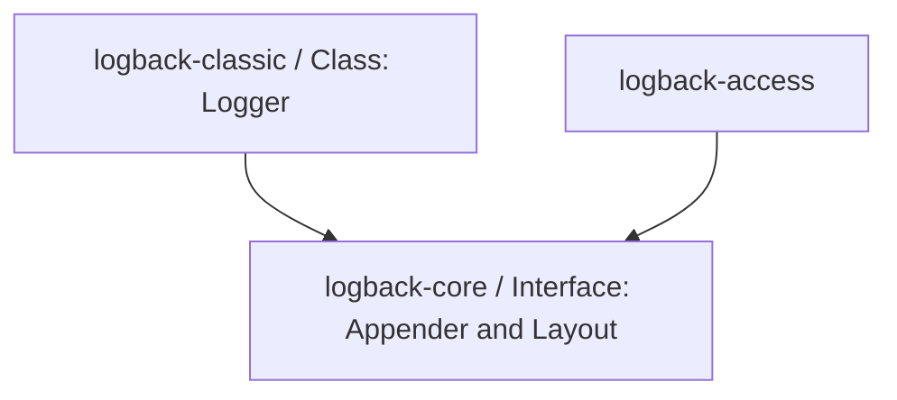
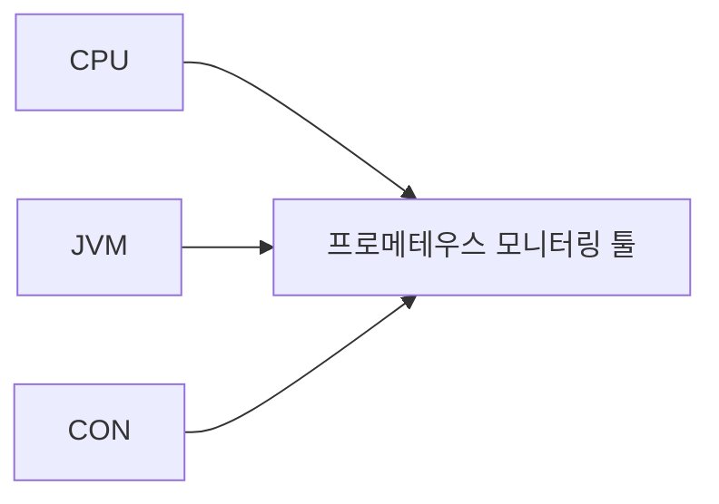
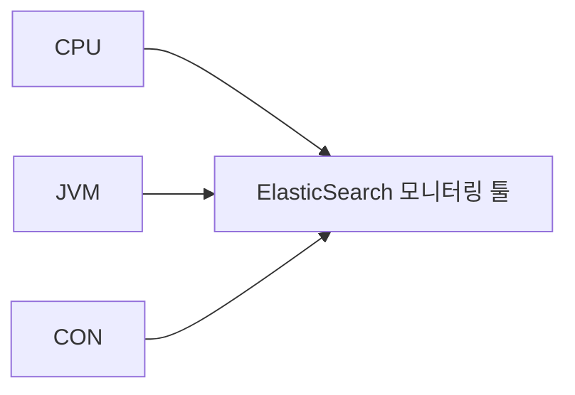
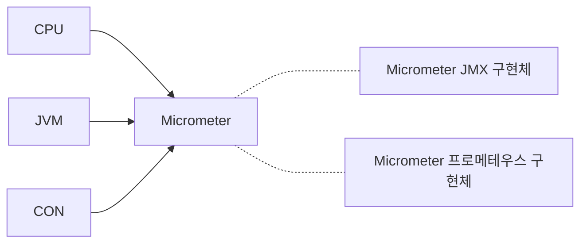

# 로깅

## 로깅 개요

- 프로그램 동작시 발생하는 `모든 일`을 기록하는 행위
  - 여기서 `모든 일`은 프로젝트의 성격이나 팀에 맞게 설정하면 된다.
  - 서버의 상태와 동작 정보를 시간 경과에 따라 기록.
  - 시스템의 오류와 문제들을 쉽게 찾을 수 있도록 도와줌
- 로깅 프레임워크
  - SLF4J
  - Logback
  - Lof4j
  - nlog

### 로깅 vs System.out.println()

- 로깅의 장점
  - 일괄적으로 출력 형식을 지정할 수 있다.
  - 로그 레벨에 따라 남기고 싶은 로그를 별도로 지정할 수 있다.
  - 콘솔뿐만 아니라 파일이나, 네트워크 등 로그를 별도에 위치에 남길 수 있다.
  - `System.out.println()`보다 성능적으로 우수하다.

### 로그 레벨

|   레벨    |                    설명                     |
|:-------:|:-----------------------------------------:|
| `Fatal` |       매우 심각한 에러. 프로그램이 종료되는 경우가 많음.       |
| `Error` |    의도하지 않은 에러가 발생한 경우. 프로그램이 종료되진 않음.     |
| `Warn`  |         에러가 될 수 있는 잠재적 가능성이 있는 경우         |
| `Info`  |   명확한 의도가 있는 에러, 요구사항에 따라 시스템 동작을 보여줄 때   |
| `Debug` |    Info 레벨보다 더 자세한 정보가 필요한 경우. Dev 환경     |
| `Trace` | Debug 레벨보다 더 자세함. Dev 환경에서 버그를 해결하기 위해 사용 |

### 로깅 vs 디버깅

- 실제 운영 환경에서는 디버깅을 할 수 없다. 이런 상황에서는 로깅이 최선의 선택이다.
- 디버깅을 쓸 수 있는 상황이라면 디버깅을 사용하는 것이 좋다.

### 로깅 형식

- 추적하기 편하게 만들기 위해 아래와 같은 형식을 채택
  - `[ClassName][MethodName] ~~~~~~` 

```kotlin
class QnaFinder(
  private val questionRepository: QuestionRepository
) {
  fun find(...) {
    //...
      log.inf("[QnaFinder][find] ~~~~~")
    //...
  }
}
```

## 로깅 프레임워크

### SLF4J

- Simple Logging Facade for Java
- 다양한 로깅 프레임 워크에 대한 추상화(인터페이스) 역할
  - 단독으로는 사용 불가능
  - 최종 사용자가 배포시 원하는 구현체 선택 (OCP, DIP 원칙 준수)

#### SLF4J의 동작과정

- 개발할 때는 SLF4J API를 사용하여 로깅 코드를 작성
- 배포할 때는, 바인딩된 Logging Framework가 실제 로깅 코드를 수행하는 과정을 거침


- `Bridge`
  - SLF4J 이외의 다른 로깅 API로의 Logger 호출을 SLF4J API로 연결하여 SLF4J API가 대신 처리할 수 있도록 하는 어댑터 역할을 하는 라이브러리 
  - 레거시 로깅 프레임워크를 위한 라이브러리
  - 여러 개 사용 가능해도 상광 없지만, Binding 모듈에서 사용될 프레임워크와 다른 종류의 프레임워크만 사용해야 한다.
- `SLF4J API`
  - 로깅에 대한 추상 레이어(인터페이스)를 제공 => 로깅 동작에 대한 역할을 수행할 추상 메소드를 제공한다고 보면 된다.
  - 추상 클래스이기 때문에 이 모듈만 단독적으로 쓰일 순 없다.
  - 주의사항! "하나의 API 모듈에 하나의 Binding 모듈만 둬야 한다!"
- `Binding`
  - SLF4J API를 `로깅 구현체 Logging Framework`와 연결하는 어댑터 모듈
  - SLF4J API를 구현한 클래스에서 Binding으로 연결될 Logger의 API를 호출
  - 주의사항! "하나의 API 모듈에 하나의 Binding 모듈만 둬야 한다!"

### Logback

- SLF4J의 구현체
- Log4J를 토대로 만든 프레임워크

#### Logback 구조

- Logback은 아래와 같이 3가지 모듈로 나뉜다.
  - logback-core, logback-classic, logback-access



- `logback-core`
  - 다른 두 모듈을 위한 기반 역할을 하는 모듈
  - Appender와 Layout 인터페이스가 이 모듈에 속한다.
- `logback-classic`
  - logback-core를 가지며 SLF4J API를 구현한다.
  - Logger 클래스가 이 모듈에 속한다.
  - logback-classic는 기본적으로 slf4j 의존성과 logback-core 의존성을 가지고 있고, 그것을 설정해 주지만, 실제로 설정할 때 slf4j 의존성과 logback-core 의존성을 exclude하고 따로 설정해주는 것이 좋다고 한다. 
- `logback-access`
  - Servlet Container와 통합되어 HTTP 액세스에 대한 로깅 기능을 제공한다.
  - logback-core는 logback-access의 기반 기술이기에 필요하지만 logback-classic 및 slf4j와 무관하다.
  - 웹 애플리케이션 레벨이 아닌 컨테이너 레벨에서 설치되어야 한다.

#### Logback 설정 요소

- `Logger`
  - 어떻게 기록할까?
  - 실제 로깅을 수행하는 구성요소
  - 출력 레벨 조정
- `Appender`
  - 어디에 기록할까?
  - 로그 메시지가 출력할 대상 결정
  - `ConsoleAppender`: 콘솔로 출력하는 Appender
  - `FileAppender`: 파일로 출력하는 Appender
  - `RollingFileAppender`: 파일을 일정 조건에 맞게 따로 저장하는 Appender
- `Layout` = `Encoder`
  - 어떻게 출력할까?
  - `Encoder`는 로그 이벤트를 바이트 배열로 변환하고 해당 바이트 배열을 `OutputStream`에 쓰는 작업을 담당한다.
  - Appender에 포함되어 사용자가 지정한 형식으로 표현될 로그 메시지를 변환하는 역할을 담당하는 요소

## 팁

- 특정 로그가 개발할 때만 필요하다면 `debug` level을 사용하자.
- 로그가 너무 많으면 로깅 시스템에도 부하가 될 수 있다. 주기적으로 로그가 너무 많이 쌓이지 않는지 확인.

# 분산 추척

- 클라이언트 요청 -> A Svc -> B Svc... 와 같이 마이크로서비스로 구성된 아키텍처에서 로그를 더 편하게 확인하려면 로그를 어떻게 구성해야 할까?
- `고유 ID`를 가지고 로그를 한 번에 볼 수 있게 구성.
  - 한 개의 요청이 존재할 때, 해당 요청의 전파를 볼 수 있어야 한다.

## TraceId & SpanId

### `TraceId`
- 전체 트랜잭션이나 요청의 전역적인 ID 
- 시스템에서 하나의 요청이 시작되면, 이 요청을 고유하게 식별하기 위해 생성
- 분산 시스템의 여러 마이크로서비스 간 요청이 전달될 때 동일한 traceId를 공유
- A 서비스 → B 서비스 → C 서비스로 이어지는 요청의 전체 경로를 추적

### `SpanId`

- 트랜잭션 내에서 개별 작업 또는 요청의 단위 작업을 고유하게 식별하는 ID
- 요청을 구성하는 개별 작업의 경로를 추적. 
- 요청이 어떤 서비스 또는 작업에서 얼마 동안 처리되었는지, 오류가 발생했는지 등 세부 정보를 파악.

```shell
traceId: 4bf92f3577b34da6a3ce929d0e0e4736
└── spanId (Root): 00f067aa0ba902b7 (A 서비스)
    ├── spanId: 00f067aa0ba902b8 (B 서비스 호출)
    └── spanId: 00f067aa0ba902b9 (C 서비스 호출)
```

## Tracing 툴

- Jaeger
- Zipkin
- OpenTelemetry
- `io.micrometer:micrometer-tracing-bridge-brave` 의존성

<br/>

# Metrics

- 시스템의 성능과 상태에 대한 통계적인 정보를 의미.
- ex) DAU, Retension, CPU 사용량, 메모리 사용량

## 모니터링 인터페이스

### 만약 모니터링 툴을 수정해야 하는 상황이라면?

- 프로메테우스 모니터링 툴에 CPU, JVM, CON(커넥션) 정보 등을 JMX 툴에 전달한다고 해보자.



- 만약 ElasticSearch으로 모니터링 툴을 변경해야 하면 어떻게 될까?



- 지표를 측정하는 코드를 변경한 툴에 맞도록 변경해야 한다.
- 인터페이스를 통해 해결할 수 있는 방법은 없을까?

### 마이크로미터 Micrometer

- 마이크로미터는 벤더 독립적인 인터페이스다.
  - CPU, JVM 등등 여러가지 메트릭(측정 지표)에 대한 표준 측정 방식을 제공한다.
  - 메트릭에 액세스하여 다양한 차원에서 분석할 수 있는 기능을 제공
- 스프링부트 액추에이터는 마이크로미터를 기본으로 내장해서 사용한다.
  - 스프링은 웬만한 추상화를 직접 만들지만, 이미 잘 만들어진 추상화인 마이크로미터를 활용했다. 



- 인터페이스에 맞는 모니터링 툴 구현체만 선택하면 된다.
  - 원하면 변경도 가능하다.

### JVM 메트릭

- JVM 관련 메트릭은 `jvm.` 으로 시작한다.
- 해당 메트릭이 포함하고 있는 정보는 아래와 같다.
  - 메모리 및 버퍼 풀 세부 정보
  - 가비지 컬렉션 관련한 통계
  - 스레드 활용
  - 로드 및 언로드된 클래스 수
  - JVM 버전 정보
  - JIT 컴파일 시간

### 시스템 메트릭

- `system.`, `process.`, `disk.`으로 시작한다.
- 해당 메트릭이 포함하고 있는 정보는 아래와 같다.
  - CPU 메트릭
  - 파일 디스크립터 메트릭
  - 가동 시간 메트릭
  - 사용 가능한 디스크 공간

### 애플리케이션 시작 메트릭

- `application.started.time`: 애플리케이션을 시작하는 데 걸리는 시간. `ApplicationStartedEvent`로 측정한다.
- `application.ready.time`: 애플리케이션이 요청을 처리할 준비가 되는 데 걸리는 시간 `ApplicationReadyEvent`로 측정한다.

> #### ApplicationStartedEvent
> - 스프링 컨테이너가 완전히 실행된 상태일 때 발행된다. 이후에 `CommandLineRunner`가 호출된다.

> #### ApplicationReadyEvent
> - `CommandLineRunner`가 실행된 이후 호출된다.

### 스프링 MVC 메트릭

- 스프링 MVC가 처리하는 모든 요청을 다룬다.
- `http.server.request`이다.
- 해당 메트릭은 아래와 같은 `TAG`가 달려 있다.
  - `uri`: 요청 URI
  - `method`: GET, POST 등의 HTTP 메소드
  - `status`: 200, 400, 500 등의 HTTP 상태 코드
  - `exception`: 예외
  - `outcome`: 상태 코드를 그룹으로 모아서 확인.

### 데이터소스 메트릭

- DataSource와 커넥션 풀에 관한 메트릭을 확인할 수 있다.
- `jdbc.connections`로 시작한다.
  - 만약 히카리 CP 커넥션 풀을 사용한다면 `hikari.`로 시작하는 메트릭을 통해 커넥션 풀의 자세한 내용을 확인할 수 있다.
- 최대 커넥션, 최소 커넥션, 활성 커넥션, 대기 커넥션 수 등을 확인할 수 있다.

### 로그 메트릭

- `logback.events`
- logback 로그에 대한 메트릭을 확인할 수 있다.

### 톰캣 메트릭

- `tomcat.`으로 시작한다.
- 톰캣 메트릭을 사용하려면 아래 옵션을 설정해줘야 한다.

```yaml
# application.yaml
server:
  tomcat:
    mbeanregistry:
      enalbed: true
```

- `tomcat.threads.busy`: 현재 작동하는 스레드 수
- `tomcat.theads.config.max`: 최대 스레드 수

### 사용자 정의 메트릭 

- 사용자가 직접 메트릭을 정의할 수도 있다.
- ex) 주문 수, 취소 수

## 쿠버네티스 환경에 적합한 모니터링 데이터 수집 방법

- 쿠버네티스 노드는 `kubelet`을 통해 파드를 관리하며, 파드의 CPU나 메모리 같은 메트릭 정보를 수집하기 위해 `kubelet`에 내장된 `cAdvisor`를 사용한다.
  - `cAdvisor`는 구글이 만든 컨테이너 메트릭 수집 도구로, 쿠버네티스 클러스터 위에 배포된 여러 컨테이너가 사용하는 메트릭 정보를 수집한 후 이를 가공해서 `kubelet`에 전달하는 역할을 한다.
- 메트릭 서버에서 수집한 데이터로 여러 기능을 수행하도록 구성한 것을 `리소스 메트릭 파이프라인 Resource Metric Pipeline`이라고 한다.
  - `cAdvisor`에서 수집된 데이터로 여러 기능을 수행하도록 구성한 것이다.
  - 하지만 집계한 데이터를 메모리에만 저장하므로 데이터를 영구적으로 보존하기 어렵고 현재 시점의 데이터만 출력된다.
  - 따라서 메트릭 데이터를 저장 공간에 따로 저장하는 `완전한 모니터링 파이프라인 Full Monitoring Pipeline`으로 구축하기를 권장한다. (ex-프로메테우스)

# 참고자료

- [로깅과 로그 관리 + 분산 추척](https://www.youtube.com/watch?v=c7V52EMKXQM)
- [Observability with Spring Boot 3](https://spring.io/blog/2022/10/12/observability-with-spring-boot-3)
- [[10분 테코톡] ☂️ 검프의 Logging(로깅) #1](https://www.youtube.com/watch?v=1MD5xbwznlI)
- [[10분 테코톡] ☂️ 검프의 Logging(로깅) #2](https://www.youtube.com/watch?v=JqZzy7RyudI)
- [스프링 공식 문서](https://docs.spring.io/spring-boot/reference/actuator/metrics.html#actuator.metrics.supported)
- [[액추에이터] - 마이크로미터(Micrometer)와 메트릭(Metric)](https://ttl-blog.tistory.com/1322)
- [안정적인 운영을 완성하는 모니터링. 프로메테우스와 그라파나](https://velog.io/@moey920/%EC%95%88%EC%A0%95%EC%A0%81%EC%9D%B8-%EC%9A%B4%EC%98%81%EC%9D%84-%EC%99%84%EC%84%B1%ED%95%98%EB%8A%94-%EB%AA%A8%EB%8B%88%ED%84%B0%EB%A7%81.-%ED%94%84%EB%A1%9C%EB%A9%94%ED%85%8C%EC%9A%B0%EC%8A%A4%EC%99%80-%EA%B7%B8%EB%9D%BC%ED%8C%8C%EB%82%98)
