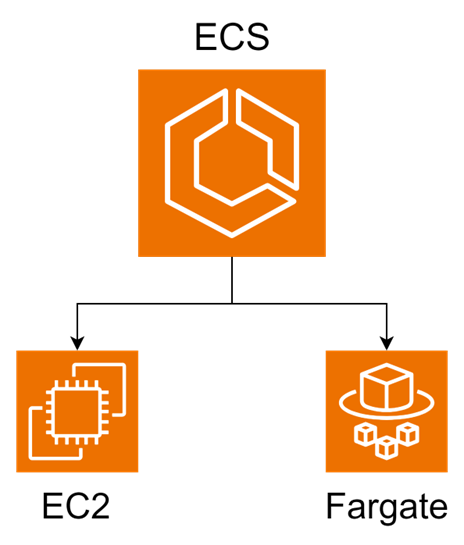
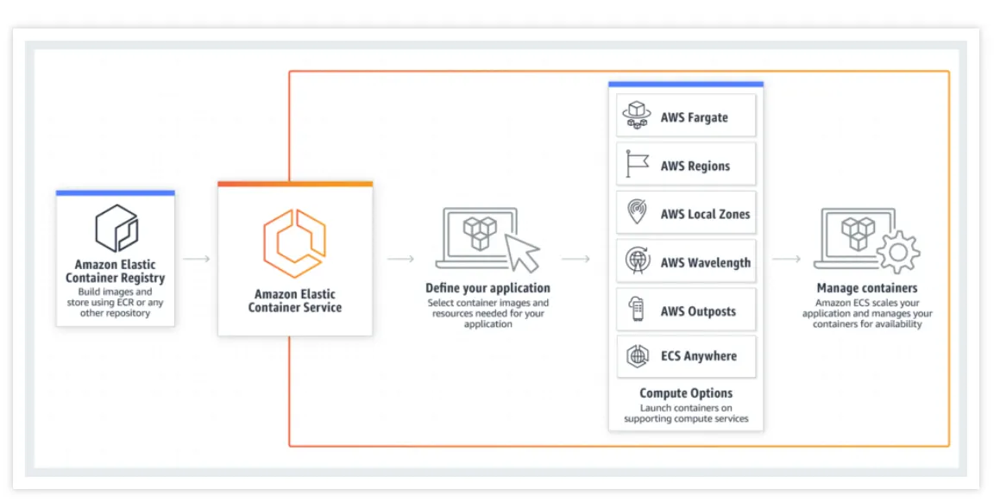
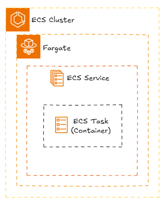

# ECS

- Elastic Container Service
- Docker 컨테이너를 AWS 클라우드에서 쉽게 배포, 관리, 확장하는 완전 관리형 컨테이너 오케스트레이션 서비스
  - AWS EC2 인스턴스
  - AWS Fargate를 통한 Serverless 환경

> #### AWS Fargate
> - 서버리스(Serverless) 컴퓨팅 엔진

## 동작

1. 이미지 저장소인 `Elastic Container Registry`에 도커 이미지를 등록
2. ESC 구축
   - ESC에서 Task Definition(어떤 이미지를 사용하고, 얼마의 CPU와 메모리를 할당할지 등이 정의)
   - Cluster, Service, Task 계층 구조
3. ECS 업데이트: 새로운 리비전의 작업 정의를 사용하도록 명령
   - 기본적으로 Rolling Update
   - CI/CD 파이프라인에서 도커 이미지 빌드 및 등록, ESC 업데이트 등의 작업을 자동화

----

## 기술 선택

### AWS ECS

- AWS 네이티브 환경에서 빠르게 컨테이너 기반 애플리케이션을 배포
- 서버리스 방식으로 컨테이너를 운영
- 간단한 오토스케일링과 로드 밸런싱 설정
- AWS 서비스와의 긴밀한 통합을 활용

### k8s

- AWS보다 더 비용효율적인 클라우드를 사용하고 싶을 때. 
- 멀티 클라우드 또는 하이브리드 클라우드 환경을 구축
- 복잡한 배포 전략(카나리 배포, 롤링 업데이트 등)이나 네트워크 구성을 세밀하게 관리
- 오픈 소스 도구를 활용하여 확장성과 유연성을 극대화
- 다양한 클라우드 및 온프레미스 환경에서 일관된 인프라 관리

# 참고자료

- [AMAZON ECS/ECR 이해](https://medium.com/@yyuni915/amazon-ecs-ecr-%EC%9D%B4%ED%95%B4-c4bcd7257ea9)
- [ECS vs k8s](https://velog.io/@captain-yun/ECS-vs-k8s)
- [AWS - Elastic Container Service(ECS) 구성과 Fargate](https://jtechtalk.tistory.com/37)
