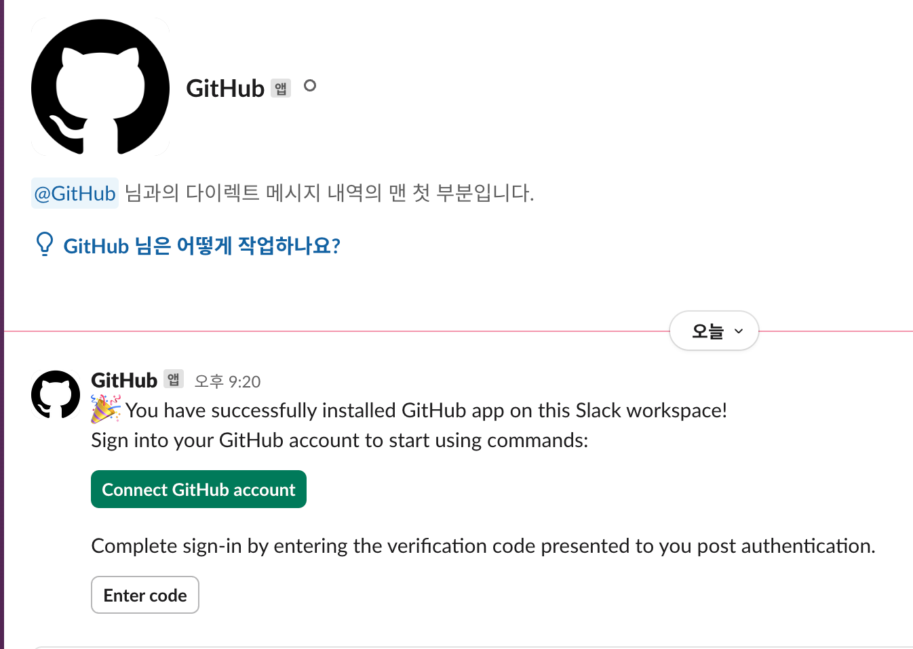
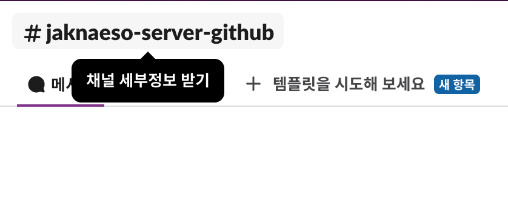

# Slack Github 연동

## 기본

- `더보기`의 `자동화`를 메뉴를 선택한다.


- GitHub 앱을 추가해준다.


- 그러면 GitHub 앱으로부터 DM이 온다. Connect GitHub account를 통해 계정을 연결해주자.



- GitHub 앱과의 DM에서 `Enter code` 버튼을 눌러, Verification Code에서 받은 코드를 입력해준다.


- 아래와 같이 안내된 명령어 중 `/github subscribe owner/repo`를 사용하면 repository를 설정할 수 있다.


## 채널 연동

- 채널에 접속해 메인 화면 상단에 위치한 채널 이름을 클릭한다.



- `통합 > 앱 추가`를 선택하고 Github 앱을 설치한다. (위 작업에서 이미 앱을 추가했다면 또 추가해줄 필요가 없다.)


- 채널 채팅에 `/github subscribe owner/repo` 명령어를 입력해 레포지토리를 연동해준다!
- 기본적으로 추가되는 요소는 아래와 같다.
  - `issues`
  - `pulls`
  - `commits`
  - `releases`
  - `deployments`
- 그 외에 아래 항목을 추가할 수 있다.
  - `branches`
  - `reviews`
  - `comments`

- 아래 예시는 `/github subscribe owner/repo reviews comments`를 통해 리뷰와 코멘트를 추가하는 예시다.


- 기본적으로 main에 대해서만 반응하기 때문에 모든 브랜치에서 알림을 받고 싶다면 `:all`을 더해줘야 한다.

```shell
/github subscribe owner/repo commits:all
```
