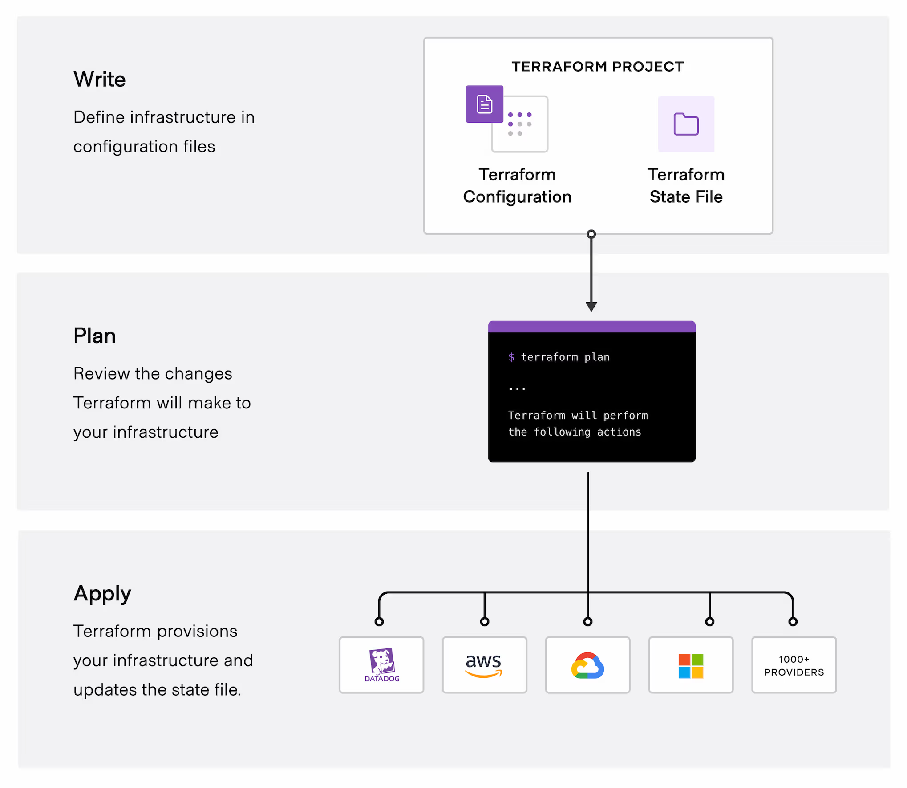

# Terraform

- Terraform은 인프라를 코드로 관리할 수 있게 해주는 툴이다.
  - 컴퓨트 인스턴스, 스토리지, 네트워크 등의 low-level component를 포함한다.
  - 또한 DNS entries와 Saas features와 같은 high-level component도 포함한다.
- 테라폼은 이걸 어떻게 가능하게 할까? 
  - 테라폼은 클라우드 플랫폼 및 기타 서비스의 API를 호출한다.
  - 이를 통해 리소스를 생성하고 관리한다.

## 핵심 플로우

1. Write: 여러 클라우드 프로바이더와 서비스를 아우르는 리소스를 정의한다.
   - ex) 보안 그룹과 로드 밸런서가 있는 가상 사설 클라우드(VPC) 네트워크에서 애플리케이션을 배포하기 위한 구성을 작성
2. Plan: 기존 인프라와 구성에 기반하여 생성, 업데이트 또는 삭제할 인프라를 설명하는 실행 계획을 생성한다.
3. Apply: 리소스 종속성을 고려하여 제안된 작업을 올바른 순서로 수행한다.
   - ex) VPC의 속성을 업데이트하고 해당 VPC의 가상 머신 수를 변경하는 경우, Terraform은 가상 머신을 확장하기 전에 VPC를 재생성한다.

## 왜 사용해야 할까?

### 어떤 인프라든 관리 가능!

- 대다수의 클라우드 프로바이더가 이미 Terraform Registry를 사용하고 있다.
  - 링크: [terraform registry](https://registry.terraform.io/?product_intent=terraform)
- 또한 나만의 커스터마이징 플러그인을 만들 수도 있다.
  - 참고자료: [Plugin development](https://developer.hashicorp.com/terraform/plugin)

### 인프라 추적

- Terraform은 인프라를 수정하기 전에 계획을 생성하고, 사용자에게 승인을 요청한다.
- 또한 실제 인프라 상태를 상태 파일에 저장하며, 이는 환경의 진실된 정보 원본으로 작동한다.
  - Terraform은 상태 파일을 사용하여 현재 인프라를 구성에 맞게 변경할 부분을 결정한다.

### 변경 자동화

- Terraform의 구성 파일은 선언적 방식으로 작성된다.
  - 인프라의 최종 상태를 기술하며, 리소스를 생성하기 위한 단계별 지침을 작성할 필요가 없음을 의미한다.
- 리소스 의존성을 결정하기 위해 리소스 그래프를 생성하며, 상호 의존적이지 않은 리소스는 병렬로 생성하거나 수정한다.
  - 이를 통해 효율적인 리소스 프로비저닝이 가능해진다.

### 구성 표준화

- Terraform에는 모듈이라는 재사용 가능한 구성 요소가 있다.
  - 인프라 컬렉션을 정의하며, 시간을 절약하고 모범 사례를 장려한다.
- Terraform에 공개된 모듈을 사용할 수 있으며, 직접 작성할 수도 있다.

### 협업

- Configuration이 파일 형태로 작성되기 때문에 이를 버전 관리 시스템(like git)으로 관리할 수 있다.
- 또한 HCP Terraform을 사용해 팀 간 Terraform 워크플로우를 효율적으로 관리할 수 있다.
- HCP Terraform은 일관되고 신뢰할 수 있는 환경에서 Terraform을 실행하며, 다음과 같은 기능을 제공한다.
  - 공유 상태와 비밀 데이터에 대한 안전한 액세스
  - 역할 기반 액세스 제어
  - 모듈 및 프로바이더를 공유하기 위한 개인 레지스트리
  - 기타 협업 도구

## UseCase

- 일관된 워크플로우 사용. 
- 인프라를 안전하고 효율적으로 프로비저닝.
- 전체 수명 주기에 걸쳐 이를 관리

### 멀티 클라우드 배포

- 여러 클라우드에 걸쳐 인프라를 프로비저닝하면 장애 내성이 향상되고 클라우드 제공자의 장애로부터 더 유연하게 복구할 수 있습니다.
- 하지만 멀티 클라우드 배포는 각 클라우드 제공자가 고유한 인터페이스, 도구, 워크플로우를 가지고 있어 복잡성을 증가시킨다.
- Terraform은 동일한 워크플로우를 사용해 여러 제공자를 관리하고, 클라우드 간 종속성을 처리할 수 있도록 도와준다.
- 이를 통해 대규모 멀티 클라우드 인프라의 관리 및 오케스트레이션이 간소화된다.

### 애플리케이션 인프라 배포, 확장, 모니터링 도구

- Terraform을 사용해 다중 계층(N-tier) 애플리케이션의 인프라를 효율적으로 배포, 릴리스, 확장, 모니터링할 수 있다.
- N-tier 애플리케이션 아키텍처는 애플리케이션 구성 요소를 독립적으로 확장할 수 있으며, 관심사를 분리한다.
  - ex) 애플리케이션은 데이터베이스 계층을 사용하는 웹 서버 풀과 API 서버, 캐싱 서버, 라우팅 메쉬를 위한 추가 계층으로 구성될 수 있음
- Terraform은 각 계층의 리소스를 함께 관리하며, 계층 간의 종속성을 자동으로 처리한다.
  - ex) 데이터 베이스 계층을 배포한 후 이를 필요로 하는 웹 서버를 프로비저닝

### Self-Service Clusters

- 팀이 자체적으로 관리할 수 있는 "Self-Servie" 모델을 구축할 수 있다.
  - 중앙 운영팀(플랫폼 팀)에 대한 반복적인 인프라 요청이 줄어드는 효과!
- 조직의 배포 및 관리 표준을 코드화한 Terraform 모듈을 작성하고 사용해, 조직의 규정을 준수하면서도 효율적으로 서비스를 배포할 수 있다!
- HCP Terraform은 ServiceNow와 같은 티켓 발행 시스템과 통합하여 새로운 인프라 요청을 자동으로 생성할 수도 있다.

### 정책 준수 및 관리

- 팀이 생성하고 사용할 수 있는 리소스 유형에 대한 정책을 적용하는 데 도움을 준다.
- `Sentinel`이라는 정책 코드화 프레임워크를 사용해 Terraform이 인프라 변경을 수행하기 전에 자동으로 정책 준수 여부를 검사할 수 있다.
  - `Sentinel` 정책은 Terraform Enterprise 및 HCP terraform에서 사용할 수 있다.

### PaaS 애플리케이션 설정

- Heroku와 같은 플랫폼 서비스(PaaS) 공급자는 웹 애플리케이션을 생성하고 데이터베이스나 이메일 제공자와 같은 애드온을 추가할 수 있다.
- Terraform을 사용해 Heroku 애플리케이션 설정을 코드화하고, DNS 설정(CNAME 생성), CDN 구성 등을 일관되고 신속하게 처리할 수 있다.

### Software Defined Networks

- `Software Defined Networks (SDNs)`와 상호 작용하여 애플리케이션 요구 사항에 따라 네트워크를 자동으로 구성할 수 있다.

### Kubernetes

- Kubernetes 클러스터를 배포하며, pod, deployment, service 등을 관리할 수 있다.
- Kubernetes Custom Resource Definition(CRD)와 HCP Terraform을 사용해 클라우드 및 온프레미스 인프라를 관리할 수도 있다.

### 병렬 환경

- 스테이징 또는 QA 환경을 사용해 새 애플리케이션을 프로덕션에 출시하기 전에 테스트할 수 있다.
- Terraform을 사용하면 개발, 테스트, QA, 프로덕션을 위한 인프라를 빠르게 생성하고 폐기할 수 있다.
- 필요할 때마다 환경을 생성하는 방식은 지속적으로 모든 환경을 유지하는 것보다 효율적이다.

### 소프트웨어 데모

- Terraform을 사용하면 다양한 클라우드 제공업체에서 데모를 생성, 프로비저닝, 부트스트랩할 수 있다.
- 이를 통해 최종 사용자가 자신의 인프라에서 소프트웨어를 쉽게 체험하고 클러스터 크기와 같은 매개변수를 조정해 더 철저히 테스트할 수 있다.

# 참고자료

- [Terraform docs](https://developer.hashicorp.com/terraform/docs)
