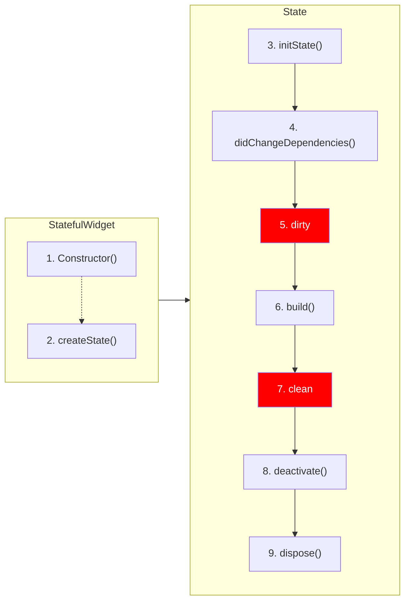
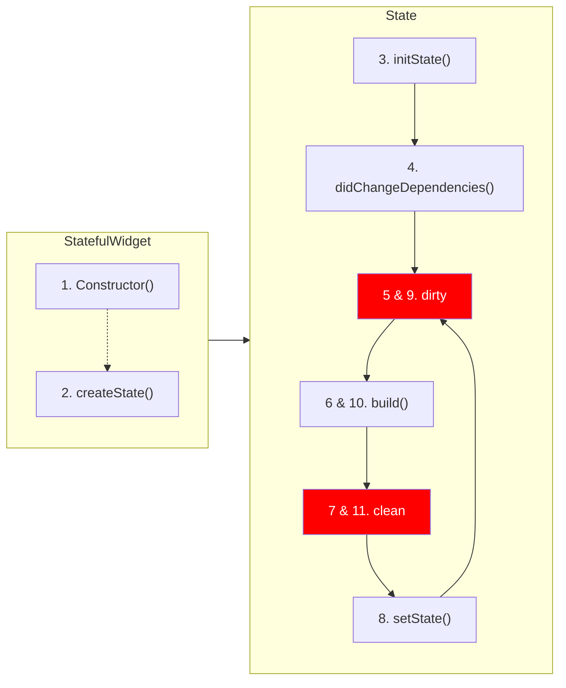
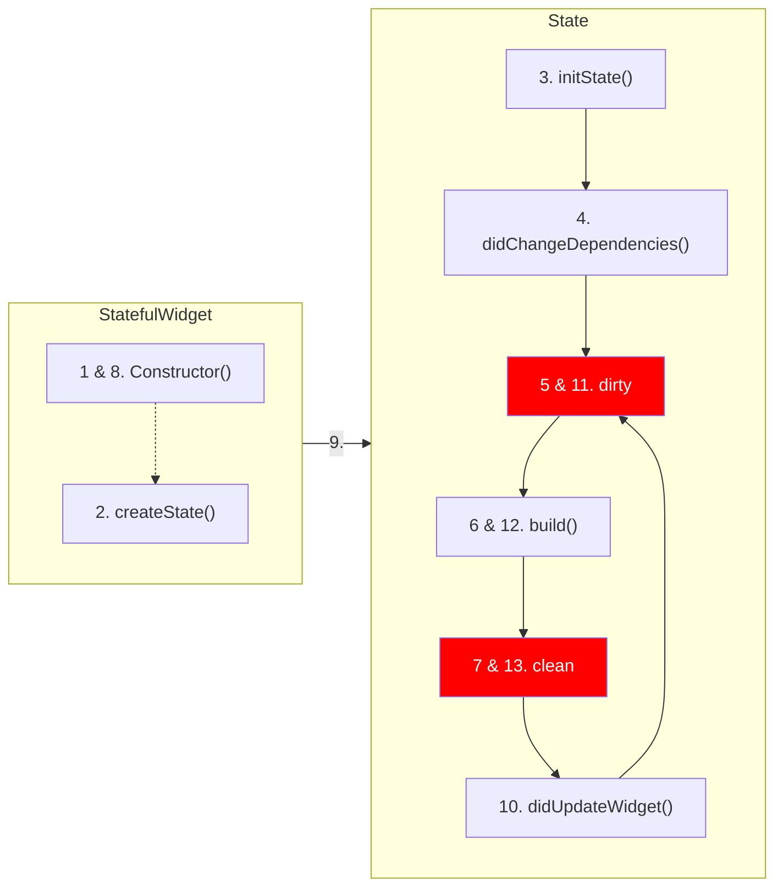

# StatefulWidget Lifecycle

## 1. 기본 라이프사이클

- 먼저 `StatefulWidget`을 상속받은 위젯의 라이프 사이클이다.
    - 아래와 같이 생성자가 먼저 생성되고, `createState()`를 실행하게 된다.
- 그렇다면 `State`의 생명주기는 어떨까?
- 위의 위젯 사이클이 돌고 나면 아래와 같은 순서대로 `State`의 사이클이 돌게 된다.

1. `initState()`는 인스턴스화 됐을 때, 딱 1번만 실행된다.
2. 그리고 `didChangeDependencies()`가 바로 실행된다.
    - `Theme.of()`, `MediaQuery.of()`와 같은 값들이 변경됐을 때, `didChangeDependencies()`가 다시 실행될 수 있다.
3. `dirty`와 `clean`은 `State` 클래스의 상태를 말한다.
    - `build()`가 실행돼야 하는 상태를 `dirty`, `build()`가 실행된 다음의 상태를 `clean`이라고 한다.
    - 위에서 clean까지
4. `State`가 삭제되면 `deactivate()` 함수가 실행된다. 뒤이어 `dispose()` 함수가 순서대로 실행된다.

- 여기서 `StatefulWidget`의 `Constructor()`부터 `State`의 `clean`까지는 위젯이 그려지는 라이프사이클이고, `deactivate()`와 `dispose()`는 위젯이 지워질 때의 라이프사이클이다.

## 2. `setState()`가 호출됐을 때의 라이프사이클

- `clean` 상태에서 `setState()`가 실행되었다고 해보자.

- 사실 `setState()`는 `build()`를 바로 호출하지 않는다.
- 대신 `State` 인스턴스를 `dirty` 상태로 만들어 놓는다.
- 그러면 자동으로 `build()`가 호출되고 리렌더링이 일어나게 된다.

## 3. `setState()`를 통해 변수가 변경되어, 자식 위젯에 영향이 전파되었을 때의 라이프사이클

- `StatefulWidget`이 부모로부터 파라미터를 전달받고, 그 파라미터가 `setState()`로 변경되는 경우

1. 부모 위젯의 변수가 `setState()`에 의해 변경되면 그 변수를 파라미터로 전달받은 `StatefulWidget`는 `Construtor()` 다시 호출하게 된다.
2. `State`는 `didUpdateWidget()`을 실행하게 되고, `State` 인스턴스를 `dirty` 상태로 바꾸게 된다.
3. 그리고 다시 `build()`가 실행되며 리렌더링이 일어나게 되는 것이다.
