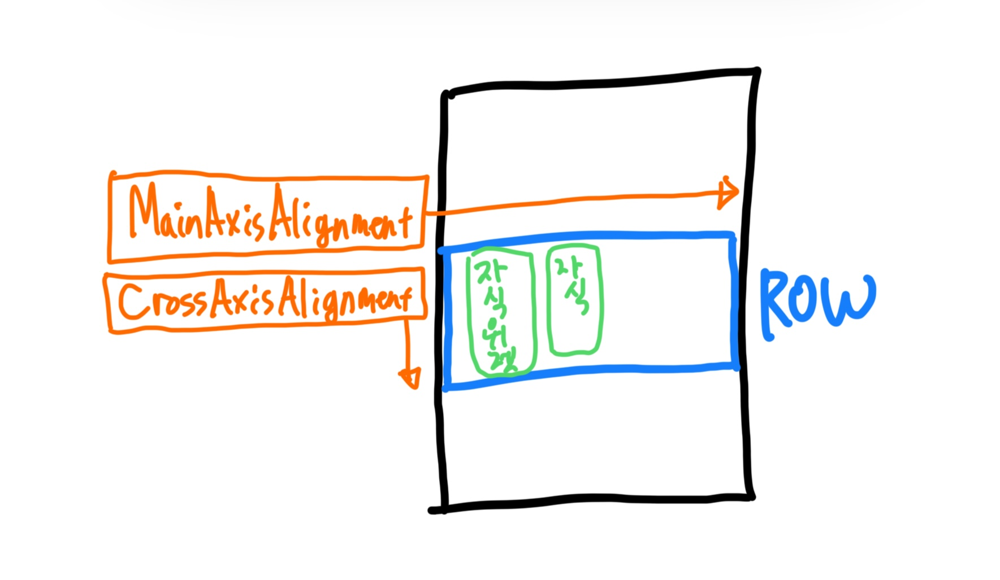
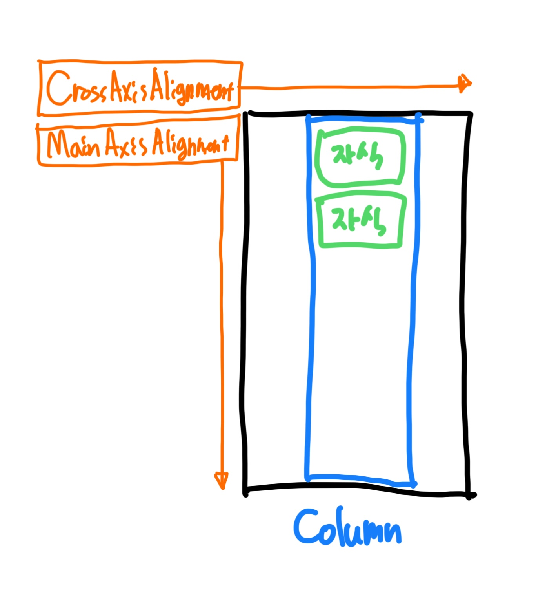

# Row And Column

- `Row`
    - 가로로 위젯을 배치할 때 사용한다.
- `Column`
    - 세로로 위젯을 배치할 때 사용한다.

## `MainAxisAlignment`는 주축, `CrossAxisAlignment`는 반대축이다.

- 특별한 제한사항이 없다면 Row 위젯과 Column 위젯의 주축은 최대 크기를 차지하고 반대축은 최소 크기를 차지한다.

## Row

## Column

## MainAxisAlignment Options

- `MainAxisAlignment.start`: 주축의 시작에 정렬한다.
- `MainAxisAlignment.end`: 주축의 끝에 정렬한다.
- `MainAxisAlignment.center`: 주축의 중앙에 정렬한다.
- `MainAxisAlignment.spaceBetween`: 주축에서 위젯들 사이에 동일한 간격을 두고 정렬한다.
- `MainAxisAlignment.spaceAround`: 주축에서 위젯들 주변에 동일한 간격을 두고 정렬한다.
- `MainAxisAlignment.spaceEvenly`: 주축에서 위젯들 앞뒤 및 사이에 동일한 간격을 두고 정렬한다.

## CrossAxisAlignment Options

- `CrossAxisAlignment.start`: 반대축의 시작에 정렬한다.
- `CrossAxisAlignment.end`: 반대축의 끝에 정렬한다.
- `CrossAxisAlignment.center`: 반대축의 중앙에 정렬한다.
- `CrossAxisAlignment.stretch`: 반대축으로 위젯들을 최대로 확장한다.
- `CrossAxisAlignment.baseline`: 텍스트 기준선을 기준으로 위젯을 정렬한다.

## TextBaseline

- 중요하지 않다.
- `TextBaseline.alphabetic`: 주로 사용한다. 사실 이 설정만 알아도 됨.
- `TextBaseline.ideographic`: 알파벳 아래 끝부분을 포함해 정렬(g, p, y 등)
