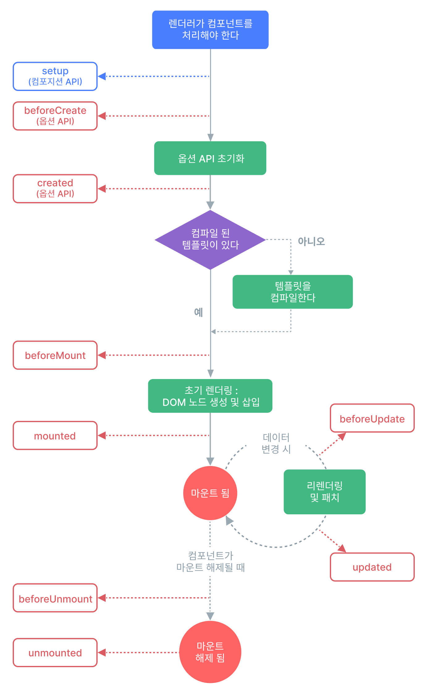

# Lifecycle

## 참고자료

- [Vue의 라이프사이클 훅에서 비동기 처리하기](https://velog.io/@metamong/Vue%EC%9D%98-%EB%9D%BC%EC%9D%B4%ED%94%84%EC%82%AC%EC%9D%B4%ED%81%B4-%ED%9B%85%EC%97%90%EC%84%9C-%EB%B9%84%EB%8F%99%EA%B8%B0-%EC%B2%98%EB%A6%AC%ED%95%98%EA%B8%B0)
