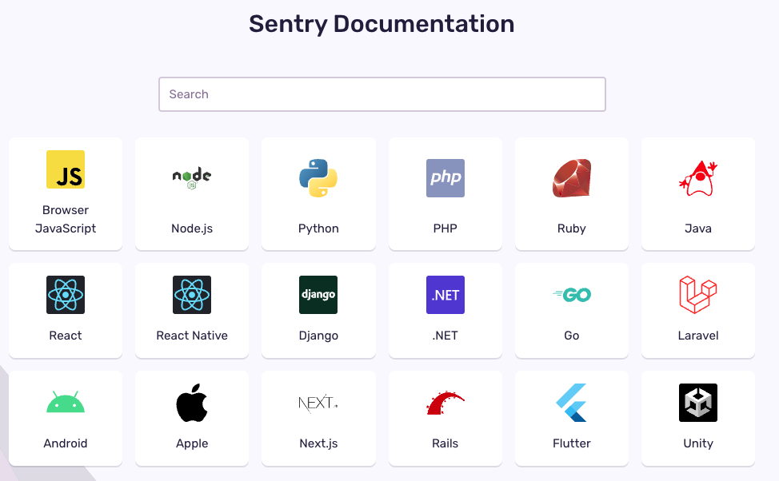

# Sentry

## Sentry란?

- Sentry란 Application 에러 트래킹, 성능 모니터링을 제공해주는 서비스이다.
- 에러가 발생하면 알림을 받을 수 있고, 에러에 대한 상세 정보를 트래킹해준다.
- 성능 모니터링을 통해 각 지표들을 쉽게 확인할 수 있다.
- 공식 문서에 의하면 아래의 다양한 언어들을 지원해준다.

## Sentry에 대한 자세한 정보

- Sentry Tutorial과 Sentry Basics 강추!!
- 튜토리얼 링크: [Sentry Tutorial](https://sentry.io/_/tutorials/)
- 베이직 링크: [Sentry Basics](https://docs.sentry.io/product/sentry-basics/)

## 참고자료

- [Sentry: About](https://sentry.io/about/)

- [Sentry 공식문서](https://docs.sentry.io/)
