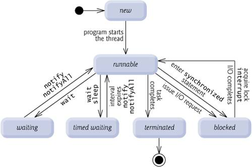

# Thread

## Thread의 기본개념

- 스레드는 프로세스를 빼놓고 얘기할 수 없다.

### 프로세스 Process

- 프로세스(Process)는 일반적으로 cpu에 의해 메모리에 올려져 실행중인 프로그램을 말하며, 자신만의 메모리 공간을 포함한 독립적인 실행 환경을 가지고 있다.
- 자바 JVM(Java Virtual Machine)은 주로 하나의 프로세스로 실행되며, 동시에 여러 작업을 수행하기 위해서 멀티 스레드를 지원하고 있다.

### 스레드 Thread

- 스레드는 프로세스 안에서 실질적으로 작업을 실행하는 가장 작은 단위이다.
- 자바에서는 JVM에 의해 관리된다. 프로세스는 적어도 한 개 이상의 스레드를 가지고 있으며 Main 스레드 하나로 시작해, 스레드를 추가 생성하면 그게 멀티 스레드 환경이다.
- 스레드는 같은 프로세스 안에서 자원을 공유하기 때문에 컨텍스트 스위칭이 빨라 효율적인 편이다.

<br/>

## Java Thread란

- Java에서는 기본적으로 Thread를 상속하고 구현한 객체를 `new`로 할당할 수 있다.
- run 메소드를 오버라이드해 구현해야한다.



### 기본 메소드

- `run()`
  - 스레드의 실행 코드가 작성되는 메소드
  - 사용자는 run을 오버라이드하여 구현해야한다.
- `sleep()`
  - 현재 스레드를 멈춘다. 자원을 놓아주지 않고 제어권을 넘기기 때문에 병목현상이 발생할 수 있다.
-  `interrupt()`
  - 스레드가 일시 정지 상태에 있을 때 `InterruptedException`을 발생시킨다.
  - 이를 통해 run 메소드를 정상종료할 수 있다.
- `join()`
  - 다른 스레드의 작업이 끝날 때까지 기다리게 만든다.
  - 스레드의 순서를 제어하기 위해 사용한다.

<br/>

## Thread와 Runnable

- `Thread`를 상속해 스레드를 만들 수도 있지만 `Runnable` 인터페이스를 구현할 수도 있다.
- 실행 방법이 약간 다르다. 
  - Thread 상속 객체의 경우, start() 메소드를 직접 호출할 수 있다.
  - Runnable 구현체는 `new Thread(Runnable runnable)` 형태로 객체를 생성해야 start() 메소드를 사용할 수 있다.

```java
public class ExampleThread implements Runnable {
  @Override
  public void run() {
    System.out.println("Thread Run");
  }
}

public class Main {

  public static void main(String[] args) {
    Runnable runnable = new ExampleThread();
    Thread thread = new Thread(runnable);
    thread.start();
  }
}
```

### Thread vs Runnable

<table>
  <thead>
    <th></th>
    <th>Runnable</th>
    <th>Thread</th>
  </thead>
  <tbody>
    <tr>
      <td>람다 가능 여부</td>
      <td>가능</td>
      <td>불가능</td>
    </tr>
    <tr>
      <td>구현형태</td>
      <td>implement => 다른 객체 상속 가능</td>
      <td>extends => 다른 객체 상속 불가</td>
    </tr>
    <tr>
      <td>자원 사용량</td>
      <td>적은 편</td>
      <td>많은 편</td>
    </tr>
  </tbody>
</table>


<br/>

# 대안

- `Thread`와 `Runnable`은 쓰레드를 생성할 때 너무 저수준의 API를 사용하고 작업이 끝난 후 결과값을 반환해주지 않는다.
- 또한 스레드를 사용하기 위해 항상 새롭게 스레드를 생성하고 종료시켜야하는데, 생성 비용이 큰 편이기 때문에 효율적이지 못하다는 단점이 있다.
- 그래서 대안으로 `Executor`, `ExecutorService`, `ScheduledExecutionService`, `Callable`, `Future`가 등장하게 되었다.

## Callable & Future

### Callable

```java
@FunctionalInterface
public interface Callable<V> {
    V call() throws Exception;
}
```

- Java5부터 추가된 기능으로 `Runnable`의 발전된 형태이다. 
- 제너릭을 사용해 결과값을 받을 수 있는 객체이다.

### Future

```java
public interface Future<V> {

    boolean cancel(boolean mayInterruptIfRunning);

    boolean isCancelled();

    boolean isDone();

    V get() throws InterruptedException, ExecutionException;

    V get(long timeout, TimeUnit unit)
        throws InterruptedException, ExecutionException, TimeoutException;
}
```

- 스레드의 작업은 기본적으로 비동기로 실행되기 때문에 실행 결과를 바로 얻지 못하고 예상치 못한 시점에 결과값을 받게 된다. (가용가능한 스레드가 없으면 더 늦춰지기도 한다.)
- 미래에 완료된 `Callable`의 반환값을 받기 위해 사용되는 것이 `Future`다. (javascript의 `await` 역할을 해줄 수 있다.)
- `ExecutorService`에서 `submit()` 메소드를 활용하면 `Future` 객체로 결과값을 받아올 수 있다.

<br/>

## Executor & Executors & ExecutorService

### Executor

### Executor

### ExecutorService

<br/>


<br/>

## 


# 참고자료

- [[Java] Thread와 Runnable에 대한 이해 및 사용법](https://mangkyu.tistory.com/258)
- [Interrupt Method](https://cornswrold.tistory.com/190)
- [자바: Thread 클래스와 Runnable 인터페이스](https://www.daleseo.com/java-thread-runnable/)
- [[Java] Callable, Future 및 Executors, Executor, ExecutorService, ScheduledExecutorService에 대한 이해 및 사용법](https://mangkyu.tistory.com/259) 
