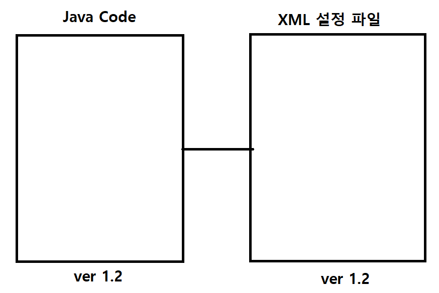
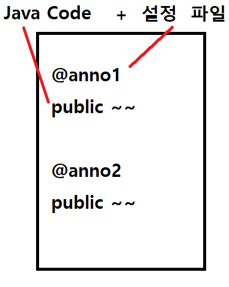
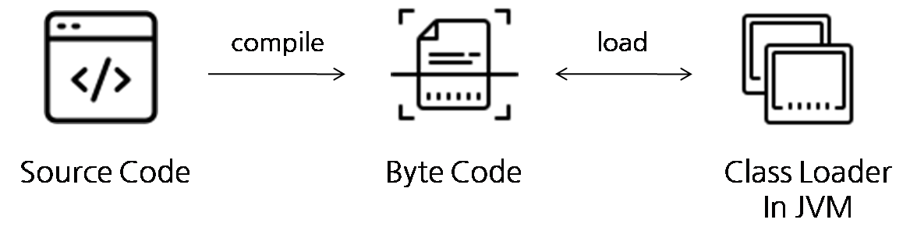

# Annotation

> 어노테이션 Annotation <br/>
> 자바 어노테이션은 자바 소스 코드에 추가하여 사용할 수 있는 메타데이터의 일종이다. 보통 `@` 기호를 붙여 사용한다. JDK 1.5 버전 이상에서 사용 가능하며 자바 어노테이션은 클래스 파일에 임베디드되어 컴파일러에 의해 생성된 후 JVM에 포함되어 작동한다.

## 어노테이션이 생긴 이유?

- JDK 1.5 이전 어노테이션이 사용되기 이전에는 자바 코드 관련 설정 파일을 따로 저장하고 아래 그림과 같이 `ver @.@`로 구분해 관리했다.
- 이와 같은 방식은 다음과 같은 어려움을 야기했다.
  1. 자바 코드를 변경할 때 설정 파일도 같이 업데이트해줘야하는 번거로움
  2. 설정과 코드가 분리되어 개발이 어려움
- 예를 들면, 과거에는 스프링 코드를 만들 때 xml 파일에 직접 Bean을 추가해야만 스프링 컨테이너에서 해당 Bean을 관리할 수 있었다.



- 하지만 어노테이션을 사용하면서 이런 문제를 획기적으로 해결할 수 있었다. 코드 위에 어노테이션을 붙여 코드와 설정을 통합한 것이다.
- 이것도 스프링을 예로 들자면, 기존 xml로 등록했던 빈들을 `@Bean`, `@Component`, `@Configuration`, `@Controller`, `@Service` 등의 어노테이션 등을 통해 손쉽게 스프링 컨테이너에 등록할 수 있게 되었다!



<br/>

# 어노테이션의 유형

- 표준(내장) 어노테이션: 자바가 기본적으로 제공해주는 어노테이션
- 메타 어노테이션: 어노테이션을 위한 어노테이션
- 사용자 정의 어노테이션: 사용자가 직접 정의하는 어노테이션

## 표준(내장) 어노테이션

표준 어노테이션은 `@Override`, `@Deprecated`, `@SuppressWarnings` 등이 있다.

### @Override

- 오버라이딩을 올바르게 했는지 컴파일러가 체크한다. 메소드 이름을 잘못 적는 실수를 방지해줄 수 있다.

### @Deprecated

- 메소드나 필드 위에 붙여 더 이상 사용하지 않도록 권장하는 어노테이션이다.
- 자바는 하위 호환성을 엄청나게 중요시하기 때문에 함부로 없애지는 않지만, 권장하지 않기 위해 `@Deprecated`를 붙인다.

### @FunctionalInterface

- 함수형 인터페이스에 붙이면, 컴파일러가 올바르게 작성했는지 확인한다.
- 하나의 추상 메소드만 가져야한다는 제약을 확인해주고, 함수형 인터페이스라는 것을 알려주는 역할도 한다.

### @SuppressWarnings

- 컴파일러의 경고메시지가 나타나지 않게 한다.
- 아래 코드를 보면, Array를 선언할 때 제네릭을 기입하지 않았기 때문에 타입을 선언하지 않았다는 `unchecked`라는 경고가 발생할 것이다.

```java
ArrayList list = new ArrayList();
list.add(obj); // 경고 발생 => unchecked
```

- 하지만 아래와 같이 어노테이션만 붙여주면 경고가 나타나지 않도록 만들 수 있다.

```java
@SuppressWarnings("unchecked")
ArrayList list = new ArrayList();
list.add(obj); // 경고 발생 => unchecked
```

- 경고가 너무 많아 새로운 경고를 알아보지 못하는 것을 방지하기 위해, 이미 확인된 경고에 해당 어노테이션을 붙일 수 있다.

<br/>

## 메타 어노테이션

- 어노테이션을 위한 어노테이션

### @Target

- 어노테이션을 정의할 때, 적용대상을 지정하는데 사용한다.
- 종류는 아래와 같다.
  - ElementType.PACKAGE : 패키지 선언
  - ElementType.TYPE : 타입 선언
  - ElementType.ANNOTATION_TYPE : 어노테이션 타입 선언
  - ElementType.CONSTRUCTOR : 생성자 선언
  - ElementType.FIELD : 멤버 변수 선언
  - ElementType.LOCAL_VARIABLE : 지역 변수 선언
  - ElementType.METHOD : 메서드 선언
  - ElementType.PARAMETER : 전달인자 선언
  - ElementType.TYPE_PARAMETER : 전달인자 타입 선언
  - ElementType.TYPE_USE : 타입 선언

```java
@Target({TYPE, FIELD, TYPE_USE})
@Retention(RetentionPolicy.SOURCE)
public @interface MyAnnotation{}

@MyAnnotation // 적용대상 = Type(클래스, 인터페이스)
class MyService{
	@MyAnnotation //적용대상 = FIELD
    int i;

    @MyAnnotation // 적용대상 = TYPE_USE
    MyService myService;
}
```

### @Retention

- 어노테이션의 유지 기간을 정하기 위해 사용한다. 유지 기간 정책은 총 3가지이다.
  - RetentionPolicy.SOURCE : 소스 코드(.java)까지 남아있는다.
  - RetentionPolicy.CLASS : 클래스 파일(.class)까지 남아있는다.(= 바이트 코드)
  - RetentionPolicy.RUNTIME : 런타임까지 남아있는다.(= 사실상 안 사라진다)



```java
@Target(ElementType.METHOD)
@Retention(RetentionPolicy.RUNTIME)
public @interface Override{}
```

- Retention에 대한 자세한 내용(박종훈님의 글)

```
- SOURCE: 소스코드까지만 유지 (즉, 컴파일 과정에서 어노테이션 정보는 사라짐)
- CLASS: 클래스파일 까지만 유지 (런타임시 유지안됨)
- RUNTIME: 런타임 시점까지 유지 (Reflection API 로 어노테이션 정보 조회 가능)

원할한 이해를 위해.. SOURCE -> RUNTIME -> CLASS 순으로 설명드릴께요.

SOURCE 정책
Getter / Setter 같은 경우 롬복이 바이트 '코드를 생성'해서 넣어주는 것이기 때문에, 굳이 바이트코드에 어노테이션 정보가 들어갈 필요가 없습니다. (왜냐하면 롬복이 코드를 생성해주니까..) 이 점에 대해서는 글에도 잘 설명되어 있네요^^

RUNTIME 정책
런타임에 어노테이션 정보를 뽑아 쓸수 있다는 의미입니다. 즉, Reflection API 등을 사용하여 어노테이션 정보를 알수가 있다는 의미입니다. 스프링 학습을 하시는 것 같아서 스프링을 예로 들자면, @Controller, @Service, @Autowired 등이 있습니다. 스프링이 올라오는 실행 중인 시점에 컴포넌트 스캔이 가능해야하기 때문에 RUNTIME 정책이 필요합니다. (스프링도 내부적으로 Reflection 등을 활용하여 어노테이션이 붙은 놈들만 가져옵니다.)

CLASS 정책
그러면, CLASS 정책은 왜 필요한지 궁금하실거에요. "아니 Reflection 같은걸로 정보를 얻을수도 없으면서 왜 필요한거지?" 말이죠 ㅎㅎ
그런데 이미 '참고사이트'에 첨부해주신 스택오버플로우('retention-of-java-type-checker-annotations') 글에 설명이 되어있습니다. 인텔리제이를 써보셨다면, @NonNull 등이 붙어있는 경우 null 값을 넣게되면 노랑색 경고로 알려줍니다.
"아니 그러면 SOURCE로 해도 될거 같은데?" 싶으실텐데요, 중요한점은 Maven/Gradle로 다운받은 라이브러리와 같이 jar 파일에는 소스가 포함되어있지 않다는 점입니다. class 파일만 포함되어있죠 (Download Sources 옵션은 논외로 할께요)

즉, class 파일만 존재하는 라이브러리 같은 경우에도 타입체커, IDE 부가기능 등을 사용할수 있으려면 CLASS 정책이 필요하게 됩니다. SOURCE 정책으로 사용한다면 컴파일된 라이브러리의 jar 파일에는 어노테이션 정보가 남아있지 않기 때문이죠.
그외에도 클래스로딩시 무언가를 하고 싶은 경우에도 사용될수도 있고요^^
```

### @Documented

- javadoc으로 작성한 문서에 포함하기 위해 해당 어노테이션을 붙인다.

### @Inherited

- 어노테이션을 자손 클래스에 상속하고자 할 때, @Inherited를 붙인다.
- 어노테이션도 상속이 가능하다는 사실을 깨달았을 것이다.

```java
@Inherited  // 어노테이션 위에 붙여주면 된다.
@interface SuperAnno{}

@SuperAnno
class Parent{}

// Parent를 상속했기 때문에 @SuperAnno 가 붙은 것으로 인식
class Child extends Parent{}

```

### @Repeatable

- 반복해서 붙일 수 있는 어노테이션을 정의할 때 사용한다.

```java
@Repeatable(value = Colors.class)
public @interface Color {}

@Target(Element.TYPE)
@Retention(RetentionPolicy.RUNTIME)
@Documented
public @interface Colors {
    Color [] value();
}

@Color("green")
@Color("blue")
@Color("red")
public class RGBColor {}

@Color("green")
public class GreenColor {}
```

- 여기서 정말 중요한 주의사항! `@Repeatable`은 위 코드에 적혀있는 `public @interface Colors`처럼 컨테이너 어노테이션을 정의해야지만 사용할 수 있다!!!

<br/>

## 사용자 정의 어노테이션

- [자바 커스텀 어노테이션](https://bravenamme.github.io/2021/06/24/custom-annotation/)

- [자바 사용자 정의 어노테이션](https://ittrue.tistory.com/158)

- [우아한형제들 기술블로그: 시의적절한 커스텀 어노테이션](https://techblog.woowahan.com/2684/)

<br/>

## 참고자료

- [Java 어노테이션: 커스텀 어노테이션 만들기](https://velog.io/@potato_song/Java-%EC%96%B4%EB%85%B8%ED%85%8C%EC%9D%B4%EC%85%98-%EC%BB%A4%EC%8A%A4%ED%85%80-%EC%96%B4%EB%85%B8%ED%85%8C%EC%9D%B4%EC%85%98-%EB%A7%8C%EB%93%A4%EA%B8%B0)

- [자바 어노테이션 총정리](https://bangu4.tistory.com/199)

- [어노테이션이 뭔데??](https://velog.io/@jkijki12/annotation)

- [스프링 어노테이션 기반 설정](https://soft91.tistory.com/64)

- [@Retention](https://jeong-pro.tistory.com/234)

- [어노테이션](https://blog.naver.com/PostView.nhn?blogId=swoh1227&logNo=222229853664&redirect=Dlog&widgetTypeCall=true&directAccess=false)
