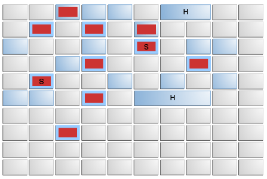
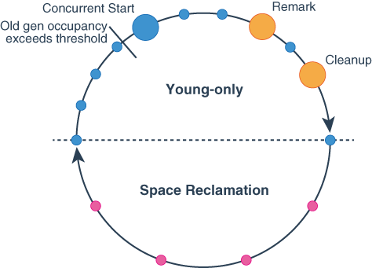

# G1 GC

- `G1` = `Garbage-First`

## `Heap Layout`

- `Heap`은 여러 개의 `Region`으로 나눠진다.
    - `Region`은 각 메모리의 연속된 블록이다.
- 메모리 요청이 들어오면 메모리 관리자는 비어 있는 `Region`을 할당한다.
    - 해당 `Region`을 특정 `Generation`에게 할당한 다음, 애플리케이션이 사용할 수 있는 `free space`로 돌려준다.

### 'Region'

- 각각의 블록은 1MB부터 32MB까지 다양하다.
- 총 블록의 개수는 대략 2048개다. (혹은 JVM 메모리 할당량에 따라 2048개보다 적을 수 있다.)
- 예를 들어 8GB 메모리가 JVM에 할당되었다면 3~4MB정도 사이즈의 2000개의 블록이 생성된다.
    - 각 블록은 `Eden`, `Survivor`, `Old Generation` 타입이 될 것이다.
    - 그리고 할당되지 않은 공간이 일부 남아 있을 것이다.
- 블록 할당량 또한 각각 다르다.
    - `New Generation`(`Eden` + `Suvivor`): 최소 5%에서 최대 60%의 메로리 할당량 부여. (애플리케이션 타입에 따라 알맞은 할당량 부여.)
    - 따라서 G1GC의 경우 `New Generation`에 고정된 값을 할당하는 것을 추천하지 않는다.

### 영역 대분류

- `G1GC`에서 Heap은 크게 3가지로 나눠진다.
    - `Eden`
    - `Survivor`
    - `Old Generation`

### Cycle

#### Initial Mark

- `G1`은 `Old Gen`의 수거 대상 Region을 정하기 전에 "여기 살아있는 객체가 있다"는 걸 `표시 marking`한다.
    - 이게 `초기 마크 Initial Mark`.
- 이 단계는 Thread에 의해 동시적으로 수쟁되며, 애플리케이션 퍼포먼스에 최소한의 영향만 준다.

#### Concurrent Marking

- `initial mark` 단계가 끝나고 나면, `G1`은 Heap의 모든 Region에 있는 더 많은 살아있는 객체를 식별하기 위해 `동시 마킹 concurrent mark`을 한다.
- 이 단계 또한 애플리케이션 스레드와 동시에 실행되므로, 애플리케이션이 정상적으로 동작한다.

#### Remark

- 동시 마킹이 완료되면, 초기 마크 단계 이후 수정되었을 수도 있는 객체를 식별하기 위해 `remark phase`를 진행한다.
- 살아 있는 객체를 정확히 판단하기 위한 단계다.
- 애플리케이션이 잠시 멈추는 현상이 발생할 수 있다.

#### Concurrent Cleanup

- `remark phase` 이후에는 `concurrent cleanup`이 실행된다.
    - 더 이상 사용되지 않는 `region`으로부터 메모리를 회수한다.
- 애플리케이션 스레드와 동시에 실행되어, 애플리케이션이 정상적으로 동작한다.

#### Evacuation

- 살아있는 객체를 다른 Region으로 옮기는 단계다.
    - 가비지 비율이 높은 Region들을 우선적으로 선택하여 이주 대상으로 삼는다.
    - 이러한 이유로 `Garbage-First`라는 이름이 붙음.
- 이 과정의 목적은 가비지가 많은 Region을 비원서 단편화를 최소화하고, 전체 힙의 효용을 높이는 것이다.

#### Mixed Garbage Collection

- `young generation`과 `old generation`에서 동시에 가비지 컬렉션을 실행하는 행위이다.
    - `old generation`을 주기적으로 정리함으로써 full GC의 긴 정지 시간을 피하기 위함.

### 구성

#### Collection Set

- `G1`은 `collection set`이라는 region의 list를 유지한다.
    - 가비지 컬레션 후보를 가지고 있는 목록이다.
- 이 region들은 내부에 포함된 가비지의 양을 기준으로 선택되며, GC 사이클 동안 수거된다.

#### Pause Time Target

- `G1`은 사용자가 지정한 `중지 시간 pause time` 목표를 달성하는 것을 목표로 한다.
- 이 목표를 달성하기 위해 G1은 `collection set`의 크기나 기타 여러 매개변수를 동적으로 조정하면서 동작을 조절한다.

#### Repeat Cycle

- `G1`은 힙의 상태와 중지 시간 목표에 따라 우선순위를 조장하면서, 가비지 컬렉션 사이클을 반복한다.

----

### 만약 `Block` 크기보다 큰 객체를 만들어야 한다면?

- `G1GC`에서 region의 크기의 절반 이상보다 큰 객체를 `Humongous object`라고 부른다.
- `Humongous object`는 G1GC가 일반적인 객체를 위해 사용하는 보통의 메모리 섹션에 맞추기에는 너무 큰 객체이다.
    - 따라서 `G1GC`는 `Humongous object`를 따로 다룬다.
    - 작은 조각들로 나누지 않고, `G1GC`는 `Humongous object`를 위한 특별한 메모리 공간을 가지고 있다.
- 일반적인 객체가 그런 것처럼 `Humongous object`도 불필요해지거나 "가비지"가 될 수 있다.
    - G1GC는 가비지 컬렉션이 도는 동안 `Humongous object`가 여전히 필요한지 확인한다.
    - 만약 `Humongous object`가 더 이상 필요하지 않으면 `G1GC`는 메모리를 비워낸다.
- 복사하는 오버헤드를 줄이기 위해, `Humongous object`는 `evacuation pause`가 돌지 않는다. (이주 X)
    - Full GC는 `Humongous object`를 제자리에서 압축해버린다.

--- 

## G1GC Properties

- 여기서 `<ergo>`는 자동 튜닝된 값을 뜻한다. (ergonomic decision)

#### `-XX:+UseG1GC`

- G1GC 활성화.
- Java 8은 Parallel GC가 기본.
- Java 9부터 기본값.

#### `-XX:MaxGCPauseMillis`

- 기본값 `200`
- 최대 정지 시간 설정

#### `-XX:GCPauseTimeInterval=<ergo>`

- 최대 정지 시간 간격
- 기본적으로 어떤 것도 지정되어 있지 않다.
    - 설정이 없으면 G1은 극단적인 상황에 가비지 컬렉션을 `연속적으로 back-to-back`으로 수행할 수 있다.

#### `-XX:ParallelGCThreads=<ergo>`

- 가비지 컬렉션 중 정지 구간 동안 병렬 작업에 사용되는 스레드의 최대 개수.
    - ex) 프로세스에 할당된 CPU 스레드 수가 8 이하면 그대로 사용, 그보다 많다면 8을 초과한 스레드 수의 5/8만큼을 추가로 더하여 최종 스레드 수 결정
- 정지될 때마다, 최대 스레드의 수는 힙 크기에 따라 추가로 제한될 수 있다.
    - G1은 힙 전체 크기에 대해 `XX:HeapSizePerGCThread`만큼의 메모리당 1개의 쓰레드만 사용한다.

#### `-XX:ConcGCThreads=<ergo>`

- 동시 작업에 사용되는 최대 쓰레드 수.
- 기본값은 `-XX:ParallelGCThreads`을 4로 나눈 값.

#### `-XX:InitiatingHeapOccupancyPercent=45`

- Heap 용량 퍼센티지에 따라 G1GC의 카비지 컬렉션 사이클을 언제 돌릴지에 대한 설정
- 기본값 `45%`

#### `-XX:G1HeapRegionSize=<ergo> `

- Heap Region Size 설정
- 기본값은 최대 힙 크기를 기준으로 하며, 대략적으로 2048개의 Region이 생성되도록 계산한다.
- 이 크기는 2의 제곱수 여야 하며, 1MB에서 32MB 사이의 값만 유효하다.

#### `-XX:G1NewSizePercent=5`

- Young Generation의 최소 사이즈

#### `-XX:G1MaxNewSizePercent=60`

- Young Generation의 최대 사이즈

#### `-XX:G1HeapWastePercent=5`

- `collection set` 후보에서 회수되지 않은 공간의 허용 비율을 나타낸다.
    - `collection set`의 여유 공간이 이 값보다 낮아지면, G1은 공간 회수 단계를 중단한다.
- G1GC는 Mixed GC에서 얼마나 효율적으로 가비지를 회수하고 있는지를 판단한다.
    - 만약 수거 대상 Region에서 회수된 공간이 적고, 쓸모없는 데이터가 일정 기준 이상이라면, GC 사이클은 효율이 낮다고 보고 회수 작업을 멈춰버린다.
- 기본값 `5%`

#### `-XX:G1MixedGCCountTarget=8`

- 공간 회수 단계의 예상 길이를 GC 사이클 기준으로 나타낸 값.
- 기본값 `8`
- ex) (기본값 설정에 따르면) G1은 Old Region 회수를 8번의 Mixed GC에 나눠서 하도록 계획

#### `-XX:G1MixedGCLiveThresholdPercent=85`

- 살아 있는 객체 비율이 이 임계점보다 높은 `Old Generation` Region은 수거되지 않는다.
    - 정리: Live Object 비율이 설정값보다 높은 Region을 Mixed GC 대상에서 제외.
    - 수거 효율이 낮은 Region을 건드리지 않고, Garbage 비율이 높은 곳부터 우선적으로 수거하기 위함.
- 기본값 `85%`

----

# 참고자료

- [오라클 공식문서](https://docs.oracle.com/en/java/javase/17/gctuning/garbage-first-g1-garbage-collector1.html#GUID-572C9203-AB27-46F1-9D33-42BA4F3C6BF3)
- [How G1 Garbage Collector work in Java](https://medium.com/@byterockai/how-g1-garbage-collector-work-in-java-e468a94ebed6)
- [G1GC tuning](https://velog.io/@hanblueblue/GC-2.-G1GC-tuning)
