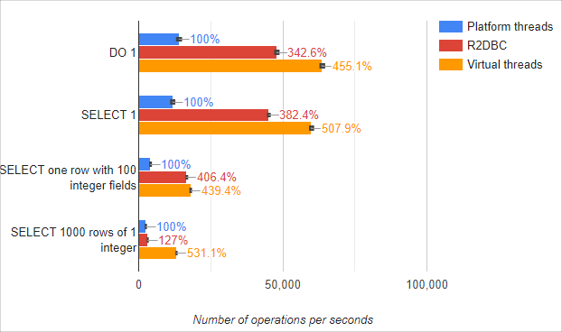

# 가상 스레드 심화

## MariaBD Benchmark

- 가상스레드를 사용하는 것이 좋긴 하다.

## CPU를 사용하는 API?

- 가상 스레드는 과연 I/O을 하는 API에서만 효과가 있을까?

### 실험: 스프링 부트 + 피보나치 계산 + 1000 사용자 + 30분

- 출처: https://blog.fastthread.io/virtual-threads-performance-in-spring-boot/
- JMeter로 성능 테스트를 해봤을 때, 플랫폼 쓰레드와 가상 스레드 간 처리량, 평균 실행 시간 큰 차이 없다.
- 하지만 쓰레드 개수에서 차이가 났다.
- 플랫폼 쓰레드 235개
- 가상 쓰레드 43개 (더 적은 메모리!!)

# 참고자료

- [자바21 가상 쓰레드 쓰면 정말 성능 좋아?](https://www.youtube.com/watch?v=_lp3ohne-i8)
- [MariaDB 공식문서 - Benchmark JDBC connectors and Java 21 virtual threads](https://mariadb.com/resources/blog/benchmark-jdbc-connectors-and-java-21-virtual-threads/)
- [Virtual Threads Performance in Spring Boot](https://blog.fastthread.io/virtual-threads-performance-in-spring-boot/)

---

# 글 작성하기

## 1. 문제 상황

- 현재 프로젝트의 스펙
  - 멀티 모듈 자바 프로젝트
- 마케팅 담당자와 협업하여 서버 사이드 이벤트 추적 기능을 만들었다.
  - 페이지 이동, 주요 이벤트 발생 시마다 이벤트 추적이 필요해 호출 빈도가 상당히 높다.
  - 외부 API를 호출하며, 응답시간이 200ms ~ 500ms가 걸린다.
  - 이용자가 몰리는 시간대에 갑자기 애플리케이션의 스레드 풀이 고갈되었다는 Alerts가 울리면서, 서버의 지연시간이 증가하기 시작한다.

### 원인 분석

- 왜 스레드 풀이 고갈되었을까?
  - 서버에서 Network I/O가 많이 일어나는 상황이다.
- 자바의 플랫폼 스레드에 대해서 설명.
  - 자바의 플랫폼 스레드는 Blocking 방식으로 돌아간다.
  - 플랫폼 스레드는 개당 많으면 2MB 정도의 메모리를 차지하기에 리소스 소모가 심하다.
  - 
- 무작정 스레드를 많이 생성하는 것이 좋지만은 않다.
- Blocking 되는 것이 문제라면 Non-Blocking 방식으로 문제를 해결해볼 순 없을까?

## 2. JVM에서 사용할 수 있는 Non-Blocking 도구들

### 2-1. 가상스레드

- 가상스레드의 원리 설명

### 2-2. Coroutine

- 코루틴이란 무엇인지? 원리? 성능 차이?
- [카카오페이 기술블로그 - 코루틴과 가상스레드 차이](https://tech.kakaopay.com/post/coroutine_virtual_thread_wayne/)
- 학습 장벽이 있다.

### 2-3. Reactor

- Spring Reactor란?
- 코루틴보다 더 어렵다.
- DB와 연동해서 사용하려면 R2DBC도 공부해서 적용해야 한다.

## 3. 가상스레드를 적용했을 때, 발생할 수 있는 문제들은?

### 3-1. Thread Pinning

- 가상 스레드는 `synchronized` 키워드를 만들면 blocking이 되어 버린다.
  - `synchronized`는 Java 모니터 락을 걸게 되는데, 이때 가상 스레드가 플랫폼 스레드로부터 `언마운트 Unmount`를 하지 못한다. 
  - JVM이 `synchronized`의 잠금(monitor) 소유자를 가상 스레드가 아닌 플랫폼 스레드로 기록했기 때문이다.
- 반면 `ReentrantLock`을 사용하면 내부적으로 AQS라는 프레임워크를 사용하여 잠금 상태를 관리하기 때문에 자바 코드 레벨에서 잠금 상태를 관리한다. 
  - 따라서 가상 스레드가 `unmount`를 하여, non-blocking으로 작동할 수 있게 된다.

#### 희소식

- JDK24를 사용하면 `synchronized` 키워드를 사용하는 메소드를 만났을 때, 대부분의 경우에서 pinning 현상이 발생하지 않게 되었다고 한다.
- [관련 정보](https://openjdk.org/jeps/491)

### 3-2. overwhelming 문제

- 카카오 테크 밋에서 공유된 문제다.
- [카카오 테크 밋](https://www.youtube.com/watch?v=vQP6Rs-ywlQ&t=1544s)
- 플랫폼 스레드의 blocking 현상이 스로틀처럼 작동하여 알아서 유량 제어를 해주는데, 가상스레드를 적용하면서 유량 제어가 풀려버리게 된다.
- 이때 테크 밋에서는 세마포어를 활용해 스로틀을 해주는 것을 추천해주는데, 자세한 구현은 따로 알려주지 않아서 직접 구현해봤다.

