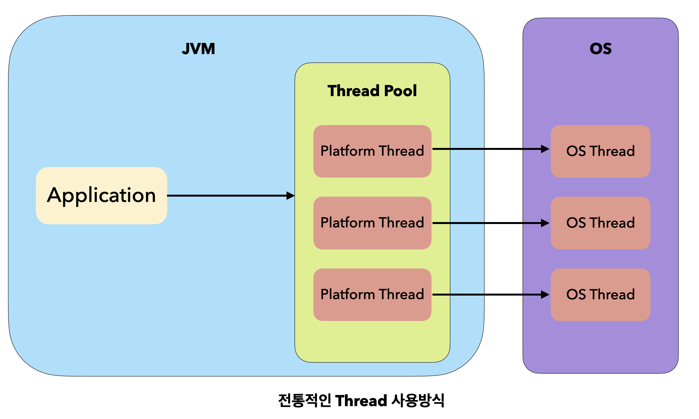
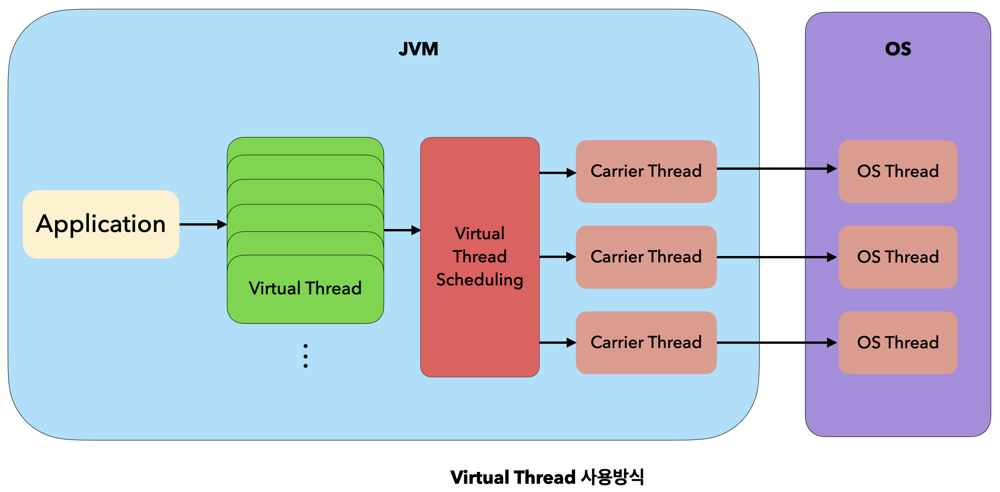

# Virtual Thread

- Java 21에 새롭게 추가된 기능

## 기존 Java의 문제

- 자바 플랫폼은 일반적으로 스레드 중심으로 구성되어 있기 때문에 스레드가 상당히 중요하다.

### 1. OS 기반 스레드

- OS 스레드를 래핑(wrapping)한 것을 사용했는데 이를 플랫폼 스레드라고 정의했다.
- OS 커널에서 사용할 수 있는 스레드의 개수는 제한적이고 생성과 유지 비용이 비싸다.
- 효율을 위해 스레드 풀을 만들어야 한다는 불편이 있었다.

### 2. 처리량

- 기본적인 사용자 요청 처리 방식은 Thread Per Request이다. => request 1개당 스레드 하나
- 따라서 처리량을 늘리기 위해서는 스레드를 늘려야만 하는 구조였던 것이다.
- 그렇다고 무한정 늘릴 수는 없기 때문에 애플리케이션의 처리랴은 스레드 풀에 의해 한정되었다.

### 3. Blocking

- Thread Per Request 모델에 의하면 IO 작업을 처리하기 위해 스레드는 Blocking되고 이 때문에 해당 작업이 끝날 때까지 다른 요청을 처리하지 못하고 기다려야 하는 문제가 있었다.
- 이를 위해 Non-Blocking 방식인 Reactive Programming이 생겼지만 여기에도 여러 단점이 존재한다.
  - 코드를 작성하기 위한 학습장벽이 높다는 점
  - 라이브러리들을 모두 Reactive 방식에 맞게 새롭게 작성해야하는 점

 

## 가상 스레드란?

- OS 스레드를 그대로 사용하지 않고 JVM 자체적으로 내부 스케줄링을 통해 사용할 수 있는 경량 스레드
- 하나의 Java 프로세스가 수십~수백만 개의 스레드를 실행할 수 있게 설계

### 구조

- 기존의 플랫폼 스레드는 아래와 같이 구성되어 있었다.
- OS의 스레드를 사용했기 때문에 스레드 풀을 통해 관리하는 방식을 주로 사용했었다. 

- 하지만 Virtual Thread는 JVM에서 직접 관리한다. 가상 스레드를 OS 스레드와 연결하는 스케줄링(mount/unmount)을 진행한다.ㅍ-속
- OS의 스레드를 래핑하지 않으니 스레드 풀도 필요없다.

- 각 구조가 사용하는 자원의 차이는 아래와 같다.

<table>
  <thead>
    <th></th>
    <th>플랫폼 스레드</th>
    <th>가상 스레드</th>
  </thead>
  <tbody>
    <tr>
      <th>메타데이터 사이즈</th>
      <td>약 2kb(OS마다 차이 존재)</td>
      <td>200~300B</td>
    </tr>
    <tr>
      <th>메모리</th>
      <td>미리 할당된 Stack 사용</td>
      <td>필요시마다 Heap 사용</td>
    </tr>
    <tr>
      <th>컨텍스트 스위칭 비용</th>
      <td>1~10us(커널 영역에서 발생하는 작업)</td>
      <td>ns or 1us 미만</td>
    </tr>
  </tbody>
</table>

### 장점

- 하드웨어를 효율적으로 활용할 수 있다. 가상 스레드는 Blocking 발생하면 내부적인 스케줄링을 통해 플랫폼 스레드를 다른 가상 스레드와 연결해 활용한다.
- 전통적인 자바는 OS 스레드 기반이기 때문에 WebFlux 등 Reactive Programming을 할 때 디버깅과 성능테스트가 까다로웠다. 하지만 가상스레드는 JVM 레벨에서 Non-Blocking 처리가 가능하기 때문에 처리량도 높아지고 컨텍스트 추적에 이점이 있다. 

 

# 참고 자료

- [블로그 Soo Story](https://findstar.pe.kr/2023/04/17/java-virtual-threads-1/) 
