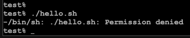
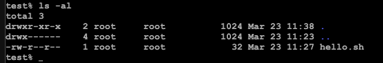
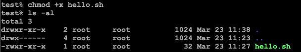
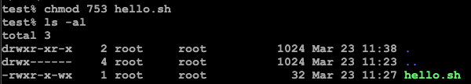

# Shell Script

## 쉘

- 유닉스 계열의 시스템에서 사용하는 대화형 인터페이스이다. 사용자의 커널 사이에서 사용자의 입력을 받아서 명령을 해석하여 커널에 전달하고 결과를 사용자에게 반환한다.
- 쉘은 그 종류가 다양한데, Bash(배쉬), Tcsh(C쉘), Ksh(콘쉘), Zsh(Z쉘), Fish(Friendly Interactive SHell) 등이 있다.

<br/>

## 쉘 스크립트란?

- 쉘 스크립트란 Unix 커맨드 등을 나열해서 실행하는 것이다.
- 쉘 스크립트 자체 문법이 존재하지만, 보통 운영체제의 명령어와 함께 사용된다.

### 기본 설정

- 쉘 스크립트의 확장자는 `.sh`이다.

```shell
#!/bin/sh

echo "Hello World"
```

- 쉘 스크립트를 작성할 때 맨 위에 `#!/bin/sh`를 써줘야 한다. 시스템에 지금부터 쉘 스크립트를 사용한다고 알려주기 위한 녀석이다.

### 권한 부여

- 기본적으로 쉘 스크립트를 사용할 때 권한 부여를 해주지 않으면 아래와 같이 `Permission denied`가 발생한다.



- 리눅스가 위와 같이 실행을 거부하는 이유는 `hello.sh`에 권한이 없기 때문인데, 명령어를 통해 해당 쉘 스크립트 파일에 권한을 부여해줄 수 있다.
- `ls -al` 명령어를 사용하면 권한을 확인할 수 있다.



- 실행 권한이 없는 것을 확인할 수 있다.
  - `r`: 읽기 권한(read)
  - `w`: 쓰기 권한(write)
  - `x`: 실행 권한(execute)
- `chmod` 명령어를 사용하면 실행권한을 부여할 수 있다.

```shell
$ chmod +x hello.sh
```



- 그런데 실행권한을 각 사용자에 맞게 주고 싶다면 어떻게 해야할까? 리눅스에서는 숫자를 통해 권한을 부여할 수 있다.

<table>
    <tr>
        <th>사용자</th>
        <th>그룹</th>
        <th>전체</th>
    </tr>
    <tr>
        <td>r=400</td>
        <td>r=40</td>
        <td>r=4</td>
    </tr>
    <tr>
        <td>w=200</td>
        <td>w=20</td>
        <td>w=2</td>
    </tr>
    <tr>
        <td>x=100</td>
        <td>x=10</td>
        <td>x=1</td>
    </tr>
</table>

- 만약 아래와 같이 부여한다면
  - 사용자에게는 rwx 모두 부여
  - 그룹에는 rx만 부여
  - 전체에는 wx만 부여

```shell
$ chmod 753 hello.sh
```



<br/>

## 쉘 스크립트 문법

- [BASH 쉘 프로그래밍 문법](https://inpa.tistory.com/entry/LINUX-%EC%89%98-%ED%94%84%EB%A1%9C%EA%B7%B8%EB%9E%98%EB%B0%8D-%ED%95%B5%EC%8B%AC-%EB%AC%B8%EB%B2%95-%EC%B4%9D%EC%A0%95%EB%A6%AC)

<br/>

## 온라인 리눅스 터미널

- [온라인 리눅스 터미널 / BASH(쉘 스크립트) 연습 사이트 모음](https://inpa.tistory.com/entry/LINUX-%EC%98%A8%EB%9D%BC%EC%9D%B8-%EB%A6%AC%EB%88%85%EC%8A%A4-%ED%84%B0%EB%AF%B8%EB%84%90-BASH%EC%89%98-%EC%8A%A4%ED%81%AC%EB%A6%BD%ED%8A%B8-%EC%97%B0%EC%8A%B5-%EC%82%AC%EC%9D%B4%ED%8A%B8)

<br/>

## 참고자료

- [쉘 스크립트](https://engineer-mole.tistory.com/200)

- [쉘 스크립트 파일에 실행 권한 부여](https://codechacha.com/ko/linux-assign-execute-permission-to-script/)
