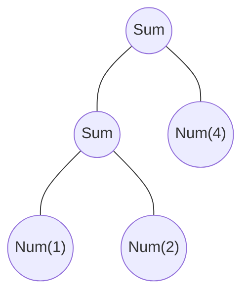

# 기초

> #### 라이브러리를 작성할 때는 반환 타입을 명시하라
> - 다른 사람들이 사용하는 라이브러리를 만들 때는 반환 타입 추론 사용을 지양하자.
> - 명시적으로 함수의 반환 타입을 지정하면 실수로 함수 시그니처가 바뀌면서 라이브러리 소비자들의 코드에 오류가 발생하는 경우를 피할 수 있다.

> #### 문자열에 '$'를 넣고 싶다면
> - `\` 백슬래시를 사용해 $를 이스케이프 시켜야 한다.

---

## 클래스

- kotlin의 기본 가시성은 `public`이다.

### 커스텀 게터 구현

```kotlin
class Rectangle(val height: Int,  val width: Int) {
    val isSquare: Boolean
        get() { // 프로퍼티 게터 선언
            return height == width
        }
}
```

---

## `Enum`과 `when`

- `enum class` 키워드 사용 (자바는 `enum` 키워드)

> #### Soft keyword
> - 코틀린에서 `enum`은 소프트 키워드다. `enum`은 `class` 앞에 있을 때만 특별한 의미를 지니고, 다른 곳에서는 일반적인 이름으로 사용할 수 있다.
> - 반면 `class`는 하드 키워드다. 따라서 클래스를 표현하는 변수명으로 `clazz`나 `aClass` 같은 구문을 사용한다.

- enum의 끝에선 `;`을 적어야 한다. (java와 동일)

### when 절

- `when` 절 분기문에서 마치 java의 `switch`와 비슷하게 람다로 표현하면 된다.
- `setOf()` 여러 객체를 사용할 수 있다.
  - 하지만 `Set` 인스턴스를 매번 생성하기 때문에 비효율적일 수 있다.

```kotlin
fun mix(c1: Color, c2: Color) =
    when (setOf(c1, c2)) {
        setOf(RED, YELLOW) -> ORANGE
        setOf(YELLOW, BLUE) -> GREEN
        setOf(BLUE, VIOLET) -> INDIGO
        else -> throw Exception("Dirty color")
    }
```

- 인자 없이도 사용할 수 있다.
  - 성능은 향상되나, 가독성이 떨어진다.

```kotlin
fun mixOptimized(c1: Color, c2: Color) =
    when {
        (c1 == RED && c2 == YELLOW) ||
        (c1 == YELLOW && c2 == RED) -> 
            ORANGE

        (c1 == BLUE && c2 == YELLOW) ||
        (c1 == YELLOW && c2 == BLUE) ->
            GREEN

        (c1 == BLUE && c2 == VIOLET) ||
        (c1 == VIOLET && c2 == BLUE) ->
            INDIGO
        
        else -> throw Exception("Dirty color")
    }
```

### 스마트 캐스트 예시

- 다른 여러 타입의 코틀린 객체를 사용할 수 있게 해준다.
- 여러 타입의 식 객체를 아우르는 공통 타입 역할만 수행하는 인터페이스를 `마커 인터페이스 marker interface`라고 부른다.
  - 클래스가 구현하는 인터페이스를 지정하기 위해 콜론 뒤에 인터페이스 이름을 사용한다.

```kotlin
interface Expr
class Num(val value: Int): Expr
class Sum(val left: Expr, val right: Expr): Expr
```

- `(1 + 2) + 4`라는 식 -> `Sum(Sum(Num(1), Num(2)), Num(4))`라는 구조의 객체로 생긴다.
- 트리 표현



```kotlin
fun eval(e: Expr): Int {
    if (e is Num) {
        val n = e as Num // 여기서 Num으로 타입을 변환. 불필요한 중복
        return n.value
    }
    if (e is Sum) {
        return eval(e.right) + eval(e.left) // 변수 e에 대해 스마트 캐스트 사용
    }
    throw IllegalArgumentException("Unknown expression")
}
```

- 스마트 캐스트는 `is`로 변수에 든 값의 타입을 검사한 다음에 그 값이 바뀔 수 없는 경우에만 작동한다.
  - 원하는 타입으로 명시적으로 캐스팅 하려면 `as` 키워드를 사용한다.
- 위 코드는 코틀린답지 않다. `when`으로 리팩토링!

```kotlin
fun eval(e: Expr): Int =
    when (e) {
        is Num -> e.value
        is Sum -> eval(e.right) + eval(e.left)
        else -> throw IllegalArgumentException("Unknown expression")
    }
```


