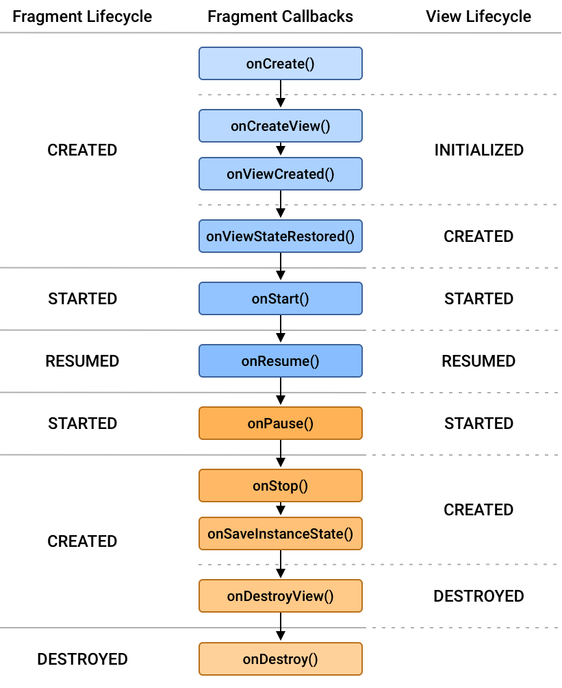

# Android Lifecycle

## 활동 생명 주기

- 안드로이드에서는 Activity, Fragment, Service 총 3가지 단계를 순환하는 생명주기를 가진다.
- 안드로이드는 사람처럼 로직을 이해하고 상태 변화를 자동으로 시켜주지 못하기 때문에 생명주기에 대한 개념을 통해 앱을 제어한다.

 

## Activity Lifecycle

- 활동 생명 주기에서 각 단계로 전환하기 위해 7개의 콜백을 사용한다.

### 1. `onCreate()`

- Activity가 생성되면 가장 먼저 호출된다.
- 화면 Layout 정의, View 생성, DataBinding 등을 구현한다.
- 단 한번만 수행된다. 따라서 최초 실행할 때 해야하는 작업을 넣어줘야한다.

### 2. `onStart()`

- Activity가 화면에 표시되기 직전에 호출된다.
- 화면에 진입할 때마다 실행되어야하는 작업을 구현한다.

### 3. `onResume()`

- Activity가 화면에 보여지는 직후에 호출된다.
- 현재 Activity가 사용자에게 `focus in`되어 있는 상태이다.

### 4. `onPaush()`

- Activity가 화면에 보여지지 않은 직후 호출된다.
- 현재 Activity가 사용자에게 `focus out`되어있는 상태이다.

### 5. `onStop()`

- Activity가 다른 Activity에 의해 100% 가려질 때 호출되는 콜백이다.
- 홈 키를 누르는 경우, 다른 액티비티로의 이동이 있는 경우가 있다.
- 이 상태에서는 Activity가 호출되면, `onRestart()`가 호출된다.

### 6. `onDestroy()`

- Activity가 완전히 종료되었을 때 호출되는 콜백
- 사용자가 `finish()`, `onBackPressed()`를 호출할 때 이루어진다.
  - 위 메소드가 실행되면 `onPause()`, `onStop()`, `onDestroy()`가 호출된다.
- 시스템에서 메모리가 부족해지면 프로세스를 종료하는데 그 때 호출된다.

### 7. `onRestart()`

- `onStop()`이 호출된 이후에 다시 기존 Activity로 돌아오는 경우 호출되는 콜백
- `onRestart()`가 호출된 이후 이어서 `onStart()`가 실행된다.

 

## Fragment Lifecycle

### Fragment

- Fragment는 동작 또는 Activity 내에서 UI의 일부를 나타낸다. 여러 개의 프래그먼트를 하나의 액티비티에 조합하여 창이 여러 개인 UI를 구축할 수 있으며, 하나의 프래그먼트를 여러 액티비티에서 재사용할 수 있다. 프래그먼트는 자체 수명 주기를 가지고, 자체 입력 이벤트를 받으며, 액티비티 실행 중에 추가 및 제거가 가능한 액티비티의 모듈식 섹션이라고 생각하면 된다.
- 프래그먼트를 사용하면 화면 하나를 독립적으로 작동하는 부분화면 여러개로 구현할 수 있다. 프래그먼트는 액티비티처럼 정의된 레이아웃을 표시하고, 자체 생명주기를 가지며 입력 이벤트를 받을 수 있다. 하지만 독립적으로 존재할 수 없고, 해당 프래그먼트를 관리하는 호스트 액티비티나 프래그먼트 하위에서만 존재할 수 있다.
- Fragment는 분할된 화면들을 독립적으로 구성하거나, 분할된 화면들의 상태를 관리하기 위해 사용한다.

### Fragment의 장점

- Lightweight
  - 액티비티는 안드로이드 4대 컴포넌트 중 하나로 안드로이드 시스템에서 관리한다. 반면 프래그먼트는 안드로이드 시스템이 직접 관리하지 않고 프래그먼트 매니저가 관리하기 때문에 메모리 리소스가 상대적으로 덜 소모되어 액티비티보다 가볍다.
- Reusability
  - 한번 작성된 프래그먼트는 여러 액티비티에서 재사용이 가능하며, 따라서 UI 구현에 필요한 작업량을 상당히 감소시킬 수 있다

### Lifecycle

- 액티비티와 별개로 자체 생명 주기를 가지고 있지만, 액티비티의 생명주기와 유기적으로 연관되어 있다.

### 1. `onAttach()`

- 프래그먼트가 액티비티에 붙을 때 호출한다.
- 인자로 Context가 주어진다.

### 2. `onCreate()`

- 프래그먼트가 액티비티의 호출을 받아 생성한다.
- Bunddle 형태로 액티비티로부터 데이터가 넘어오며, UI 초기화는 불가능하다.

### 3. `onCreateView()`

- 레이아웃 inflate 담당한다.
- savedInstanceState로 이전 상태에 대한 데이터 제공하고, View와 관련된 객체를 초기화 할 수 있다.

### 4. `onViewCreated()`

- `onCreagteView()`를 통해 반환된 View 객체는 `onViewCreated()`의 파라미터로 전달된다.
- 이 때 Lifecycle이 INITIALIZED 상태로 업데이트된다. 때문에 View의 초기값 설정, LiveData 옵저빙, RecyclerView, ViewPager2에 사용될 Adapter 세팅은 이 메소드에서 해주는 것이 적절하다.

### 5. `onViewStateRestored()`

- 저장해둔 모든 state 값이 Fragment의 View의 계층 구조에 복원되었을 때 호출한다.
  - ex) 체크박스 위젯이 현재 체크되어있는지
- View lifecycle owner : INITIALIZED → CREATED 변경

### 6. `onStart()`

- 사용자에게 보여질 수 있을 때 호출한다.
- Activity의 `onStart()` 시점과 유사
- Fragment의 childFragmentManager을 통해 FragmentTransaction을 안전하게 수행할 수 있다.
- View lifecycle owner : CREATED → STARTED 변경

### 7. `onResume()`

- 사용자와 프래그먼트가 상호작용 할 수 있는 상태일 때 호출한다.
- Fragment가 보이는 상태에서 모든 Animator와 Transition 효과가 종료되고, 프래그먼트와 사용자가 상호작용 할 수 있을 때 onResume Callback

### 8. `onPause()`

- Fragment가 visible 일 때 `onPause()`가 호출
- 이 때 Faragment와 View의 Lifecycle이 PAUSED가 아닌 STARTED가 된다.

### 9. `onStop()`

- Fragment가 더 이상 화면에 보여지지 않게 되면 onStop() 콜백 호출
  부모 액티비티, 프래그먼트가 중단될 때, 상태가 저장될 때 호출한다.
- View와 Lifecycle : STARTED → CREATED
- API 28버전을 기점으로 `onSaveInstanceState()` 함수와 `onStop()` 함수 호출 순서가 달라짐, 따라서 onStop()이 FragmentTransaction을 안전하게 수행하는 마지막 지점이 된다.

### 10. `onDestoryView()`

- 모든 exit animation, transaction이 완료되고 Fragment가 화면으로부터 벗어났을 경우 호출한다.
- view와 lifecycle : CREATED → DESTROYED
- 가비지 컬렉터에 의해 수거될 수 있도록 Fragment View에 대한 모든 참조가 제거되어야 한다.
- `getViewLifecycleOwnerLiveData()`

### 11. `onDestroy()`

- Fragment가 제거되거나, FragmentManager가 destroy 됐을 경우, `onDestroy()` 콜백 함수가 호출한다.
- Fragment Lifecycle의 끝을 알린다.

### 12. `onDetach()`

- 프래그먼트가 액티비티로부터 해제되어질 때 호출된다.

 

## 참고자료

- [안드로이드 Activity Lifecycle](https://velog.io/@its-mingyu/%EC%95%88%EB%93%9C%EB%A1%9C%EC%9D%B4%EB%93%9C-Activity-Lifecycle)

- [공식홈페이지: 활동 수명 주기에 관한 이해](https://developer.android.com/guide/components/activities/activity-lifecycle?hl=ko)

- [Android Fragment란](https://junghun0.github.io/2019/06/08/android-fragment/)

- [Velog: Android Fragment Lifecycle](https://velog.io/@jeongminji4490/Android-Fragment-Lifecycle)

- [프레그먼트 생명주기](https://velog.io/@evergreen_tree/Android-%ED%94%84%EB%9E%98%EA%B7%B8%EB%A8%BC%ED%8A%B8-%EC%83%9D%EB%AA%85%EC%A3%BC%EA%B8%B0)
