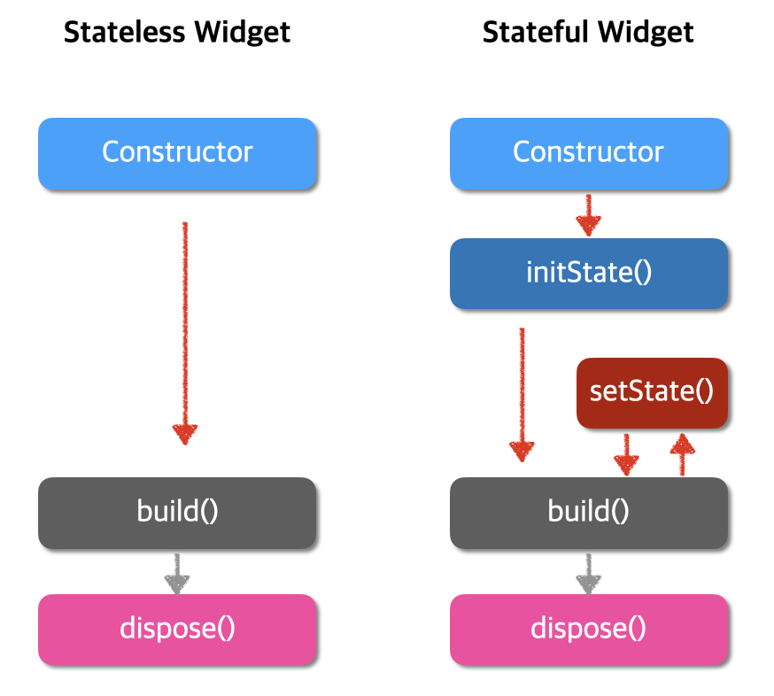
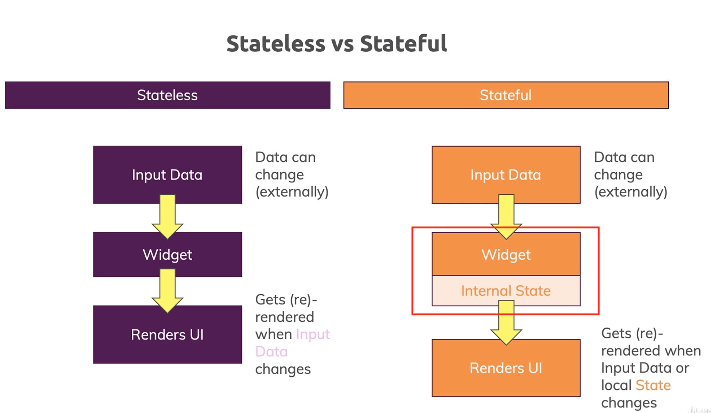

# State

## State

1. Widget이 빌드될 때 동기적으로 읽을 수 있는 정보
2. 위젯의 생명주기가 끝나기 전까지 변경될 수 있는 정보

### App State와 Widget State

- State는 App State와 Widget State 구분된다.
- App State는 Flutter App 전반에서 사용되는 data로 여러 Widget에서 쓰인다. React나 Vue에서 사용되는 Global Store의 느낌과 비슷하다.
  - 예시) 로그인 정보, 유저 설정, 장바구니
- Widget State(Ephemeral state 또는 local state)는 Widget 내부에서만 사용되는 data이다. 공유하거나 반환할 필요가 없는 값이다.

<br/>

## STLess & STFul

- 휴대폰 스크린에 Widget을 띄우기 위해선 stateless 혹은 stateful 클래스를 만들어야 한다. 여기서 StatelessWidget과 StatefulWidget은 무엇일까?




<br/>

## Stateless Widget

- StatelessWidget은 State가 없어서 Stateless가 아니다.
- 내부적으로 상태값은 가지고 있으나, 값을 변경할 수 없기 때문에 Stateless이다. (프론트엔드에서 정적 페이지라고 표현하는 것과 동일하게 보면 될듯!)

### STLess Widget 코드 기본 구조

```dart
class MyWidget extends StatelessWidget {
  const MyWidget({Key? key}) : super(key: key);

  @override
  Widget build(BuildContext context) {
    return Container();
  }
}
```

<br/>

## Stateful Widget

- State가 존재하고 변경할 수 있는 Widget으로, 상태 변경이 일어나면 화면이 동적으로 변하는 Widget이다.

### STFul Widget 코드 기본 구조

```dart
class MyWidget extends StatefulWidget {
  const MyWidget({Key? key}) : super(key: key);

  @override
  State<MyWidget> createState() => _MyWidgetState();
}

class _MyWidgetState extends State<MyWidget> {
  @override
  Widget build(BuildContext context) {
    return Container();
  }
}
```

### Stateful Widget의 생명주기

### 1. `initState()`

- 위젯이 생성된 후 State 객체가 생성될 때 호출되는 메소드이다.
  처음 한번만 호출되고 그 이후론 호출되지 않는다.

### 2. `didChangeDependencies()`

- `initState()`가 끝나고 호출되는 함수이며, 해당 위젯이 의존하는 위젯이 변경되면 재호출된다. (cf. inheritedWidget)
- context를 사용하여 변수를 초기화하는 명령어가 있다고 할 때, `initState()`는 context가 형성되기 전 호출되어 사용하지 못하므로, `didChangeDependencies()` 메소드 내에서 context를 사용하여 변수를 초기화할 수 있다.

### 3. `build()`

- 이 메소드를 통해 위젯이 그려진다.
- State클래스에서 반드시 오버라이딩(`@override`) 되어야하며, 상태가 변경될때마다 호출된다.

### 4. `setState()`

- State객체의 상태가 변경되었다는 것을 프레임워크에 알리는 메소드이다. State객체의 상태가 변경되었을 때마다 호출해주어야 한다.
- `setState()`를 할때마다 어떠한 명령어를 내리고 싶다면, build메소드처럼 오버라이딩한 함수를 객체 내에 정의하면 된다.

### 5. `didUpdateWidget()`

- 부모위젯이 다시 빌드되어 위젯이 갱신될때 호출된다. 이때, 해당 메소드가 호출된 후에는 항상 `build()`메소드가 호출되므로, setState를 이 메소드 내에서 호출하면 build가 두번 호출되는 것이다.

### 6. `deactivate()`

- 트리에서 State객체가 제거될 때 호출된다. 프레임워크가 제거된 State객체를 트리의 다른 부분에 다시 삽입하는 경우가 있는데, 이때는 build 메소드를 한번 호출한다.

### 7. `dispose()`

- 트리에서 State객체가 영구적으로 제거될 때 호출된다. 이 메소드 내에서 setState를 호출하면 안된다.

### 8. `reassemble()`

- hot reload 실행 시 호출되며, build도 같이 호출된다.

<br/>

## 참고자료

- [State(상태)를 밥아저씨가 설명하는 것처럼 쉽게 알아보기](https://velog.io/@tmdgks2222/Flutter-State)

- [앱 생명주기와 Stateful , Stateless 위젯](https://bangu4.tistory.com/312)

- [Stateless 위젯과 Stateful 위젯](https://r4bb1t.tistory.com/80)
