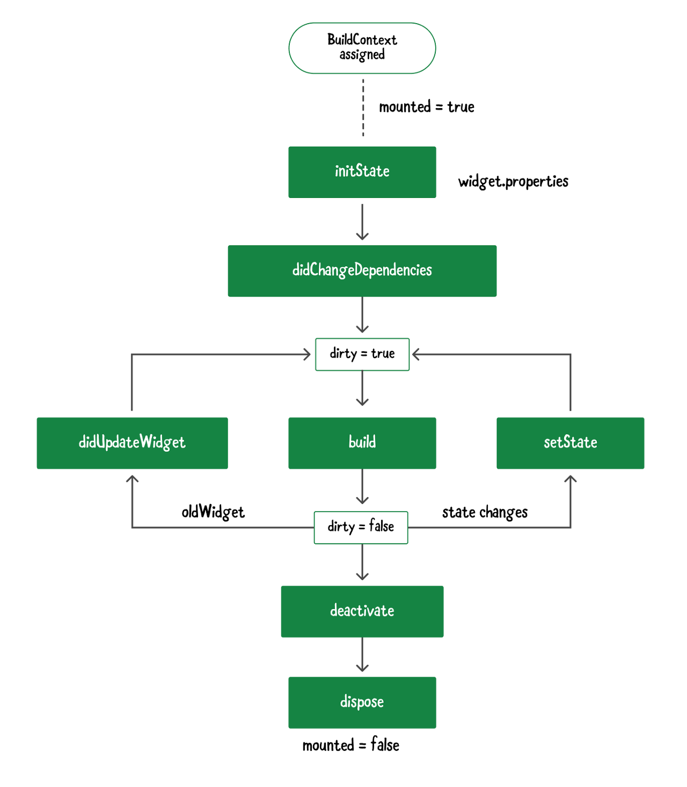
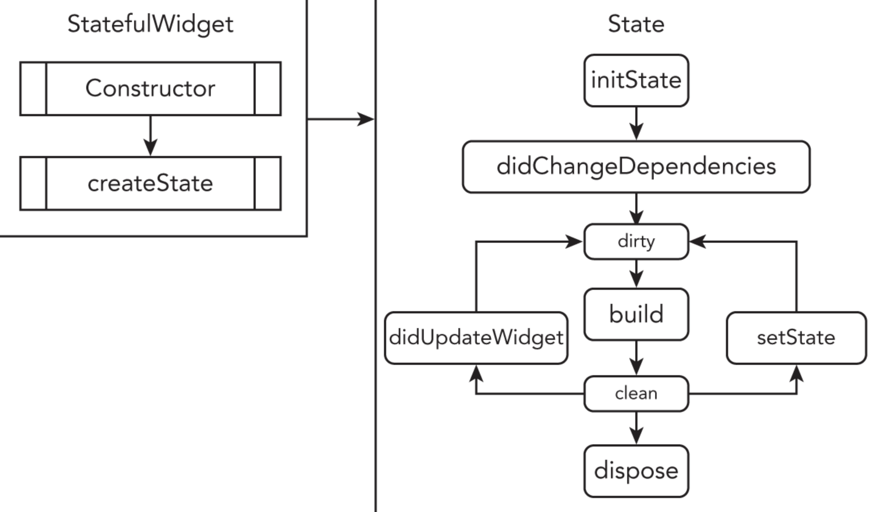

# Flutter Lifecycle

## Flutter App Lifecycle

- detached : 응용 프로그램이 플러터 엔진에 호스팅이 되었지만, 모든 뷰에서는 분리된 경우를 말한다. 엔진은 시작이 됐지만 아직 어떠한 뷰에도 연결이 되지 않았거나, 뷰가 Navigator Pop에 의하여 파괴 되었을 때의 상태이다.

- inactive : 응용 프로그램이 비활성 상태이며 사용자의 어떠한 입력도 수신하지 않는 경우이다. 두 플랫폼(Android, iOS) 모두 전화 통화를 할 때 해당 상태에 들어가게 된다. 해당 상태에서의 앱은 언제든 Pause(일시정지) 상태가 될 수 있다고 가정을 해야 한다.

- paused : 사용자가 홈버튼 등을 눌러서 앱이 백그라운드 상태로 내려간 경우를 말한다. 즉, 사용자가 어플리케이션의 UI를 확인할 수 없는 경우이다.

- resumed : 어플리케이션이 포그라운드 상태에 있는 경우를 말한다. 응용프로그램이 사용자에게 보여지고 사용할 수 있는 상태이다.

## Stateful Widget Lifecycle



### 1. createState() : 상태 생성

- StatefulWidget이 생성될때 반드시 호출되는 하는 함수

### 2. mounted == true : setState() 호출 가능 체크

- State가 생성되면 mounted property가 true로 설정된다.
- 위젯을 제어할 수 있는 buildContext 클래스에 접근 가능해지며 `setState()`를 호출할 수 있게 된다.
- `setState()` 호출전에 mounted property를 체크하면 더 안전한 코드를 작성할 수 있다.

### 3. initState() : 위젯 초기화

- 위젯 초기화시 1번 호출한다. 위젯에 필요한 데이터를 준비하고 작성하기 좋은 구간이다.

### 4. didChangeDependencies() : 의존성 변경시 호출

- initState() 이후에 호출된다.
- 데이터에 의존하는 위젯이라면 화면에 표시하기 전에 꼭 호출해야한다.
- 상속받은 위젯을 사용할때 Super(Parent)가 변경되면 호출한다.

### 5. build() : 위젯 빌드 반환

- 위젯을 만들어주는 메소드. 위젯이 렌더링되어 반환된다.

### 6. didUpdateWidget() : 위젯 갱신시 호출되는 메소드

- Parent 위젯이나 데이터가 변경되어 위젯을 갱신해야 할 때 호출한다.
- 위젯이 생성되고 나서 갱신을 해야 할때는 initState()가 아니라 didUpdateWidget()을 호출해야한다.

### 7. setState() : 실행중에 변경사항을 알리는 메소드

- 데이터가 변경되었다는 것을 알리고 다시 Build() 메소드를 실행시켜, UI를 갱신한다.
- 상태 갱신이 필요한 부분에 사용한다.

### 8. deactivate() - 상태 관리 Stop!

- State가 소멸전에 플러터의 구성 트리로부터 제거되는 메소드
- 따라서, 관리는 되지 않으나 메모리 해제까지 한것은 아니라 사용은 가능하다.

### 9. dispose() - 상태 관리 끝

- State 위젯을 완전히 소멸시킨다.
- Widget을 제거할 때 해줘야하는 작업이 있다면 여기에 작성하면 된다.
- deactivate() 된 위젯을 다른 트리에서 재사용하는 경우 dispose()하 호출되지 않을 수 있으니 주의하자.

### 10. mounted == false : setState() 호출불가

- 더이상 stateful 위젯이 존재하지 않으므로, setState()메소드 사용이 불가함을 설정함.

<br/>

## 생명주기 활용 예시

### Stateful Widget과 State



- 실제 코드를 작성할 때는 Widget과 State를 분리하기 때문에 위와 같은 형태를 띄게 된다.
- 실제 코드는 아래와 같다.

```dart
import 'dart:developer';
import 'package:flutter/material.dart';

class MyWidget extends StatefulWidget {
  @override
  _MyWidgetState createState() => _MyWidgetState();
}

class _MyWidgetState extends State<MyWidget> {
  // StatefulWidget을 생성해 이 위젯이 위젯트리에 삽입되자마자 곧바로 initState 메서드가 호출된다.
  // 그래서 만약 우리가 앱이 실행되자마자(StatefulWidget이 생성되는 순간에) 무언가 기능을 구현하고 싶다면 여기서 코드를 적어주자!
  @override
  void initState() {
    super.initState();
    print('initState is called');
  }

  // initState가 끝나고 호출되는 함수이며, 해당 위젯이 의존하는 위젯이 변경되면 재호출된다.
  @override
  void didChangeDependencies() {
    super.didChangeDependencies();
    print('didChangeDependencies is called');
  }

  @override
  void setState(fn) {
    super.setState(fn);
    log('setState');
  }

  @override
  void didUpdateWidget(covariant MyWidget oldWidget) {
    super.didUpdateWidget(oldWidget);
    log('didUpdateWidget');
  }

  // 트리에서 State객체가 제거될 때 호출된다.
  @override
  void deactivate() {
    super.deactivate();
    log('deactivate');
  }

  // dispose 메서드는 위젯이 위젯 트리에서 완전히 제거될 때 호출된다
  @override
  void dispose() {
    super.dispose();
    print('dispose is called');
  }

  // hot reload 실행 시 호출되며, build도 같이 호출된다.
  @override
  void reassemble() {
    super.reassemble();
    log('reassemble');
  }

  @override
  Widget build(BuildContext context) {
    // StatefulWidget이 초기화되었다면 실제적으로 위젯을 build해야한다
    print('build is called');
    return Scaffold(
      appBar: AppBar(
        title: Text('MyWidget!!'),
      ),
      body: Center(
          child: ElevatedButton(
            child: Text('Go to Previous Page'),
            onPressed: () {
            setState(() {
                print('setState is called');
            });

            // Navigator.pop()을 이용하면 현재 페이지를 스택에서 제거할 수 있다. 즉, 현재 페이지가 제거되면서 스택 제일 위에 있는 이전 페이지로 이동이 일어난다.
            // pop 메서드에 의해 MyWidget 위젯이 파괴되고 dispose 메서드가 실행되면서 print 메세지가 출력된다
            Navigator.pop(context);
        },
      )),
    );
  }
}
```

<br/>

## 참고자료

- [앱 생명주기와 Stateful , Stateless 위젯](https://bangu4.tistory.com/312)

- [[Flutter] LifeCycle(생명주기)](https://velog.io/@realryankim/Flutter-LifeCycle%EC%83%9D%EB%AA%85%EC%A3%BC%EA%B8%B0)
