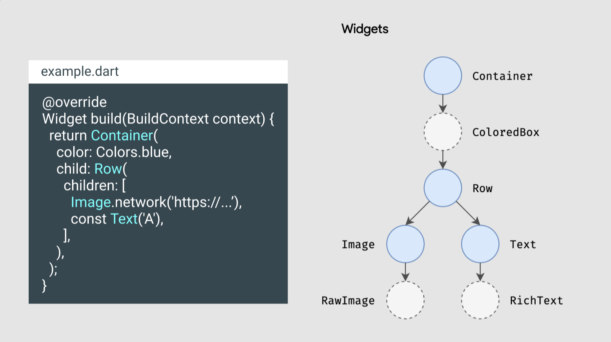

# Render

## Tree

## 참고자료

- [[Flutter] 이 코드.. 화면에 어떻게 그려질까? 렌더링 원리 - 1. 트리](https://velog.io/@broccolism/Flutter-%EC%9D%B4-%EC%BD%94%EB%93%9C..-%ED%99%94%EB%A9%B4%EC%97%90-%EC%96%B4%EB%96%BB%EA%B2%8C-%EB%A0%A4%EC%A7%88%EA%B9%8C-1.-%ED%8A%B8%EB%A6%AC)
