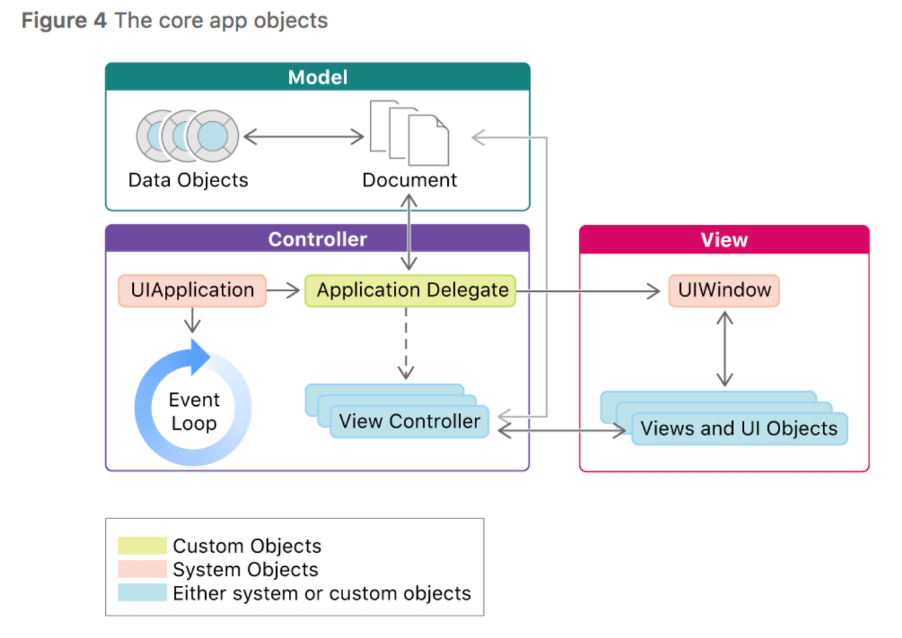
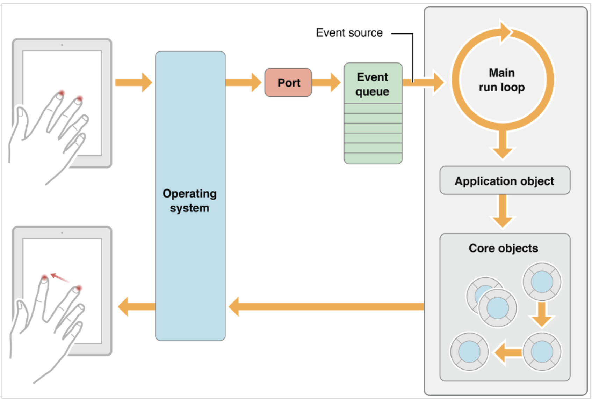
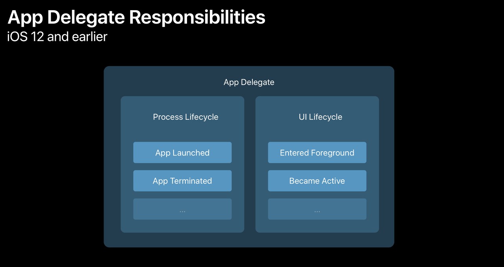
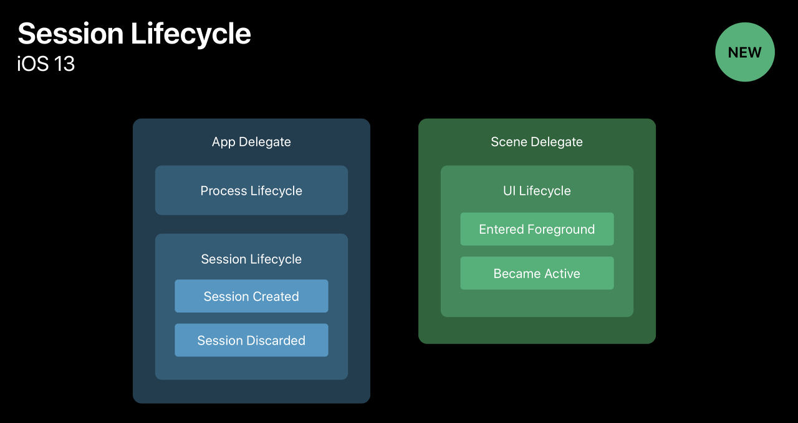
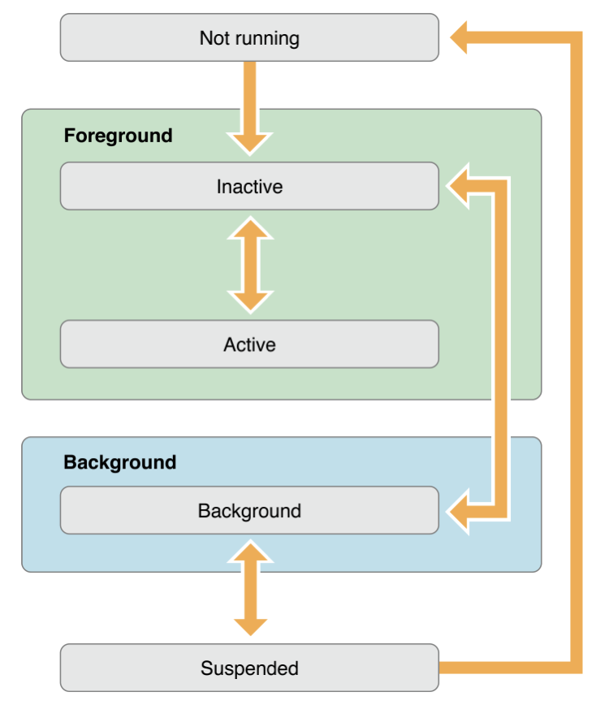
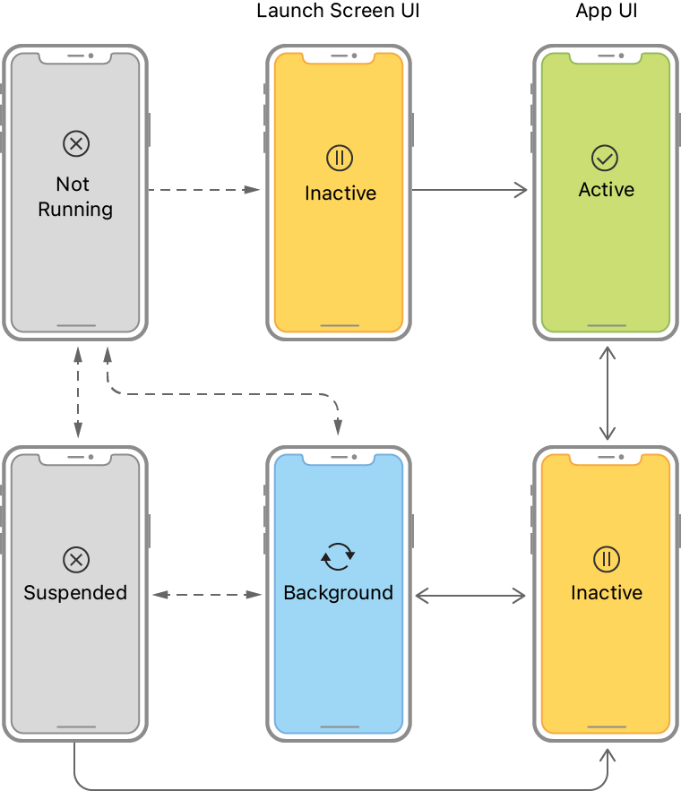

# Swift App Lifecycle

## IOS App 생명주기

- main함수 안에서 실행되는 `UIApplicationMain` 함수는 앱에 몇가지 중요한 객체를 생성하고 스토리보드에서 UI를 로딩하고 앱의 초기 셋팅값(info.plist)을 불러오고 앱을 Run loop에 올려 놓으며 함수를 진행시킵니다.
- 모든 iOS앱의 중심에는 시스템과 앱의 여러 객체들간의 대화를 가능하게 해주는 `UIApplication` 객체가 있습니다.

- iOS앱은 기본적으로 MVC(Model-View-Controller)구조를 사용한다. MVC 디자인 패턴을 통해 앱의 Data와 비지니스 로직을 UI 요소로부터 분리를 시켜준다. 덕분에 서로 다른 디바이스에서도 같은 동작이 가능하다.

### The Main Run Loop

- Main Run Loop는 사용자 관련 이벤트들을 받은 순서대로 처리한다. `UIApplication`는 앱이 실행될 때, Main Run Loop를 실행하고, 이 Run Loop로 이벤트를 처리한다. 이름에 표현되어 있다시피, Main Run Loop는 앱의 메인 스레드에서 동작한다.

 

## AppDelegate와 SceneDelegate

- IOS 13부터 Scene-Based Lifecycle로 변화되었다.
- SceneDelegate가 추가되면서 UISceneDelegate가 앱의 생명주기 이벤트를 관리하게 되었다.
- 이는 즉, App 단위의 상태 변화 관리에서 Scene 단위의 상태 변화 관리로의 변경을 의미했다.
- window가 scene 개념으로 바뀌고 하나의 앱이 여러 scene을 가질 수 있게 변화되었다.

> Scene?  
> UIKit는 UIWindowScene 객체를 사용하는 앱 UI의 각 인스턴스를 관리합니다. Scene에는 UI의 하나의 인스턴스를 나타내는 windows와 view controllers가 들어있습니다. 또한 각 scene에 해당하는 UIWindowSceneDelegate 객체를 가지고 있고, 이 객체는 UIKit와 앱 간의 상호 작용을 조정하는 데 사용합니다. Scene들은 같은 메모리와 앱 프로세스 공간을 공유하면서 서로 동시에 실행됩니다. 결과적으로 하나의 앱은 여러 scene과 scene delegate 객체를 동시에 활성화할 수 있습니다.  
> (Scenes - Apple Developer Document 참고)

> IOS 13 버전 이후의 AppDelegate 역할  
> 이전에는 앱이 foreground에 들어가거나 background로 이동할 때 앱의 상태를 업데이트하는 등의 앱의 주요 생명 주기 이벤트를 관리했었지만 더이상 하지 않습니다. 대신 이제 AppDelegate의 역할은 아래와 같습니다.
>
> 1. 앱의 가장 중요한 데이터 구조를 초기화
> 2. 앱의 scene을 환경설정(Configuration)
> 3. 앱 밖에서 발생한 알림(배터리 부족, 다운로드 완료 등)에 대응
> 4. 특정한 scenes, views, view controllers에 한정되지 않고 앱 자체를 타겟하는 이벤트에 대응
> 5. 애플 푸쉬 알림 서브스와 같이 실행시 요구되는 모든 서비스를 등록  
>    (UIApplicationDelegate - Apple Developer Document 참고)

 

## UIScene (App State)

- Scene 상태는 UIScene에 열거형(`UIScene.ActivationState`)으로 구현되어 있다. 그 종류는 아래와 같다.
  - unattached
  - foregroundInactive
  - foregroundActive
  - background

### 1. Unattached

- Scene과 앱이 연결되어 있지 않은 상태이다.
- Scene은 Unattached 상태에서 시작되며 시스템이 Scene에 연결 알림을 보낼 때까지 해당 상태로 유지된다.

### 2. foregroundInactive

- 실행 중이지만 이벤트를 수신하지 않는 상태이다.
- 다른 상태로 전환할 때 foregroundInactive 상태를 경유해 지나간다.
- 위 그림에도 전환될 때 foregroundInactive를 상태가 되었다가 바뀌는 것을 확인할 수 있다.
- 사용예시) 시스템 알림, 제어센터 off, app switching

### 3. foregroundActive

- 실행과 동시에 이벤트를 수신하는 상태이다.
- active scene은 화면에 표시되며 사용자가 볼 수 있다.

### 4. background

- 실행 중이지만 화면에는 없는 상태이다. 즉, "보이지 않는" 상태인 것이다.
- 음악 재생 앱이 있다. (음악 재생 앱은 Background 상태에서 동작해야할 게 많은 특수한 앱이다.)
- 보통 가능한한 최소한의 동작을 수행하는 것이 좋다. (아무것도 안하는 게 최고다.)
- 왜냐하면 메모리가 부족할 때 언제든지 Background 또는 Suspended Scene의 연결을 끊어서 리소스를 회수해 Unattached 상태로 바꿀 수 있기 때문이다.

### 5. Suspended

- Suspended 상태는 공식 문서에는 나와있지 않다.
- 앱이 background 상태에서 추가적인 작업을 하지 않으면 곧바로 suspended 상태로 진입한다.
- 앱을 다시 실행할 경우 빠른 실행을 위해 메모리에만 올라가 있다. 다만 메모리가 부족하다면 언제든지 Unattached 상태가 될 수 있다.

 

## 앱 생명주기 흐름도

- 위 흐름도를 해설하자면 아래와 같다.
  1. UIKit이 Scene 앱에 연결할 때 Scene의 초기 UI를 구성하고 Scene에 필요한 데이터를 로드한다.
  2. foreground-active 상태로 전환할 때 UI를 구성하고 사용자와 상호작용할 준비를 한다.
  3. foreground-active 상태에서 벗어나면 데이터를 저장하고 앱이 아무 동작도 하지 않게 한다.
  4. background 상태로 진입하면 중요한 작업을 완료하고 가능한 한 많은 메모리를 확보한 뒤 스냅샷을 준비한다.
  5. Scene과 연결이 해제되면 Scene과 관련된 모든 공유 리소스를 정리한다.

 

## 참고자료

- [공식문서: Managing your app’s life cycle](https://developer.apple.com/documentation/uikit/app_and_environment/managing_your_app_s_life_cycle)

- [공식문서: UIScene](https://developer.apple.com/documentation/uikit/uiscene)

- [공식문서: UIScene.ActivationState](https://developer.apple.com/documentation/uikit/uiscene/activationstate)

- [블로그](https://jeong9216.tistory.com/461)

- [AppDelegate와 SceneDelegate(IOS 13버전 이전과 이후)](https://velog.io/@dev-lena/iOS-AppDelegate%EC%99%80-SceneDelegate)

- [[iOS] 앱의 생명주기(App Life Cycle)와 앱의 구조(App Structure)](<https://jinshine.github.io/2018/05/28/iOS/%EC%95%B1%EC%9D%98%20%EC%83%9D%EB%AA%85%EC%A3%BC%EA%B8%B0(App%20Life%20Cycle)%EC%99%80%20%EC%95%B1%EC%9D%98%20%EA%B5%AC%EC%A1%B0(App%20Structure)/>)
