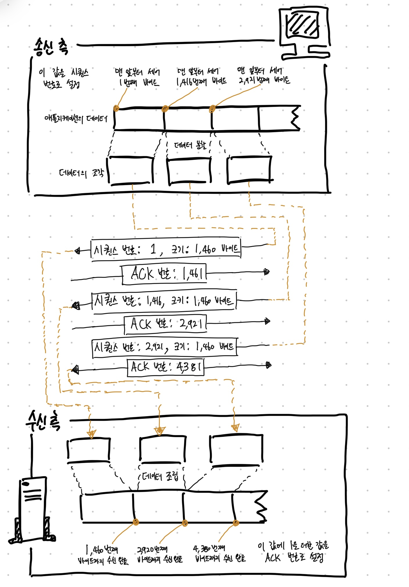

# Chapter 02 TCP/IP의 데이터를 전기 신호로 만들어 보낸다.

## 1. 소켓을 작성한다.

### 1-1. 프로토콜 스택의 내부 구성

- OS에 내장된 네트워크 제어용 소프트웨어(**프로토콜 스택**)와 네트워크용 하드웨어(**LAN 어댑터**)가 브라우저에서 받은 메시지를 서버에 송출하는 동작
- 프로토콜 스택의 내부는 역할이 서로 다른 몇 부분으로 나눠져 있다. (아래 그림 참고)
  - 작업을 의뢰하는 쪽이 상위에 의뢰를 받아 실제로 작업하는 쪽이 하위에 있다.
  - 상하 관계는 확실하지 않거나 역전되는 경우도 있으므로 엄밀히 따질 필요는 없다.


> - `TCP`: Transmission Control Protocol
> - `UDP`: User Datagram Protocol
> - `IP`: Internet Protocol
> - `ICMP`: Internet Control Message Protocol
> - `ARP`: Address Resolution Protocol 

- 최상단에 위치한 것은 `네트워크 애플리케이션`이다.
  - 브라우저, 메일러(메일을 읽고 쓰는 소프트웨어), 웹 서버, 메일 서버 등의 프로그램이 여기에 해당한다.
  - 애플리케이션은 `Socket 라이브러리`를 가지고 있으며, 또 `Socket 라이브러리` 안에는 `Resolver`가 내장되어 있다.
- 그 아래는 OS의 내부에 존재하는 `프로토콜 스택`이 있다.
  - 프로토콜 스택은 `TCP`와 `UDP`를 통해 데이터 송/수신 작업을 한다.
  - IP 프로토콜은 패킷 송/수신 동작을 제어하는 부분이다. 인터넷에서 데이터를 운반할 때는 데이터를 작게 나누어 `패킷` 형태로 운반하는데, 이 패킷을 통신 상대까지 운반하는 것이 IP의 주 역할이다.
  - IP 안에는 `ICMP`와 `ARP`라는 프로토콜을 다루는 부분이 포함되어 있다.
  - `ICMP`는 패킷을 운반할 때 발생하는 오류를 통지하거나 제어용 메시지를 통지할 때 사용한다.
  - `ARP`는 IP 주소에 대응하는 이더넷의 `MAC 주소`를 조사할 대 사용한다.
- IP 아래에 있는 `LAN 드라이버`는 LAN 어댑터의 하드웨어를 제어한다.
- 그 아래에 있는 하드웨어인 LAN 어댑터가 실제 송/수신 동작을 수행한다. (케이블에 대해 신호를 송/수신)

> `TCP`와 `UDP`은 언제 사용할까?
> - 브라우저나 메일 등의 일반적인 애플리케이션이 데이터를 송/수신할 경우에는 `TCP`
> - DNS 서버에 대한 조회 등에서 짧은 제어용 데이터를 송/수신할 경우에는 `UDP`

### 1-2. 소켓의 실체는 통신 제어용 제어 정보

- 대표적인 정보로는 통신 상대의 IP 주소는 무엇인가, 포트 번호는 몇 번인가, 통신 동작이 어떤 상태에 있는가 등이 있다.
- 소켓은 개념적인 것이어서 실체가 없으므로 굳이 말하자면 이 제어 정보가 소켓의 실체라고 할 수 있다.
- 프로토콜 스택은 이 제어 정보를 참조하면서 동작한다.
  - 프로토콜 스택은 이것을 참조하여 다음에 무엇을 해야 하는지를 판단하는데 이것이 소켓의 역할이다.

#### netstat 명령어

- 윈도우의 경우 `netstat`이라는 명령으로 소켓의 내용을 화면에 표시할 수 있다.
  - Local Address는 LAN 어댑터 하드웨어에 할당한 IP 주소를 의미한다.


> netstat 명령어 설명
> - 소켓의 내용을 표시하는 명령어이며, 옵션을 줄 수 있다.
> - `a`: 통신 중인 것뿐만 아니라 통신 개시 전의 것도 포함하여 전부 표시
> - `n`: IP 주소나 포트번호를 번호로 표시
> - `o`: 소켓을 사용하고 있는 프로그램의 PID 표시

> netstat 결과 설명
> - `프로토콜(Proto)` 행
>   - 프로토콜의 종류
>   - 예시에서는 TCP/IP 프로토콜을 사용하여 데이터를 송수신한 것으로 보임. (TCP와 UDP 중 하나)
> - `로컬 주소(Local Address)` 행
>   - netstat 명령을 실행한 기계 자체의 IP 주소와 포트번호
>   - 보통 컴퓨터는 여러 개의 LAN 어댑터를 장착하고 있다. 따라서 여러 개의 IP 주소가 표시되는 것이 대부분이다.
>   - 또한 `0.0.0.0`은 특정 IP 주소와 연결되어 있지 않음을 나타낸다.
> - `외부 주소(Foreign Address)` 행
>   - `0.0.0.0`은 아직 통신이 시작되지 않고 특정 IP 주소나 포트와 연결되어 있지 않은 것을 나타낸다.
>   - 또한 UDP 프로토콜은 소켓을 상대측의 주소나 포트와 연결하지 않으므로 상태측은 `*:*`로 표시된다.
> - `상태(State)` 행
>   - `LISTENING`: 상대의 접속을 기다리고 있는 상태
>   - `ESTABLISHED`: 접속 동작이 끝나고 데이터가 통신 중인지 나타냄
> - `PID` 행
>   - 이 소켓을 사용하고 있는 프로그램의 식별 번호(Program Identifier)

### 1-3. Socket을 호출했을 때의 동작

- `Socket 라이브러리`의 `socket`이나 `connect`를 호출했을 때의 프로토콜 스택 내부 동작 설명


- 준비 단계에서는 socket을 호출하여 소켓을 만들 것을 의뢰하면 프로토콜 스택은 의뢰에 다라 한 개의 소켓을 만든다.
  - 이 때 프로토콜 스택이 최초로 하는 일은 소켓 한 개 분량의 메모리 영역을 확보하는 것이다.
  - 소켓의 제어 정보를 기록하는 메모리 여역은 처음부터 존재하는 것이 아니므로 먼저 그것을 확보해야 한다.
  - 소켓이 만들어 지면 소켓을 나타내는 디스크립터를 애플리케이션에 알려준다.
  - 디스크립터는 프로토콜 스택의 내부에 있는 다수의 소켓 중 어느 것을 가리키는지를 나타내는 번호표와 같은 정보다.
- 디스크립터를 받은 애플리케이션은 이후 프로토콜 스택에 데이터 송/수신 동작을 의뢰할 때 디스크립터를 통지한다.
  - 소켓에는 누가 누구와 통신하고 있는지, 그리고 그것이 어떤 상태로 있는지 등의 정보가 전부 기록되어 있으므로 디스크립터가 어느 소켓인지를 나타내면 필요한 정보는 전부 프로토콜 스택에서 알 수 있다.
  - 이말인즉슨, 통신 상대의 정보를 애플리케이션에서 일일이 통지받을 필요가 없다는 것이다.

<br/>

## 2. 서버에 접속한다

### 2-1. 접속의 의미

- 소켓을 만들면 애플리케이션은 `connect`를 호출하다.
  - 프로토콜 스택은 자기 쪽의 소켓을 서버측 소켓에 접속한다.
  - 그런데 이더넷이나 통신 회선 등의 케이블은 항상 접속된 상태에 있으므로 케이블은 연결하지 않거나 분리하지 않는다.
- 이더넷이나 통신 회선은 항상 케이블에 연결되어 있으므로 언제나 언제나 신호를 보낼 수 있다.
  - 그러므로 데이터를 신호로 변환하여 송신하기만 하면 언제든지 통신이 가능하다.
  - 소켓을 만든 직후에 애플리케이션에서 데이터 송신 의뢰가 오면 프로토콜 스택은 어떻게 될까?
- 소켓을 만든 직후는 아직 거기에 아무것도 기록되어 있지 않으므로 통신 상대가 누구인지도 모른다.
  - 이 상태에서는 송신 의뢰가 와도 데이터를 어디로 보내면 좋을지 알 수 없다.
  - `서버의 IP 주소나 포트 번호를 프로토콜 스택에 알리는 동작`이 필요하다. 이것은 접속 동작의 한 가지 역할이다.
- 이는 서버측도 마찬가지다.
  - 따라서 클라이언트측에서 `서버측에 통신 동작의 개시를 전달`하는 것이 접속 동작의 역할이다.
- 또한 데이터의 송/수신을 위한 메모리 영역이 필요한데 이 메모리 영역을 '버퍼 메모리'라고 부른다.
  - `버퍼 메모리의 확보`도 '접속'한다는 동작의 의미가 될 수 있다.

### 2-2. 맨 앞부분에 제어 정보를 기록한 헤더를 배치한다

- 제어 정보는 크게 2가지로 나뉜다.
  1. 클라이언트와 서버가 서로 연락을 절충하기 위해 주고받는 제어 정보. => `헤더에 기입되는 정보`
  2. `소켓에 기록되는 정보`

#### 첫 번째, Header에 기입되는 정보


- 이것은 접속 동작뿐만 아니라 데이터를 송/수신하는 동작이나 연결을 끊는 동작도 포함하여 통신 동작 전체에서 어떤 정보가 필요한지 검토하여 내용을 TCP 프로토콜의 사양으로 규정하고 있다.
- 이 제어 정보는 패킷의 맨 앞부분에 배치하기 때문에 `TCP Header`라고 부른다.
  - 이더넷이나 IP에도 같은 제어 정보가 있고 이것도 '헤더'라고 부르기 때문에 여러 헤더가 등장해 혼란스럽다.
  - 따라서 이 경우 TCP Header, IP Header, Ethernet Header 등 무엇의 헤더인지 구분할 수 있게 써야 한다.

#### 클라이언트와 서버의 통신 동작

- 클라이언트는 헤더에 필요한 정보를 기록하여 연락을 취하면서 통신 동작을 진행한다.

```
송신측: 데이터 송신 동작을 개시합니다.
수신측: 예, 잘 알겠습니다.
송신측: 00번째 데이터를 보냅니다.
수신측: 00번째 데이터를 받았습니다.
(이하 생략)
```

- 위와 같은 형식으로 헤더에 기록된 제어 정보에 의해 대화가 이뤄진다.
  - 이 대화가 가능하지 않으면 통신이 성립되지 않는다.
  - 헤더는 그만큼 중요하며 헤더의 각 항목의 의미를 알면 통신 동작을 안다고 해도 좋다.


#### 두 번째, 프로토콜 스택의 동작을 제어하기 위한 정보

- 여기에는 애플리케이션에서 통지된 정보, 통신 상대로부터 받은 정보 등이 수시로 기록된다.
- 송/수신 동작의 진행 상황 등도 수시로 기록되고 프로토콜 스택은 하나하나 차례로 정보를 참조하면서 움진인다.
- 그러므로 소켓의 제어 정보는 프로토콜 스택의 프로그램과 일체화되어 있다고 해도 좋다.
- 소켓에 기록한 제어 정보는 상대측에서 볼 수 없다. 왜냐하면 규칙에 따라 헤더에 제어 정보를 기록하여 대화하면 그것으로 클라이언트와 서버가 연락을 취하기 때문이다.
  - 예를 들어 내부 구조가 다른 위도우와 리눅스라는 OS는 프로토콜 스택을 만드는 방법이 다르므로 필요한 제어 정보도 다를 것이다.
  - 하지만 양자는 문제 없이 통실할 수 있으며 컴퓨터와 휴대전화로 통신할 때도 마찬가지다.

### 2-3. 접속 동작의 실제

```
connect(<디스크립터>, <서버측의 IP 주소와 포트 번호>, ...)
```

- 서버측의 IP 주소와 포트 번호를 쓰면 명령이 프로토콜 스택의 TCP 담당 부분에 전달된다.
- 그러면 TCP 담당 부분은 IP 주소로 표시된 상대측의 TCP 담당 부분과 제어 정보를 주고 받는다.
1. 먼저 데이터 송/수신 동작의 개시를 나타내는 제어 정보를 기록한 TCP 헤더를 만든다. (송신처, 수신처, 포트 번호를 기입하고 컨트롤 비트인 `SYN`을 1로 설정)
2. IP 담당 부분에게 건네주어 송신하도록 의뢰, IP 담당 부분은 패킷 송신 동작을 실행해 서버측에 전달
3. 서버에 패킷이 도착하면 서버측의 IP 담당이 이것을 받아 TCP 담당에게 건네준다.
4. 이후 서버측의 TCP 담당이 TCP 헤더를 조사하여 기록되어 있는 수신처 포트 번호에 해당하는 소켓을 찾아낸다.
5. (수신처 포트 번호와 동일한) 접속을 기다리고 있는 상태인 소켓을 발견하면 여기에 필요한 정보를 기록하고 접속 동작이 진행중이라는 상태가 된다.
6. 이 과정이 끝나면 서버의 TCP 담당은 응답을 돌려보낸다. 이 때는 ACK라는 비트를 1로 설정한다. 
7. 클라이언트는 이 응답을 받아 TCP 헤더를 조사하여 서버측의 접속 동작이 성공했는지 확인한다. SYN가 1이면 접속 성공이므로 소켓에 서버의 IP 주소나 포트 번호 등과 함께 소켓에 접속 완료를 나타내는 제어 정보를 기록한다.
8. 클라이언트는 ACK 비트가 1인 응답을 만들어 서버측에 다시 전달한다. 이는 서버측에 패킷이 도착한 것을 알리기 위해서다.

<br/>

## 3. 데이터를 송/수신한다

### 3-1. 프로토콜 스택에 HTTP 리퀘스트 메시지를 넘긴다

- `connect`에서 애플리케이션에 제어가 되돌아오면 데이터 송/수신 동작에 들어간다. 이 동작은 애플리케이션이 `write`를 호출하여 송신 데이터를 프로토콜 스택에 건네주는 곳부터 시작된다.
- 이제 이것을 받은 프로토콜 스택이 송신 동작을 실행한다. 그런데 이 동작에는 몇 가지 중요한 점이 있다.
  - 먼저 프로토콜 스택은 받은 데이터의 내용에 무엇이 쓰여있는지 알지 못한다. `write`를 호출할 때 송신 데이터의 길이를 지정하지만 프로토콜 스택은 해당 길이만큼만 바이너리 데이터가 1바이트씩 차례로 나열되어 있다고 인식할 뿐이다.
- 프로토콜 스택은 받은 데이터를 곧바로 송신하지 않고 일단 자체의 내부에 있는 송신용 버퍼 메모리 영역에 저장하고 애플리케이션이 다음 데이터를 건네주기를 기다린다.
  - 데이터를 전부 한꺼번에 송신 의뢰하는 경우도 있고 1바이트씩 또는 1행씩 세분하여 송신 의뢰하는 경우도 있다.
  - 어느 경우든지 한 번의 송신 의뢰에서 건네주는 데이터의 길이는 애플리케이션의 사정에 따라 결정되며 프로토콜 스택에서 제어할 수 없다.
- 작은 패킷을 많이 보내는 방법은 네트워크의 이용 효율이 저하되므로 어느 정도 데이터를 저장하고 나서 송/수신 동작을 한다.
  - OS의 종류나 버전에 따라 달라지므로 환경에 따라 다르다.

#### MTU & MSS


- 판단 요소의 하나는 한 패킷에 저장할 수 있는 데이터의 크기이다.
- 프로토콜 스택은 `MTU`라는 매개변수를 바탕으로 판단한다. MTU는 한 패킷으로 운반할 수 있는 디지털 데이터의 최대 길이다.
- MTU에는 패킷의 맨 앞부분에 헤더가 포함되어 있으므로 여기부터 헤더를 제외한 것이 하나의 패킷으로 운반할 수 있는 데이터의 최대 길이가 되고 이것을 `MSS`라고 한다.
- 애플리케이션에서 받은 데이터가 `MSS`를 초과하거나 `MSS`에 가까운 길이에 이르기까지 데이터를 저장하고 송신 동작을 하면 패킷이 잘게 나누어질 걱정을 할 필요가 없다.

> 용어 정리
> - `Maximum Transmission Unit, MTU`: 패킷 한 개로 운반할 수 있는 디지털 데이터의 최대 길이. 이더넷에서는 보통 1,500 바이트 
> - `Maximum Segment Size, MSS`: 헤더를 제외하고 한 개의 패킷으로 운반할 수 있는 TCP의 데이터의 최대 길이

#### 타이밍

- 또 한 가지 판단 요소는 타이밍이다. 애플리케이션의 송신 속도가 느려지는 경우 `MSS`에 가깝게 데이터를 저장하면 여기에서 시간이 걸려 송신 동작이 지연되므로 버퍼에 데이터가 모이지 않아도 적당한 곳에서 송신 동작을 실행해야 한다.
- 따라서 프로토콜 스택은 내부에 타이머가 있어서 이것으로 일정 시간 이상 경과하면 패킷을 송신한다.

#### 정리

- 판단 요소는 두 가지이지만 이 둘은 상반된 면도 있다.
  - 전자를 중시하면 패킷 길이가 길어져서 네트워크 이용 효율이 높아지는 반면 버퍼에 머무는 시간만큼 송신 동작이 지연될 우려가 있다.
  - 반면 후자를 숭시하면 지연은 적어지지만 이용 효율이떨어진다.
  - 따라서 양자를 절충해서 적당히 시간을 가늠하여 송신 동작을 실행해야 한다.
- 그러나 TCP 사양에는 절충에 관한 규정이 없으며 실제로 어떻게 판단해야 할지는 프로토콜 스택을 만드는 개발자에게 맡겨져 있다.
  - 그러므로 OS 종류나 버전에 따라 이와 관련된 동작이 달라진다.
- 프로토콜 스택에만 맡긴다면 좋지 않은 일이 생길 수도 있으므로 애플리케이션측에서 송신의 타이밍을 제어하는 여지도 남겨뒀다.

### 3-2. 데이터가 클 때는 분할하여 보낸다

- HTTP 리퀘스트 메시지는 보통 그다지 길지 않으므로 한 개의 패킷에 들어가지만, 폼을 사용하여 긴 데이터를 보낼 경우 한 개의 패킷에 들어가지 않을 만큼 긴 것도 있다.
- 이 경우 송신 버퍼에 저장된 데이터는 MSS의 길이를 초과하므로 다음 데이터를 기다릴 필요가 없다. 따라서 송신 버퍼에 들어있는 데이터를 맨 앞부터 차례대로 MSS의 크기에 맞게 분할하고 분할한 조작을 한 개씩 패킷에 넣어 송신한다.

### 3-3. ACK 번호를 사용하여 패킷이 도착했는지 확인한다

- 이제 데이터를 입력한 패킷이 서버를 향해 송신되는데, 데이터 송신 동작은 이것으로 끝나지 않는다.
- TCP에는 송신한 패킷이 상대에게 올바르게 도착했는지 확인하고 도착하지 않았으면 다시 송신하는 기능이 있으므로 패킷을 송신한 후에는 확인 동작으로 넘어간다.



- 클라이언트는 데이터 조각으로 분할할 때 바이트를 세어 시퀀스 번호를 보낸다.
- 서버측은 데이터의 길이를 확인해 거기에 1을 더한 값을 ACK 번호로 보낸다. (`수신 확인 응답`)
- 실제 시퀀스 번호를 생성할 때는 1부터 시작하지 않고 난수를 바탕으로 산출한 초기값으로 시작한다.
  - 시퀀스 번호가 항상 1부터 시작한다고 예측할 수 있으면 거기에 악의적인 공격을 할 우려가 있기 때문이다.
  - 따라서 데이터 송/수신을 시작하기 전에 초기값을 상대에게 알리게 되어 있다. (connect를 SYN 1로 설정하고 거기에 더해 시퀀스 번호 초기값을 같이 보낸다.)
- 사실 TCP의 데이터 송/수신 동작은 양방향이므로 클라이언트에서 서버로 향하는 데이터의 흐름과 서버에서 클라이언트로 향하는 두 가지의 데이터 흐름이 있기 때문에 이에 대응해야 한다.
  - 서버측에서 ACK만 넘기는 것이 아니라, 시퀀스 번호를 붙여 데이터를 넘겨준다는 얘기다.
  - 반대로 클라이언트 측에서도 ACK 번호를 산출해 서버에서 반송한다.


- 수신측에 패킷이 올바르게 도착한 것을 확인하고 도착하지 않으면 사지 보내므로 네트워크의 어디에서 오류가 발생했더라도 그것을 전부 검출하여 회복 처리(패킷을 다시 보내는 것)를 할 수 있다.
  - 반대로 말한면 구조가 이렇기 때문에 다른 곳에서 오류 recovery를 할 필요가 없다.
- 이 덕분에 LAN 어댑터, 버터, 라우터 모두 회복 조치를 취하지 않는다.
  - 오류를 검출하면 그 패킷을 버리기만 하는데, 애플리케이션도 마찬가지다.
  - TCP에 맡겨두면 오류가 발생해도 데이터가 문제 없이 상대에게 도착하므로 애플리케이션의 송신 동작은 송신한 채로 끝난다.
  - TCP는 몇 번 시도하다가 회복의 전망이 없다면 데이터 송신 동작을 강제로 종료하고 애플리케이션에 오류를 통지한다. (케이블 분리, 서버 다운 등의 이슈) 

### 3-4. 패킷 평균 왕복 시간으로 ACK 번호의 대기 시간을 조정한다

사실 오류 검출과 회복의 원리는 꽤 복잡하다. 간단히 요점만 설명하면 아래와 같다.

- 먼저 ACK 번호가 돌아오는 것을 기다리는 시간을 `타임아웃 값`이라고 한다.
- 네트워크가 혼잡하여 정체가 일어나면 ACK 번호가 돌아오는 것이 지연되므로 이것을 예측하여 대기 시간을 어느 정도 길게 설정해야 한다.
  - 그러지 않으면 ACK 번호가 돌아오기 전에 다시 보내야 하는 사태가 일어난다.
  - 헛된 패킷을 보내면 혼잡은 더 가중된다.
- 대기 시간은 너무 짧지도 길지도 않은 적절한 값으로 설정해야 하는데, 이것은 간단하지 않다.
  - 서버가 가까운지, 먼지에 따라 ACK 번호가 돌아오는 차이가 크고, 정체시의 지연도 가미하여 생각해야 하기 때문이다.
  - 차이가 크다면 대기 시간을 일정한 값으로 설정하는 방법이 적절하지 않다.
  - 그래서 TCP는 대기 시간을 동적으로 변경하는 방법을 취하고 있다. ACK 번호가 돌아오는 시간을 기준으로 대기 시간을 판단하는 것이다.
  - 구체적으로는 데이터 송신 동작을 실행하고 있을 때 항상 ACK 번호가 돌아오는 시간을 계측해둔다. 만약 시간이 지연되면 이것에 대응하여 대기시간도 늘린다.

### 3-5. 윈도우 제어 방식으로 효율적인 ACK 번호를 관리한다

- 한 개의 패킷을 보내고 ACK 번호를 기다린다는 방법(핑퐁 방식)은 단순하고 이해하기 쉽지만 ACK 번호가 돌아올 때까지의 시간 동안 아무 일도 하지 않고 기다리는 것은 시간 낭비다.
  - 이런 낭비를 줄이기 위해 TCP는 윈도우 제어라는 방식에 따라 송신과 ACK 번호 통지의 동작을 실행한다.
  - 윈도우 제어는 한 개의 패킷을 보낸 후 ACK 번호를 기다리지 않고 차례대로 연속해서 복수의 패킷을 보내는 방법이다.
  - 이러면 ACK 번호가 돌아올 때까지의 시간이 낭비되지 않는다.
- 하지만 주의할 점이 있다.
  - 핑퐁 방식은 수신측의 능력을 초과하여 패킷을 보내는 일은 없다.
  - 그러나 ACK 번호의 신호를 기다리지 않고 차례로 패킷을 보내면 수신측의 능력을 초과하여 패킷을 보내는 경우가 발생할 수 있다.
- 구체적인 내용은 아래와 같다. 
  - 수신측의 TCP는 패킷을 수신하면 일단 수신용 버퍼 메모리에 데이터를 일시 보관한다.
  - ACK 번호를 계산하거나 조각을 연결하여 원래 데이터를 복원한 후 애플리케이션에 건네주어야 한다.
  - 따라서 처리가 끝나지 않은 상태에서 다음 패킷이 도착해도 곤란하지 않도록 수신 버퍼를 설치하고 여기에 수신된 데이터를 일시 보관하는 것이다.
  - 그런데 애플리케이션에 건네주는 속도보다 빠른 속도로 데이터가 도착하면 수신 버퍼에 데이터가 차곡차곡 쌓여서 곧 넘쳐버린다.
  - 넘친 데이터는 없어져 버리므로 패킷이 도착해도 오류가 발생한 것처럼 되는데 이것이 수신측의 능력이 초과된 것이다.
- 이 문제를 해결하기 위해 수신측은 이 양을 초과하지 않도록 송신 동작을 실행하는데 이것이 윈도우 제어 방식의 개념이다.
  - 수신측은 수신 버퍼에 데이터를 임시 보관하고 수신 처리를 진행한다.
  - 수신 처리가 끝나고 수신 버퍼에 빈 부분이 생기면 그 분량만큼 수신할 수 있는 데이터 양을 늘리므로 TCP 헤더의 `윈도우 필드`에서 이것을 송신측에 알린다.
  - 이렇게 해서 수신측의 능력을 초과하여 데이터를 보내는 일이 없어진다.
  - 수신 가능한 데이터 양의 최대값을 `윈도우 사이즈`라고 부르며 TCP를 정밀 조정하는 매개변수의 하나이다.

### 3-6. ACK 번호와 윈도우를 합승한다.

- 송/수신 동작의 효율성을 높이기 위해 ACK 번호와 윈도우를 통지하는 타이밍을 고려해야 한다.
- 먼저 윈도우 통지의 동작은 언제 일어날까?
  - 수신 데이터가 수신 버퍼에 보관되면 윈도우를 하나하나 차례대로 수신측에 통지할 필요가 없다.
  - 윈도우의 값은 송신측이 데이터를 송신할 때마다 송신한 데이터만큼 감산하여 스스로 산출할 수 있기 때문이다.
  - 윈도우 통지가 필요한 때는 수신측이 수신 버퍼에서 데이터를 추출하여 애플리케이션에 건네주었을 때이다.
  - 이 동작은 수신측의 애플리케이션에서 보낸 의뢰가 계기가 되어 일어나므로 언제 일어날지 송신측에서는 알 수 없다.
  - 그러므로 수신측에서 애플리케이션에 데이터를 건네주고 수신 버퍼의 빈 영역이 늘어났을 때 이것을 송신측에 통지해야 하는데, 이것이 윈도우 통지의 타이밍이다.
- 반면 ACK 번호는 어떨까?
  - ACK 번호는 수신측에서 데이터를 받았을 때 내용을 조사하여 정상 수신을 확인할 수 있는 경우에만 송신측에 보낸다.
  - 즉 데이터를 수신한 후 즉시 보낸다고 생각하면 된다.
- 이 두 가지를 조합해 보면 먼저 송신측에서 보낸 데이터가 수신측에 도착하여 수신 동작이 정상적으로 완료되었을 때 ACK 번호를 송신측에 통지하고 잠시 후 데이터를 애플리케이션에 건네주었을 때 윈도우를 송신측에 통지하는 상태가 된다.
  - 본래의 개념을 그대로 실현하면 데이터의 패킷을 수신할 때마다 ACK 번호 통지와 윈도우 통지의 패킷이 하나씩 따로따로 송신측에 보내진다.
  - 이렇게 해서는 수신측에서 송신측에 보내는 패킷이 많아져서 효율성이 저하된다.
- 수신측은 ACK 번호나 윈도우를 통지할 때 소켓을 바로 보내지 않고 잠시 기다린다.
  - 기다리는 사이에 다음 통지 동작이 일어나면 양쪽을 상승시켜서 한 개의 패킷으로 묶어서 보낸다. (ACK + 윈도우)
- 복수의 ACK 번호 통지가 연속해서 일어난 경우에도 패킷의 수를 줄일 수 있다.
  - ACK 번호는 데이터를 어디까지 받았는지, 즉 수신한 데이터의 끝이 어디인지를 송신측에 알리는 것이므로 ACK 번호 통지가 연속하여 일어나면 최후의 것만 통지하고 도중의 것은 생략해도 상관없다.
  - 이렇게 하면 패킷을 줄일 수 있고, 윈도우 통지가 연속된 경우도 마찬가지로 패킷을 줄일 수 있다.

### 3-7. HTTP 응답 메시지를 수신한다

- HTTP Request를 보내면 다음에는 웹 서버에서 응답 메시지가 돌아오기를 기다리고 응답 메시지가 돌아오면 그것을 수신한다.
- 브라우저의 동작
  - 브라우저는 Request Message를 송신해 달라고 의뢰하고, 이것이 끝나면 서버에서 돌아오는 응답 메시지를 받기 위해 read 프로그램을 호출한다.
  - 그러면 프로토콜 스택에 제어가 넘어간다. 데이터를 수신할 때도 데이터를 송신할 때와 마찬가지로 데이터를 일시 보관하는 수신 버퍼를 사용한다.
  - 먼저 프로토콜 스택은 수신 버퍼에서 수신 데이터를 추출하여 애플리케이션에 건네준다.
  - 이때 Request Message의 송신을 완료하고 나서 얼마 안 된 시점이라면 아직 응답 메시지가 돌아오지 않았을 것이다.
  - 응답 메시지가 돌아올 때까지는 다소 시간이 걸리므로 수신 버퍼에 데이터가 들어가지 않을 것이다.
  - 그러면 수신 버퍼에서 수신 데이터를 추출하여 애플리케이션에 건네주는 작업을 잠시 보류한다. => 이후 서버에 응답 메시지 패킷이 도착하면 그것을 수신해 작업을 계속한다.
  - 

<br/>

## 4. 서버에서 연결을 끊어 소켓을 말소한다.

### 4-1. 데이터 보내기를 완료했을 때 연결을 끊는다.

- 데이터 송신이 완료되면 송을 완료한 측이 연결 끊기 단계로 들어가는데 어디에서 데이터 송/수신 동작이 끝나는지는 애플리케이션에 따라 다르다.
  - 웹이라면 브라우저에서 웹 서버에 request message를 보내고 서버가 이것에 응답하여 응답 메시지를 반송 완료하면 데이터 보내기가 완료된 것이다.
  - 이 경우 서버측이 연결 끊기 단계에 들어간다. 클라이언트측이 데이터 보내기를 완료되면 완료되는 애플리케이션 같은 경우에는 클라이언트 측에서 연결 끊기 단계에 먼저 들어갈 수도 있다.


- (서버측이 먼저 연결을 끊는다고 가정하고) 서버측의 애플리케이션이 먼저 Socket 라이브러리의 close를 호출한다. 그러면 서버측의 프로토콜 스택이 TCP 헤더를 만들고 여기에 연결 끊기를 나타내는 정보를 설정한다.
  - 구체적으로는 컨트롤 비트의 FIN 비트에 1을 설정하고 IP 담당 부분에 의뢰하여 클라이언트에 송신해 달라고 한다.
  - 이와 동시에 서버측의 소켓에 연결 끊기 동작에 들어갔다는 정보를 기록한다.
- 클라이언트측은 서버에서 FIN을 1로 설정한 TCP 헤더가 도착하면 클라이언트측의 프로토콜 스택은 자신의 소켓에 서버측이 연결 끊기 동작에 들어갔다는 것을 기록한다.
  - 그리고 FIN을 1로 설정한 패킷을 받은 사실을 알리기 위해 ACK 번호를 서버측에 반송하고 이것이 끝나면 애플리케이션이 데이터를 가지러 올 때까지 기다린다.
- 잠시 후 애플리케이션이 read를 호출하여 데이터를 가지러 올 것이다.
  - 데이터를 건네지 않고 서버에서 보낸 데이터를 전부 수신 완료했다는 사실을 클라이언트측의 애플리케이션(브라우저)에 알린다.
  - 웹의 동작은 서버가 응답을 반송하면 끝나도록 규칙으로 정해져 있으므로 서버에서 보낸 데이터를 전부 수신 완료하면 클라이언트도 종료한다.
  - close를 호출해 송/수신 동작을 끝낸다는 얘기다.
  - 그 뒤로는 클라이언트측의 프로토콜 스택은 서버측과 마찬가지로 FIN 비트를 1로 설정한 TCP 헤더를 만들고 IP 담당 부분에 의뢰하여 서버에 송신한 후 서버에서 ACK가 돌아오면 서버와의 대화가 끝난다.

### 4-2. 소켓을 말소한다.

- 서버와의 대화가 끝나면 소켓을 사용해 서버와 통신할 수 없게 된다.
  - 이 때 소켓이 필요하진 않지만, 오동작을 막기 위해 바로 소켓을 말소하지 않고 잠시 기다린 후에 소켓을 말소한다.
  - 만약 ACK 번호가 돌아오지 않았는데 소켓이 말소되어 잇다면 어떻게 될까?
  - 소켓을 말소하면 거기에 기록되어 있던 제어 정보가 없어지므로 소켓에 할당되어 있던 포트 번호도 몇 번인지 알 수 없게 된다.
  - 이 시점에 다른 애플리케이션이 소켓을 작성하면 새 소켓에 말소된 소켓의 포트 번호가 할당될 수 있다.
  - 이 때 서버가 다시 보낸 FIN이 도착하면 말소된 소켓이 아닌 새롭게 구성된 소켓에 FIN이 도착하게 된다. => 새로운 소켓이 연결 끊기 들어가 버린다는 얘기다.
- 그래서 일반적으로 몇 분 정도 기다리고 나서 소켓을 말소한다고 한다.

<br/>

## 5. IP와 이더넷의 패킷 송/수신 동작

### 5-1. 패킷의 기본

- TCP 담당 부분은 접속, 송/수신, 연결 끊기의 각 단계에서 통신 상대와 대화할 때 IP 담당 부분에 의뢰하여 대화하는 데이터를 패킷의 모습으로 만들어 상대에게 보낸다.
- 패킷은 '헤더'와 '데이터' 두 부분으로 구성된다.
  - 헤더에는 수신처를 나타내는 주소 등의 제어 정보가 들어있다.


- 패킷이 만들어지면 가장 가까운 중계 장치에 도착하고 중계 장치는 도착한 패킷의 헤더를 조사하여 패킷의 목적지를 판단한다.
  - 이때 어느 수신처가 어느 방향에 있는지에 대한 정보를 기록한 표와 같은 것을 사용한다.
  - 패킷의 헤더에 기록되어 있는 수신처와 표에 등록된 내용을 결합하여 패킷의 헤더에 기록되어 있는 수신처와 표에 등록된 내용을 결합하여 패킷의 수신처가 어느 부분에 해당하는지 찾아낸다.
  - 그렇게 목적지에 좀 더 가까운 중계 장치에 도달하게 된다.
- 중계 장치를 여럿 거쳐 최종적으로 수신처의 기기에 패킷이 도착하게 되면, 수신처에서는 보통 송신처를 향해 회답 패킷을 보낸다.
  - 어떤 시점에서는 송신처와 수신처가 명확해보이지 않을 수 있다. 그래서 송신처, 수신처를 묶어 `엔드노드`라고 부른다.
- 서브넷은 '라우터'와 '허브'라는 두 종류의 패킷 중계 장치에서 다음과 같은 역할을 분담하면서 패킷을 운반한다.
  1. 라우터가 목적지를 확인하여 다음 라우터를 나타낸다.
  2. 허브가 서브넷 안에서 패킷을 운반하여 다음 라우터에 도착한다.
- 허브는 이더넷의 규칙에 따라 패킷을 운반하고, 라우터는 IP의 규칙에 따라 패킷을 운반하기 때문에 위 문장을 아래와 같이 바꿔 얘기할 수 있다.
  1. IP가 목적지를 확인하여 다음 IP의 중계 장치를 나타낸다.
  2. 서브넷 안에 있는 이더넷이 중계 장치까지 패킷을 운반한다.
- TCP/IP 헤더에서는 TCP 헤더 외에도 추가적으로 두 가지의 헤더가 붙어 있는데 패킷을 운반하는 사용된다.
  - MAC 헤더: 이더넷용 헤더
  - IP 헤더: IP용 헤더


- 먼저 송신처에서 패킷의 목적지가 되는 액세스 대상 서버의 IP 주소를 IP 헤더의 수신처에 기록한다.
  - 목적지가 분명해지므로 IP는 이 수신처가 어느 방향에 있는지 조사하고 그 방향에 있는 다음 라우터를 조사한다.
  - 다음 라우터에 패킷이 도착할 수 있도록 이더넷에 의뢰한다. 다음 라우터에 할당된 이더넷의 주소(MAC 주소)를 조사하고 그것을 MAC 헤더에 기록한다.
- 그리고 패킷을 송신하면 이더넷의 원리에 따라 움직이는 허브에 도착하게 된다.
  - 허브에는 패킷의 목적지를 판단하기 위한 표와 같은 것이 있어서 이더넷의 헤더에 수신처의 정보와 표를 결합해 패킷의 목적지를 판단해 중계한다.
- 패킷이 다음 라우터에 도착하게 된다. 라우터에는 IP용 표가 있으므로 이것과 IP 헤더의 수신처를 결합하면 다음에 어느 라우터에 패킷을 중계하면 좋을지가 결정된다.
  - 다음 라우터에 패킷을 건네주기 위해 라우터의 MAC 주소를 조사하고, 이것을 MAC 헤더에 기록한다.
- 무선 LAN, ADSL, FTTH 등 IP의 의뢰를 받아 패킷을 운반할 수 있는 것이면 무엇이든지 이더넷 대신 사용할 수 있다.
  - IP와 조합하여 역할을 분다매서 통신 기술을 적재적소에 구분하여 사용할 수 있다.
  - 이더넷과 같은 거대한 네트워크를 구축하려면 이와 같은 유연성이 꼭 필요한데, 이것이 역할을 분담하는 이유다.

### 5-2. 패킷 송/수신 동작의 개요

- IP 담당 부분은 패킷을 상대에게 송출만 하기 때문에 그 뒤에 상대가 있는 곳까지 패킷을 운반하는 것은 허브나 라우터 같은 네트워크 기기의 역할이 되므로 IP 담당 부분은 패킷을 운반하는 동작 전체에서 입구 부분에 불과하다.
- 패킷 송/수신 동작의 출발점은 TCP 담당이 IP 담당에게 패킷 송신을 의뢰하는 곳에서부터 시작된다.
  - 의뢰 동작을 할 때 TCP 담당은 데이터의 조각에 TCP 헤더를 부가한 것을 IP 담당에게 건네준다.
  - 이것이 패킷에 들어가는 내용물이 되고 이와 동시에 통신 상대의 IP 주소를 나타낸다.
- 의뢰를 받은 IP 담당은 내용물을 한 덩어리의 디지털 데이터로 간주하고 그 앞에 제어 정보를 기록한 헤더를 부가한다. IP 헤더와 MAC 헤더다.
  - IP 헤더는 IP 프로토콜에 규정된 규칙에 따라 IP 주소로 표시된 목적지까지 패킷을 전달할 때 사용하는 제어 정보가 기록된다.
  - MAC 헤더는 이더넷 등의 LAN을 사용하여 가장 가까운 라우터까지 패킷을 운반할 때 사용하는 제어 정보를 기록한 것이다.
- 이렇게 만든 패킷을 네트워크용 하드웨어에게 건네준다.
  - 여기서 하드웨어는 이더넷이나 무선 LAN 등을 말한다. (LAN 어댑터)
  - LAN 어댑터에 건네줄 때의 패킷의 형태는 0이나 1의 비트가 이어진 디지털 데이터라고 생각하면 된다.
  - 이것이 LAN 어댑터에 의해 전기나 빛의 신호 상태로 바뀌어 케이블에 송출된다.
- 상대에게 패킷이 도착하면 거기에서 회답이 돌아온다.
  - 케이블에서 신호의 모습을 한 패킷이 들어오면 LAN 어댑터에서는 이것을 디지털 데이터의 모습으로 변환한다. 그리고 이것을 IP 담당에게 넘겨준다.
  - IP 담당은 MAC 헤더와 IP 헤더 뒤에 이어지는 내용물인 TCP 헤더와 데이터 조각을 TCP 담당에게 넘겨준다.

### 5-3. 수신처 IP 주소를 기록한 IP 헤더를 만든다

- IP 담당은 TCP 담당에서 패킷 송/수신 의뢰를 받으면 IP 헤더를 만들어 TCP의 헤더 앞에 붙인다.


- 이 중에서 가장 중요한 것은 패킷을 어디로 전달해야 하는지를 나타내는 `수신처 IP 주소`다.
  - 여기에는 애플리케이션이 TCP 담당에게 넘긴 IP 주소를, TCP 담당 부분에서 다시 IP 담당 부분에게 통지한 IP 주소를 설정한다.
  - IP는 스스로 수신처를 판단하지 않고 애플리케이션이 지정한 상대에게 패킷을 송신할 뿐이다. (잘못 지정해도 그대로 IP 헤더에 설정한다.)
- 송신처 IP 주소도 설정한다.
  - 송신처가 되는 LAN 어댑터를 판단해 주소를 설정한다. (보통 기기에 여러 개의 LAN 어댑터가 있기 때문)
- IP용 표를 `경로표`라고 부른다. (3장에서 자세히 소개)
  - 윈도우에서 `route print` 명령으로 경로의 내용을 표시해볼 수 있다.
- `프로토콜 번호`라는 필드에도 값을 설정한다.
  - 여기에는 패킷에 들어간 내용물이 어디에서 의뢰받은 것인지를 나타내는 값을 설정한다.
  - 예를 들어, TCP에서 외뢰받은 내용물 이라는 06(16진수 표기), UDP에서 의뢰받은 것이면 17(16진수 표기)

### 5-4. 이더넷용 MAC 헤더를 만든다

- IP 헤더를 만들었으면 앞에 MAC 헤더를 붙인다.
  - IP 헤더의 수신처 IP 주소에 패킷을 전달하는 목적지가 쓰여있으므로 이것을 보면 패킷을 어디로 운반해야 하는지 판단할 수 있는데, 이더넷에서 TCP/IP 개념이 통용되지 않는다.
  - 이더넷은 TCP/IP와 다른 구조로 패킷의 수신처를 판단하며, 이 구조를 따르지 않으면 이더넷 패킷을 운반할 수 없기 때문이다.


- MAC 헤더의 맨 앞에 있는 수신처 MAC 주소와 그 다음의 송신처 MAC 주소는 각각 패킷을 전달하는 상대와 패킷을 송신한 송신처의 MAC 주소를 나타낸다.
- IP 주소는 32비트지만 MAC 주소는 48비트다.
- 3개의 `이더 타입 EhterType`이라는 항목은 IP 헤더의 프로토콜 번호와 비슷하다.
  - IP의 경우 IP 헤더 뒤에 이어지는 것이 패킷의 내용물이고, 내용물이 어디에서 의뢰되었는지를 프로토콜 번호로 나타냈다.
  - 이더넷의 경우 이더 타입까지가 MAC 헤더이고, 그 뒤에 이어지는 것은 패킷의 내용물로 생각한다.
  - 그리고 내용물이 무엇인지를 이더 타입으로 나타낸다. 이더넷의 내용물은 IP나 ARP라는 프로토콜의 소켓이며 각각에 대응하는 값이 규칙으로 정해져 있으므로 여기에 값을 기록한다.
  - 이더 타입 필드를 IP 프로토콜을 나타낼 때 0800(16진수 표기)로 값을 설정한다.
- 송신처의 MAC 주소는 LAN 어댑터의 MAC 주소를 설정한다.
- 수신처의 MAC 주소는 다소 복잡하다.
  - 패킷을 건네주는 상대의 MAC 주소를 설정하여 이더넷에 의뢰한 후 상대에게 패킷이 전달되므로 여기에는 패킷을 건네주는 상대의 MAC 주소를 기록해야 한다.
  - 그러나 이 시점에서는 아직 누구에게 패킷을 건네주어야 할지 모르기 때문에 우선 패킷을 건네줄 상대가 누구인지 조사하는데 이것은 경로표에 기록되어 있다.
  - 경로표에서 찾은 일치하는 행의 `Gateway` 항목에 기록되어 있는 IP 주소의 기기가 패킷을 건네줄 상대가 된다.
  - 패킷을 건네줄 상대를 알았으면 상대의 MAC 주소를 수신처 MAC 주소의 필드에 설정하면 되지만 상대의 MAC 주소를 모른다.
  - 이 시점에서 상대의 IP 주소에서 MAC 주소를 조사하는 동작을 실행한다.

### 5-5. ARP로 수신처 라우터의 MAC 주소를 조사한다

- ARP의 개념
  - MAC 주소를 조사할 때 사용하는 것이다. 
  - 이더넷에는 연결되어 있는 전원에게 패킷을 전달하는 브로드캐스트라는 구조가 있다.
  - 예를 들어, "00라는 IP 주소를 가지고 있는 분이 계십니까?"라고 전원에게 질문하면 해당자는 "저요. 제 MAC 주소는 XXXX입니다."라는 식의 응답이 돌아온다.
- 따라서 상대가 자신과 같은 네트워크에 존재하면 이것으로 MAC 주소를 알 수 있다.
  - 패킷을 보낼 때마다 이 동작을 하면 ARP의 패킷이 불어나기 때문에 한 번 조사한 결과는 `ARP 캐시`라는 메모리 영역에 보존하여 다시 사용한다.
- 하지만 이 캐시를 계속 사용하면 문제가 발생할 수도 있다.
  - IP 주소를 설정하여 고쳐진 경우 등 ARP 캐시의 내용과 현실 사이에 불일치하는 부분이 생기기 때문이다.
  - 이것을 막기 위해 ARP 캐시는 만료기간이 있다. 보통 몇 분 정도다. (OS에 따라 다르다.)

### 5-6. 이더넷의 기본

- IP 담당 부분이 패킷을 완성했으면 LAN 어댑터가 나설 차례다.
- 이더넷은 다수의 컴퓨터가 여러 상대와 자유롭게 적은 비용으로 통신하기 위해 고안된 통신 기술이다.
- 네트워크의 실체는 케이블만 있다. `트랜시버 transceiver`라는 작은 기기도 있지만 이것은 연결한 케이블 사이에 신호를 흘리는 역할만 하고 케이블과 같은 것이다.
  - 컴퓨터가 신호를 송신하면 케이블을 통해 네트워크 전체에 신호가 흐르고 전원에게 신호가 도착한다.
- 어떠한 형태로 네트워크가 구성되든 MAC 헤더에 수신처 MAC 주소에 기억된 상대에게 패킷을 전달하고, 송신처 MAC 주소로 송신처를 나타낸 후, 이더 타입으로 패킷의 내용물을 나타낸다는 세 가지 성질은 변하지 않는다.
  - 이 세 가지 성질을 가진 것이 이더넷이라고 생각하면 된다.
  - 이더넷에 접속된 기기는 이더넷이라는 하나의 사양에 기초하여 동작하기 때문에 앞으로의 설명은 클라이언트 PC뿐만 아니라 서버나 라우터를 포함한 모든 기기에 공통적으로 적용된다.
  - 이더넷도 IP와 마찬가지로 패킷의 내용물은 보지 않으므로 이더넷의 송/수신 동작은 TCP 동작 단계에서 상관 없이 모든 것에 공통이다.

### 5-7. 패킷을 전기나 빛의 신호로 변환하여 송신한다

- IP가 만든 패킷은 메모리에 기억된 디지털 데이터이므로 이것을 그대로 상대에게 보낼 수 없다.
  - 그래서 디지털 데이터를 전기나 빛의 신호로 변환하여 네트워크의 케이블에 송출하는데, 이것이 송/수신 동작의 본질이라고 할 수 있다.
- 이 동작을 실행하는 것이 LAN 어댑터인데, LAN 어댑터는 단독으로 동작하지 않는다.
  - 이것은 LAN 어댑터에만 한정되지 않고 키보드, 마우스, 디스플레이 어댑터, 사운드카드 등 모든 하드웨어에 공통이다.
  - LAN 어댑터의 구조는 제조 업체나 기종에 따라 달라지므로 LAN 드라이버는 LAN 어댑터 제조 업체가 준비한 전용 제품을 사용한다.
- LAN 어댑터는 전원을 공급하면 즉시 사용할 수 있는 것이 아니라 다른 하드웨어와 마찬가지로 초기화 작업이 필요하다.
  - 전원을 공급하여 OS를 실행할 때 LAN 드라이버가 하드웨어의 초기화 작업을 수행해야 사용 가능한 상태가 된다.
  - 하드웨어 이상 검사, 초기 설정 중 하드웨어와 공통인 초기화 작업이 있다.
  - 그리고 이더넷 특유의 작업도 있다. 송/수신 동작을 제어하는 `MAC`이라는 회로에 MAC 주소를 설정하는 것이다.
- LAN 어댑터의 ROM에는 전 세계적으로 중복되지 않도록 일원화해서 관리하는 MAC 주소를 제조할 때 기록하므로 이것을 읽어와서 MAC 회로에 설정한다.
  - 이렇게 해서 MAC 회로는 자체에 할당된 MAC 주소가 무엇인지 알게 된다.

### 5-8. 패킷에 3개의 제어용 데이터를 추가한다

- LAN 드라이버는 IP 담당 부분에서 패킷을 받으면 그것을 LAN 어댑터의 버퍼 메모리에 복사한다. 복사를 마친 후 패킷을 송신하도록 MAC 회로에 명령을 보내면 MAC 회로의 작업이 시작된다.
- MAC 회로는 먼저 송신 패킷을 버퍼 메모리에서 추출하고 맨 앞에는 `프리앰블`과 `스타트 프레임 딜리미터`라는 두 개의 데이터를 맨 끝에는 `프레임 체크 시퀀스(FCS)`라는 오류 검출용 데이터를 부가한다.
- `프리앰블`은 송신하는 패킷을 읽을 때의 타이밍을 잡기 위한 것으로 1과 0이 번갈아 나타나는 비트열이 56비트 이어진 것이다.
- 디지털 데이터를 전기 신호로 나타낼 때는 0과 1의 비트 값을 전압이나 전류의 값에 대응시킨다.
  - 신호에서 데이터를 읽을 때의 동작은 이 대응을 반대로 실행하면 된다. 신호의 전압이나 전류의 값을 읽고 거기에서 0과 1의 비트 값으로 되돌리면 된다.
- 데이터 신호와 클록 신호를 합성하여 한 개의 신호로 만든다.
  - 클록 신호의 타이밍을 잡기 위한 특별한 신호를 패킷 앞에 부가하면 되는데, 이것이 `프리앰블`의 역할이다.
- `스타트 프레임 딜리미터`는 패킷의 시작을 나타내느 표시가 된다.
- 끝에 부가하는 `FCS`는 패킷을 운반하는 도중에 잡음 등의 영향으로 파형이 흐트러져 데이터가 변한 경우 이것을 검출하기 위해 사용한다.
  - 32비트의 비트열이며 패킷의 맨 앞부분에서 맨 끝까지의 내용을 어떤 계산식에 기초하여 계산한 것이다.

### 5-9. 허브를 향해 패킷을 송신한다

- 신호를 송신할 때, 리피터 허브를 사용한 반이중 모드와 스위칭 허브를 사용한 전이중 모드 두 가지가 있다.
- `반이중 모드`는 신호의 충돌을 피하기 위해 다른 기기가 송신한 신호가 흐르고 있는지 조사하고, 신호가 흐르고 있으면 그것이 끝날 때까지 기다린다.
- 그리고 신호가 정지했거나, 애초부터 신호가 흐르고 있지 않았으면 송신 동작을 시작한다.
- 이 송신 동작은 먼저 MAC 회로가 프리앰블의 맨 앞부터 1비트씩 차례로 디지털 데이터를 전기 신호로 변환하고 이것을 `PHY` 또는 `MAU`라는 송/수신 신호 부분에 보낸다.
  - 이때 디지털 데이터를 신호로 변환하는 속도가 전송 속도다.
  - 1초 동안 10메가비트 분량의 디지털 데이터를 신호로 변환하여 보내는 것이 10메가비트/초라는 전송률이다.
- `PHY(MAU)` 회로는 이 신호를 케이블에 송출하는 형식으로 변환하여 송신한다.
  - 이더넷은 케이블의 종류나 전송 속도에 따라 몇 가지 신호 형식이 규정되어 있지만, MAC 회로는 이러한 형식의 차이에 신경쓰지 않고 어느 형식으로도 변환할 수 있는 공통 형식의 신호를 `PHY(MAU)` 회로에 보낸다.
  - 그리고 `PHY` 회로에서 실제로 케이블에 송출하는 형식으로 변환하여 송신한다.
  - `PHY` 회로는 MAC 회로가 송신한 신호의 형식을 변환하기 위한 변환 회로라고 생각하면 된다.
- 이더넷에는 다수의 파생 형식이 있으며 케이블에 송출하는 신호의 형식에는 많은 변형이 있다.

### 5-10. 돌아온 패킷을 받는다

- LAN 어댑터에서 패킷을 전기 신호로 변환하여 송출하면 리피터 허브를 이용한 반이중 동작의 이더넷에서는 1대가 송신한 신호가 리피터 허브에 접속된 케이블 전부에 흘러간다.
  - 자신뿐만 아니라 누군가가 신호를 보내면 그것이 전부 수신 신호선에서 흘러온다.
  - 그러므로 수신 동작은 이런 신호를 전부 받아들이는 것부터 시작한다.
- 신호의 맨 앞에는 프리앰블이 있으므로 파형에서 타이밍을 계산하여 스타트 프레임 딜리미터가 나오면 그 다음 비트부터 디지털 데이터로 변환하여 동작을 개시한다.
  - 이 동작은 송신할 때와 반대로 `PHY` 회로에서 MAC 회로쪽으로 진행한다.
  - 먼저 `PHY` 회로에서 신호를 공통 형식으로 변환하여 MAC 회로로 보내고, MAC 회로에서 신호를 맨 앞부터 차례대로 디지털 데이터로 변환하여 버퍼 메모리에 저장한다.
  - 그리고 신호의 마지막에 이르면 맨 끝의 FCS를 검사한다. 정확히 말하면 패킷의 맨 앞부터 계산식에 적용하여 FCS의 값을 계산하고 이것을 패킷 끝의 FCS와 비교한다.
  - 도중에 잡읍 등의 영향을 받아 파형이 흐트러지면 둘의 값이 일치되지 않고 오류 패킷으로 간주하여 폐기한다.
- FCS에 문제가 없으면 다음에는 MAC 헤더의 수신처 주소와 MAC 주소를 조사하여 LAN 어댑터를 초기화할 때 설정한 자체의 MAC 주소와 비교한 후 이것이 자신에게 오는 것이 맞는지 판단한다.
  - 다른 곳에 갈 패킷은 수신할 필요가 없으므로 폐기하고, 수신처 MAC 주소가 자신에게 오는 것인 경우에만 패킷을 받아 버퍼 메모리에 저장한다.
  - 이렇게 해서 MAC 회로가 할 일을 끝내면 패킷을 수신한 사실을 컴퓨터 본체에 통지한다.
- 이 통지는 `인터럽트`라는 구조를 사용한다.
  - 여기서 `인터럽트`는 운영체제나 컴퓨터구조를 배울 때 배우는 `인터럽트` 개념과 동일하다. 컴퓨터의 주의를 LAN 어댑터로 가져오는 역할을 한다.
  - LAN 어댑터는 확장 버스 슬롯에 인터럽트용 신호선에 신호를 보내면 CPU는 OS 내부의 인터럽트 처리용 프로그램으로 전환한다. 여기에서 LAN 드라이버가 호출되어 LAN 어댑터를 제어하면서 송/수신 동작을 실행한다.
  - 인터럽트에는 번호가 할당되어 있어서 LAN 어댑터를 설치할 때 번호를 하드웨어로 설정한다.
  - LAN 드라이버는 프로토콜 스택에 수신한 값을 건네주게 된다.

### 5-11. 서버의 응답 패킷을 IP에서 TCP로 넘긴다

- 이제 프로토콜 스택의 IP 부분과 TCP 부분을 차례로 거치며 수신된 패킷을 조사한다.
- IP 담당은 `ICMP`라는 메시지를 사용하여 통신 상대에게 오류를 통지하게 되어 있다.
- 또한 IP 프로토콜은 `조각 나누기 fragmentation`라는 기능이 있다.
  - `프래그먼트 오프셋 fragment offset`이라는 항목은 원래 패킷이 어느 위치에 있었는지를 나타내는 정보가 들어있다.
  - 이런 정보를 바탕으로 분할된 패킷이 전부 도착하기를 기다렸다가 패킷을 원래 모습으로 되돌리는 동작인 `리어셈블링 reassembling`을 수행한다.
- 리어셈블링이 끝나면 패킷을 TCP 담당에게 건네준다.
  - IP 헤더에 기록된 수신처 IP 주소와 송신처 IP 주소, TCP 헤더에 기록된 수신처 포트 번호 및 송신처 포트 번호의 네 가지 항목을 조사하여 해당하는 소켓을 찾는다.
  - 소켓을 찾아내면 통신의 진행 상태가 기록되어 있으므로 상황에 따라 적절한 동작을 실행한다.
  
<br/>

# 참고자료

- 성공과 실패를 결정하는 1%의 네트워크 원리, Tsutomu Tone 지음
