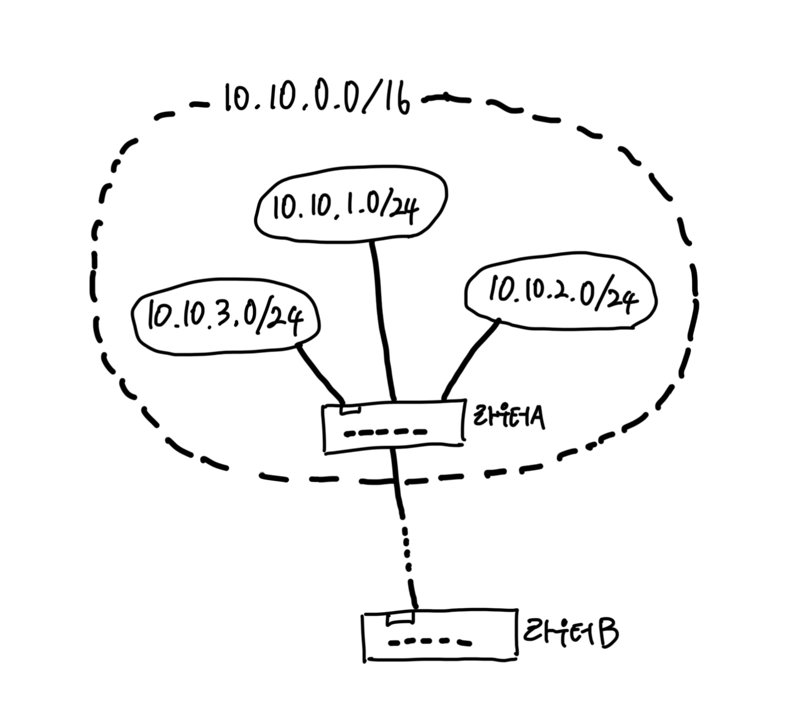

# Chapter 03 케이블의 앞은 LAN 기기였다.

#### 부제: 허브와 스위치, 라우터의 탐험

- 클라이언트 PC는 가정이나 회사의 LAN을 경유하거나 단독으로 인터넷에 접속할 수 있다.
    - 클라이언트 PC가 가정이나 회사의 LAN에 접속하고 앞부분이 ADSL이나 광섬유(FTTH) 등의 광대역 회선에 의해 인터넷에 접속된다는 최신의 대표적인 상황을 가정하여
      탐험한다.
    - 이 경우 LAN 어댑터가 송신한 패킷은 스위칭 허브 등을 경유하여 인터넷 접속용 라우터에 도착한다.
    - 라우터의 앞부분은 이미 인터넷이므로 여기에서부터 앞부분은 통신사(프로바이더, provider)가 패킷을 상대에게 운반한다.

## 1. 케이블과 리피터, 허브 속을 신호가 흘러간다

### 1-1. 하나하나의 패킷이 독립된 것으로 동작한다.

- 컴퓨터에서 송신된 패킷은 허브나 라우터라는 중계 장치에 의해 중계되어 목적지를 향해 진행한다.
    - 패킷의 헤더에 기록된 제어 정보와 중계 장치의 내부에 있는 중계 대상을 등록한 표로 목적지를 판단하고 목적지에 가까워지도록 하여 패킷을 중계하는 형태다.
    - 중계 동작을 할 때 우편배달부가 편지의 내용을 보지 않고 배달하는 것처럼 중계 장치는 데이터 부분을 보지 않고 패킷을 중계한다.
- 내용을 보지 않으므로 거기에 쓰여있는 애플리케이션의 데이터나 TCP 프로토콜의 제어 정보의 내용이 패킷을 운반하는 동작에 영향을 주지 않는다.
    - 즉 HTTP의 메시지, TCP의 수신 확인이나 시퀀스 번호, 클라이언트와 서버라는 관계는 모두 무시된다.
    - 따라서 모든 패킷은 아무 관련도 없는 별개의 것으로 간주하고 목적지를 향해 중계된다.
- 클라이언트 PC가 LAN에 접속해 있는 것을 가정한다.
    - PC가 송신한 패킷이 리피터 허브, 스위칭 허브, 라우터를 경유하여 인터넷에 나가는 것으로 간주한다.
    - 가정에서는 리피터 허브나 스위칭 허브가 내장된 라우터를 사용하는 경우가 많고 단일 기능의 여러 기기를 연결해서 사용하는 경우가 적을 것이다.
    - 그러나 단일 기능의 기기가 이해하기 쉬우므로 단일 기능의 기기를 알면 여러 기능을 내장한 복합적인 기기도 이해할 수 있다.

### 1-2. LAN 케이블은 신호를 약화시키지 않는 것이 핵심이다

- LAN 어댑터의 PHY(MAU) 회로에서 전기 신호로 형태를 바꾼 패킷은 RJ-45 커넥터를 통해 `트위스트 페어 케이블(꼰 선쌍)`에 들어가는데, 이 부분을 확대한 것이 아래
  그림이다.
    - 이더넷의 신호의 실체는 플러스와 마이너스의 전압이므로 LAN 어댑터의 `PHY(MAU)` 회로의 플러스와 마이너스 신호 단자에서 신호가 나온다고 생각하면 된다.
    - LAN 어댑터의 `PHY(MAU)` 회로는 RJ-45 커넥터에 직접 결선되어 있으므로 커넥터의 1번 핀과 2번 핀에서 케이블로 신호가 흘러나간다.
    - 그 후 신호는 케이블 속을 흘러 리피터 허브의 커넥터 부분에 도착하고, 이 부분은 단순히 전기 신호가 케이블을 통해 전달되는 것이다.

- 그림에 대한 설명

1. PHY(MAU)는 LAN 어댑터나 허브의 것과 기본적으로 같다.
2. 플러스와 마이너스의 한조로 신호 전달
3. LAN 어댑터 값은 직접 결선(MDI)
4. 신호선에는 색이 표시되어 있으며, EIA-568B라는 사양으로 다음과 같이 결선하도록 결정되어 있다.
    - 1 - 하양/주황
    - 2 - 주황
    - 3 - 하양/초록
    - 4 - 하양/파랑
    - 5 - 파랑
    - 6 - 초록
    - 7 - 하양/갈색
    - 8 - 갈색
5. 신호선은 2개가 1조로 꼬여있다.
6. 신호선의 배치는 양끝 모두 같다.
7. 컴퓨터를 접속하는 포트, 신호선을 교차시켜 결선(MDI-X)
8. 다른 허브와 접속하는 경우의 포트. '애플링크(AppleLink)용' 또는 '캐스케이드 접속용'이라고 한다. 이곳은 LAN 어댑터와 마찬가지로 MAU가 직접 접속되어 있다.(
   MDI) 이렇게 해서 다른 허브와 접속했을 때 양쪽의 송신과 수신이 연결된다.
9. 입력 신호를 수신 포트 이외의 모든 포트에 출력하는 것이 리피터 회로의 역할이다. 복수의 포트에서 동시에 신호가 들어오면 복수의 신호가 혼합된 신호를 모든 포트에 출력하기
   때문에 패킷이 충돌하는 것이다.

 

#### 송출한 신호는 그대로의 모습으로 허브에 도착하는 것이 아니라 허브에 도착할 때 신호가 약해져 있다.

- 케이블을 통과하는 사이에 신호의 에너지가 조금씩 떨어지므로 게이블의 길이가 길어질수록 신호가 약해진다.
- 신호는 단지 약해지기만 하는 것이 아니다.
    - 이더넷은 사각형의 각진 신호를 사용하지만 이 각이 뭉개져서 둥글게 된다.
    - 이 현상은 주파수가 높을수록 에너지가 떨어지는 비율이 높다는 전기 신호의 성질과 관계가 있다.
    - 신호의 각진 부분은 전압이 급격히 변화하는데, 이것은 해당 부분의 주파수가 높다는 의미다.
    - 주파수가 높은 신호는 약해지므로 급격한 변화가 없어져서 각이 뭉개지는 것이다.
- 잡음이 없고 조건이 좋은 경우에도 신호가 도착할 때는 이와 같이 변형되는데, 이것에 잡음의 영향까지 더해지면 매우 심각하게 변형된다.
    - 약해진 신호가 더욱 변형되므로 0과 1을 잘못 판독할 수 있는데, 이것이 통신 오류의 원인이 된다.

### 1-3. '꼼'은 잡음을 방지하기 위한 방법이다

- `트위스트 페어 케이블(꼰 선쌍)`에는 이러한 잡음의 영향을 억제하는 대책이 마련되어 있는데, 이것이 '꼼'이다.
    - 신호선을 마구 꼬아서 잡음을 막을 수 있다.
- 잡음이 생기는 원리
    - 잡음의 원인은 케이블 주위에서 발생하는 전자파다.
    - 신호와 잡음의 전류가 뒤섞여서 신호의 파형이 변형되는데, 이것이 잡음의 정체다.
- 케이블에 영향을 주는 전자파는 두 종류로 나눌 수 있다.
    1. 모터, 형광등, CRT 모니터와 같은 기기에서 누설되는 전자파 => 선을 '꼼'으로써 막을 수 있다.
    2. 케이블 안의 인접한 신호선에서 누설되는 전자파. 이러한 잡음의 영향을 `크로스토크 crosstalk`라고 한다. => 이것을 막는 대책도 신호선을 마주 꼬는 것이다.
- 꼬는 간격을 미묘하게 변화시키면 어떤 부분에서는 플러스 신호가 가까이에 있고, 다른 부분에서는 마이너스 신호선이 가까워진다.
    - 그러면 플러스와 마이너스에서는 잡음의 영향이 반대가 되므로 플러스와 마이너스의 균형이 잡히면서 잡음의 영향이 줄어든다.
- 신호선을 마주 꼬면 케이블의 성능이 향상되지만 성능 향상의 대책이 이것만 있는 것은 아니다.
    - 금속성의 실드(`차폐, shield`)라는 피복을 입히는 등의 대책도 있다.

### 1-4. 리피터 허브는 연결되어 있는 전체 케이블에 신호를 송신한다

- 신호가 리피터 허브에 도달하면 LAN 전체에 신호가 흩어진다.
    - 이더넷의 기본이라는 원리. 전체에 패킷의 신호를 뿌리고 수신처 MAC 주소에 해당하는 기기만 패킷을 수신한다는 원리를 그대로 실현한 것이 리피터 허브다.
- 리피터 허브의 내부
    - 각 커넥터의 안쪽에는 LAN 어댑터의 내부에 있는 PHY(MAU) 회로와 역할이 같은 회로가 있다.
    - LAN 어댑터측과 같이 RJ-45 커넥터에 직접 접속하면 신호를 제대로 수신할 수 없다.
    - 제대로 수신하려면 '송신 단자'에서 보낸 신호를 '수신 단자'로 받도록 해야 한다.
    - 허브 안의 PHY(MAU) 회로와 커넥터 사이의 신호선을 교차시켜서 접속하는 것이 이 때문이다. 한쪽의 송신이 상대의 수신에 연결되어 신호를 제대로 송/수신할 수 있게
      된다.
- 리피터 허브에서 끝의 커넥터에는 `MDI/MDI-X`와 같이 쓰여있는 전환 스위치가 붙어있는데, 이를 통해 의미를 알 수 있을 것이다.
    - `MDI`는 RJ-45 커넥터와 신호 송/수신 회로를 직접 결선한 것이다.
    - `MDI-X`는 교차하여 결선하는 것을 나타낸다.
- 허브와 커넥터 부분은 보통 MDI-X이다.
    - 허브의 커넥터 부분은 보통 MDI-X이므로 허브끼리 접속할 때는 한쪽을 MDI로 설정해야 한다.
    - 만약 MDI로 전환하는 스위치가 없고 모든 커넥터가 MDI-X인 경우에는 `크로스 케이블`로 허브들을 접속한다.
    - 크로스 케이블은 송신과 수신 단자가 바뀌어 들어오도록 신호선을 접속한 케이블이다.
- 리퍼터 허브에서 `PHY(MAU)` 회로의 수신부에 도달한 신호는 여기부터 `리피터 회로`에 들어간다.
    - 리피터 회로의 기본은 들어오는 신호를 리피터 허브의 커넥터 부분에 뿌리는 데 있다.
    - 여기에서 신호의 파형을 다듬고 오류를 억제하도록 연구한 제품도 있지만, 기본은 들어온 신호를 그대로 커넥터 부분에 송출하는 것이다.
    - 따라서 잡음의 영향을 받아 변형되고, 데이터가 변화한 것 같은 신호라도 그대로 흘려버린다.

 

## 2. 스위칭 허브의 패킷 중계 동작

### 2-1. 스위칭 허브는 주소 테이블로 중계한다

- 아래는 패킷이 스위칭 허브를 경우하여 흘러갈 때의 동작이다.
    - 스위칭 허브는 이더넷의 패킷을 그대로 목적지를 향해 중계하도록 만들어져 있다.
- 먼저 신호가 커넥터 부분에 도달하여 PHY(MAU) 회로에서 수신되는 부분까지는 리피터 허브와 동일하다.
    - 커넥터와 PHY(MAU) 회로는 MDI-X로 접속되어 있고, 트위스트 페어 케이블에서 신호가 들어오면 이것이 PHY(MAU) 회로의 수신 부분에 들어간다.
- PHY(MAU) 회로에서 케이블을 흐르는 신호의 형식부터 공통의 신호 형식으로 변환한 후 신호는 MAC 회로로 들어간다.
    - 여기에서 디지털 데이터로 변환한 후 패킷의 맨 끝에 있는 FCS를 대조하여 오류의 유무를 검사하고, 문제가 없으면 버퍼 메모리에 저장한다.
    - 이 부분은 LAN 어댑터와 거의 같으므로 각 스위칭 허브의 커넥터 안쪽에는 LAN 어댑터와 같은 회로가 있다고 생각하면 좋을 것이다.
- 커넥터 안쪽에 있는 회로 부분을 `포트`라고 부르므로 스위칭 허브의 각 포트는 PC의 LAN 어댁터와 거의 같습니다.
    - 그러나 LAN 어댑터와 다른 부분이 있다. LAN 어댑터에는 MAC 주소가 할당되어 있어서 수신한 패킷의 수신처 MAC 주소가 자신에게 해당하지 않는 경우에는 패킷을
      폐기한다.
    - 반면 스위칭 허브의 포트는 수신처 MAC 주소를 검사하지 않고 모든 패킷을 수신하여 버퍼 메모리에 저장하기 때문에 스위칭 허브의 포트에는 LAN 어댑터와 달리 MAC
      주소가 할당되어 있지 않다.
- 패킷을 버퍼 메모리에 저장하면 다음에 수신처 MAC 주소와 일치하는 것이 MAC 주소표에 등록되어 있는지 조사한다.
    - MAC 주소표에는 기기의 MAC 주소와 그 기기가 어느 포트에 존재하는지에 대한 정보가 등록되어 있다. 아래 주소표와 같이 MAC 주소와 포트가 짝을 이루고 있다.
    - 이것을 사용하여 수신한 패킷을 어느 포트에서 송신하면 좋을지를 판단한다. 예를 들어 수신한 패킷의 수신처 MAC 주소가 '00-02-B3-1C-9C-F9'라면 표의 세
      번째 행에 등록된 주소와 일치하므로 포트 항목에 쓰여있듯이 주소는 9번 포트에 있다는 것을 알 수 있다.
    - 이 사실을 알았다면 `스위치 회로`를 경유하여 패킷을 송신측의 포트에 보냈는데, 이 예의 경우 8번 포트가 송신측 포트가 된다.

#### 그림에 대한 설명1 - MAC 주소표

- 스위치의 내부에는 MAC 주소와 포트 번호를 등록한 테이블이 있다.
- 여기에는 패킷을 수신할 때 수신 포트와 송신처 주소가 함께 등록된다.
- 이를 통해 이 주소가 어느 포트에 접속되어 있는지 판단할 수 있다. 패킷을 중계할 때는 이 정보로부터 어디에 패킷을 송신해야 할지 판단한다.

|      MAC 주소       | 포트  | 제어 정보 |
|:-----------------:|:---:|:-----:|
| 00-60-97-A5-43-3C |  2  |  ...  |
| 00-00-C0-16-AE-FD |  7  |  ...  |
| 00-02-B3-1C-9C-F9 |  8  |  ...  |
|        ...        | ... |  ...  |

#### 그림에 대한 설명2 - 번호에 대한 설명

1. 동작 원리에서 보면 스위칭 허브의 포트는 LAN 어댑터와 거의 비슷한다. 실제로는 이 그림과 같이 각 포트마다 별도로 MAU, LANC, 메모리가 존재하는 것이 아니라 복수의
   포트를 동시에 제어하는 스위치로 구성된 것이 일반적이다.
2. 패킷을 중계하는 핵심 부분이다. 이 부분의 구성은 제품에 따라 다르며 스위치 회로가 아니라 고속 신호선(버스)으로 구성한 것, 공유 메모리로 구성한 것 등이 있다.
3. 복수의 패킷 중계 동작을 동시에 실행할 수 있다.

 

#### 스위치 회로의 구조

- 스위치 회로는 전자 회로로 만든 것으로, 이를 통해 입력 포트와 출력 포트를 연결할 수 있다.
    - 여기에는 신호선이 격자 모양으로 배치되고, 교점에 스위치가 있다.
    - 이 스위치는 전자적으로 개폐를 제어할 수 있고, 이 전자적 개폐를 통해 신호가 흐르는 대상을 제어한다.
    - 입력측은 수신측 포트에, 출력측은 송신측 포트에 각각 접속되어 있다.
- 포트 사이에 패킷을 운반할 때는 이 회로의 패킷의 신호를 흘린다.
    - 예를 들어 2번 포트에서 7번 포트로 패킷을 운반하려면 신호는 입력측의 2번에서 들어올 것이다.
    - 이때 이 선의 가로로 나열된 스위치의 왼쪽에서 6개까지의 스위치는 가로 방향으로, 일곱 번째의 스위치는 세로 방향으로 전환한다.
    - 그러면 신호는 출력측의 7번으로 흘러가고, 그 앞의 7번 포트에 패킷이 도착한다. 신호의 교점에 있는 스위치는 각각 독립하여 움직이므로 신호가 중복되지 않으면 복수의
      신호를 동시에 흘릴 수도 있다.
- 이 스위치 회로를 경유하여 송신측의 포트에 패킷을 운반하면 MAC 회로나 PHY(MAU) 회로가 송신 동작을 실행하고 케이블에 신호가 흘러간다.
    - 이때 송신 동작도 LAN 어댑터의 송신 동작과 같다. 이더넷의 규칙에 따라 먼저 아무도 송신중이지 않다는 것을 확인한다.
    - 즉 신호 송/수신 회로의 수신 부분에 신호가 흘러들어오지 않는 것을 확인한다. 누군가가 송신 중이면 그것이 끝날 때까지 기다린다. 그리고 송신 동작이 끝나거나 아무도
      송신하지 않으면 소켓을 디지털 데이터에서 신호로 변환하여 송신한다.
    - 송신 동작을 하고 있는 사이에 수신 신호를 감시하는 부분도 LAN 어댑터와 같다. 송신 동작 중에 다른 기기가 보낸 신호가 수신측에 들어오면 패킷이
      충돌하므로 `재밍 신호`를 보낸 후 송신 동작을 중지하고 잠시 기다렸다가 다시 보내는데, 이것도 LAN 어댑터와 같다.

### 2-2. MAC 주소 테이블을 등록 및 갱신한다

- 스위칭 허브는 패킷을 중계할 때 MAC 주소표의 내용을 갱신하는 동작도 실행한다. 갱신의 동작은 두 종류가 있다.
    1. 패킷을 수신했을 때 송신처 MAC 주소를 조사하고, 이것을 수신한 입력 포트 번호와 하나의 세트로 MAC 주소표에 등록하는 것이다.
    2. 일정 시간이 경과하면 MAC 주소표에 등록된 정보를 삭제한다.
- MAC 주소표의 내용은 스위칭 허브 자체가 스스로 등록하거나 삭제하므로 수동으로 등록 및 삭제할 필요가 없다.
    - MAC 주소표의 내용이 이상해진 경우에도 기기를 리셋하여 MAC 주소표의 내용을 전부 지워버리면 이때부터 새롭게 주소가 등록되므로 수동 갱신할 필요가 없다.

### 2-3. 예외적인 동작

#### 포트 번호가 같은 경우

- 스위칭 허브는 패킷을 수신한 포트와 송신하는 포트가 같을 경우 패킷을 중계하지 않고 폐기한다.

#### 일치하는 MAC 주소가 없을 경우

- MAC 주소표와 수신처 MAC 주소와 일치하는 주소가 등록되어 있지 않은 경우도 있다.
    1. 주소의 기기에서 패킷이 한 번도 스위칭 허브에 도착하지 않은 경우
    2. 시간이 경과하여 MAC 주소표에서 삭제된 경우
- 패킷을 수신한 포트 이외의 전체 포트에서 패킷을 송신한다. 수신처 MAC 주소의 기기는 어딘가에 존재할 것이므로 이 방법을 통해 패킷이 도착한다.
    - 기기가 존재하지 않는 포트에도 송신되지만 이 때문에 문제가 생기지는 않는다. => 무시되기 때문에
    - 패킷을 보내면 무언가의 응답이 돌아오고 그 때 주소표에 등록되므로 두 번째 이후는 네트워크 전체에 패킷을 보내지 않게 된다.
- LAN에는 1초에 수천 개 이상의 패킷을 흘려보내는 능력이 있으므로 패킷이 한두 개 증가해도 큰 문제가 되지 않는다.
- 또한 수신처의 MAC 주소가 `브로드캐스트 주소`인 경우에도 수신 포트를 제외하고 모든 포트에서 패킷을 송신한다.

> #### 브로드캐스트 주소
> - 주소를 수신처 주소로 지정하여 패킷을 보내면 네트워크에 접속된 모든 기기에 패킷이 도착한다는 특별한 주소다.
> - LAN에 사용하는 MAC 주소는 FF:FF:FF:FF:FF:FF가 되고 IP 주소는 255.255.255.255가 브로드캐스트 주소가 된다.

### 2-4. 전이중 모드에서 송신과 수신을 동시에 실행한다.

- `전이중 모드` 즉 송신과 수신을 동시에 실행할 수 있는 성질도 리피터 허브에 없는 스위칭 허브의 특징이다.
    - 리피터 허브의 경우 여러 대의 컴퓨터가 동시에 송신 동작을 개시하면 리피터 허브의 내부에서 신호가 뒤섞여서 신호가 파괴된다.
- 리피터 허브를 사용하면 PHY(MAU)에서 충돌 검사를 하기 때문에 신호가 충돌하지 않는 셈이 된다.
- 충돌이 일어나지 않으면 반이중 모드의 충돌 방지 대책을 마련할 필요가 없다.
    - 즉 송신과 수신을 동시에 실행해도 상관없다.
    - 그러나 이더넷에 신호가 흐르고 있을 때는 이것이 끝나기를 기다렸다가 송신 동작을 실행하므로 그대로는 송신과 수신을 동시에 실행할 수 없다.
    - 그래서 이더넷의 규칙을 개정하여 신호가 흐르고 있어도 상관하지 않고 송신해도 좋다는 동작 모드를 새로 추가했다.
    - 동시에 이 동작 모드로 동작할 때는 신호의 충돌을 검출하는 회로를 무효롸하기로 했는데 이것이 '전이중'이라는 동작 모드이다.
- 전이중 모드는 송신할 때 신호가 흐르고 있어도 이것이 끝나기를 기다릴 필요가 없으므로 그만큼 반이중 모드보다 빠르게 동작한다.
    - 양방향으로 동시에 송신할 수 있으므로 송신할 수 있는 데이터 양의 상한선도 높아서 성능이 좋다.

### 2-5. 최적의 전송 속도로 보내는 자동 조정

- 전이중 모드와 반이중 모드를 전환할 필요가 생겼다.
    - 전이중 모드가 등장한 후 한동안 수동으로 동작 모드를 전환했지만 불편하므로 나중에 동작 모드를 자동으로 전환하는 기능이 나왔다.
    - 접속한 상대가 전이중 모드를 지원하는지 검출하고 동작 모드를 자동으로 전환하는 기능이다.
    - 이 기능을 `자동 조정 auto negotiation`이라고 한다.
- 이더넷은 데이터가 흐르고 있지 않을 때는 `링크 펄스`라는 펄스형의 신호를 흘린다.
    - 올바르게 동작하는지, 케이블이 단선되지 않았는지 등의 사항 확인
- 두 기기의 전원을 켜고 하드웨어의 초기화 동작이 끝나면 자체에서 지원하는 속도와 동작 모드를 펄스 신호로 보내기 시작한다.
    - 그러면 신호가 상대에게 도착하며, 도착한 펄스의 패턴을 읽고 상대가 어느 모드를 지원하는지 조사한다.
    - 모드에는 우선 순위가 결정되어 있고 우선 순위가 높은 것부터 차례대로 조사하면서 자신과 상대 모두가 지원하는 것을 찾는다.

### 2-6. 스위칭 허브는 복수의 중계 동작을 동시에 실행한다

- 스위칭 허브는 수신처 MAC 주소의 기기가 존재하는 포트 이외에는 송신 동작을 실행하지 않으므로 다른 포트는 빈 상태가 된다.
    - 여기에서 별도의 패킷을 흘릴 수 있으며, 이렇게 해서 동시에 여러 개의 패킷을 중계할 수 있다.
- 리피터 허브 쪽은 들어온 신호를 모든 포트에서 뿌리므로 동시에 두 개 이상의 신호가 들어오면 패킷이 충돌하기 때문에 복수의 신호를 동시에 흘릴 수 없다.
- 따라서 기기 전체에서 중계할 수 있는 패킷의 수는 스위칭 허브쪽이 리피터 허브쪽보다 많다.

 

## 3. 라우터의 패킷 중계 동작

### 3-1. 라우터의 기본

- 리피터 허브나 스위칭 허브를 경유한 패킷은 결국 라우터에 도착하고, 라우터에서 다음 라우터로 중계될 것이다.
    - 이러한 중계의 원리는 스위칭 허브와 비슷하다. 중계 대상을 등록한 표를 보고 패킷을 어디로 중계해야 할지 판단하는 부분이 공통이기 때문이다.
    - 구체적인 동작은 다름 => 라우터의 바탕이 되는 IP라는 개념이 스위칭 허브의 바탕이 되는 이더넷과 다르기 때문

#### 그림에 대한 설명

1. `포트 부분`. 이곳은 ADSL을 지원하는 것, FTTH를 지원하는 것, 전용선 등의 통신 회선을 지원하는 것 등 기종에 따라 다양하다.
2. 라우팅 테이블에 등록된 정보에 의해 중계 대상을 판단하여 패킷을 중계한다.
3. 이더넷의 포트는 PC의 LAN 어댑터와 거의 같다. 즉 RJ-45 커넥터, MAU(PHY), MAC, 메모리가 있다. 커넥터와 MAU(PHY)의 접속도 LAN 어댑터와 같이
   MDI로 설정하는 것이 보통이다.

- 위 그림은 라우터의 내부 구조를 상당히 간략화한 것이다.
    - **중계 부분**과 **포트 부분**이라는 두 부분으로 구성된 것을 알면 충분
    - 중계 부분: 패킷의 중계 대상을 판단하는 동작 (= 프토토콜 스택의 IP 담당 부분)
    - 포트 부분: 패킷을 송/수신하는 동작을 담당 (= LAN 어댑터)
- 라우터의 포트 부분에 무선 LAN용 하드웨어를 장착한 기종이라면 무선 LAN도 지원할 수 있다.
    - LAN 이외의 통신 기술을 지원하는 것도 있다. `ADSL`이나 `FTTH` 등 이른바 '광대역 회선'이라고 부르는 것과 전용선 등의 통신 회선 등이 예시이다.
- 포트 부분에서 패킷을 수신하는데, 이 동작은 포트 부분의 통신 기술의 규칙을 따른다.
    - 포트 부분이 이더넷이라면 이더넷의 규칙을, 무선 LAN이라면 무선 LAN의 규칙대로 동작.
- 포트 부분의 하드웨어에 의뢰하여 패킷을 수신.
    - 중계 부분에서 받은 패킷의 IP 패킷에 기록되어 있는 수신처 IP 주소와 중계 대상을 등록한 표를 대조하여 중계 대상을 판단한다.
    - 그리고 중계 대상측의 포트로 패킷을 옮기고 포트 부분의 하드웨어 규칙에 따라 패킷 송신 동작을 실행한다. (중계 부분이 포트 부분에 의뢰)

> 라우터의 각 포트에는 MAC 주소와 IP 주소가 할당되어 있다.

### 3-2. 경로표에 등록된 정보

- 테이블을 사용해 중계 대상을 조사한다는 개념은 비슷하지만, 구체적인 동작은 스위칭 허브가 다르다.
    - 스위칭 허브: MAC 헤더에 기록되어 있는 수신처 MAC 주소로 중계 대상 판단
    - 라우터: IP 헤더에 기재되어 있는 수신처 IP 주소로 중계 대상을 판단
- 취급하는 주소가 다르므로 중계 대상의 주소를 등록하는 테이블의 내용도 다르다.

> 라우터는 IP 주소로 중계 대상을 판단한다.

- 라우터의 테이블은 `라우팅 테이블 routing table` 또는 `경로표`라고 부르며 아래와 같은 정보를 등록한다.

| 수신처(Destination) |  넷마스크(Netmask)  | 게이트웨이(Gateway) | 인터페이스(Interface) | 매트릭(Metric |
|:----------------:|:---------------:|:--------------:|:----------------:|:----------:|
|    10.10.1.0     |  255.255.255.0  |     ------     |        e2        |     1      |
|   10.10.1.101    | 255.255.255.255 |     ------     |        e2        |     1      |
|   192.168.1.0    |  255.255.255.0  |     ------     |        e3        |     1      |
|   192.168.1.10   | 255.255.255.255 |     ------     |        e3        |     1      |
|     0.0.0.0      |     0.0.0.0     |   192.0.2.1    |        e1        |     1      |

- 라우터는 이 항목에 등록되어 있는 IP 주소와 수신한 패킷의 수신처 IP 주소를 비교하여 그 행이 해당하는지 판단한다.
- 단 스위칭 허브와 같이 두 가지 모두 완전히 일치하는지 조사하는 것이 아니라 호스트 번호 부분을 무시하고 네트워크 번호의 부분만 조사한다.
- 주소 비교 동작을 실행할 때 네트워크 번호의 비트 수를 판단해야 하므로 경로표에는 `넷마스크` 항목도 마련되어 있다.
- '수신처' 항목에는 서브넷을 나타내는 IP 주소가 등록되어 있는 경우도 있지만, 그렇지 않은 경우도 잇다.
    - 또한 실제로 서브넷에 할당된 넷마스크의 값과 경로표에 등록된 넷마스크의 값이 다를 수도 있다.
- `주소 집약`이라는 개념을 이용하면 몇 개의 서브넷을 모아서 한 개의 서브넷으로 간주한 후 묶은 서브넷 경로표에 등록할 수 있다.
    - 아래와 같이 3개의 서브넷이 있고, 이 서브넷에 라우터B에서 패킷을 건네준다고 가정해보자. 이때 라우터B의 경로표에 3개의 서브넷을 별도로 등록하는 것이 원칙이다.
    - 어느 서브넷에 패킷을 건네줄 때 라우터A에 패킷을 중계하는 것으로 바뀌지 않으므로 3개의 서브넷을 일괄적으로 통합한 10.10.0.0/16이라는 서브넷이 있는 것으로
      간주한다.
    - 또 통합한 서브넷을 경로표에 등록해도 패킷의 중계 동작을 정확하게 실행할 수 있다. 이렇게 하여 경로표에 등록하는 건수를 줄일 수 있는데 이것이 `주소 집약`의
      개념이다.
    - '수신처'에 집약한 주소를 등록한다.

- 이것과 반대로 한 개의 서브넷을 세분화하여 경로표에 등록하고 복수의 서브넷이 있는 것처럼 보이는 경우도 있다.
- 또한 '수신처' 항목에 등록된 주소가 실제 서브넷에 할당한 네트워크 번호와 다른 경우도 있다. 그러나 라우터는 제대로 동작하므로 걱정할 필요가 없다.
- 이 방법을 사용한다면 호스트 번호 부분에 값이 들어있는 개별 컴퓨터를 나타내는 '수신처' 항목에 등록할 수 있다.
    - 넷마스크 값을 255.255.255.255, 즉 32비트를 전투 1로 만들면 된다.
    - 이렇게 하면 호스트 번호 부분의 비트 값을 전부 0으로 한 서브넷을 나타내는 주소와 호스트 번호 부분에 값이 들어있는 개별 컴퓨터를 나타내는 주소를 같은 방법으로 취급할
      수 있다.

> 라우터의 경료표에서 '넷마스크' 항목은 경로표의 수신처와 패킷의 수신처 주소를 대조할 때 비트 수를 나타낸다.

- '게이트웨이' 항목과 '인터페이스' 항목은 패킷의 중계 대상을 나타낸다.
    - '수신처' 항목과 '넷마스크' 항목에서 해당 행을 찾아내면 '인터페이스' 항목에 등록되어 있는 인터페이스(포트)에서 '게이트웨이' 항목에 등록되어 있는 IP 주소를 가진
      라우터에 대해 패킷을 중계한다.
- 마지막으로 `매트릭`은 수신처 IP 주소에 기록되어 있는 목적지가 가까운지, 먼지를 나타낸다.
    - 여기에 등록되어 있는 수가 작으면 목적지가 가까이에 있고, 이 수가 크면 먼 것을 나타낸다.
    - 또한 이 경로표에 경로 정보를 등록하는 원리도 라우터와 스위칭 허브에서 서로 다르다.

|    구분    |                   스위칭 허브                   |                                                                                 라우터                                                                                  |
|:--------:|:------------------------------------------:|:--------------------------------------------------------------------------------------------------------------------------------------------------------------------:|
|    기반    |                   이더넷 기반                   |                                                                                IP 기반                                                                                 |
| 중계 대상 판단 |    MAC 헤더에 기록되어 있는 수신처 MAC 주소로 중계 대상 판단    |                                                                 IP 헤더에 기재되어 있는 수신처 IP 주소로 중계 대상을 판단                                                                  |
|  경로표 저장  | 패킷 중계 동작의 일환으로 MAC 주소 테이블에 정보를 등록하는 동작을 실행 | 경로정보를 저장하거나 갱신하는 동작은 패킷을 중계하는 동작과 분리. 패킷을 중계할 때 경로표의 내용에 손대지 않는다는 의미. (a) 사람이 수동으로 경로 정보를 등록/갱신 (b)라우팅 프로토콜이라는 구조를 사용하여 라우터들끼리 경로 정보를 교환하고 라우터가 자체에서 경로표에 등록 |

### 3-3. 라우터의 패킷 수신 동작

- 이더넷의 포트 부분의 구조는 PC의 LAN 어댑터와 거의 같으므로 패킷을 수신하여 버퍼 메모리에 저장하는 부분까지의 동작도 LAN 어댑터와 거의 같다.
- 먼저 신호가 커넥터 부분에 도착하면 안쪽에 있는 PHY(MAU) 회로와 MAC 회로에서 신호를 디지털 데이터로 변환한다.
  - 그리고 패킷 끝부분의 FCS를 대조하여 오류의 유무를 점검하고, 정상이면 MAC 헤더의 수신처 MAC 주소가 자신에게 해당하는지 조사하여 해당하면 패킷을 수신 버퍼 메모리에 저장한다.
  - 수신처 MAC 주소에 자신이 해당하지 않을 경우에는 패킷을 폐기한다.

### 3-4. 경로표를 검색하여 출력 포트를 발견한다

- 라우터는 패킷 수신 동작이 끝나면 맨 앞의 MAC 헤더를 폐기한다. MAC 헤더의 역할은 이 라우터에 패킷을 전달하는 것이다.
  - 그러므로 패킷을 수신하면 역할이 끝나기 때문에 MAC 헤더를 폐기하는 것이다.

> 라우터에서 중계하는 패킷의 수신처 MAC 주소에는 라우터의 포트에 할당된 MAC 주소가 기록되어 있다.

- MAC 헤더 뒤에 있는 IP 헤더의 내용을 보고 패킷 중계 동작에 들어간다. (1010.1.101인 PC가 192.168.1.10이라는 서버에 보낸 패킷이 라우터에 들어온 예시)
1. 경로표에서 중계 대상을 조사한다. 
   - 수신한 패킷의 IP 주소와 경로표의 '수신처' 항목을 조사하여 해당하는 행을 찾는다. 
   - '넷마스크' 항목에 등록된 값에서 네트워크 번호의 비트 수를 판단하여 네트워크 번호 부분만 비교한다.
   - 예를 들어 3행을 조사한다면 '넷마스크' 항목은 255.255.255.0이므로 '수신처' 항목의 왼쪽에서 24비트 부분만 조사한다.
2. 복수의 후보가 발견되면 네트워크 번호의 비트 수가 가장 긴 것을 찾는다.
  - 3행은 192.168.1.0/255.255.255.0 이라는 '서브넷'을 나타내며, 4행은 서브넷 안에 있는 192.168.1.10/255.255.255.255 라는 '서버'를 나타낸다.
  - 서버가 속한 서브넷을 나타내는 주소보다 서버 자체를 나타내는 주소 쪽이 범위가 축소되므로 4행을 선택할 것이다.
  - 이렇게 해서 후보가 1개만 남으면 이것을 중계 대상으로 삼는다.
3. 네트워크 번호의 길이가 같은 것이 여러 행 존재하는 경우 메트릭 값으로 판단한다. 작은 쪽을 중계 대상으로 삼는다.
4. 만약 행이 한 개도 발견되지 않는다면 라우터는 패킷을 폐기하고, `ICMP` 메시지로 송신처에 이 사실을 통지한다.
  - 스위칭 허브와 다른 특성. 스위칭 허브는 많아야 수천 대 정도의 그다지 크지 않은 네트워크를 가정하여 만든 것이다. 모든 포트에 패킷을 뿌린다는 거친 방법으로도 문제가 되지 않는다.
  - 한편 라우터가 가정하는 네트워크는 헤아릴 수 없이 크다. 모두가 중계 대상을 모르는 패킷을 뿌린다면 대량의 패킷이 뿌려지기 때문에 네트워크가 혼잡해진다. 그러므로 라우터는 중계 대상이 분명하지 않은 패킷을 폐기하는 것이다.

| 수신처(Destination) |  넷마스크(Netmask)  | 게이트웨이(Gateway) | 인터페이스(Interface) | 매트릭(Metric |
|:----------------:|:---------------:|:--------------:|:----------------:|:----------:|
|    10.10.1.0     |  255.255.255.0  |     ------     |        e2        |     1      |
|   10.10.1.101    | 255.255.255.255 |     ------     |        e2        |     1      |
|   192.168.1.0    |  255.255.255.0  |     ------     |        e3        |     1      |
|   192.168.1.10   | 255.255.255.255 |     ------     |        e3        |     1      |
|     0.0.0.0      |     0.0.0.0     |   192.0.2.1    |        e1        |     1      |

### 3-5. 해당하는 경로가 없는 경우에 선택하는 기본 경로

- 위와 같은 경우는 라우터에 중계 대상을 전부 등록해야 한다.
- 이때는 위의 표에서 경로표의 마지막 1행이 중계 대상을 전부 등록한 것과 같은 역할을 한다. (0.0.0.0)
- 0.0.0.0이라는 것은 패킷의 수신처 IP 주소와 경로표의 '수신처' 항목을 비교할 때 비트 수가 0이라는 것이므로 비교 동작을 실행하지 않아도 된다.
- 이 행의 '게이트웨이' 항목에 인터넷으로 나가는 라우터를 등록해두면 다른 행에 해당하는 것이 없는 경우에는 패킷을 그곳으로 중계한다.
  - 이 행을 `기본 경로`라고 하며, 여기에 등록한 라우터를 `기본 게이트웨이`라고 한다.
  - PC의 TCP/IP 설정 화면에 있는 '기본 게이트웨이'라는 항목과 같은 의미이다.
  - PC에도 라우터와 같이 경로표가 있고, 기본 게이트웨이에 입력한 값이 경로표의 기본 게이트웨이로 등록된 것이다.

> 라우터의 경로표에서 '넷마스크' 항목의 0.0.0.0인 행은 '기본 경로'를 나타낸다.

- 이렇게 해서 '수신처' 항목에 서브넷을 나타내는 IP 주소와 개별 컴퓨터를 나타내는 IP 주소가 뒤섞였어도 같은 방법으로 중계 대상을 검색할 수 있다.
  - 또한 중계 대상이 분명하지 않은 사태도 방지할 수 있다.

### 3-6. 패킷은 유효 기한이 있다

- 경로표에서 중계 대상을 찾아내면 패킷을 출력측의 포트로 옮기고 여기에서 송신하는데, 라우터에는 그 전에 몇가지 해야 할 일이 있다.
- 우선 `TLL(Time To Live, 생존 기간)`이라는 IP 헤더의 필드를 갱신하는 것이다.
  - 라우터를 경유할 때마다 이 값을 1씩 줄이다가 이 숫자가 0이 되면 패킷의 생존 기간이 만료되는 것으로 간주하여 패킷을 폐기한다.
  - 패킷이 같은 장소를 뱅글뱅글 순환하는 사태를 막기 위한 것이다. (경로표에 등록된 정보에 오류가 있거나 기기의 고장 등으로 우회로로 전환될 때 일시적으로 경로가 혼란에 빠지는 경우)
- 송신처가 처음 패킷을 송신할 때 64 또는 128이라는 값을 설정하고 나서 그 수만큼만 라우터를 경유하면 패킷이 수명을 다한 것으로 간주한다.
  - 현재의 인터넷은 지구의 반대편까지 액세스해도 경유하는 라우터 수가 많아야 수십 개 정도다

### 3-7. 큰 패킷은 조각 나누기 기능으로 분할한다

- 라우터의 포트 부분은 이더넷뿐만 아니라 이더넷 이외의 LAN이나 통신 회선의 경우도 있다.
  - 이 회선이나 LAN의 종류에 따라 패킷의 최대 길이가 달라지므로 출력 포트측의 패킷의 최대 길이가 입력측보다 작은 경우도 있다.
  - 패킷의 최대 길이는 같아도 여분으로 헤더를 부가해서 패킷의 실질적인 길이가 짧아지는 경우도 있다. (ADSL이나 FTTH 등 이른바 광대역 액세스 회선에서 `PPPoE` 프로토콜을 이용하는 경우)
  - 어느 경우든지 중계하는 패킷의 크기가 출력측의 패킷 최대 길이를 초과하면 그대로는 패킷을 송신할 수 없다.
- 이 경우에는 IP 프로토콜에 규정된 `조각 나누기(fragmentation)`라는 방법을 사용하여 패킷을 분할하고, 패킷의 길이를 짧게 만든 후 중계한다.
  - TCP가 데이터를 조각으로 분할하는 것과 다르다. TCP의 데이터 분할은 패킷에 데이터를 저장하기 전에 이뤄진다. 즉 분할한 데이터 조각을 한 개의 패킷에 저장한다. 이 패킷은 한 개이므로 IP 조각 나누기의 관점에서 보면 분할되어 있지 않은 셈이다.
  - 반면 조각 나누기쪽은 패킷이 만들어진 후에 패킷을 분할하는 것을 가리킨다.

- 조각 나누기의 동작은 아래와 같이 이뤄진다.
1. 출력 측의 MTU를 조사하여 중계하는 패킷을 그대로 출력 측에서 송신할 수 있는지 조사한다.
  - 패킷의 최대 길이는 포트의 종류에 따라 결정되므로 여기에서 헤더의 길이를 빼서 MTU를 산출하고 중계하는 패킷의 길이와 비교한다.
  - 출력측의 MTU가 충분히 커서 분할하지 않아도 송신할 수 있으면 분할하지 않는다.
  - 출력측의 MTU가 작은 경우에는 여기에 저장할 수 있는 크기로 패킷을 분할하는데, 그 전에 IP 헤더의 플래그 필드를 조사하여 분할해도 좋을지 확인한다.
2. 플래그 필드가 분할 불가로 되어 있으면 분할할 수 없으므로 패킷을 폐기하고 ICMP 메시지를 송신처에 통지한다.
   - 그렇지 않으면 출력측의 MTU에 맞춰 데이터 부분을 맨 앞부분부터 차례대로 잘라낸다. 이 때 TCP 헤더 이후의 부분을 분할 대상 데이터로 간주한다.
   - TCP 헤더는 사용자 데이터가 아니지만 IP 입장에서 보면 TCP에서 송신을 의뢰받은 부분이므로 데이터가 된다.
   - 그 데이터에 IP 헤더를 덧붙이는데, 기존 IP 헤더를 복사해 일부 필드를 고쳐쓴다.

### 3-8. 라우터의 송신 동작은 컴퓨터와 같다.

- 송신 전의 일이 끝나면 패킷의 송신 동작으로 넘어간다.
  - 동작은 출력측의 포트에 따라 다르다.
  - 이더넷: 이더넷의 규칙에 따라 패킷을 신호로 변환하여 송신
  - ADSL: ADSL의 규칙에 따라 신호를 변환하여 송신
  - 가정용 LAN: 라우터 쪽은 ADSL 등의 통신 회선을 경유하여 인터넷에 연결되어 있으므로 통신 회선의 규칙에 따라 패킷 송신 동작을 실행.
- 이더넷의 패킷 송신 동작은 이더넷의 규칙에 규정되어 있으므로 기종이 달라도 마찬가지이다.
  - 즉 패킷 송신 동작의 기본은 프로토콜 스택의 IP 담당 부분이 패킷을 보낼 때와 같다.
- 먼저 MAC 헤더의 맨 앞에 있는 수신처 MAC 주소 필드에 값을 설정하기 위해 경로표의 '게이트웨이' 항목에서 패킷을 건네줄 상대를 판단한다.
  - '게이트웨이' 항목에 IP 주소가 쓰여있으면 이 IP 주소가 건네줄 상대이고, 이를 통해 상대의 IP 주소가 결정되면 ARP로 IP 주소에서 MAC 주소를 조사하고, 결과를 수신처 MAC 주소로 설정한다.
  - 라우터에도 ARP 캐시가 있으므로 먼저 ARP 캐시를 찾아보고, 해당하는 것이 없으면 ARP로 조회를 보내 MAC 주소를 조회한다.
- 그 다음은 송신처 MAC 주소 필드인데, 이것은 출력측의 포트에 할당된 MAC 주소를 설정한다. 타입 필드에 0800(16진수)을 설정한다.
- 이렇게 송신 패킷이 만들어지면 이것을 전기 신호로 변환하여 포트에서 송신한다. (동작은 컴퓨터와 동일)
  - 반이중/전이중
- 출력측의 포트가 이더넷이면 송신한 패킷은 스위칭 허브를 경유하여 다음 라우터에 도달할 것이다.
  - 수신처 MAC 주소에 다음 라우터의 주소가 쓰여 있으므로 스위칭 허브가 이것을 보고 다음 라우터까지 패킷을 운반해 오기 때문이다.
  - 그러면 그 라우터가 다시 그 다음의 라우터에 패킷을 중계한다.

### 3-9. 라우터와 스위칭 허브의 관계

- IP와 이더넷의 관계가 라우터와 스위칭 허브의 관계를 나타낸다.
  - 라우터는 패킷을 운반하는 일을 스위칭 허브에 의뢰한다.
- IP가 이더넷에 의뢰하는 것은 최종 목적지까지 패킷을 운반하는 것이 아니라 다음 라우터에 패킷을 운반하는 것이다.
  - MAC 헤더를 만들 때 IP 경로표에서 다음 라우터의 IP 주소를 조사하고, 여기에서 ARP로 조사한 MAC 주소를 수신처 MAC 주소에 기록한다.
  - 이것이 다음 라우터까지 패킷을 운반하도록 이더넷에 의뢰하는 것을 나타낸다.
  - 그리고 다음 라우터에 패킷이 도착하면 또 여기에서부터 다음 라우터에 패킷을 운반하도록 고쳐서 이더넷에 의뢰한다. (이 동작을 반복한다.)
- IP와 무선 LAN의 관계는 어떻게 될까?
  - 무선 LAN과 이더넷을 치환하면 된다.

> 통신 상대까지 패킷을 저달하는 전체의 동작은 IP(라우터)가 담당하고, 이 동작을 할 때 다음 라우터까지 패킷을 운반하는 부분은 이더넷(스위칭 허브)이 담당한다. 

 

## 4. 라우터의 부가 기능

### 4-1. 주소 변환으로 IP 주소를 효율적으로 이용한다.

- 중요한 두 가지 기능. `주소 변환`, `패킷 필터링`
- 주소는 각 기기를 식별하는 것이므로 다른 것과 중복되지 않는 고유한 주소를 할당하는 것이 기본.
- 예전에는 사내의 PC와 공개용 서버라는 구별이 없고 클라이언트도 포함하여 모두 공개용이었다.
  - 1990년대에 인터넷이 일반에게 공개되면서 급속하게 접속 대수가 늘어나면서 이 방법을 계속 사용하면 가까운 장래에 할당할 주소가 사라져버린다는 예측이 나옴.
- 사실 회사용 서버는 자사의 네트워크 안에서 패킷을 건네줄 대상이 명확해야 하므로 다른 회사에 같은 주소가 존재해도 상관없다.
  - 주소 부족에 대처하기 위해 이 성질을 이용했다.
  - 즉, 사내의 기기에 할당하는 주소는 다른 회사와 중복되어도 좋다고 한 것이다.
  - 특정 주소를 사내용으로 사용한다는 규칙이 세워짐.
- 이러한 규칙에 기초한 사내용 주소는 `프라이비트 주소 private address`
- 이전의 고유한 주소는 `글로벌 주소 global address`라고 부른다.
- 프라이비트 주소로 사내에서 사용하는 것은 아래의 범위로 한정한다. (private address rule)
  - 10.0.0.0 ~ 10.255.255.255
  - 172.16.0.0 ~ 172.31.255.255
  - 192.168.0.0 ~ 192.168.255.255
- 단 사내에서 주소가 중복되면 패킷을 운반할 수 없으므로 사내에서의 중복은 피해야 한다.
- 이렇게 해서 주소를 절약할 수 있게 되었지만, 이것만으로는 문제가 해결되지 않는다.
  - 사내 네트워크는 완전히 독립되어 있는 것이 아니라 인터넷을 통해 많은 회사에 연결되므로 패킷이 사내와 인터넷을 완래하면 여기저기에 같은 주소가 있게 되어 패킷을 정확하게 운반할 수 없게 된다.
- 따라서 사내 네트워크를 인터넷에 접속할 때는 공개용 서버를 중계해야 한다.
  - 사내 네트워크느에는 private address를 할당하고 인터넷과는 직접 패킷을 주고받지 않도록 특별한 구조를 사용하여 접속하는데, 이 구조가 주소 변환이다.

### 4-2. 주소 변환의 기본 동작

- `주소 변환`의 구조는 패킷을 중계할 때 IP 헤더에 기재된 IP 주소와 포트 번호를 바꿔쓰는 것이다.
- 먼저 TCP의 접속 동작에서 최초로 흐르는 패킷을 인터넷에 중계할 때 송신처의 IP 주소를 private address에서 글로벌 주소로 바꿔 쓴다.
- 여기서 사용하는 글로벌 주소는 주소 변환 장치의 인터넷측에 있는 포트에 할당된 주소로, 이것과 동시에 포트 번호도 바꿔 쓴다.
  - 포트 번호 쪽은 미사용 번호를 주소 변환 장치가 적당히 선택하여 사용한다.
  - 그리고 바꿔쓰기 전의 private address와 포트 번호, 바꿔쓴 후의 글로벌 주소와 포트 번호를 한 세로 하여 주소 변환 장치 내부에 있는 대응표에 기록해둔다.
- 송신처의 IP 주소와 포트 번호를 바꿔쓴 후 패킷을 인터넷에 송출한다.
  - 그러면 패킷은 서버에 도착하며 여기에서 회신 패킷이 돌아온다.
  - 서버는 송신처에 회신을 돌려보내므로 회신 패킷의 수신처는 바꿔쓴 글로벌 주소와 포트 번호가 되어 있을 것이다.
  - 이 글로벌 주소는 주소 변환 장치에 할당되어 있으므로 회신 패킷은 주소 변환 장치에 되돌아온다.
- 주소 변환 장치는 주소의 대응표에서 글로벌 주소와 포트 번호를 찾아서 수신처를 대응하는 private address와 포트 번호로 바꿔쓰고, 사내 네트워크에 패킷을 보낸다.
- 그 후 패킷을 주고받을 때는 대응표에서 private address와 global address의 대응 관계를 조사하여 주소와 포트 번호를 바꿔쓰고 나서 패킷을 중계한다.
  - 데이터 송/수신을 끝내고 연결 끊기 동작의 패킷이 흐르다가 인터넷에 대한 접속 동작이 끝나면 대응표에 등록한 것을 삭제한다.
  - 이렇게 해서 private address를 할당한 기기도 인터넷에 접속할 수 있다.
  - 인터넷측에서 보면 주소 변환 장치(여기서는 라우터)가 통신 상대로 되어 있는 것으로 보인다.

### 4-3. 포트 번호를 바꿔쓰는 이유

- 초기의 주소 변환은 포트 번호 바꿔쓰기를 실행하지 않고 주소만 바꿔 썼다.
  - 이 방법으로도 사내와 인터넷에서 주고받기가 가능하면서 구조가 간단하다.
- private address와 global address가 1대 1로 대응해서 인터넷에 접속하는 대수만큼 global address가 필요하다.
  - 접속 동작이 끝나고 대응표에서 삭제하면 같은 global address를 다른 기기에서 사용하므로 동시에 접속하는 대수만 있으면 되지만, 사내의 사원 수가 많으면 동시에 액세스하는 인원 수도 늘어난다.
  - 그 수만큼 global address가 필요하다는 얘기다.
- 포트 번호를 바꿔쓰는 방법은 이 점을 개선하기 위해 고안된 것이다.
- 클라이언트측의 포트 번호는 원래 비어있는 것이어서 무작위로 선택하여 사용할 뿐이므로 이것을 바꿔써도 문제가 발생하지 않는다.
  - 포트 번호는 16비트 수치이므로 수만 개의 값을 취할 수 있다. (16비트 = 65,536개지만 이것을 전부 주소 변환용으로 사용하는 것은 아니다.)

### 4-4. 인터넷에서 회사로 액세스한다.

- 사내에서 인터넷으로 액세스하는 패킷을 중계할 때는 대응표에서 송신처의 private address와 포트 번호가 등록되어 있지 않아도 패킷을 중계할 수 있다.
  - 바꿔쓰는 global address는 주소 변환 장치(라우터)에 할당되어 있고, 포트 번호는 적당히 비어있는 것을 사용하면 되므로 주소 변환 장치 자체에서 적당히 판단할 수 있기 때문이다.
  - 그러나 인터넷에서 사내로 패킷을 중계할 때는 대응표에 등록되어 있지 않으면 중계할 수 없다.
  - 대응표에 기록이 없으면 주소 변환 장치가 global과 private의 대응 관계를 판단할 수 없기 때문이다.
- 인터넷에서 액세스하지 않는 기기에는 인터넷측에서 패킷을 송신할 수 없다는 얘기다.
  - 액세스 중인 기기라고 해도 인터넷과의 통신에 사용하고 있는 포트 번호 이외의 포트에 패킷을 보낼 수 없다.

### 4-5. 라우터의 패킷 필터링 기능

- `패킷 필터링 기능`
- 패킷을 중계할 때 MAC 헤더, IP 헤더, TCP 헤더에 기록되어 있는 내용을 조사하여 그것이 사전에 설정한 조건에 합치되면 패킷을 중계하거나 폐기하는 동작을 실행할 뿐이다.
  - 대부분의 방화벽이라는 기기나 소프트웨어는 이 원리를 이용하여 부정 침입을 방지한다.
- 이와 같이 패킷 필터링의 개념은 간단하지만 부정 침입과 정상 액세스를 분간하여 부정 침입만 차단하도록 조건을 설정하는 것은 간단하지 않다.
  - 예를 들어 인터넷에서 침입을 방지하기 위해 인터넷으로 들어오는 패킷을 전부 차단하면 어떻게 될까?
  - 사내에서 인터넷으로 액세스하는 동작도 정상 작동하지 않게 될 것이다.

 

# 참고자료

- 성공과 실패를 결정하는 1%의 네트워크 원리, Tsutomu Tone 지음
