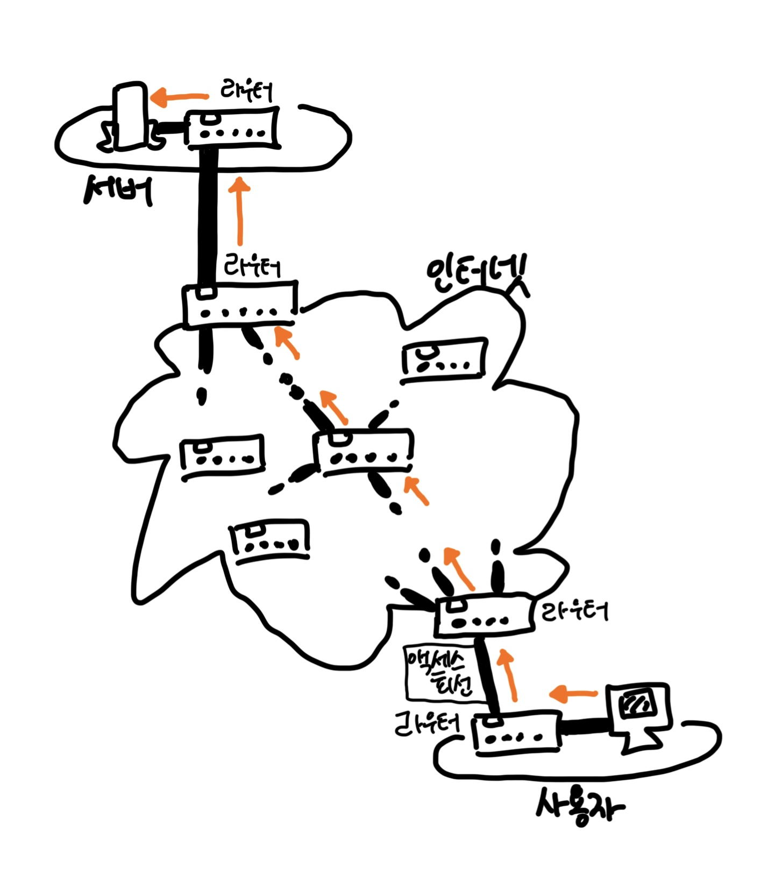
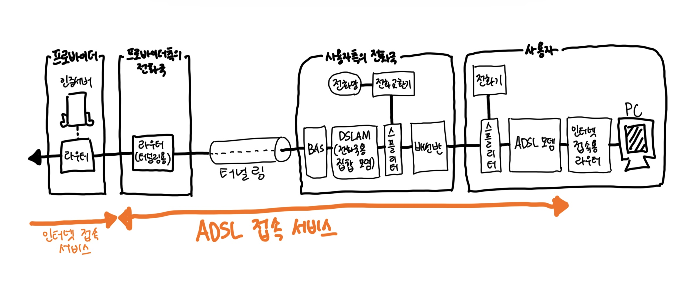
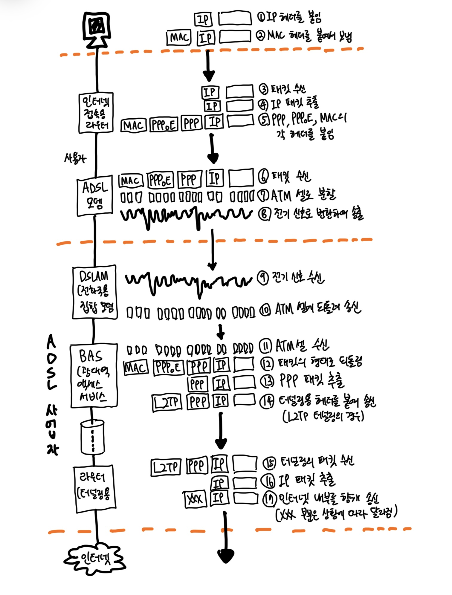

# Chapter04. 액세스 회선을 통해 인터넷의 내부로
- 액세스 회선과 프로바이더

## 1. ADSL 기술을 이용한 액세스 회선의 구조와 동작

### 1-1. 인터넷의 기본은 가정이나 회사의 LAN과 같다.

- 인터넷? 생각보다 간단하다.
  - 라우터에서 패킷을 중계하는 부분은 가정이나 회사의 LAN과 같으며, 라우터의 기본적인 구조나 동작도 전혀 다르지 않다.
  - 가정이나 회사의 네트워크 규모가 커진 것이 인터넷이라고 생각하면 된다.

> - 인터넷의 내부에는 수만 대 이상의 라우터가 있고, 이것이 수신처 IP 주소를 바탕으로 중계 대상을 판단하면서 패킷을 중계한다.
> - 다수의 라우터가 차례대로 중계하여 패킷을 목적지에 전달한다.

- 가정이나 회사의 LAN과 다른 면이 몇 가지 있다.

1. 중계 장치 간의 거리 
  - 가장 가까운 전화국에만 도착하려고 해도 수 킬로미터는 될 것이고, 대한민국과 미국을 연결하는 부분은 태평양을 넘어야 하므로 이더넷 케이블로 연결한다는 것은 어렵다.
2. 라우터에서 패킷의 중계 대상을 제어하는 부분
  - 경로표에 등록된 경로 정보에 기초하여 중계 대상을 판단한다는 기본 동작은 같지만, 경로표에 정보를 등록하는 부분이 다르다.
  - 인터넷의 라우터에는 경로 정보가 10만 개 이상이나 등록되어 있으며, 정보가 시시각각으로 변화한다.

### 1-2. 사용자와 인터넷을 연결하는 액세스 회선

- 스위칭 허브와 라우터로 패킷을 중계하면 패킷은 목적지 서버를 향해 진행한다.
  - 인터넷 접속용 라우터를 경유하여 인터넷으로 나간다.
- 라우터의 중계 동작은 모두 같으므로 인터넷 접속용 라우터의 패킷 중계 동작도 이더넷의 라우터와 거의 같다.
- 단, 인터넷 접속용 라우터의 패킷 송신 동작은 이더넷의 패킷 송신 동작과 조금 다르다.
  - 인터넷 접속용 라우터는 액세스 회선의 규칙에 따라 패킷 송신 동작을 실행하기 때문인데, 이곳이 이더넷의 규칙과 다른 부분이다.
- `액세스 회선`은 인터넷과 가정이나 회사의 LAN을 연결하는 통신 회선을 말한다.
  - 일반 가정이라면 `ADSL`, `FTTH`, CATA, 전화 회선, ISDN 등을 액세스 회선으로 이용하는데, 회사의 경우 이것에 전용 회선 등이 추가된다.

### 1-3. ADSL 모델에서 패킷을 셀로 분할한다.

- ADSL 기술을 사용한 액세스 회선은 아래와 같이 흘러간다. (오른쪽에서 왼쪽으로)
- 사용자측의 라우터에서 송신된 패킷은 ADSL 모뎀이나 전화의 케이블을 통해 전화국에 도착하며, 여기에서 ADSL 사업자의 네트워크를 경유하여 프로바이더(ISP; Internet Service Provider)에 도착한다.

- 프로바이더에 도착하는 동안 패킷은 여러 형태로 모습을 바꾸며 진행되는데, 아래와 같이 변경된다.

- 클라이언트에서 만든 패킷(1번과 2번)이 리피터 허브나 스위칭 허브를 경우하여 인터넷 접송용 라우터에 도착한다.(3번)
- 이더넷의 패킷에서 IP 패킷을 추출하여 중계 대상을 판단하는 부분(4번)까지는 이더넷의 라우터와 다르지 않다.
- 그 다음에 패킷을 송신하는 동작도 비슷하다.
  - 인터넷 접속용 라우터와 ADSL 모뎀이 이더넷으로 연결되었으면 이더넷의 규칙에 따라 패킷 송신 동작을 실행하므로 신호를 송신하는 동작은 달라지지 않는다.
  - 단 이더넷의 헤더가 조금 다르다. 액세스 회선 사업자에 따라 변형되며, 액세스 회선의 앞에 있는 `BAS`라는 패킷 중계 장치의 도움을 받는다.
  - MAC, PPPoE, PPP 헤더라는 3개의 헤더가 붙는다. (5번)
  - 이더넷의 규칙에 따라 신호로 변환하여 송신한다.

> #### BAS
> - Broadband Access Server. 라우터의 일종

> #### PPP
> - Point-to-Point Protocol. 전화 회선이나 ISDN 등의 통신 회선을 사용하여 통신할 때 사용하는 구조.
> - 본인 확인, 설정값 통지, 데이터 압축, 암호화 등 다양한 기능을 조합하여 사용할 수 있다.

- 인터넷 접속용 라우터가 패킷을 송신하면 ADSL 모뎀에 도착한다. (6번)
- 그러면 ADSL 모뎀은 패킷을 작게 분할하여 셀어 저장한다. (7번)
  - 셀의 맨 앞부분에 헤더(5바이트)를 가지고 있고, 그 뒤에 데이터(48바이트)가 이어지는 작은 디지털 데이터의 덩어리로, `ATM`이라는 통신 기술에 사용한다.
  - 패밋을 작게 만든 것이라고 생각하면 되고, 데이터 부분에 패킷을 분할한 조작을 저장하는 것이다.
  - TCP가 애플리케이션에서 받은 데이터를 분할하고, 분할된 조각을 패킷의 데이터 부분에 저장하는 것과 같은 개념이다.
- 셀로 분할하는 것은 다음과 같은 이유 때문이다.
  - ADSL 기술 개발이 시작되던 당시 통신 업계에서 ATM 기술이 유력시. => ATM 관련 설비 투자 중
  - 이 경우 셀을 사용하는 상태로 두면 다른 설비와 매끄럽게 연대되어 개발 투자나 설비 투자를 줄일 수 있었다. 이것이 그 이유.
  - 이러한 이유가 없다면 셀로 분할하지 않아도 상관 X => 실제로 셀로 분할하지 않는 유형의 ADSL 모뎀을 사용하는 ADSL 사업자도 존재

> ADSL 모뎀은 패킷을 셀로 분할하고, 전기 신호로 바꿔 스플리터에 송신

 

# 참고자료

- 성공과 실패를 결정하는 1%의 네트워크 원리, Tsutomu Tone 지음
