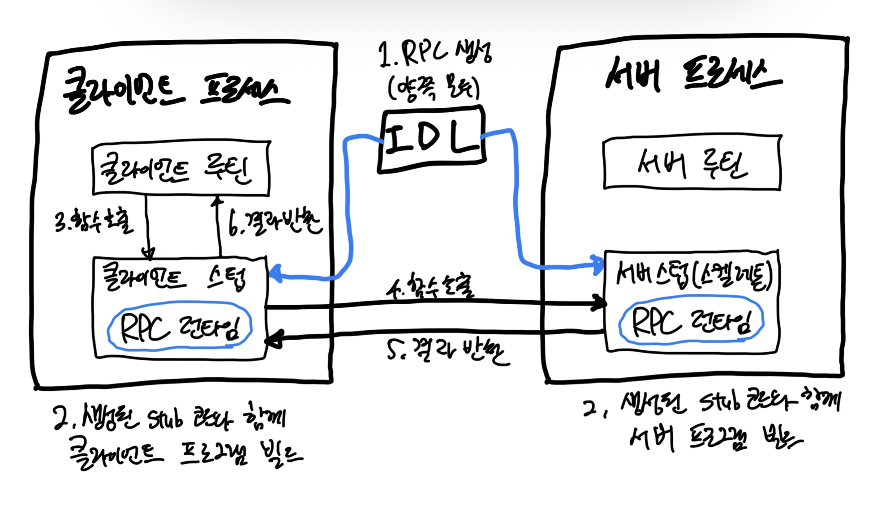

# gRPC

- RPC란 Remote Procedure Call의 약자로, 다른 컴퓨터에 있는 기능을 자기 기능인 것처럼 실행할 수 있는 시스템이다.
- RPC는 언어 독립적이므로 서로 다른 프로그래밍 언어를 사용하는 서버와 클라이언트 사이에서도 사용될 수 있다.
- gRPC는 구글에서 개발한 오픈소스 기술로 다양한 플랫폼에서 서로 다른 언어로 작성된 애플리케이션 간 통신을 위한 효율적이고 간편한 툴을 제공한다.
  - gRPC는 이전의 RPC 시스템과 달리 대용량 데이터 전송 및 멀티플랫폼 지원 등의 문제를 해결할 수 있다.

## RPC

### RPC의 동작 흐름

> #### `IDL(Interface Definition Language)`
> - 서로 다른 서버가 원활하게 통신할 수 있도록 '약속'을 만드는 언어라고 생각하면 된다.
> - 특성
>   - 명확한 계약 정의: 어떤 함수를 제공하는지, 각 함수가 어떤 파라미터를 받고 어떤 데이터를 반환하는지 명확하게 정의
>   - 언어 독립성 보장: IDL 파일(`.proto`, `.thrift` 등)이 있으면, 각 언어에 맞는 클라이언트와 서버 코드를 자동으로 생성 가능. IDL 컴파일러가 만들어준 코드 위에서 비즈니스 로직에만 집중하면 된다.
>   - 직렬화/역직렬화 처리: 클라이언트가 보낸 데이터는 네트워크를 통해 전송될 수 있는 형태로 반환되어야 한다. 서버는 이 데이터를 받아서 다시 자신이 사용하는 언어의 객체로 변환해야 한다.
> - 대표 예시
>   - Protocol Buffers
>   - Apache Thrift

- RPC를 통해 하부 네트워크 프로토콜에 대해 신경 쓰지 않아도 되고, 프로그램 개발에만 집중 가능

### 단점

- 하지만 단점도 존재한다.
- RPC 코드를 이해하기 어려울 뿐더러 에러 발생 시 디버깅이 어렵다.
  - 때문에 데이터 통신을 Web에서 해결해보려 함. => REST API

## gRPC

- 구글이 대규모 서비스를 운영하기 위해 개발한 프로토콜
- gRPC는 IDL로 PB(Protocol buffer)를 사용한다.
- 또한 `HTTP/2` 프로토콜을 활용하여 통신을 한다.

> #### HTTP/2의 장점
> -[HTTP/2](https://hpbn.co/http2/)
> - 하나의 Connection에 여러 개의 메시지를 주고 받을 수 있음. (`Multiplexing`)
> 
> - `바이너리 프레이밍 Binary Framing`: 더 성능이 좋고, 검증 가능한 정확한 구현 
> 
> - Header를 압축하여 중복을 제거하고 전달 (HPACK 압축 형식을 사용하여 요청 및 응답 헤더 메타데이터를 압축)
>   - 전송되는 헤더 필드를 정적 허프만 코드로 인코딩하여 개별 전송 크기로 줄인다.
>   - 클라이언트와 서버가 이전에 본 헤더 필드들의 인덱스화된 목록을 유지하고 업데이트하도록 요구. (공유 압축 컨텍스트를 설정한다는 말.)
> 

## gRPC는 언제 사용해야 하는가?

### REST API와 비교

|         | REST API  | gRPC                       |
|:--------|:----------|:---------------------------|
| 데이터 포맷  | 주로 JSON   | Protocol buffers(바이너리)     |
| 프로토콜    | HTTP      | HTTP/2                     |
| 성능      | 상대적으로 느리다 | 빠르다(직렬화와 역직렬화가 효율적이다.)     |
| 스트리밍    | 제한적       | 양방향 스트리밍 지원                |
| 브라우저 지원 | 우수        | 제한적 (gRPC-Web 필요)          |
| 학습 난이도  | 낮음        | 상대적으로 높다 (proto 파일, IDL 등) |

### 기술 선택

#### REST API

- 브라우저 환경에서 사용해야 할 경우
- 단순한 CRUD 중심의 서비스
- 다양한 디바이스나 외부 서비스와의 연동

#### gRPC

- 마이크로서비스 간 통신이 많은 시스템
- 실시간 데이터 전달이 중요한 서비스
- 고성능이 요구되는 내부 시스템 도는 서비스 간 통신
- 명확한 인터페이스 정의 및 자동 코드 생성이 필요한 경우

