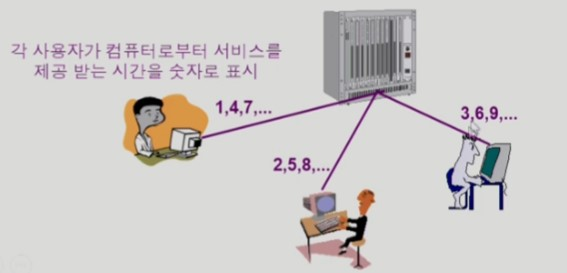

# 01 Operating System

## 목차

1. [운영체제의 개념](#1-운영체제의-개념)  
   &nbsp; 1-1. [운영체제란](#1-1-운영체제란)  
   &nbsp; 1-2. [운영체제의 목표](#1-2-운영체제의-목표)  

 

2. [운영체제의 분류](#2-운영체제의-분류)  
   &nbsp; 2-1. [동시 작업 가능 여부](#2-1-동시-작업-가능-여부)  
   &nbsp; 2-2. [사용자의 수](#2-2-사용자의-수)  
   &nbsp; 2-3. [처리 방식](#2-3-처리-방식)  

 

3. [운영체제의 종료](#3-운영체제의-종류)  
    &nbsp; 3-1. [유닉스 UNIX 계열](#3-1-유닉스-unix-계열)  
   &nbsp; 3-2. [MS Windows 계열](#3-2-ms-windows-계열)  
   &nbsp; 3-3. [Mac OS](#3-3-mac-os)  

 

4. [운영체제의 구조](#4-운영체제의-구조)  

 

5. [용어 정리](#5-용어-정리)  

  

## 1. 운영체제의 개념

 

### 1-1. 운영체제란

 

운영체제 Operating System 란 컴퓨터 하드웨어 바로 위에 설치되어 사용자 및 다른 모든 소프트웨어와 하드웨어를 연결하는 소프트웨어 계층을 말한다. 컴퓨터에 운영체제가 없다면 아무런 기능을 못하기 때문에 컴퓨터가 작동하기 위해 필요한 최소한의 기능을 탑재하고 있는 소프트웨어가 운영체제이다.

 

좁은 의미의 운영체제는 커널을 뜻한다. 커널이란 운영체제의 핵심 부분으로 항상 메모리에 상주하는 부분을 말한다. 넓은 의미의 운영체제는 커널을 포함해 메모리에 상주하지 않는 각종 주변 시스템 유틸리티를 포함한 개념이다.

 

### 1-2. 운영체제의 목표

 

운영체제는 컴퓨터 시스템 사용의 편리성을 위해 동시 사용자/프로그램들이 각각 독자적 컴퓨터에서 수행되는 것과 같은 가상 환경을 제공해줄 수 있다. 또한 하드웨어를 직접 다루는 복잡한 작업을 대신해준다. 

 

운영체제의 가장 중요한 목표는 `자원을 효율적으로 관리`하는 것이다. 여기서 말하는 자원이란 프로세서, 기억장치, 입출력 장치 등이다. 자원은 한정되어 있고 수요는 많기 때문에 어떤 순서로 작업을 어떤 순서로 처리할 것인지를 결정한다. 운영체제는 **효율성**을 최우선으로 하는 것이 원칙이지만, 특정 사용자나 프로그램이 차별을 받으면 안되기 때문에 **형평성**도 따져봐야 한다.

  

## 2. 운영체제의 분류

 

### 2-1. 동시 작업 가능 여부

 

- 단일 작업 Single Tasking

단일 작업이란 한 번에 하나의 작업만 처리하는 것이다. 옛날의 운영체제는 단일 작업만 지원이 가능했다고 한다. 예를 들어 MS-DOS 프롬프트 상에서는 한 명령의 수행이 끝날 때까지 다른 명령을 수행시킬 수 없다. 지금도 엘리베이터와 같이 하나의 작업만 수행하는 기계에는 단일 작업 운영체제를 사용한다.

 

- 다중 작업 Multi Tasking

현대의 운영체제는 대부분 다중작업을 지원한다. 다중 작업이란 동시에 두 개 이상의 작업을 처리해주는 것을 말한다. UNIX, MS Windows 등에서는 한 명령의 수행이 끝나기 전에 다른 명령이나 프로그램을 수행할 수 있다.

 

### 2-2. 사용자의 수

 

- 단일 사용자 Single User

하나의 하드웨어로 한 명의 사용자만 받는다. MS-DOS가 있다. 옛날의 Windows는 단일 사용자 운영체제였지만, 현재는 계정을 여러 개 만들고 서버 기능을 추가해 원격으로 다중 사용자가 접속할 수 있게 한다면 다중 사용자 운영체제라고 볼 수 있다.

 

- 다중 사용자 Multi User

하나의 하드웨어로 다중의 사용자를 수용할 수 있다. UNIX와 Linux, NT Server, Ubuntu, Windows 10, Mac OS 등이 있다.

 

### 2-3. 처리 방식

 

- 일괄 처리 Batch Processing

일괄 처리 운영체제는 작업 요청의 일정량을 모아 한꺼번에 처리한다. 작업이 완전히 종료할 때까지 기다려야 한다. 현대에는 사용하지 않는다. 초기 Punch Card 처리 시스템이 그 예이다.

 

- 시분할 time sharing

여러 작업을 수행할 때 컴퓨터 처리 능력을 일정한 시간 단위로 분할하여 사용한는 방식이다. 일괄 처리 시스템에 비해 짧은 응답 시간을 가진다. 
리눅스, 윈도우즈, 안드로이드, iOS 등이 모두 시분할 운영체제에 속한다.

 

- 실시간 운영체제 Realtime OS

정해진 시간 안에 어떠한 일이 반드시 종료됨이 보장되어야하는 실시간 시스템을 위한 운영체제이다. 예를 들어, 원자로, 공장 제어, 미사일 제어, 반도체 장비, 로봇 제어 등에 사용된다. 실시간 시스템은 제약조건을 지키지 못했을 때의 심각도에 따라 `경성 실시간 시스템 Hard realtime system`과 `연성 실시간 시스템 Soft realtime system`으로 나눌 수 있다. 경성 실시간 시스템은 원자로, 미사일 제어와 같이 치명적일 경우이다.

  

## 3. 운영체제의 종류

 

### 3-1. 유닉스 UNIX 계열

 

본래 대형 컴퓨터를 제어하기 위해 만들어진 운영체제이고 코드의 대부분이 C언어로 작성되었다. 높은 이식성을 가지고 있고 복잡한 시스템에 맞게 확장이 용이이다. 최소한의 커널 구조를 가지고 있는 것도 특징이다. 소스 코드를 공개해놨기 때문에 유닉스 계열의 다른 운영체제들이 많이 생겨났다. 

 

유닉스 계열로는 System V, FreeBSD, SunOS, Solaris, Linus 등이 있다. 상업적인 유닉스 운영체제도 나왔지만 Linux와 같은 오픈소스 운영체제가 많이 쓰이면서 기존의 상업 유닉스 시장이 비활성화되었다.

 

핸드폰의 운영체제인 **안드로이드**도 리눅스의 커널을 사용하고 있다.

 

### 3-2. MS Windows 계열

 

PC(Personal Computer)를 제어하기 위해 만들어진 운영체제이다. 1981년 개발된 DOS는 단일 사용자용 운영체제였고, 메모리 관리 능력에 한계(주 기억장치: 640KB)가 있었다. 
이후 MS사에서 개발한 Windows는 다중 작업용 GUI 기반 운영체제이며, Plug and Play, 네트워크 환경 강화 등의 특징을 가지고 있다. 초기 윈도우즈는 다중 작업을 할 때 컴퓨터 작업이 어느 순간 멈추는 등 불안정적이었지만 현재는 많이 발전하여 안정적인 운영체제로 발돋움했다.

 

### 3-3. MAC OS

 

오직 Mac을 위한 운영 체제로 Apple이 직접 만들었다. 하이브리드 커스텀 커널을 사용하지만 UNIX의 필수 핵심 요소는 모두 가지고 있어 UNIX와 시스템이 거의 동일하다고 한다.

  

## 4. 운영체제의 구조

 

- **CPU**
    - 어떤 프로그램에 CPU를 할당할 것인가?
    - `CPU 스케줄링`: 짧은 시간동안 자원을 줬다 뺏었다하는 작업을 반복

 

- **Memory**
    - 한정된 메모리를 어떻게 할당할 것인가?
    - 메모리 관리
    - CPU에서 곧 사용할 자원들은 남기고 아닌 자원들은 Disk로 보낸다.

 

- **Disk**
    - 파일을 어떻게 보관할 것인가?
    - 파일 관리, `디스크 스케줄링`
    - 디스크 헤드가 움직이면서 파일을 처리한다는 특성을 고려하여 스케줄링

 

- **I/O device**
    - 정보를 어떻게 주고받게할 것인가?
    - 입출력 관리
    - **인터럽트**를 사용

 

- **프로세스 관리**
    - 프로세스의 생성과 삭제
    - 자원 할당 및 반환
    - 프로세스 간 협력

 

- 기타
    - 보호 시스템
    - 네트워킹
    - 명령어 해석기 Command Line Interpreter

 

 

## 5. 용어 정리

 

#### 컴퓨터에서 여러 작업을 동시에 수행하는 것을 의미하는 용어

- `Multitasking`: 하나의 프로그램이 끝나기 전에 다른 작업을 수행
- `Multiprogramming`
- `Time Sharing`: CPU를 강조
- `Multiprocess`: 여러 프로세스가 동시 실행(위와 비슷하다.)

**Multiprogramming**은 여러 프로그램이 메모리에 올라가 있음을 강조하는 용어이다. 
**Time Sharing**은 CPU의 시간을 분할하여 나누어 쓴다는 의미를 강조한 것이다. 
**멀티 프로세서 Multi Processor**는 위와는 다른 말이다. 하나의 컴퓨터에 CPU(processor)가 여러 개 탑재된 것을 의미한다.

 

## 출처

- 반효경, 운영체제와 정보기술의 원리

- Abraham Silberschatz, Operating System Concept

