# 02 시스템 구조 System Structure

## 출처

- 반효경, 운영체제와 정보기술의 원리

- Abraham Silberschatz, Operating System Concept

## 목차

1. [컴퓨터 시스템 구조](#1-컴퓨터-시스템-구조의-이해)  
   &nbsp; 1-1. [운영체제란](#1-1-cpu와-메모리)  
   &nbsp; 1-2. [하드웨어와 I/O 그리고 연산](#1-2-하드웨어와-io-그리고-연산)  
   &nbsp; 1-3. [인터럽트](#1-3-인터럽트)  

 

2. [동기식 I/O vs 비동기식 I/O](#2-동기식-io-vs-비동기식-io)  
   &nbsp; 2-1. [동기식과 비동기식 입출력의 개념](#2-1-동기식과-비동기식-입출력의-개념)  
   &nbsp; 2-2. [입출력 명령어의 차이](#2-2-입출력-명령어의-차이)  

 

3. [저장 장치](#3-저장-장치)  
   &nbsp; 2-1. [저장 장치의 구조](#3-1-저장-장치의-구조)  
   &nbsp; 2-2. [저장 장치의 계층 구조](#3-2-저장-장치의-계층-구조)  

 

4. [프로그램 작동](#4-프로그램-작동)  
   &nbsp; 1-1. [프로그램의 실행](#4-1-프로그램의-실행)  
   &nbsp; 1-2. [커널 주소 공간](#4-2-커널-주소-공간)  
   &nbsp; 1-3. [사용자 프로그램이 사용하는 함수](#4-3-사용자-프로그램이-사용하는-함수)  

  

## 1. 컴퓨터 시스템 구조의 이해

 

### 1-1. CPU와 메모리

 

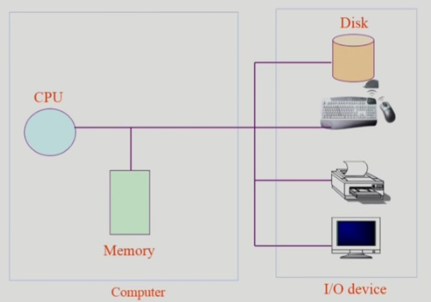

 

- `CPU`: 매 클럭(clock)마다 메모리에서 명령(instruction)을 읽어와 수행한다. 쉬지 않고 일한다.

- `메모리`: CPU의 작업 공간

- `Disk`: 일명 하드디스크, Memory에서 하드디스크의 기록을 읽어오거나 Memory에서의 처리 결과를 저장한다. input과 output을 모두 수행하는 I/O device이다.

 

### 1-2. 하드웨어와 I/O 그리고 연산

 

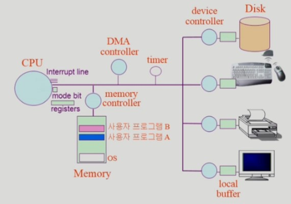

 

- `register`: CPU에서 메모리보다 빠르게 접근할 수 있는 작업공간으로 소량의 정보만을 담을 때 사용한다.

- `mode bit`: CPU에서 실행되는 것이 운영체제인지 사용자 프로그램인지 구분해주는 역할을 한다. CPU의 제어권을 누가 가지고 있는지를 알려준다고 생각하면 된다. 이를 통해 사용자 프로그램의 잘못된 수행으로 인해 다른 프로그램 및 운영체제에 피해가 가지 않도록 방지할 수 있다.

  - 1 => 사용자 모드: 사용자 프로그램 수행
  - 0 => 모니터 모드: OS 코드 수행
  - 모니터모드는 커널 모드, 시스템 모드라고 부르기도 한다.
  - interrupt나 Exception 발생시 하드웨어가 mode bit을 0으로 바꾼다.
  - 사용자 프로그램에게 CPU를 넘기기 전 1로 설정한다.
  - 보안을 해칠 수 있는 중요한 명령어는 mode bit이 0일 때만 수행 가능하다.

 

- 디바이스마다 컨트롤러(`device controller`)가 존재한다. 이 컨트롤러는 디바이스를 전담하는 작은 CPU이다.
  - 제어 정보를 위해 control register, status register를 가진다.
  - I/O 연산은 CPU가 직접하지 않고 디바이스 컨트롤러가 해준다.
  - I/O 디바이스마다 작은 CPU가 존재한다면 그에 대한 메모리도 존재할 것이다. 디바이스의 메모리 역할을 하는 것이 `local buffer`이다.

 

- `장치 구동기 device driver`: 하드웨어가 아닌 소프트웨어이다. OS 코드 중 각 장치별 처리 루틴을 의미한다. CPU가 처리하는 메모리 명령어에 저장되어 있다.

 

- 입출력 I/O 의 수행
  - `시스템콜 system call`을 통해 사용자 프로그램은 운영체제에게 I/O를 요청할 수 있다.
  - trap을 사용해 인터럽트 벡터의 특정 위치로 이동한다.
  - 제어권이 인터럽트 벡터가 가리키는 인터럽트 서비스 루틴으로 이동한다.
  - 올바른 I/O 요청인지 확인 후에 수행한다.
  - I/O 완료 시 제어권을 시스템콜 다음 명령으로 옮긴다.

 

### 1-3. 인터럽트

 

**인터럽트**는 운영 체제에서 컴퓨터에 예기치 않은 일이 발생하더라도 작동이 중단되지 않고 계속적으로 업무 처리를 할 수 있도록 해 주는 기능이다. 
좁은 의미는 하드웨어가 발생시킨 인터럽트만을 뜻하지만 넓은 의미의 인터럽트는 하드웨어가 발생시킨 인터럽트와 (`Trap`=) `소프트웨어 인터럽트`를 모두 포함한다. Trap은 system call(커널 함수 호출)과 Exception(예외 및 오류)에 의해 발생할 수 있다.  
인터럽트가 발생한 시점의 레지스터와 program counter를 save한 후 CPU의 제어를 인터럽트 처리 루틴에 넘겨 작업을 수행한다. 
현대의 운영체제는 인터럽트에 의해 구동된다는 말을 할 정도로 아주 중요한 개념이다.

 

- `interrupt line`: CPU는 기본적으로 메모리의 순서에 따라 명령어(instruction)만 수행하는 기능밖에 없다. I/O device에 변화가 생겼을 때 그것을 인지하기 위해 필요한 것이 **interrupt line**이다. 이를 기반으로 CPU는 자원을 재할당할 수 있다.

- `timer`: 만약 무한루프를 도는 작업을 처리하게 된다면? 무한정으로 그 프로그램에 사로잡혀 다른 작업을 할 수 없게 될텐데 이를 방지하는 것이 **timer**이다. 프로그램에 자원을 할당하기 전 timer에 값을 세팅한 후 CPU를 넘겨주는데, 할당된 시간만큼만 사용할 수 있으므로 특정 프로그램이 CPU를 독점하는 것을 막아준다. timer에 설정된 시간이 지나면 interrupt를 발생시켜 CPU 제어권을 운영체제로 뺏어와 다른 프로그램에 자원을 할당토록 한다.
  - 매 클럭마다 1씩 감소된다.
  - 타이머가 0이 되면 **타이머 인터럽트**가 발생한다.
  - time sharing을 구현하기 위해 사용하는 **하드웨어**이다.

 

- `시스템 콜 System Call`: 사용자 프로그램이 운영체제의 서비스를 받기 위해 커널 함수를 호출하는 것을 말한다.

- `인터럽트 벡터 Interrupt Vector`: 인터럽트가 발생했을 때, 해당 인터럽트를 처리할 수 있는 서비스 루틴들의 주소를 가지고 있는 공간이다.

- `인터럽트 처리 루틴 Interrupt Service Routine` 또는 인터럽트 핸들러: 해당 인터럽트를 처리하는 커널 함수를 의미한다.

 

- `DMA Controller`: 메모리 버퍼, 포인터, 카운터를 사용하여 장치 제어기가 CPU이 도움없이 DMA 컨트롤러를 이용하여 데이터를 직접 메모리로 전송할 수 있도록 도와주는 하드웨어이다.
  - 프로그램 수행 중 인터럽트의 발생 횟수 최소화하고 시스템 효율성 증대시킬 수 있다.
  - CPU는 DMA 컨트롤러와 상태정보 및 제어정보만 전송한다.
  - CPU의 개입 없이 입출력장치와 주 기억장치와의 데이터 직접 전송 가능하다.

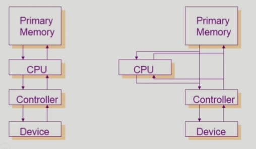

- 오른쪽에 해당하는 것이 DMA Controller가 작동하는 그림이다.

 

 

## 2. 동기식 I/O vs 비동기식 I/O

 

### 2-1. 동기식과 비동기식 입출력의 개념

 

두 방식 모두 인터럽트를 통해 I/O의 완료를 전달받는다.

 

- 동기식 입출력 Synchronous I/O
  - I/O 요청 후 입출력 작업이 완료된 후에야 제어가 사용자 프로그램으로 넘어가는 방식이다.
  - 구현 방법 (I/O 장치와 CPU의 낭비)
    - I/O가 끝날 때까지 CPU가 기다린다.
    - 매시점 하나의 I/O만 일어날 수 있다.
  - 개선된 구현 방법
    - I/O가 완료될 때까지 해당 프로그램에게서 CPU를 빼앗는다.
    - I/O 처리를 기다리는 줄에 그 프로그램을 줄 세운다.
    - 다른 프로그램에게 CPU 제어권을 준다.

 

- 비동기식 입출력 Asynchronous I/O
  - I/O가 시작된 후 입출력 작업이 끝나기를 기다리지 않고 제어가 사용자 프로그램에 즉시 넘어가는 방식이다.

 

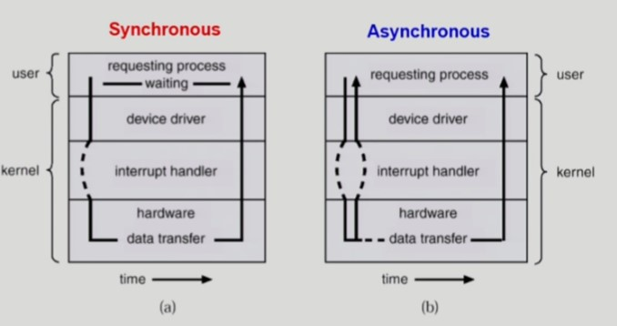

 

#### 동기식 입출력의 과정

1. 사용자가 I/O 요청을 하면 동기식 입출력에서는 먼저 운영 체제의 커널로 CPU의 제어권이 넘어와서 입출력 처리와 관련된 커널의 코드가 수행된다.
2. 입출력을 호출한 프로세의 상태를 봉쇄 상태(block state)로 바꾸어 입출력이 완료될 때까지 CPU를 할당받지 못하도록 막는다.
3. 입출력이 완료되면 I/O 컨트롤러가 CPU에게 인터럽트를 발생시켜 입출력이 완료된 것을 인지시킨다.
4. 프로세스의 봉쇄 상태를 해제시켜 CPU를 할당받을 수 있게 된다.

 

#### 비동기식 입출력의 과정

1. CPU의 제어권이 입출력을 요청한 프로세스에게 곧바로 다시 주어지게 되며, 입출력연산이 완료되는 것과 무관하게 처리 가능한 작업부터 처리한다.
2. 입출력 연산이 완료되면 인터럽트를 통해 이를 CPU에게 알려준다.
3. 그 시점부터 읽어온 데이터를 필요로 하는 명령을 수행한다.

 

### 2-2. 입출력 명령어의 차이

 

- I/O를 수행하는 special instruction에 의하는 경우가 있고, Memory Mapped I/O 의해 발생하는 경우가 있다.

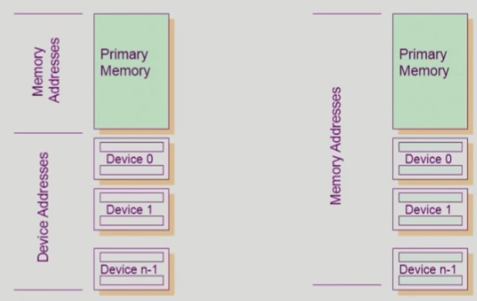

- 왼쪽 그림처럼 메모리에 접근하는 instruction과 I/O에 접근하는 instruction이 따로 존재해 I/O 디바이스의 접근성을 높이는 경우가 일반적이다.

- 오른쪽 방식은 Memory Mapped I/O라고 불린다. 메모리로만 접근하는 방식이다.

 

 

## 3. 저장 장치

 

### 3-1. 저장 장치의 구조

 

저장 장치는 주 기억 장치와 보조 기억 장치로 나눌 수 있다. 주 기억 장치는 앞에서 `메모리`라고 부르던 것으로 전원이 꺼지면 내용이 모두 사라져버리는 휘발성(volatile)을 가진 RAM을 매체로 사용한다. 
반면 보조 기억 장치는 `Disk`로 나타난 I/O device로 비휘발성(nonvolatile)을 가진 마그네틱 디스크를 사용한다. 보조 기억 장치는 다시 파일 시스템용과 메모리 연장 공간인 스왑 영역용으로 나눌 수 있다.

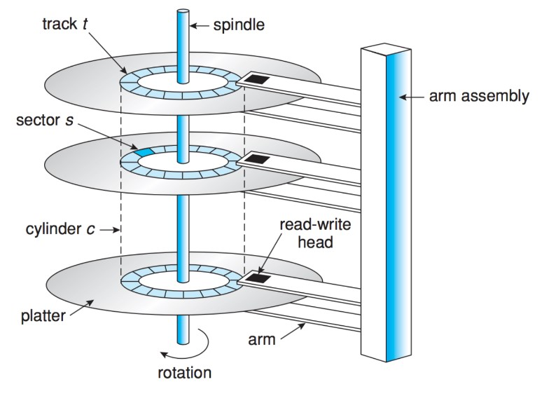

보조 기억 장치 중 가장 대표적인 저장 매체인 하드디스크는 여러 개의 마그네틱 원판들이 있고, 암(arm)이 이동하며 원판에 저장된 데이터를 읽고 쓰는 방식으로 동작하게 된다. 디스크 원판의 표면은 트랙(track)으로 나뉘고, 각 트랙은 섹터(sector)로 나뉜다. 섹터에 최소한의 단위 정보가 저장된다.

 

### 3-2. 저장 장치의 계층 구조

 

일단 그림에 보이진 않지만 메모리의 위에는 CPU가 있다.

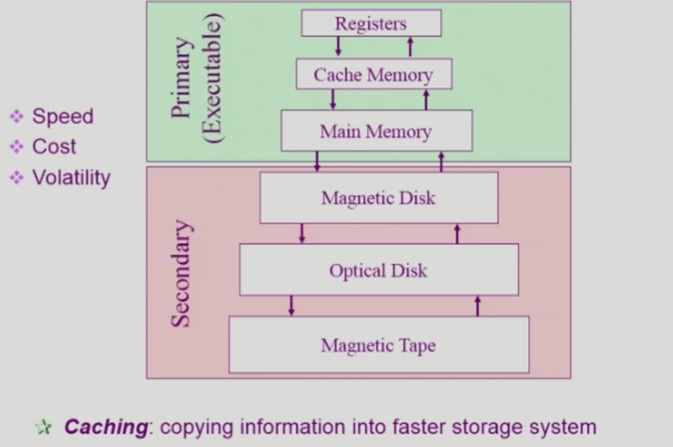

- 위에 있는 하드웨어일수록 속도가 빠르고 비용이 비싸다.

- Primary에 표기된 메모들은 휘발성이 있고, 용량이 적다.

- 요즘엔 Secondary에 표기된 Magnetic Disk(Hard Disk) 대신 SSD와 같은 플래시 메모리가 많이 사용된다.

- 매번 프로세서가 Main Memory에서 명령어를 가져오려면 시간이 오래 걸린다. 이 때 사용하는 것이 CaChe Memory이다. 아주 빠르지만 용량이 작기 때문에 자주 사용하는 것은 따로 담아둔다. 이것을 `Caching`이라고 한다.

- `Caching`: 저속의 저장장치에 저장되어있는 데이터에 대해 그 일부의 복사본을 그보다 빠른 저장장치에 보관에서 컴퓨터 동작의 성능을 향상하는 기법을 말한다.

 

## 4. 프로그램 작동

 

### 4-1. 프로그램의 실행

 

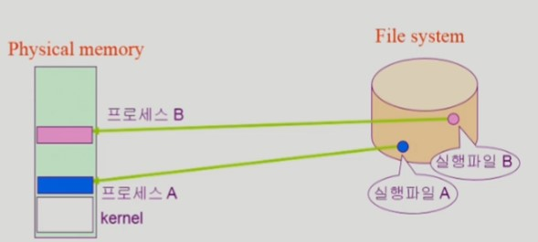

- 위와 같이 프로그램은 실행 파일의 형태로 하드디스크(파일 시스템)에 저장되어 있고, 실행될 때 Physical Memory에서 그 내용을 불러온다.

- 이 때 메모리 낭비를 줄이기 위해 `가상 메모리 Virtual Memory`라는 것을 사용한다.

 

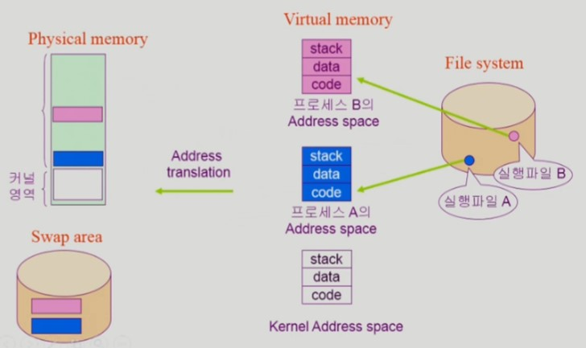

- 특정 프로그램을 실행시키면 가상 메모리(Virtual Memory) 또는 논리 메모리(Logical Memory)라고 불리는 것이 생성되어 독자적인 주소 공간을 가지게 된다. 주소는 code, data, stack으로 구성되어 있다. 주소공간은 프로그램이 종료될 때 소멸한다.

- 모든 내용을 Physical 메모리에 올리는 것은 낭비이기 때문에 당장 필요한 정보만 보내야 한다. 나머지 부분은 Swap area라는 디스크에 내려놓게 된다.

- physical 메모리와 가상 메모리의 주소값이 다르기 때문에 프로그램 내용을 메모리로 옮기는 과정에서 주소값을 바꿔줘야한다. 이를 주소 변환(Address translation)이라고 한다. 주소 변환을 해주는 하드웨어가 따로 존재해 이 작업을 처리해준다.

 

### 4-2. 커널 주소 공간

 

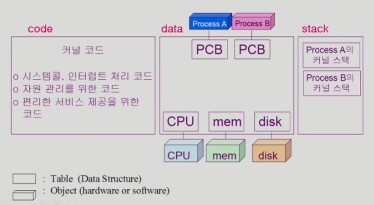

- 운영체제의 내용이 있는 커널 주소 공간이다.

- code

  - 자원 관리를 위한 코드와 편리한 인터페이스를 제공하는 코드 등이 존재한다. 시스템콜과 인터럽트 처리 코드와 같은 필수 기능도 있다.

- data

  - 운영체제는 하드웨어를 직접 관리하고 통제한다. 하드웨어를 관리하기 위한 자료구조를 하나씩 만들어 가지고 있는다.

  - 운영체제는 프로그램도 관리한다. 프로그램을 관리하기 위한 자료구조 또한 보유하고 있다. 그 자료구조를 `PCB(Program Control Block)`라고 부른다.

- stack
  - 함수를 호출하거나 사용할 때 필요한 부분이다.

 

### 4-3. 사용자 프로그램이 사용하는 함수

 

- 사용자 정의 함수

  - 사용자의 프로그램에서 정의한 함수

 

- 라이브러리 함수

  - 사용자의 프로그램에서 정의하지 않고 가져와 사용한 함수
  - 사용자의 프로그램의 실행 파일에 포함되어 있다.

 

- 커널 함수
  - 운영체제 프로그램의 함수
  - 커널 함수의 호출 = 시스템 콜

 

함수는 주소공간의 code부에 저장된다. 사용자 정의 함수와 라이브러리 함수는 코드부에서 바로 사용할 수 있다. 반면 사용자 프로그램에서 커널 함수를 사용하려면 **시스템콜**을 통해 인터럽트 라인을 세팅하고 CPU 제어권은 커널로 넘겨 커널 함수를 시행해야 한다. 복잡한 과정이다. 아래는 프로그램의 실행 단계이다.

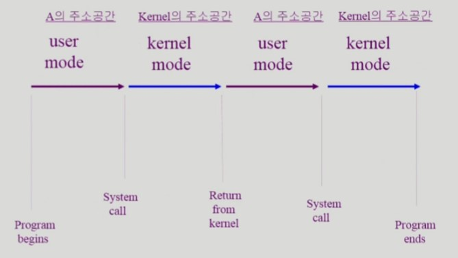

 

