# 03 프로세스 Process

## 출처

- 반효경, 운영체제와 정보기술의 원리

- Abraham Silberschatz, Operating System Concept

## 목차

1. [프로세스의 개념](#1-프로세스의-개념)  
   &nbsp; 1-1. [프로세스란](#1-1-프로세스란)  
   &nbsp; 1-2. [프로세스의 상태 Process State](#1-2-프로세스의-상태)  
   &nbsp; 1-3. [프로세스 제어 블록 Process Control Block](#1-3-프로세스-제어-블록-process-control-block)  
   &nbsp; 1-4. [문맥 교환 Context Switch](#1-4-문맥-교환-context-switch)  

 

2. [스케줄링](#2-스케줄링)  
   &nbsp; 2-1. [스케줄링을 위한 큐](#2-1-스케줄링을-위한-큐)  
   &nbsp; 2-2. [스케줄러](#2-2-스케줄러-scheduler)  

 

3. [스레드 Thread](#3-스레드-thread)  
   &nbsp; 3-1. [스레드란](#3-1-스레드란)  
   &nbsp; 3-2. [스레드를 사용하는 이유](#3-2-스레드를-사용하는-이유)  
   &nbsp; 3-3. [스레드의 구현](#3-3-스레드의-구현)  
   &nbsp; 3-4. [멀티스레드 Multithreaded Programming](#3-4-멀티스레드-multithreaded-programming)  

  

## 1. 프로세스의 개념

 

### 1-1. 프로세스란

 

`Process is a Program in Execution` => 프로세스는 수행 중인 프로그램을 뜻한다. 디스크에서 파일 형태로 존재하던 프로그램이 메모리에 올라가서 수행되기 시작하면 비로소 생명력을 갖는 프로세스가 된다. 
프로세스를 이해하려면 프로세스의 문맥(context)을 알아야 한다. 프로세스의 문맥이란 프로세스가 현재 어떤 상태에서 수행되고 있는지를 정확히 규명하기 위해 필요한 정보를 의미한다. 

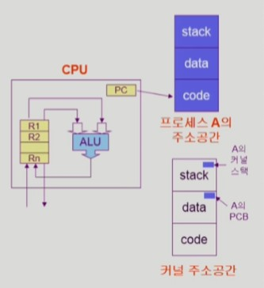

- 프로세스의 문맥
  - CPU의 수행 상태를 나타내는 하드웨어 문맥
    - Program Counter
    - 각종 register
  - 프로세스의 주소 공간
    - code, data, stack
  - 프로세스 관련 커널 자료 구조
    - PCB(Process Control Block)
    - Kernel stack

 

### 1-2. 프로세스의 상태

 

프로세스의 상태는 **실행**, **준비**, **봉쇄** 3가지로 분류할 수 있다. 여기서 현대 운영체제에 추가된 `Suspended`까지 4가지로 볼 수도 있다.

- 실행 Running

  - CPU를 보유하고 기계어 명령을 실행하고 있는 상태

- 준비 Ready

  - CPU를 기다리는 상태
  - 메모리 등의 조건을 모두 만족해 할당만 받으면 바로 실행 가능

- 봉쇄 Blocked (wait, sleep)

  - 프로세스에게 CPU를 할당해도 실행할 수 없는 상태
  - 프로세스 자신이 요청한 Event(I/O 등)가 만족되지 않아 이를 기다리는 상태
  - ex) 디스크에서 file을 읽어와야 하는 경우

- `Suspended` (stopped)
  - 현대 시분할 시스템에 의해 만들어진 중기 스케줄러에 의해 추가된 프로세스 상태
  - 외부적인 이유로 프로세스의 수행이 정지된 상태
  - 프로세스는 통째로 디스크에 스왑 아웃 `Swap out`된다.
  - ex) 사용자가 프로그램을 일시정지시킨 경우(break key), 시스템이 여러 이유로 프로세스를 잠시 중단시킴(메모리에 너무 많은 프로세스가 올라와 있을 때)

#### 용어정리

- `New`: 프로세스가 생성 중인 상태
- `Terminated`: 수행(execution)이 끝난 상태
- `Blocked`: 자신이 요청한 Event가 만족되면 Ready
- `Suspended`: 외부에서 재개해주어야(Resume) 활성화(Active)

 

#### 과거의 프로세스 상태도

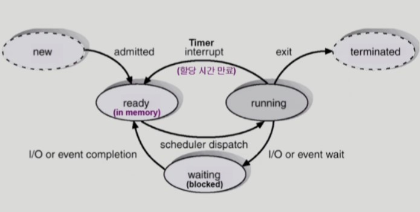

 

#### 현대의 프로세스 상태도

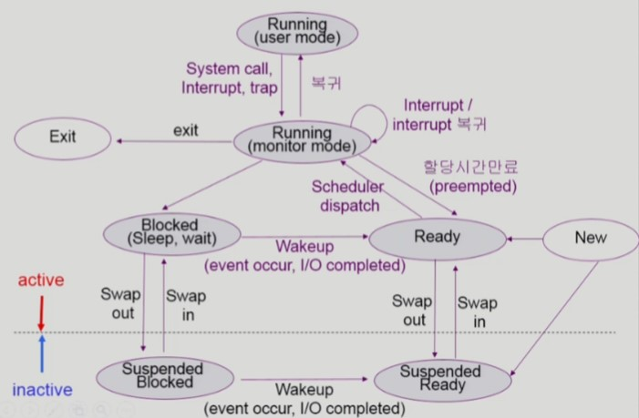

 

#### 큐와 프로세스

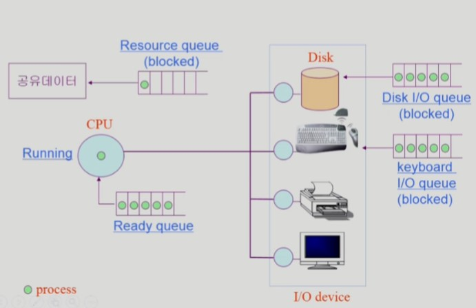

- 프로세스가 CPU를 할당받으려면 큐에서 줄을 서야 한다.
- 운영체제는 모든 자원이 효율적으로 움직일 수 있게 운영한다.
- 해당 큐 자료구조는 커널 주소공간의 data 영역에 존재한다.

 

### 1-3. 프로세스 제어 블록 Process Control Block

 

프로세스 제어 블록, 일명 PCB는 운영체제가 시스템 내의 프로세스들을 관리하기 위해 프로세스 당 유지하는 정보들을 담는 커널 내의 자료구조를 뜻한다. PCB는 다음과 같은 구성요소를 가지고 있다.

- 프로세스의 상태 `Process state`: CPU를 할당해도 되는지 여부
- 프로그램 카운터 값 `Program Counter`: 다음에 수행할 명령의 위치를 지시
- CPU 레지스터 `CPU Register`: 레지스터에 현재 어떤 값을 저장하고 있는지
- CPU 스케줄링 정보 `CPU Scheduling Information`: 스케줄링을 위해 필요한 정보
- 메모리 관리 정보 `Memory Management Information`: 메모리 할당을 위해 필요한 정보
- 자원 사용 정보 `Accounting Information`: 자원 사용 요금을 계산해 청구하는 등의 용도
- 입출력 상태 정보 `I/O Status Information`

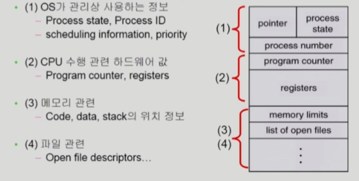

 

### 1-4. 문맥 교환 Context Switch

 

문맥 교환이란 하나의 사용자 프로세스로부터 다른 사용자 프로세스로 CPU의 제어권이 이양되는 과정을 뜻한다.  
CPU가 다른 프로세스로 넘어갈 때, 운영체제는 CPU를 내어주는 프로세스의 상태를 그 프로세스의 PCB에 저장하고 CPU를 새롭게 얻는 프로세스의 상태를 PCB에서 읽어온다. 간단히 말하면, CPU가 뺏긴 시점의 문맥을 기억해 다시 CPU 제어권을 부여받았을 때 다시 시작할 시점으로 설정해주는 것이다.

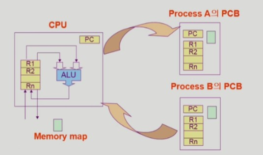

 

그러나 **시스템 콜**이나 **인터럽트**가 발생할 때 반드시 문맥 교환이 발생하는 것은 아니다. 
타이머 인터럽트가 발생하거나 프로세스가 입출력 요청 시스템 콜을 하여 봉쇄 상태에 들어가는 경우에는 문맥 교환이 일어나지만, 그 밖의 인터럽트와 시스템 콜 발생 시에는 문맥 교환이 일어나지 않고 모드 변경만 한다. 즉, 사용자 모드에서 커널 모드로 바뀌어 시스템 콜이나 인터럽트 처리를 하고 다시 동일한 프로세스의 사용자 모드로 되돌아와 이전에 수행하던 작업을 계속 수행할 뿐이다.

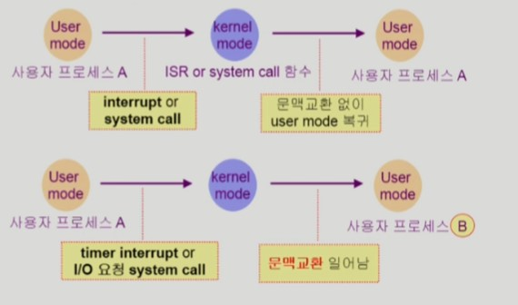

 

## 2. 스케줄링

 

### 2-1. 스케줄링을 위한 큐

 

프로세스들은 각 큐들을 오가며 수행된다. 작업 큐가 가장 넓은 개념이고, 준비 큐와 장치 큐에 있는 프로세스들은 모두 작업 큐에 속한다.

- 작업 큐 `Job queue`
  - 현재 시스템 내에 있는 모든 프로세스의 집합
  - 작업 큐에 존재한다고 해서 반드시 메모리를 가지는 것은 아님

 

- 준비 큐 `Ready queue`
  - 현재 메모리 내에 있으면서 CPU를 잡아서 실행되기를 기다리는 프로세스의 집합

 

- 장치 큐 `Device queue`
  - I/O device의 처리를 기다리는 프로세스의 집합

 

#### 준비 큐와 다양한 장치 큐의 모습

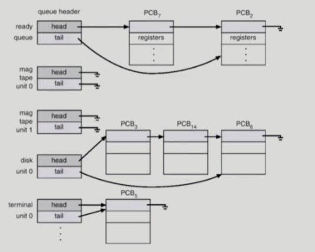

- 각 자원마다 큐가 하나씩 존재한다.
- 큐 헤더(queue header)는 큐의 가장 앞부분을 말한다.
- 큐는 각 프로세스의 PCB를 연결 리스트 형태로 줄 세우고 포인터를 이용해 순서를 정한다.
- 프로세스가 CPU를 할당받고 코드를 수행중이다가 입출력 요청이 발생하면 해당 장치 큐에 가서 줄을 선다.
- 장치 큐에 속한 프로세스들은 봉쇄 상태에 있다가 해당 장치의 서비스를 받고나서 장치 컨트롤러가 인터럽트를 발생시키면 준비 상태로 바뀌어 준비 큐로 이동하게 된다.

 

#### 프로세스의 수행도

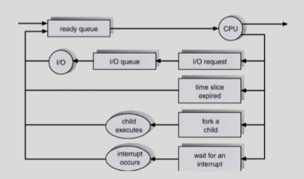

- 프로그램이 시작되면 먼저 준비 큐에 줄을 선다.
- 언제가 자기 차례가 되면 CPU의 제어권을 획득하게 된다.
- 할당 시간이 끝나면 다시 준비 큐에 가서 줄은 선다.

 

### 2-2. 스케줄러 Scheduler

 

- 장기 스케줄러 `Long-term scheduler` (or `job scheduler`)

  - 시작 프로세스 중 어떤 것들을 ready queue로 보낼지 결정
  - 프로세스에 memory 및 각종 자원을 주는 문제를 해결
  - 프로세스의 수 `degree of Multiprogramming`를 제어
  - time sharing system에는 보통 장기 스케줄러가 없음(무조건 ready)
  - 과거에 자원이 매우 빈약했던 시절에 주로 사용된 스케줄러
  - 현대의 시분할 시스템에서는 거의 사용되지 않음

 

- 단기 스케줄러 `Short-term scheduler` (or `CPU scheduler`)
  - 어떤 프로세스를 다음번에 running 시킬지 결정
  - 프로세스에 CPU를 주는 문제
  - 충분히 빨라야 함(millisecond 단위)
  - 시분할 시스템에서는 타이머 인터럽트가 발생할 때 단기 스케줄러가 호출됨

 

- 중기 스케줄러 `Medium-term scheduler` (or `Swapper`)
  - 현대의 시분할 시스템에서는 장기 스케줄러 대신 중기 스케줄러를 사용
  - 너무 많은 프로세스에게 메모리를 할당해 시스템의 성능이 저하되는 경우 이를 해결하기 위해 추가된 스케줄러
  - 여유 공간 마련을 위해 프로세스를 통째로 메모리에서 디스크의 스왑 영역에 저장한다. 이를 스왑 아웃 `Swap out`이라고 부른다.
  - 프로세스에게서 memory를 뺏는 문제
  - 프로세스의 수 `degree of Multiprogramming`를 조절

 

## 3. 스레드 Thread

 

### 3-1. 스레드란

 

"A `thread`(of `lightweight process`) is a basic unit of CPU utilization" 
스레드는 어떠한 프로그램 내에서, 특히 프로세스 내에서 실행되는 흐름의 단위를 말한다. 멀티스레드는 프로세스 내부에 CPU 수행 단위가 여러 개 있는 경우를 말한다.

- Thread의 구성(독립적으로 가지고 있는 것)
  - Program Counter
  - Register Set
  - Stack Space

 

- Thread가 동료 thread와 공유하는 부분(=task)

  - code section
  - data section
  - OS resources

 

- 전통적인 개념의 heavyweight process는 하나의 thread를 가지고 있는 task로 볼 수 있다.

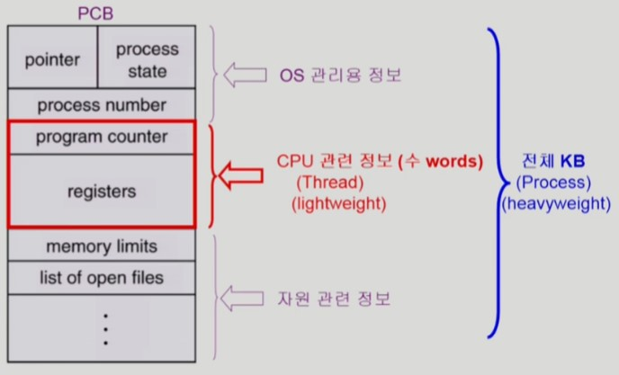

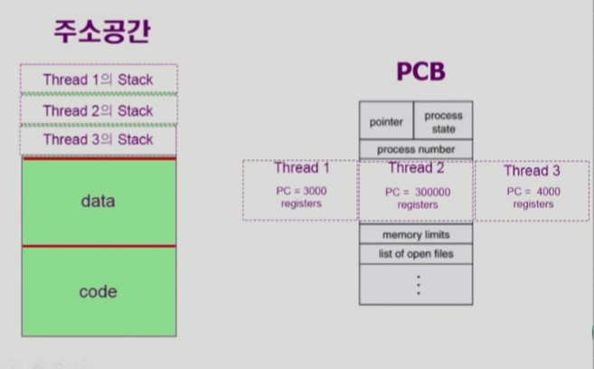

- 현재 메모리의 어떤 부분을 실행하고 있는지 프로그램 카운터가 가리키고 있다
- 동일한 일을 하는 여러 개의 프로세스가 있다고 가정했을 때, 프로세스마다 별도의 주소공간이 여러 개가 만든다면 이는 메모리 낭비로 이어진다. 낭비를 줄이기 위해 주소공간 하나만 가지고 프로세스마다 다른 부분의 코드를 실행하게 해주는 것이 스레드이다.
- PCB에서 사용하는 각종 자원과 프로세스 상태 등을 공유하는 대신 CPU 수행과 관련된 정보는 각자 Thread로 가지고 있는다. PC(Program Counter)와 register, stack 등이 그 내용이다.

 

### 3-2. 스레드를 사용하는 이유

 

1. **빠른 응답성**: 다중 스레드로 구성된 태스크 구조에서는 하나의 서버 스레드가 blocked(wating) 상태인 동안에도 동일한 태스크 내의 다른 스레드가 실행(running)되어 빠른 처리를 할 수 있다.

2. **경제성**: 프로세스보다 Thread의 생성`creating`과 `CPU switching`의 overhead가 상당히 낮다. 동일한 일을 수행하는 다중 스레드가 협력하여 높은 처리율(throughput)과 성능 향상을 얻을 수 있다.

3. **자원 공유**: binary code, data, resource of the process를 공유해 자원을 효율적으로 사용할 수 있다.

4. CPU가 여러 개일 경우, 스레드를 사용하면 병렬성을 높일 수 있다.

 

### 3-3. 스레드의 구현

 

스레드를 구현하는 방법은 사용자 수준 스레드와 커널 수준 스레드로 나눌 수 있다. 
사용자 수준 스레드는 사용자 영역의 스레드 라이브러리로 구현하고 스레드와 관련된 모든 행위를 사용자 영역에서 하므로 커널이 스레드의 존재를 모든다. 
반면 커널 수준 스레드는 커널이 스레드와 관련된 모든 작업을 관리할 수 있도록 구현한 것이다. 사용자 수준 스레드의 단점을 극복하기 위해 나온 방법이다. 
여기에 더해 실시간 real-time 기능을 지원하는 Thread 방식도 있으니 알아두자.

 

### 3-4. 멀티스레드 Multithreaded Programming

 

운영체제는 멀티 태스킹(두 가지 이상의 작업을 동시에 처리하는 것)을 할 수 있도록 프로세스마다 CPU 및 메모리 자원을 적절히 할당하고 병렬로 실행한다. 멀티 스레드란 하나의 프로세스 내에서 둘 이상의 스레드가 동시에 작업을 수행하는 것을 의미한다. 멀티 프로세스가 애플리케이션 단위의 멀티 태스킹이라면, 멀티 스레드는 애플리케이션 내부에서의 멀티 태스킹이다.

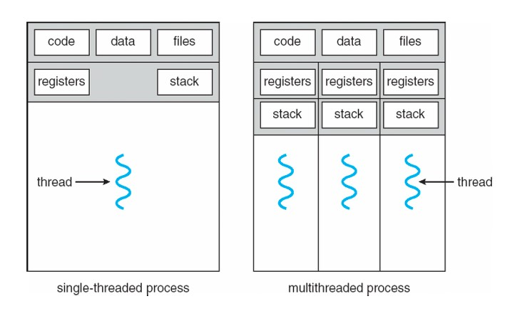

- 멀티 스레드의 장점

멀티 프로세스가 아닌 멀티 스레딩으로 구현할 경우, 메모리 공간과 시스템 자원의 소모가 줄어드는 장점이 있다. 스레드 간 통신은 별도의 자원을 이용하지 않고, 전역 변수의 공간 혹은 동적으로 할당된 힙(Heap) 영역을 이용한다. 따라서 프로세스 간 통신 방법(IPC)보다 스레드 간의 통신이 훨씬 간단하다.

결과적으로 시스템의 처리량(Throughput)이 향상되고 자원 소모가 줄어들어 자연스럽게 프로그램의 응답 시간이 단축된다. 이런 장점 때문에 여러 프로세스로 할 수 있는 작업을 하나의 프로세스에서 스레드로 나눠 수행한다.

 

- 멀티 스레드의 단점

멀티 프로세스로 프로그래밍할 때에는 프로세스 간 공유하는 자원이 없어 동일한 자원에 동시에 접근하는 일이 없다. 하지만 멀티 스레딩을 기반으로 프로그래밍을 하면 다른 스레드가 동일한 데이터에 동시에 접근할 수 있고, 또 서로 사용 중인 변수나 자료구조에 접근해 엉뚱한 값을 읽거나 수정하는 일이 발생할 수 있다.

 

