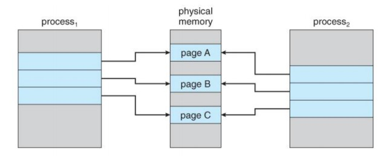
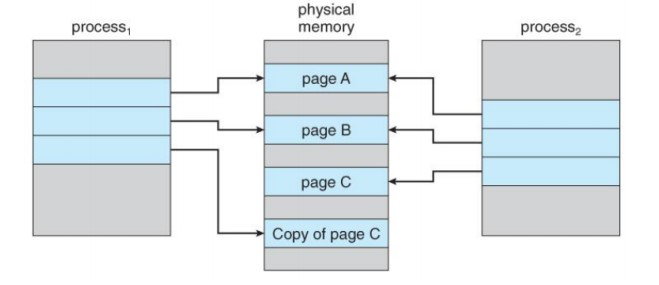
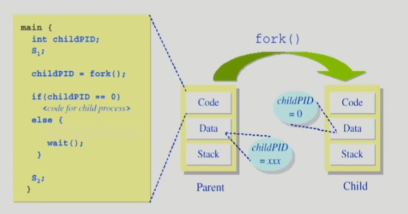
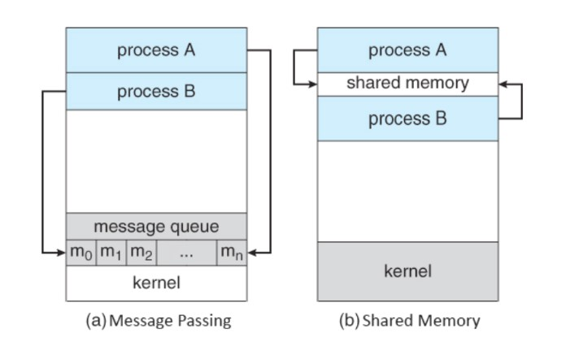

# 04 프로세스 관리 Process Management

## 출처

- 반효경, 운영체제와 정보기술의 원리

- Abraham Silberschatz, Operating System Concept

<hr/>

## 목차

1. [프로세스의 생성과 종료](#1-프로세스의-생성과-종료) <br/>
   &nbsp; 1-1. [프로세스의 생성](#1-1-프로세스의-생성) <br/>
   &nbsp; 1-2. [프로세스의 종료](#1-2-프로세스의-종료) <br/>

<br/>

2. [프로세스 시스템 콜](#2-프로세스-시스템-콜) <br/>
   &nbsp; 2-1. [fork 시스템 콜](#2-1-fork-시스템-콜) <br/>
   &nbsp; 2-2. [exec 시스템 콜](#2-2-exec-시스템-콜) <br/>
   &nbsp; 2-3. [wait 시스템 콜](#2-3-wait-시스템-콜) <br/>
   &nbsp; 2-4. [exit 시스템 콜](#2-4-exit-시스템-콜) <br/>

<br/>

3. [프로세스 간 협력](#3-프로세스-간-협력) <br/>
   &nbsp; 3-1. [메시지 교환 Message Passing](#3-1-메시지-교환-message-passing) <br/>
   &nbsp; 3-2. [데이터 공유 Shared Memory](#3-2-데이터-공유-shared-memory) <br/>

<br/><br/>

<hr/>

## 1. 프로세스의 생성과 종료

<br/>

<hr/>

### 1-1. 프로세스의 생성

<br/>

운영체제가 프로세스를 전부 생성하는 것이라고 생각할 수 있지만 시스템이 부팅된후 최초의 프로세스만 직접 생성하고 그 다음부터는 이미 존재하는 프로세스가 다른 프로세스를 복제 생성하게 된다. 이 때 프로세스를 생성한 프로세스를 `부모 프로세스 Parent Process`, 새롭게 생성된 프로세스를 `자식 프로세스 Children Process`라고 한다. 결과적으로 프로세스는 트리(계층 구조)를 형성한다. 부모와 자식은 별도의 주소 공간을 가진다. 자식 프로세스는 부모의 주소 공간을 그대로 복제하여 생성하고 그 공간에 새로운 프로그램을 올린다. 현실 세계와는 다르게 자식 프로세스가 먼저 죽고, 부모 프로세스는 그 이후에 죽는 구조이다.

<br/>

- 자원공유 여부에 따라 분류 (원칙적으로는 자원을 공유하지 않는다.)
  - 부모 프로세스와 자원을 공유하는 모델
  - 일부를 공유하는 모델
  - 전혀 공유하지 않는 모델(일반적)

<br/>

- 수행(Execution)에 따른 분류
  - 부모와 자식은 공존하며 수행되는 모델
  - 자식이 종료(terminate)될 때까지 부모가 기다리는(wait) 모델

<br/>

유닉스의 경우 `fork()` 시스템 콜이 부모의 주소 공간을 복사(OS data except PID + binary)해 새로운 프로세스를 생성하고 `exec()` 시스템 콜을 통해 새로운 프로그램으로 주소 공간을 덮어씌운다.

<br/>

#### Copy-On-Write

Copy On Write는 위의 fork()와 exec()에서 사용된다. COW는 리소스가 복제되었지만 수정되지 않은 경우 새 리소스를 만들 필요 없이 복사본과 원본이 리소스를 공유하고, 복사본이 수정되었을 때만 새 리소스를 만드는 리소스 관리 기법을 말한다. **간단히 말하면 write인 exec()가 발생했을 때 copy를 진행하는 것이다.**

<br/>

운영체제에서는 COW를 통해 프로세스가 같은 페이지를 공유하게 만들어 overhead를 줄인다. 아래 그림은 process<sub>1</sub>에서 page C가 변경됐을 때의 경우 일어나는 일을 형상화한 것이다. 내용이 변하지 않은 page는 유지하고 변경된 것만 새로운 page를 할당해 가리키게 만드는 것이다.





<br/>

<hr/>

### 1-2. 프로세스의 종료

<br/>

프로세스는 마지막 명령을 수행한 뒤 `exit()`을 통해 운영체제에 알려준다. 자식 프로세스는 부모에게 output data를 전송한다. 또한 프로세스는 종료와 함께 각종 자원들을 운영체제로 반납한다.

<br/>

위의 경우는 자발적으로 프로세스를 종료시키는 경우지만 만약 자식이 할당 자원의 한계치를 넘어서거나, 자식에게 할당된 태스크가 더 이상 필요하지 않다거나, 부모 프로세스가 먼저 종료되어 버리는 경우(운영체제는 부모 프로세스가 종료되는 경우, 자식이 더 이상 수행되도록 두지 않는다)에는 `abort()`를 통해 자식 프로세스를 강제종료를 진행하게 된다.

<br/>

<hr/>

## 2. 프로세스 시스템 콜

<br/>

<hr/>

### 2-1. fork() 시스템 콜

<br/>

- 자식 프로세스는 fork() 이후부터 실행하게 된다.
- fork 함수가 실행 된 직후에는 자식 프로세스 부모 프로레스와 동일한 주소 공간의 복사본을 가지게 된다.
- fork 함수는 부모 프로세스에게는 자식프로세스의 PID를 반환하며 자식 프로세스에게는 0을 반환한다.
- 여기서 PID란 Process ID로 프로세스 식별자이다.

```c
int main()
{
    int pid;
    pid = fork();
    if (pid == 0) // 자식 프로세스의 경우
        printf("\n난 자식 프로세스야\n");
    else if (pid > 0) // 부모 프로세스의 경우
        printf("\n난 부모 프로세스야\n");
}
```

<br/>

<hr/>

### 2-2. exec() 시스템 콜

<br/>

exec()라는 함수는 없다. 다만 exec family가 존재할 뿐이다. 종류는 아래와 같다.

```
int execl(const char *pathname, const char *arg, .../* (char  *) NULL */);
int execv(const char *pathname, char *const argv[]);
int execle(const char *pathname, const char *arg, .../*, (char *) NULL, char *const envp[] */);
int execve(const har* pathname, char *const argv[], char *const ecnp[]);
int execlp(const char *file, const char *arg, .../* (char  *) NULL */);
int execvp(const char *file, char *const argv[]);
int execvpe(const char *file, char *const argv[],char *const envp[]);
```

<br/>

- 아래 코드는 리눅스 환경에 있는 date라는 프로그램을 자식 프로세스에 덮어쓰는 코드이다.

- execlp()가 실행되면 뒤에 있는 코드는 아예 무시되고 함수에서 가리킨 새로운 프로그램을 실행하고 그 프로그램이 종료되면 자식 프로세스도 같이 종료한다.

```c
int main()
{
    int pid;
    pid = fork();
    if (pid == 0)
    {
        print("\n난 자식 프로세스야.\n);
        execlp("/bin/date", "bin/date", (char *)0);
    }
    else if (pid > 0)
        printf("\n난 부모 프로세스야\n");
}
```

<br/>

<br/>

<hr/>

### 2-3. wait() 시스템 콜

<br/>

- 프로세스 A가 wait() 시스템 콜을 호출했을 때
  - 커널은 child가 종료될 때까지 프로세스 A를 sleep시킨다.(block 상태)
  - child process가 종료되면 커널은 프로세스 A를 깨운다.(ready 상태)

```c
int main()
{
    int pid;
    pid = fork();

    if (pid == 0)
        <code for child process>
    else
    {
        wait();
    }
}
```

<br/>



<br/>

<hr/>

### 2-4. exit() 시스템 콜

<br/>

- 자발적 종료
  - 마지막 statement를 수행 후 exit() 시스템 콜을 프로그램에 명시적으로 적어주지 않아도 main 함수가 리턴되는 위치에 exit()함수를 컴파일러가 자동으로 넣어준다.

<br/>

- 비자발적 종료
  - 부모 프로세스가 자식 프로세스를 강제 종료시키는 경우
    - 자식 프로세스가 한계치를 넘어서는 자원 요청
    - 자식에게 할당된 태스크가 더 이상 필요하지 않음
  - 키보드로 kill, break 등을 친 경우
  - 부모가 종료하는 경우
    - 부모 프로세스가 종료하기 전에 자식들이 먼저 종료

<br/>

<br/>

<hr/>

## 3. 프로세스 간 협력

<br/>

프로세스는 각자 자신만의 독립적인 주소 공간을 가지고 수행되며 프로세스가 다른 프로세스의 주소 공간을 참조하는 것은 허용되지 않는다. 따라서 원칙적으로는 하나의 프로세스는 다른 프로세스의 수행에 영향을 미칠 수 없다. 사실상 부모 프로세스와 자식 프로세스는 서로 자원을 획득하기 위해 경쟁적인 관계에 놓이는 `독립적 프로세스 Independent process`이다.

<br/>

경우에 따라서 독립적인 프로세스들이 서로 협력할 때 업무의 효율성이 증진될 수 있다. 운영체제는 프로세스 간의 협력 매커니즘을 제공해 하나의 프로세스가 다른 프로세스의 수행에 영향을 미칠 수 있게 한다. 서로 영향을 미치는 프로세스를 `협력 프로세스 Cooperating process`라고 하고, 프로세스 간 협력 메커니즘을 `IPC: Interprocess Communicatoin`이라고 한다.

<br/>

- IPC의 유형

  - 메시지를 전달하는 방법

    - message passing: 커널을 통해 메시지 전달

  - 주소 공간을 공유하는 방법

    - shared memory: 서로 다른 프로세스 간에도 일부 주소 공간을 공유하게 하는 shared memory 메커니즘

    - cf) thread: **thread는 하나의 프로세스이므로 프로세스 간 협력으로 보기 어렵지만** 동일한 process를 구성하는 thread들 간에는 주소 공간을 공유하므로 협력이 가능하다.



<br/>

<hr/>

### 3-1. 메시지 교환 Message Passing

<br/>

커널이 memory protection을 위해 대리 전달해주는 것을 말한다. 덕분에 안전한 방식이고 동기화 문제가 없다는 장점이 있지만 성능이 비교적 안 좋다는 단점이 존재한다.

<br/>

- Message system
  - 프로세스 사이에 공유 변수(shared variable)를 일체 사용하지 않고 통신하는 시스템

<br/>

- Direct Communication
  - 통신하려는 프로세스의 이름을 명시적으로 표시
  - 

<br/>

- Indirect Communication
  - mailbox (또는 port)를 통해 메시지를 간접 전달
  - 

<br/>

<hr/>

### 3-2. 데이터 공유 Shared Memory

<br/>

프로세스 간의 공유된 메모리를 생성해 이용하는 것을 말한다. 성능이 좋지만 보안이 취약하고 동기화 문제가 발생한다는 단점이 있다.

<br/>

<br/>

<hr/>
