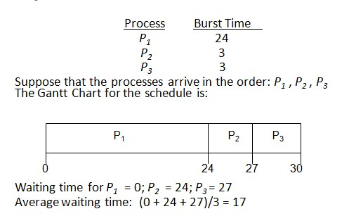
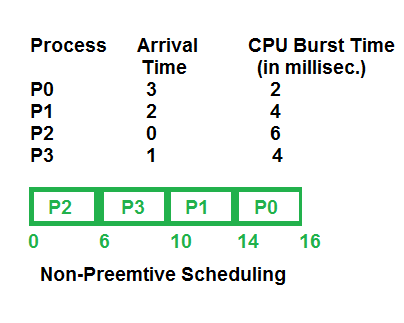

# 05 CPU 스케줄링 - CPU Scheduling

## 목차

1. [CPU 스케줄링](#1-cpu-스케줄링)  
   &nbsp; 1-1. [CPU Burst](#1-1-cpu-burst)  
   &nbsp; 1-2. [CPU Scheduler](#1-2-cpu-scheduler)  
   &nbsp; 1-3. [Dispatcher](#1-3-dispatcher)  

 

2. [스케줄링 알고리즘 Scheduling Algorithm](#2-스케줄링-알고리즘-scheduling-algorithm)  
   &nbsp; 2-1. [비선점형 스케줄링 Non-Preemptive Scheduling](#2-1-비선점형-스케줄링-non-preemptive-scheduling)  
   &nbsp; 2-2. [선점형 스케줄링 Preemptive Scheduling](#2-2-선점형-스케줄링-preemptive-scheduling)  
   &nbsp; 2-3. [알고리즘의 성능 척도](#2-3-알고리즘의-성능-척도)  

 

3. [다양한 경우에서의 스케줄링](#3-다양한-경우에서의-스케줄링)  
   &nbsp; 3-1. [Multiple Processor Scheduling](#3-1-multiple-processor-scheduling)  
   &nbsp; 3-2. [Real Time Scheduling](#3-2-real-time-scheduling)  
   &nbsp; 3-3. [Thread Scheduling](#3-3-thread-scheduling)  

  

## 1. CPU 스케줄링

 

### 1-1. CPU Burst

 

- 각 단계에서 CPU를 사용하는지, I/O 작업을 수행하는지에 따라 CPU burst, I/O burst 라고 부른다.

 

- 빈도수가 치솟아 있는 뾰족한 부분이 `I/O bound job`이다.

- 그래프에 small number of long CPU burst라고 표기되어 있는 부분이 `CPU bound job`이다.

- CPU bound job은 CPU에서 복잡한 계산을 수행하는 것을 말한다. 프로그램당 소요시간이 길다. 반면에 I/O bound job은 I/O 요청이 주를 이루어 CPU를 사용하는 시간은 짧지만 많은 instruction을 수행한다.

 

### 1-2. CPU Scheduler

 

CPU Scheduler는 준비 상태에 있는 프로세스들 중에 어떤 프로세스에게 CPU를 할당할지 결정하는 운영체제의 코드이다. CPU 스케줄링이 발생하는 상황은 아래와 같다.

1. 실행 상태에 있던 프로세스가 I/O 요청 등에 의해 봉쇄(blocked) 상태로 바뀌는 경우
2. 실행 상태에 있던 프로세스가 타이머 인터럽트 발생에 의해 준비 상태로 바뀌는 경우
3. I/O 요청으로 봉쇄 상태에 있던 프로세스의 I/O 작업이 완료되어 인터럽트가 발생하고 그 결과 이 프로세스의 상태가 준비 상태로 바뀌는 경우
4. CPU에서 실행 상태에 있는 프로세스가 종료되는 경우

 

- 비선점형 스케줄링 `nonpreemptive`
  - CPU를 획득한 프로세스가 스스로 CPU를 반납할 때까지 CPU 제어권을 박탈당하지 않는 방식
  - 위의 1, 4번이 비선점형의 예

 

- 선점형 스케줄링 `preemptive`
  - 프로세스가 CPU를 계속 사용하기를 원하더라도 운영체제가 강제로 빼앗을 수 있는 방식
  - 할당 시간(time quantum)을 부여한 후 타이머 인터럽트를 발생시키는 방법이 선점형의 한 예시
  - 위의 2, 3번이 선점형의 예

 

### 1-3. Dispatcher

 

CPU 스케줄러가 어떤 프로세스에게 CPU를 할당할 지 결정하고나면 선택된 프로세스에게 실제로 CPU를 이양하는 작업이 필요하다. 새롭게 선택된 프로세스가 CPU 제어권을 할당받고 작업을 수행할 수 있도록 환경 설정을 해주는 커널 모듈을 `디스패처 Dispatcher`라고 한다.

 

디스패처가 하는 일을 자세하게 묘사하자면, 현재 수행 중인 프로세스의 문맥을 그 프로세스의 PCB에 저장하고 새롭게 선택된 프로세스의 문맥을 PCB로부터 복원한 후 그 프로세스에게 CPU를 넘기는 과정을 수행한다. 새로운 프로세스는 문맥을 복원한 후 사용자 모드로 시스템 상태를 전환해 사용자 프로그램에게 CPU 제어권을 넘겨준다.

 

디스패처가 하나의 프로세스를 정지시키고 다른 프로세스에게 CPU를 전달할 때까지 걸리는 시간을 `디스패치 지연 시간 dispatch latency`라고 부른다. 디스패치 지연 시간의 대부분이 문맥 교환 오버헤드에 해당한다.

 

## 2. 스케줄링 알고리즘 Scheduling Algorithm

 

#### 스케줄링 알고리즘의 평가 기준

CPU 스케줄링 알고리즘은 아래의 평가 기준에 따라 평가하고 선택하게 된다.

|  항목  |  설명 |
| :--: | :--: |
| CPU 사용률(CPU Utilizatoin) | 전체 시스템 시간 중 CPU가 작업을 처리하는 시간의 비율 |
| 처리량(Throughput) | CPU가 단위 시간당 처리하는 프로세스의 개수 |
|  응답 시간(Response Time) | 대화식 시스템에서 요청 후 응답이 오기 시작할 때까지의 시간 |
|   대기 시간(Waiting Time)  |  프로세스가 준비 큐 내에서 대기하는 시간의 총합 |
| 반환 시간(Turnaround Time) (또는 소요시간)  | 프로세스가 시작해서 끝날 때까지 걸리는 시간 |

 

### 2-1. 비선점형 스케줄링 Non-preemptive Scheduling

 

비선점 프로세스 스케줄링은 `FCFS`, `SJF`, `HRRN` 등이 있다.

 

#### FCFS 스케줄링

먼저 자원 사용을 요청한 프로세스에게 자원을 할당해 주는 방식의 스케줄링 알고리즘이다. 큐의 원리와 같다. 어떤 프로세스가 앞에 오느냐에 따라 큰 영향을 받는 스케줄링이다. 
- convoy effect: 소요시간이 긴 프로세스가 먼저 도달하여 시간을 잡아먹고 있는 부정적인 현상

 

- FCFS Scheduling의 과정

 

#### SJF 스케줄링

평균 대기 시간을 최소화하기 위해 CPU 점유 시간이 가장 짧은 프로세스에 CPU를 먼저 할당하는 방식이다. 각 프로세스와 다음의 
CPU burst time을 가지고 스케줄링에 활용한다. CPU burst time이 가장 짧은 프로세스를 제일 먼저 스케줄한다. 
요구 시간이 긴 프로세스는 기아 상태가 발생할 수 있으며, 대기 상태에 있는 프로세스의 요구시간에 대한 정확한 자료를 얻기 어렵다는 문제점이 있다. 또한 주어진 프로세스들에 대해 minimum average waiting time을 보장할 수 있다는 장점이 있다. 단기 스케줄링 보다는 장기 스케줄링에 유리하다. 
이 알고리즘은 비선점형(CPU 제어권을 얻으면 이번 CPU burst가 끝날 때까지 CPU를 선점 당하지 않음)와 선점형(현재 수행 중인 프로세스의 남은 burst time보다 짧은 CPU burst time을 가진 새로운 프로세스가 도착하면 CPU를 빼앗김) 모두에 적용될 수 있는데, 선점형에 적용되는 SJF 스케줄링을 특별히 SRTF 스케줄링이라 한다.
- starvation(기아): 프로세스가 지나치게 차별받는 문제가 발생해 CPU burst time이 긴 프로세스는 영원히 CPU를 할당받을 수 없는 상황이 발생
- 다음 CPU burst를 추정만 가능하고 실제로는 알 수 없다는 점이 문제
- CPU burst time 예측 방법: 지수 평활법 exponential averaging

 

- SJF Scheduling의 과정

- 이미지 출처: https://www.geeksforgeeks.org/preemptive-and-non-preemptive-scheduling/

 

#### HRRN 스케줄링

프로세스 처리의 우선 순위를 CPU 처리 기간과 해당 프로세스의 대기 시간을 동시에 고려해 선정하는 스케줄링 알고리즘이다. SJF 스케줄링의 문제점을 보완해 개발된 스케줄링이다. 

- `우선순위 = (대기시간+처리시간) / 처리시간`

 

#### priority 스케줄링

우선순위가 높은 프로세스를 먼저 스케줄링하는 방식이다. 우선순위는 해당 프로세스의 중요도를 고려하여 부여한다. 어떻게 보면 SJF도 다음 CPU burst time에 따라 중요도를 계산하는 일종의 우선순위 스케줄링으로 볼 수 있다. Non-Preemtive와 Preemtive 둘 다 가능한 스케줄링 방식이다. 
SJF와 같이 Starvation이 발생할 수 있다. 이를 해결하기 위해 `Aging`을 활용할 수 있다. 프로세스에 나이를 부여해 나이가 높을수록 우선순위를 높여주는 것을 의미한다.

 

### 2-2. 선점형 스케줄링 Preemptive Scheduling

 

선점 프로세스 스케줄링에는 `RR`, `SRTF`, `다단계 큐`, `다단계 피드백 큐`, `RM`, `EDF` 등이 있다. 현대의 CPU 스케줄링은 대부분 선점형 스케줄링 알고리즘을 사용한다.

 

#### RR 스케줄링

Round Robin Scheduing은 가장 현대적이며 시분할 시스템을 위한 선점형 스케줄링 방식이다. 각 프로세스는 동일한 크기와 할당 시간(Time Quantum)을 가진다. 보통 할당 시간은 10 ms ~ 100 ms 정도이다. 

할당 시간이 지나면 프로세스는 준비 큐의 끝에 가서 다시 줄을 서게 된다. n개의 프로세스가 ready queue에 있고 할당 시간이 **q time unit**인 경우 각 프로세스는 최대 q time unit 단위로 CPU 시간의 1/n을 얻기 때문에 어떤 프로세스도 `(n-1)*q time unit` 이상 기다리지 않는다는 특징이 있다. 문맥 전환의 오버헤드가 큰 반면, 응답시간이 짧아지는 장점이 있어 실시간 시스템에 유리하다.

- RR은 아래와 같이 프로세스가 CPU를 번갈아가며 사용한다는 특징이 있다. 일반적으로 SJF보다 average turnaround time이 길지만 response time은 더 짧다.

 

- time quantum의 단위에 따라서 turnaround 성능이 달라진다.

 

#### SRTF 스케줄링

위에서 설명했다시피 SJF 스케줄링을 선점형으로 만든 것이다. 현재 작업 중인 프로세스를 중단시키고 최단 잔여시간 프로세스의 처리를 시작하는 방식이다. 선점형 SJF 스케줄링 또는 SRT (Shortest Remaining Time) 스케줄링이라고도 한다.

 

#### 다단계 큐 스케줄링 Multilevel Queue SchedulingPermalink

커널 내의 준비 큐를 여러 개의 큐로 분리하여 큐 사이에도 우선순위를 부여하고 각각의 큐에 대해 다른 스케줄링 알고리즘을 적용하는 스케줄링 알고리즘이다. 쉽게 말하자면 우선 순위에 따라 큐를 배정하되, 같은 큐 안에서는 Round Robin이나 다른 방식으로 Process를 Scheduling하는 방식이다. 프로세스들은 조건에 맞는 큐에 영구적으로 할당된다. 
일반적으로는 Process type에 따라 우선순위를 결정한다. 높은 우선순위의 큐와 프로세스를 무조건 먼저 실행할수도 있지만 starvaion이 발생하기 때문에 이를 방지하기 위해 각 큐마다 CPU time을 적절한 비율로 할당하는 `Time Slice`를 사용할 수 있다. 목적에 따라 Scheduling Algorithm은 완전히 다를수도 있다.

- 아래 그림과 같이 우선순위에 따라 큐를 하나씩 만들어 프로세스들을 알맞은 큐에 각각 배정한다.

 

#### 다단계 피드백 큐 스케줄링 Multilevel Feedback Queue Scheduling

다단계 큐 스케줄링에서 한 단계 발전된 방식이다. 다단계 큐 스케줄링에서는 프로세스가 하나의 큐에 영구적으로 할당되지만, 다단계 피드백 큐 스케줄링에서는 프로세스가 다른 큐로 이동이 가능하다. Aging 등의 방식으로 대기 시간이 긴 프로세스를 높은 우선순위 큐에 올려 starvaion를 막을 수 있다. 
Queue의 수, 각 큐의 scheduling algorithm, 프로세스를 상위 큐로 승격시키는 기준, 프로세스를 하위 큐로 강등시키는 기준, 프로세스가 CPU 서비스를 받으려 할 때 들어갈 큐를 결정하는 기준 등을 정해야한다.  
일반적으로, 처음 들어오는 프로세스는 우선순위가 가장 높은 큐에 넣어준다. 상위 큐일수록 Round-Robin의 할당 시간이 짧고, 하위 큐일수록 할당 시간이 길다. 제일 밑의 큐는 FCFS 알고리즘을 사용한다.

 

### 2-3. 알고리즘의 성능 척도

 

- Queueing models
   - 이론적인 방법이다.
   - 확률 분포로 주어지는 arrival rate와 service rate 등을 통해 각종 performance index 값을 계산한다.
   - 

 

- Implementation(구현)과 Measurement(성능 측정)
   - 시간도 오래 걸리고 어려운 방법이다.
   - 실제 시스템에 알고리즘을 구현하여 실제 작업(workload)에 대해서 성능을 측정하고 비교한다.
   - 예를 들어 리눅스 커널에서 직접 구현한 스케줄러 프로그램을 실행시켜 그 성능을 측정할 수 있다.

 

- Simulation(모의 실험)
   - 구현&성능 측정에 비해 비교적 쉬운 방식이다.
   - 알고리즘을 모의 프로그램으로 작성 후 `trace`를 입력으로 하여 결과를 비교한다.
   - `trace`란 프로그램을 이용해 추출하거나 임의로 만든 input data를 의미한다. 해당 데이터는 simulation의 입력으로 들어가게 된다.
   - 예를 들자면, 사용자 모드(커널 실행X)에서 모의 프로그램을 통해 작업의 처리 예제를 만들어 그 성능을 측정할 수 있다.
   - 실제 CPU의 burst time까지 고려해야 프로그램을 구성해야 신빙성이 있다.
   

 

## 3. 다양한 경우에서의 스케줄링

 

### 3-1. Multiple-Processor Scheduling

 

CPU가 여러 개 있는 경우에서의 스케줄링이다. CPU가 많을수록 스케줄링은 더욱 복잡해진다. 

 

- Homogeneous processor인 경우
   - 특정 프로세스가 반드시 특정 CPU에서 실행되어야하는 경우이다.
   - 문제가 더 복잡해진다.

 

- Load sharing
   - 일부 프로세서에 job이 몰리지 않도록 부하를 적절히 공유하는 메커니즘이 필요하다.
   - 별개의 큐를 두는 방법을 사용할 수도, 공동 큐를 사용할 수도 있다.

 

- Symmetric Multiprocessing(SMP)
   - 모든 CPU가 대등하다는 전제가 있다.
   - 각 프로세서가 각자 알아서 스케줄링을 결정하는 방식이다.

 

- Asymmetric multiprocessing
   - 하나의 프로세서가 시스템 데이터의 접근과 공유를 책임지고 나머지 프로세서는 거기에 따른다.

 

### 3-2. Real-Time Scheduling

 

Real-time Job은 데드라인이 정해진 task이다. 반드시 정해진 시간 안에 실행되어야 한다는 특징이 있다. 각 Job들이 데드라인을 지킬 수 있도록 스케줄링을 미리 하는 방법을 사용한다.

 

- Hard real-time systems
   - Hard real-time task는 정해진 시간 안에 반드시 끝내도록 스케줄링해야한다.

 

- Soft real-time computing
   - Soft real-time task는 일반 프로세스에 비해 높은 priority를 갖도록 해야한다.

 

### 3-3. Thread Scheduling

 

Thread는 한 프로세스 안에 CPU 수행단위가 여러 개 있는 것을 말한다.

 

- Local Scheduling
   - User level thread의 경우 사용자 수준의 thread library에 의해 어떤 thread를 스케줄할지 결정한다.

 

- Global Scheduling
   - Kernel level thread의 경우 일반 프로세스와 마찬가지로 커널의 단기 스케줄러가 어떤 thread를 스케줄할지 결정한다.

 

## 출처

- 반효경, 운영체제와 정보기술의 원리

- Abraham Silberschatz, Operating System Concept

- https://rebro.kr/

