# 06 프로세스 동기화 Process Synchronization

<hr/>

## 목차

1. [데이터와 프로세스](#1-데이터와-프로세스) <br/>
   &nbsp; 1-1. [데이터의 접근](#1-1-데이터의-접근) <br/>
   &nbsp; 1-2. [Race Condition](#1-2-race-condition) <br/>
   &nbsp; 1-3. [Process Synchronization Problem](#1-3-process-synchronization-problem) <br/>

<br/>

2. [동기화 알고리즘](#2-동기화-알고리즘-sychronization-algorithms) <br/>
   &nbsp; 2-1. [알고리즘1](#2-1-algorithm-1) <br/>
   &nbsp; 2-2. [알고리즘2](#2-2-algorithm-2) <br/>
   &nbsp; 2-3. [알고리즘3](#2-3-algorithm-3--petersons-algorithm) <br/>

<br/>

3. [동기화 하드웨어](#3-동기화-하드웨어-sychronization-hardware) <br/>

<br/>

4. [세마포어](#4-세마포어-semaphores) <br/>
   &nbsp; 4-1. [Semaphores 적용](#4-1-semaphores-적용) <br/>
   &nbsp; 4-2. [Block & Wakeup](#4-2-block--wakeup-방식) <br/>
   &nbsp; 4-3. [교착과 기아](#4-3-교착과-기아-상태-deadlock-and-starvationg) <br/>

<br/>

5. [고전적인 동기화 문제](#5-고전적인-동기화-문제-classical-problem-of-sunchronization) <br/>
   &nbsp; 5-1. [Bounded Buffer Problem](#5-1-bounded-buffer-problemproducer-consumer-problem) <br/>
   &nbsp; 5-2. [Readers & Writers Problem](#5-2-readers-and-writers-problem) <br/>
   &nbsp; 5-3. [식사하는 철학자 문제](#5-3-dining-philosophers-problem) <br/>

<br/>

6. [Monitor](#6-monitor) <br/>
   &nbsp; 6-1. [Monitor의 개념](#6-1-monitor의-개념) <br/>
   &nbsp; 6-2. [Bounded Buffer Problem](#6-2-bounded-buffer-problem) <br/>
   &nbsp; 6-3. [식사하는 철학자 문제](#6-3-dining-philosophers) <br/>

<br/><br/>

<hr/>

## 1. 데이터와 프로세스

<br/>

프로세스 동기화는 병형 제어(Concurrency Control)이라고 불리기도 한다. 프로세스 동기화의 핵심 중 하나인 프로세스와 데이터의 관계에서 시작해 동기화 알고리즘, Semaphores, Monitor에 대해 알아보자.

<br/>

<hr/>

### 1-1. 데이터의 접근

<br/>

- 컴퓨터에서 데이터에 접근하는 패턴
- 데이터를 저장하는 위치와 데이터를 연산하는 위치가 있다.

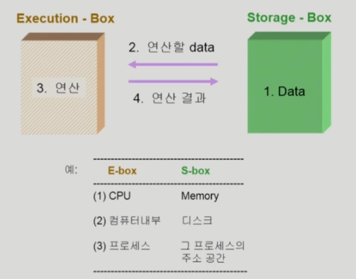

<br/>

<hr/>

### 1-2. Race Condition

<br/>

여러 주체(여러 프로세스)가 하나의 데이터(공유 데이터)를 접근하려고 할 때 이를 `Race Condition`이라고 한다. 데이터의 최종 연산 결과는 마지막에 그 데이터를 다룬 프로세스에 따라 달라진다.

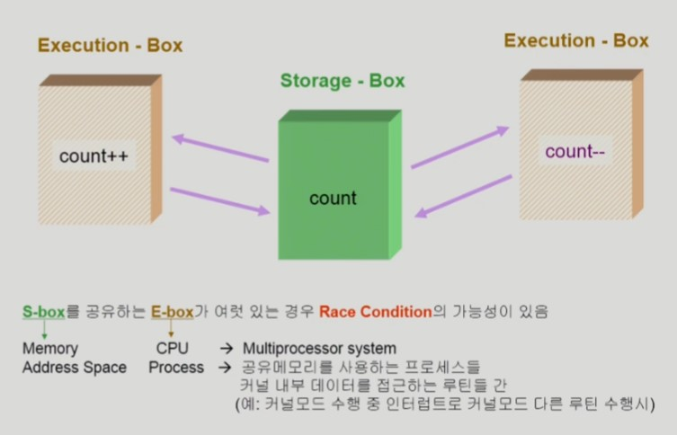

<br/>

OS에서 race condition이 발생하는 시점은 아래와 같다.

1. kernel 수행 중 인터럽트 발생 시
   - `count++`이라고 적힌 코드는 3가지 instruction에 의해서 수행된다. Load, Increment, Store
   - 해당 작업이 수행될 때 인터럽트가 들어오면 `count++`을 멈추고 인터럽트 처리루틴으로 넘어가 Interrupt handler가 실행된다.
   - **Interrupt handler**는 커널에 있는 코드이다.
   - Interrupt handler에 있는 내용인 `count--`가 실행되면 루틴을 빠져나와 본래 실행 중이던 주소로 돌아와 `count++`을 실행한다.
   - 결과적으로는 1을 감소 시킨 것은 반영이 되지 않고 1을 증가시킨 것만 반영된다. 왜냐하면 `count++`는 count를 감소시키기 전의 값을 가져와 증가시켜 저장하기 때문이다.
   - 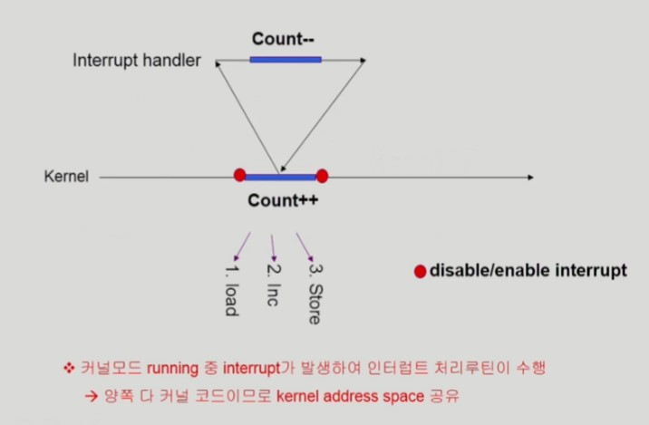
   - 작업이 진행되는 동안 Interrupt를 막는다면 해당 문제를 해결할 수 있다.

<br/>

2. Process가 System call을 하여 kernel mode로 수행 중인데 context switch가 일어나는 경우
   - 아래 같은 P<sub>A</sub>가 있는데, system call이 일어나 kernel mode일 때 P<sub>B</sub>가 CPU 제어권을 가져갔다.
   - 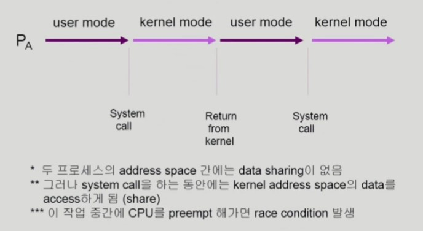
   - kernel mode일 때 CPU를 선점하면??
   - 아래와 그림을 보면 원래는 count가 2가 증가해야하지만 P<sub>B</sub>의 `count++`은 적용되지 않아 1만 증가하게 된다. 동기화(Synchronization) 문제가 발생한 것이다.
   - kernel mode일 때는 선점당하지 않도록 해야한다.
   - 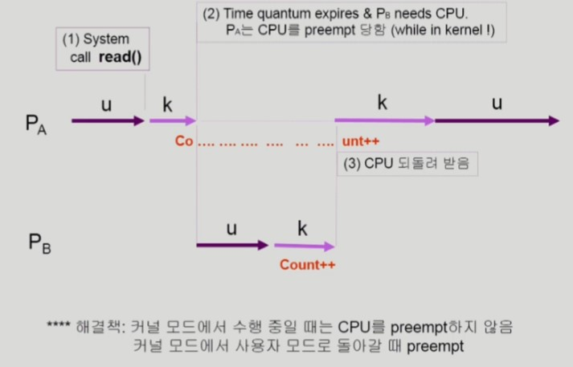

<br/>

3. Multiprocessor에서 shared memory 내의 kernel data
   - CPU가 여러 개 있는 환경, 자주 등장하는 상황은 아니다.
   - 작업 주체가 여럿이기 때문에 발생하는 문제이다.
   - 데이터를 수정하기 전에 해당 데이터에 lock을 걸어 다른 주체가 접근하지 못하게 해야 한다.
   - 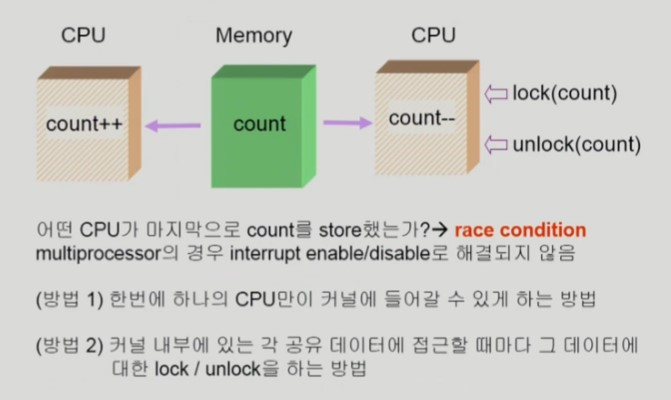

<br/>

<hr/>

### 1-3. Process Synchronization Problem

<br/>

공유 데이터(shared data)의 동시 접근(concurrent access)은 데이터의 불일치 문제(inconsistency)를 발생시킬 수 있다. 일관성(consistency) 유지를 위해 협렵 프로세스(cooperating process) 간의 실행 순서(orderly execution)을 정해주는 매커니즘이 필요하다. race condition을 막기 위해서는 concurrent process가 동기화(synchronize)되어야 한다.

<br/>

n 개의 프로세스가 공유 데이터를 동시에 사용하기를 원하는 경우 각 프로세스의 code segment에는 공유 데이터를 접근하는 코드인 `임계구역 Critical Section`이 존재한다.<br>
하나의 프로세스가 critical section에 있을 때 다른 모든 프로세스는 critical section에 들어갈 수 없어야 프로세스 동기화 문제가 발생하지 않는다.

<br/>

- 프로세스들의 일반적인 구조: critical section에 주목

```c
do {
    entry section
    critical section
    exit section
    remainder section
} while(1);
```

<br/>

<hr/>

### 2. 동기화 알고리즘 Sychronization Algorithms

<br/>

#### 전제

- 프로세스의 critical section 문제를 해결한다.
- 모든 프로세스의 수행 속도는 0보다 크다.
- 프로세스들 간의 상대적인 수행 속도는 가정하지 않는다.

<br/>

#### 프로그램적 해결법의 충족 조건

- 상호 배제 Mutual Exclusion

프로세스 P<sub>i</sub>가 critical 부분을 수행 중이면 다른 모든 프로세스들은 그들의 critical section에 들어가면 안된다.

<br/>

- 진행 Progress

아무도 critical section에 있지 않은 상태에서 critical section에 들어가고자 하는 프로세스가 있으면 critical section에 들어가게 해줘야 한다.

<br/>

- 유한 대기 Bounded Waiting

프로세스가 critical section에 들어가려고 요청한 후부터 그 요청이 허용될 때까지 다른 프로세스들이 critical section에 들어가는 횟수에 제한이 있어야 한다.

<br/>

<hr/>

### 2-1. Algorithm 1

<br/>

- Process P<sub>i</sub>

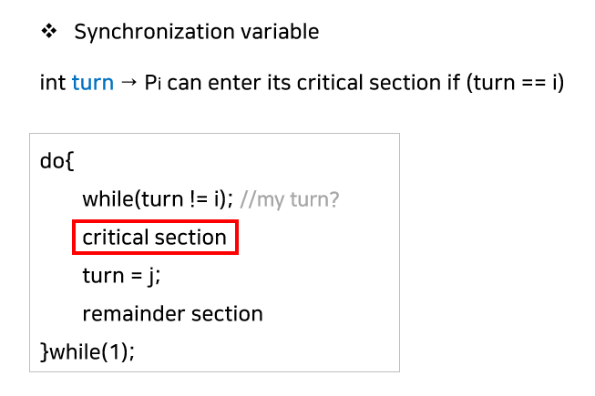

- P<sub>i</sub>가 critical section에 있는 동안 P<sub>j</sub>는 turn이 j가 아니므로 while문에 갇혀있는다. 만약 P<sub>i</sub>가 임계 구역을 빠져나오고 turn=j로 턴을 넘겨주면 P<sub>j</sub>가 실행된다.
- Mutual exclusion은 만족하지만 Progress를 만족하지 못한다.
- 과잉양보: 반드시 한 번씩 교대로 들어가야만 한다. (swap-turn) 해당 프로세스가 turn을 나의 프로세스 값으로 바꿔줘야만 들어갈 수 있다.
- critical section의 문제를 해결하지 못한 방법이다.

<br/>

<hr/>

### 2-2. Algorithm 2

<br/>

- Process P<sub>i</sub>

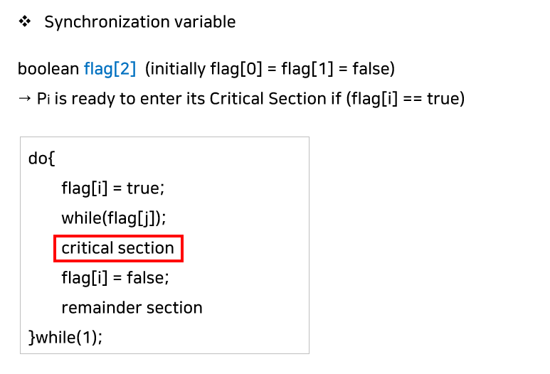

- flag는 본 프로세스가 critical section으로 들어가겠다는 의중을 표시하는 변수이다.
- 자신의 flag를 true로 바꾸고 상대방의 flag를 확인한다. 만약 상대방의 flag가 true라면 critical section을 나올 때까지 기다린다.
- 위와 마찬가지로 Mutual exclusion은 만족하지만 Progress를 만족하지 못한다.
- 만약 두 개의 프로세스가 모두 flag=true이라면 2행의 while에 들어갔다면 끊임 없이 양보하는 상황이 발생할 수 있다.

<br/>

<hr/>

### 2-3. Algorithm 3 = Peterson's Algorithm

<br/>

- 아래 알고리즘은 `Peterson's Algorithm`이다.

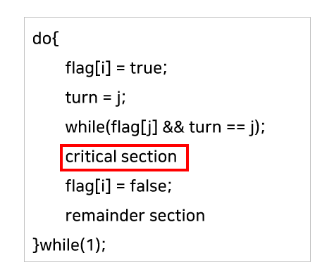

- 알고리즘1, 2의 flag와 turn를 모두 사용한 알고리즘이다.
- 만약 프로세스가 2개라면 해당 알고리즘으로 critical section 문제를 해결할 수 있다.
- 위의 3개의 조건(Mutual Exclusion, Progress, Bounded waiting)을 모두 충족한다.
- 하지만 critical section 진입을 기다리면서 계속 CPU와 메모리를 사용하는 `Busy Waiting(=spin lock)`의 문제점이 존재한다.

<br/>

<hr/>

### 3. 동기화 하드웨어 Sychronization Hardware

<br/>

하드웨어적으로 Test & modify를 atomic하게(원자성을 지키면서) 수행할 수 있도록 지원하면 앞의 문제는 간단하게 해결이 가능하다.

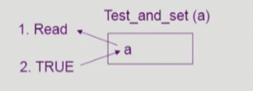

- 위의 Test_and_Set(a) instruction은 `a`의 현재 값을 읽어오고 `a`를 1로 바꿔주는 명령이다. 두 개를 한 번에 처리한다.

<br/>

- Test_and_Set() instruction을 이용한 상호 배제(Mutual Exclusion)

```
Synchronization variable :
	boolean lock = false;

Process Pi
	do {
		while (Test_and_Set(lock));
        	critical section
        	lock = false;
        	remainder section
  	  }
```

- lock을 걸고 critical section으로 진입한다. 그러면 다른 프로세스는 진입하지 못한다.

<br/>

<hr/>

## 4. 세마포어 Semaphores

<br/>

세마포는 동기화를 위해 만들어진 소프트웨어이며 추상적인 동기화 도구이다. 사전적 의미로는 역이나 군대에서 사용하는 수신호나 깃발을 뜻한다. `Semaphores`는 구체적인 구현이 과정이 없는 추상자료형이라고 할 수 있다.

세마포어는 오직 2가지, P(S) 와 V(S) 라는 Atomic 한 연산에 의해서만 접근 가능이 가능하다. P(S)는 공유데이터 값을 획득하는 과정이고 V(S)는 사용이 끝난 후 반납하는 과정이다. 세마포어는 리소스의 상태를 나타내는 카운터이다. S가 5라면 자원이 5개 있는 것이다.

<br/>

세마포어는 두 종류가 있다. **Counting Semaphore**는 도메인(범위)이 0 이상인 정수값이다. 주로 자원의 개수를 세는 데(resourse counting) 사용한다. **Binary Semaphore(=mutex)**는 정수 값이 오직 0 또는 1이다. 주로 mutual exclusion(lock/unlock)에 사용된다.

<br/>

<hr/>

### 4-1. Semaphores 적용

<br/>

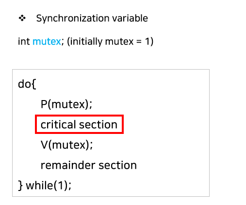

- 위 방식을 `busy-wait(=spin lock)`가 발생하므로 효율적이지 못하다. `Block & Wakeup(=sleep lock)` 방식을 사용하면 효율성을 높일 수 있다.

<br/>

<hr/>

### 4-2. Block & Wakeup 방식

<br/>

- 세마포어는 아래와 같이 정의

```
type struct{
  int value;			// Semaphore
  struct process *L;		// Wait Queue
}semaphore;
```

`block`을 수행하면, 커널은 `block`을 호출한 프로세스를 suspend 시키고 해당 프로세스의 `PCB`를 `wait queue`에 넣어준다. 
`Wakeup`을 수행하면 `block` 된 프로세스 P를 깨운 다음, 이 프로세스의 `PCB`를 `Ready Queue`로 이동시킨다.


<br/>

```
P(S){
  S.value--; // prepare to enter
  if(S.value < 0){
    add this precess to S.queue;
    block();
  }
}

V(S){
  S.value++;
  if(S.value <= 0){
    remove a process P from S.queue;
    wakeup(P);
  }
}
```

- P(S) 연산은 자원을 획득, V(S) 연산은 자원을 반납한다.
- S.value가 음수라면 자원의 여분이 없는 것이기 때문에 lock이 걸린다.

<br/>

<hr/>

### 4-3. 교착과 기아 상태 Deadlock and Starvation

<br/>

`Deadlock`은 둘 이상의 프로세스가 서로 상대방에 의해 충족될 수 있는 event를 무한히 기다리는 현상을 얘기하는데, 세마포어로 인해 교착 상태가 발생할 수 있다.

<br/>

- S와 Q가 1로 초기환된 Semaphore라고 가정해보자.

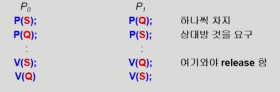

- 두 프로세스는 S와 Q가 모두 있어야 실행될 수 있는 상태이지만 P<sub>0</sub>는 S을 잡고 있고 P<sub>1</sub>은 Q를 가지고 놓고 있지 않기 때문에 상대방을 영원히 기다리는 교착 상태가 발생한다.

<br/>

세마포어에서의 `Starvation(=indefinite blocking)`은 프로세스가 suspend된 이유에 해당하는 세마포어 큐에서 빠져나갈 수 없는 현상을 뜻한다.

<br/>

<hr/>

## 5. 고전적인 동기화 문제 Classical Problem of Sunchronization

<br/>

<hr/>

### 5-1. Bounded-Buffer Problem(Producer-Consumer Problem)

<br/>

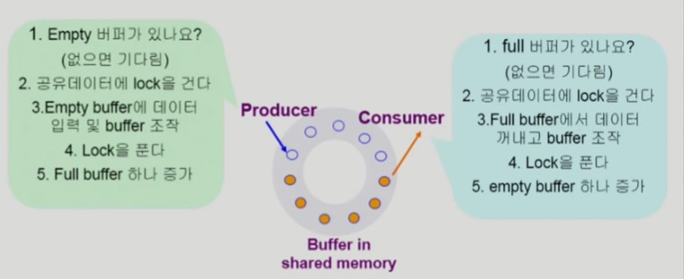

생산자(Producer) 프로세스와 소비자(Consumer) 프로세스가 여러 개 있고 그 사이에 공유 버퍼가 있다고 가정하자. 생산자는 내용이 있는 버퍼(주황색)를 만들어내는 역할을 한다. 소비자는 해당 버퍼를 소비해 버퍼를 사용하고 비운다.<br/>
만약 둘 이상의 생산자가 비어있는 버퍼를 동시에 보고 데이터를 만들어 넣는다면 문제가 발생할 수 있다. 마찬가지로 둘 이상의 소비자가 동시에 동일한 버퍼의 데이터를 사용한다면 문제가 발생할 수 있다. 따라서, 동시에 버퍼에 접근할 수 없도록 lock을 걸어줘야 한다.<br/>
버퍼가 꽉 찬 상태에서 생산자는 반드시 소비자가 버퍼의 데이터를 사용하기를 기다려야 하고, 버퍼가 빈 상태에서 소비자는 생산자가 버퍼를 채우기를 기다려야 한다. 그러므로 lock을 적시에 걸고 풀며, 자원의 개수를 카운팅 하기 위해 세마포어 변수를 사용한다. (**mutual exclusion는 binary semaphore(=mutex) 사용**, **resource count는 integer semaphore 사용**)

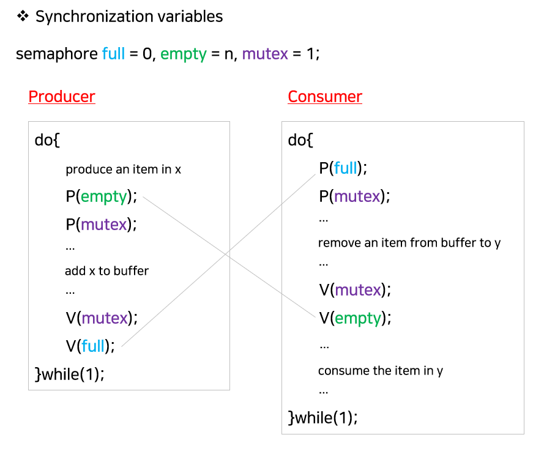

- lock을 걸어주는 mutex 변수(binary semaphore)
- 내용이 들어있는 버퍼를 세는 full 변수(integer semaphore)
- 비어있는 버퍼를 세는 empty 변수(integer semaphore)

<br/>

<hr/>

### 5-2. Readers and Writers Problem

<br/>

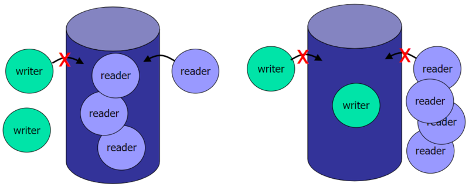

Readers-Writers Problem은 한 프로세스가 DB에 데이터를 write하는 작업을 수행할 때 다른 프로세스가 접근하면 안 되고, 읽는 작업은 여러 프로세스가 동시에 수행 가능하도록 하는 문제이다.  만약 데이터에 대해 하나의 lock을 사용하게 되면 데이터의 일관성은 지킬 수 있으나, 여러 프로세스가 동시에 읽을 수 없다면 매우 비효율적일 것이다. 
문제 해결법은 아래와 같다.

- Writer가 DB에 접근 허가를 얻지 못한 상태에서는 모든 대기 중인 Reader들이 DB에 접근할 수 있게 허용한다.
- Writer는 대기 중인 Reader가 하나도 없는 경우 접근하도록 한다.
- Writer가 접근 중이면 Reader들은 접근할 수 없도록 한다.
- Writer가 DB를 빠져나가야만 Reader들의 접근이 허용된다.

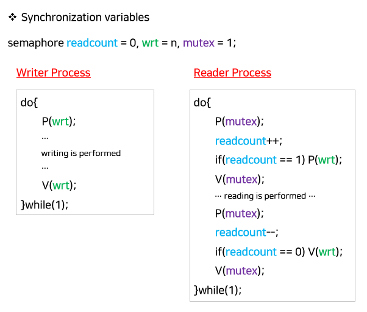

- readcount: 현재 접근 중인 Reader의 수
- mutex: 공유 변수 readcount를 접근하는 코드(critical section)의 mutual exclusion을 보장하기 위해 사용하는 변수
- wrt: reader와 writer가 공유 DB를 올바르게 접근하기 위한 변수

만약 n개의 reader가 기다리고 있다면, 제일 처음 reader만 wrt 세마포어에 넣고 나머지 n-1개의 reader는 mutex 세마포어 큐에 넣어둠으로써 효율성을 높여준다. 그러나 Starvation이 발생할 가능성이 있다. 계속해서 reader가 들어오거나 writer가 들어오는 경우 한쪽이 계속 수행되지 않을 수 있다. 이 문제를 해결하기 위해 큐에 우선순위를 부여한다거나, 일정 시간이 지나면 자동으로 write or read가 실행되도록 하면 해결할 수 있다.

<br/>

<hr/>

### 5-3. Dining-Philosophers Problem

<br/>

- 다섯 명의 철학자가 원형 식탁에 않아 있다.
- 철학자는 식사와 생각을 번걸아 가면서 한다.

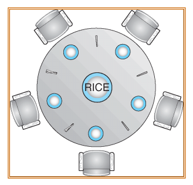

```
Synchronization variables:
    semaphore chopstick[5];

Philosopher i
    do {
        P(chopstick[i]); // 왼쪽 젓가락을 잡음
        P(chopstick[(i+1) % 5]); // 오른쪽 젓가락을 잡음
        ...
        eat();
        ...
        V(chopstick[i]); // 젓가락을 놓아줌
        V(chopstick[(i+1) % 5])
        ...
        think();
        ...
    } while(1)
```

위 코드의 문제는 Deadlock의 가능성이 있다는 점이다. 모든 철학자가 동시에 배가 고파져 왼쪽 젓가락을 잡아버리면 오른쪽 젓가락을 아무도 잡을 수 없게 되어 버린다.

<br/>

- 해결 방안
  - 4명의 철학자만 테이블에 동시에 앉을 수 있도록 한다.
  - 젓가락을 두 개 모두 집을 수 있을 때만 젓가락을 집을 수 있게 한다.
  - 비대칭 전략을 사용한다. 짝수 철학자는 왼쪽 젓가락을 홀수 철학자는 오른쪽 젓가락을 먼저 집도록 설계한다.

<br/>

- 아래 코드는 두 번째 해결방안을 구현한 것이다.(젓가락 2개 모두 가능할 때)

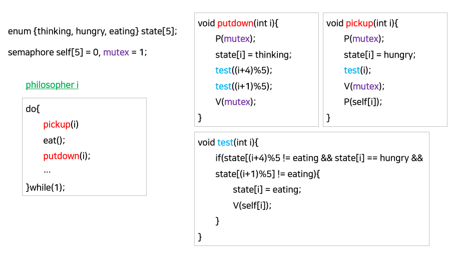

<br/>

<hr/>

## 6. Monitor

<br/>

<hr/>

### 6-1. Monitor의 개념

<br/>

Semaphore는 동기화를 도와주지만 여러가지 문제점을 가지고 있다. 코딩하기 어렵고 정확성(correctness)을 입증하기가 어렵다. 또한 자발적 협력(voluntary cooperation)이 필요하고 한 번의 실수가 모든 시스템에 치명적 영향을 미친다.


<br/>

위 문제를 해결하기 위해 Monitor를 사용할 수 있다. Monitor(모니터)는 동시 수행 중인 프로세스 사이에서 추상 데이터(abstract data type)의 안전한 공유를 보장하기 위한 High-level 동기화 구조이다. 공유 데이터를 접근하기 위해서는 모니터의 내부 Procedure를 통해서만 접근할 수 있도록 한다.

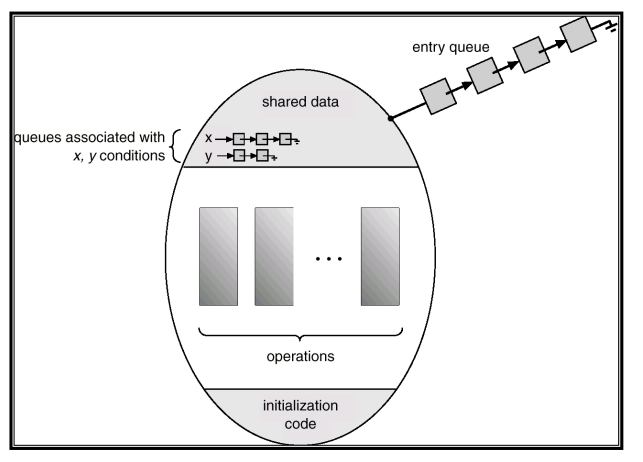

- 예를 들어 공유데이터가 있다면 밖에서 아무나 접근할 수 있는 것이 아닌 모니터 안에 캡슐화하고 만약 공유데이터의 값을 얻고 싶다면 해당 Procedure를 통해서만 획득할 수 있게 만든다.

<br/>
 
세마포어와의 가장 큰 차이점은 모니터는 락(Lock)을 걸 필요가 없다는 것이다. 세마포어는 프로그래머가 직접 wait와 signal을 사용하여 Race condition을 해결하지만 모니터는 내부의 기능으로 해결할 수 있다.<br/>
모니터 내에서는 한 번에 하나의 프로세스만 활동이 가능하고 프로그래머가 동기화 제약 조건을 명시적으로 코딩할 필요도 없다. 또한, 프로세스가 모니터 안에서 기다릴 수 있도록 하기 위해 `condition variable`을 사용한다. `condition variable`은 wait와 signal 연산에 의해서만 접근이 가능하다.

<br/>

<hr/>

### 6-2. Bounded-Buffer Problem

<br/>

세마포어가 아닌 monitor를 이용해 문제를 해결한 코드이다.

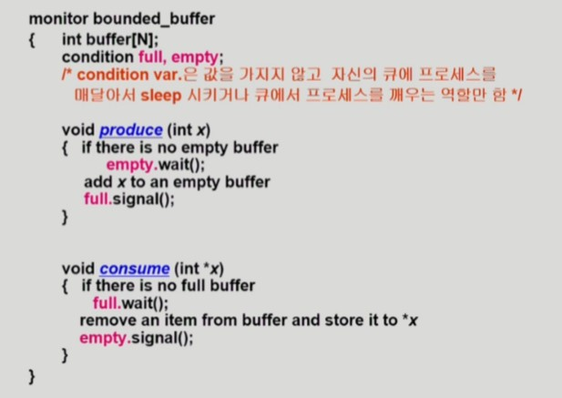

- lock을 걸 필요가 없다.
- wait와 signal을 적절히 이용해 편리하게 프로그래밍할 수 있다.

<br/>

<hr/>

### 6-3. Dining Philosophers

<br/>

monitor를 이용해 Dining Philosophers 문제를 해결한 코드이다.

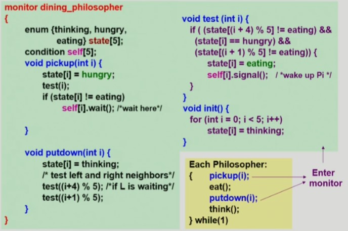

- 철학자는 밥을 먹거나 생각하는 과정을 반복한다.
- 젓가락을 잡는 행동은 monitor 내부에서 구현한다. `state[5]`가 공유데이터이기는 하나, monitor 내부에서 컨트롤하기 때문에 lock이 따로 필요하지 않다.
- test를 이용해 양쪽 젓가락을 사용할 수 있는지 확인한다.(Deadlock 방지)

<br/>

<hr/>

## 출처

- 반효경, 운영체제와 정보기술의 원리

- Abraham Silberschatz, Operating System Concept

- https://rebro.kr/

<hr/>

#### Edited by pythonstrup (myvelop.tistory.com)

<hr/>
