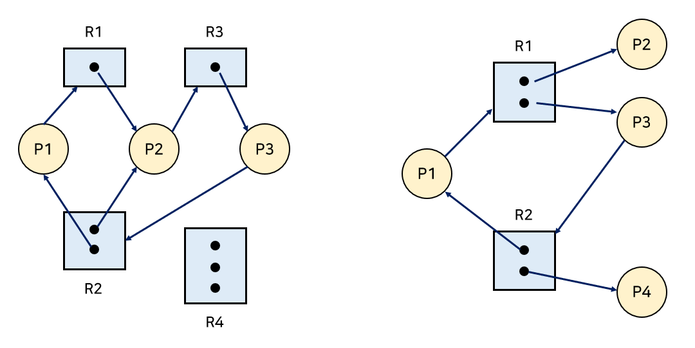
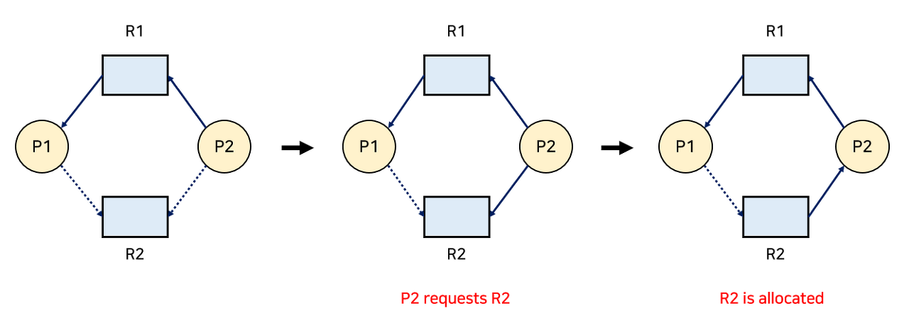
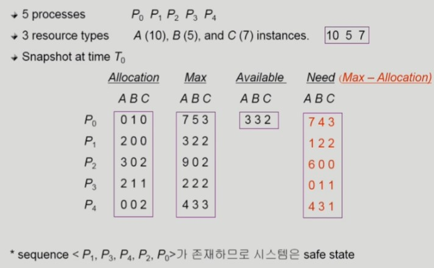
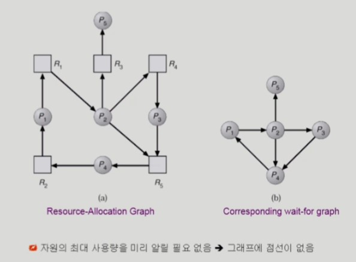
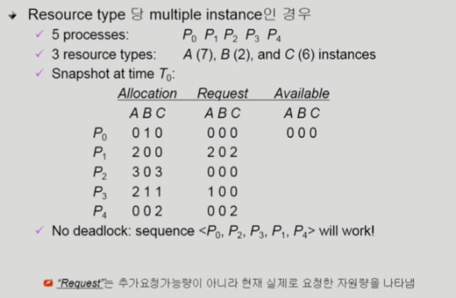

# 07 교착 상태 Deadlock

## 목차

1. [Deadlock](#1-deadlock)  
   &nbsp; 1-1. [교착 상태란?](#1-1-교착-상태란)  
   &nbsp; 1-2. [Deadlock 발생의 4가지 조건](#1-2-deadlock-발생의-4가지-조건)  

 

2. [Deadlock의 처리 방법](#2-deadlock의-처리-방법)  
   &nbsp; 2-1. [Deadlock Prevention](#2-1-deadlock-prevention)  
   &nbsp; 2-2. [Deadlock Avoidance](#2-2-deadlock-avoidance)  
   &nbsp; 2-3. [Deadlock Detection and Recovery](#2-3-deadlock-detection-and-recovery)  
   &nbsp; 2-4. [Deadlock Ignorance](#2-4-deadlock-ignorance)  

  

## 1. Deadlock

 

- Traffic deadlock picture from [Reddit](https://www.reddit.com/r/pics/comments/6qulze/traffic_deadlock/)

 

### 1-1. 교착 상태란?

 

`Deadlock`이란 일련의 프로세스들이 서로가 가진 자원을 기다리면 block된 상태를 의미한다. 여기서 `자원 Resource`란 하드웨어와 소프트웨어를 포함하는 개념이다. 예를 들어, I/O device, CPU cycle, memory space, semaphore 등이 있다.  

프로세스가 자원을 사용하는 절차에는 Request, Allocate, Use, Release가 있다.

- Request :  자원을 요청하고, 만약 다른 프로세스가 자원을 사용하고 있어 받을 수 없다면 대기한다.
- Allocate : 자원을 받는다.
- Use : 프로세스가 받은 자원을 사용한다.
- Release : 프로세스가 자원을 놓아준다.

 

예를 들어 시스템에 2개의 tape drive가 있다고 해보자. 하나의 tape drive는 다른 tape drive를 copy를 하려고 한다. 프로세스 P1과 P2는 각각 하나의 tape drive를 보유한 채 다른 하나를 copy하려고 하면 영원히 기다리고 있는 상태를 유지해야한다.

 

또다른 예도 있다. 세마포어 변수 A, B가 있고 프로세스 P1이 P(A), P(B)을 순서대로 호출하고 P2가 P(B), P(A)를 호출한다고 가정하면, P1는 A를 쥐고 있고 P2는 B를 쥐고 있기 때문에 서로 각각 B와 A를 영원히 기다리는 상태가 되어버린다.

 

### 1-2. Deadlock 발생의 4가지 조건

 

- Mutual exclusion (상호 배제)
  - 매 순간 하나의 프로세스만이 자원을 사용할 수 있다.

 

- Hold and wait (보유 대기)
  - 자원을 가진 프로세스가 다른 자원을 기다릴 때, 보유하고 있는 자원을 놓지 않고 계속 가지고 있다.

 

- No preemption (비선점)
  - 프로세스는 OS에 의해 강제로 자원을 빼앗기지 않는다. 
 
 

- Circular wait (순환 대기)
  - 자원을 기다리는 프로세스 간에 사이클이 형성되어야 한다.
  - 프로세스 p0, p1, ... , pn이 있을 때 p0은 p1을 기다리고 p1은 p2를 기다리고, ... , pn은 p0을 기다린다.

 

보통 Deadlock이 발생했는지 알아보기 위해 자원 할당 그래프(Resource-Allocation Graph)를 사용한다. 
동그라미로 표현된 R은 Resource, 자원이고 직사각형으로 표현된 P는 Process, 프로세스를 의미한다. R 내부의 까만 점은 자원(인스턴스)의 개수이다.  자원 → 프로세스로 향하는 간선은 해당 자원을 프로세스가 보유 중(Allocate)이라는 의미이고, 프로세스 → 자원으로 향하는 간선은 프로세스가 해당 자원을 요청(Request)은 했지만 아직 획득하지 못했다는 의미이다.  

- 그래프에 사이클(Cycle)이 없다면 Deadlock이 아니다. 
- 사이클이 있다면 Deadlock이 발생할 가능성이 높다.
    - 자원당 하나의 인스턴스만 있는 경우엔 Deadlock이 발생한다.
    - 여러 인스턴스가 존재하는 경우엔 Deadlock일 수도 있고 아닐 수도 있다. 
- 위의 그림에서는 왼쪽 그래프는 Deadlock이지만, 오른쪽 그래프는 Deadlock이 아니다. 

 

 

## 2. Deadlock의 처리 방법

 

- Deadlock Prevention
    - 자원 할당 시 Deadlock의 4가지 필요 조건 중 어느 하나가 만족되지 않도록 하는 것

 

- Deadlock Avoidance
    - 자원 요청에 대한 부가적인 정보를 이용해 deadlock의 가능성이 없는 경우에만 자원을 할당
    - 시스템 state가 원래 state로 돌아올 수 있는 경우에만 자원 할당

 

- Deadlock Detection and Recovery
    - Deadlock 발생은 허용하되 그에 대한 detection 루틴을 두어 deadlock 발견 시 recover

 

- Deadlock Ignorance
    - Deadlock을 시스템이 책임지지 않음
    - UNIX를 포함한 대부분의 OS가 채택

 

### 2-1. Deadlock Prevention

 

미리 예방하는 방식인 Deadlock Prevention은 자원을 할당할 때 Deadlock의 4가지 필요조건 중 어느 하나가 만족되지 않도록 하는 방식이다. 
 
-  Mutual Exclusion 
    - Critical Section Problem을 해결하기 위해서는 이 조건은 반드시 만족해야 하므로 공유자원이 존재한다면 이 조건은 만족시킬 수밖에 없다. 
 
- Hold and Wait
    - 프로세스가 자원을 요청할 때 다른 어떤 자원도 가지고 있지 않도록 해야 한다.
    - 프로세스를 시작할 때 모든 필요한 자원을 할당받게 하는 방법
    - 자원이 필요한 경우 보유하고 있던 자원을 모두 반납하고 다시 요청하는 방법
 
- No preemption
    - 프로세스가 어떤 자원을 기다려야 하는 경우 보유하고 있던 자원이 선점된다. 
    - 모든 필요한 자원을 얻을 수 있을 때 그 프로세스는 다시 시작된다. 
    - State를 쉽게 save하고 restore 할 수 있는 자원에서 주로 사용(CPU, memory)
 
4. Circular wait
    - 자원의 타입에 따라 프로세스마다 할당 순서를 정하여 정해진 순서대로만 자원을 할당한다. 
    - 예를 들어 순서가 3인 자원 Ri를 보유 중인 프로세스가 1인 자원 Rj를 할당받기 위해서는 우선 Ri를 release해야 한다.

 

그러나 Deadlock을 방지하는 방식은 발생하지도 않은 Deadlock을 신경쓰며 제약조건을 많이 걸어야하기 때문에 이용성(utilization)과 처리량(throughput)을 감소시키고, Starvation이 발생할 수 있다. 

 

### 2-2. Deadlock Avoidance

 

자원 요청에 대한 부가정보를 이용해 자원 할당이 deadlock으로부터 안전(safe)한지를 동적으로 조사해 안전한 경우에는 할당하는 방식이다. 가장 단순하고 일반적인 모델은 프로세스들이 필요로 하는 각 자원별 최대 사용량을 미리 선언하도록 하는 방법이다. 

 

- Safe state 
    - 시스템 내의 프로세스들에 대한 Safe Sequence가 존재하는 상태

 

- Safe Sequence 
    - 프로세스의 sequence <P1, P2, ..., Pn>이 있을 때, Pi의 자원 요청이 '가용 자원 + 모든 Pj (j < i)의 보유 자원'에 의해 충족되는 경우 sequence를 safe 하다고 말한다. 
    - 조건을 만족하면 다음 방법으로 모든 프로세스의 수행을 보장한다.
        - Pi의 자원 요청이 즉시 충족될 수 없으면 모든 Pj (j < i)가 종료될 때까지 기다린다.
        - Pi-1이 종료되면 Pi의 자원요청을 만족시켜 수행한다.

 

만약 시스템이 Safe state에 있으면 Deadlock이 발생하지 않는다. 하지만 Unsafe state에 있으면 possibility of deadlock 상태. 즉, Deadlock이 발생할 수 있다. 따라서, Deadlock Avoidance는 시스템이 Unsafe state에 들어가지 않는 것을 보장하는 것이다.  
2개의 Avoidance 알고리즘을 각 상황에 맞게 사용할 수 있는데, 각 자원 타입마다 하나의 인스턴스가 존재하는 경우 자원 할당 그래프 알고리즘을 사용하고, 여러 인스턴스가 존재하는 경우 Banker's 알고리즘을 사용한다. 그래프를 그리는 것보다는 Banker's 알고리즘을 사용하는 것이 효율적이고 간단하다.

 

#### 1. Resource Allocation Graph Algorithm (자원 할당 그래프 알고리즘) 

- 점선으로 표시된 간선 Claim edge
    - 프로세스 Pi가 자원 Rj을 미래에 요청할 수 있음을 의미한다.
    - 프로세스가 해당 자원을 요청하는 경우 실선인 Request edge로 바뀌게 된다.
    - Pi가 자원을 할당받으면 방향이 반대인 간선 Assignment edge가 된다.
    - 자원을 다 쓰고 반납하게 되면 Assignment edge는 다시 Claim edge로 바뀐다. 

- Deadlock를 피하는 방법은, Request edge가 Assignment edge로 변경될 때 점선을 포함하여 사이클이 생기지 않는 경우에만 요청된 자원을 할당한다. 

- 사이클 생성 여부 조사 시 프로세스의 개수가 n이라면 O(n2)의 시간복잡도를 가진다.

 

#### 2. Banker's Algorithm

여러 인스턴스가 존재하는 경우엔 사이클만으로 판단할 수는 없기 때문에 다른 알고리즘을 사용해야 한다. Banker's Algorithm은 다익스트라(Dijkstra)가 고안한 알고리즘이며, 이는 프로세스가 자원을 요청할 때마다 수행된다. 보수적인 알고리즘이기 때문에 이 알고리즘을 적용하면 Deadlock이 거의 발생하지 않는다.
 
- 가정
    - 모든 프로세스는 자원의 최대 사용량을 미리 명시한다.
    - 프로세스가 요청 자원을 모두 할당받은 경우 유한 시간 안에 자원들을 다시 반납한다. 

 

- 방법
    - 기본적인 개념은 자원을 요청할 때 safe 상태를 유지하는 경우에만 할당한다.
    - 총 요청 자원의 수가 남은 자원의 수보다 적은 프로세스만 선택하여 수행한다.
    - 그런 프로세스가 없다면 unsafe 상태이다.
    - 할당받은 프로세스가 종료되면 모든 자원을 반납한다.
    - 모든 프로세스가 종료될 때까지 이 과정을 반복한다.

- Available과 Need를 확인해 Deadlock 상태에 빠질 수 있는지 판단해 자원을 할당해야 한다.

- P1이 요청하면 현재 가진 자원만으로도 충족이 되기 때문에 할당할 수 있다.

- P0이 B자원 2개를 요청했다고 해보자. 자원을 줄 수 있지만 남아있는 자원으로 P0을 실행시킬 수 없기 때문에 자원을 할당해주지 않는다.

- Sequence < P1, P3, P4, P2, P0 >가 존재하므로 이 시스템은 safe state로 볼 수 있다.

 

### 2-3. Deadlock Detection and Recovery

 

#### Detection

Deadlock이 Detection은 Avoidance의 방법과 유사하다. 자원의 개수가 상관없다면 그래프를 통해서 사이클이 생겼는지를 확인할 수 있다. 자원의 개수를 따져야 한다면, 표를 그려 총 요청 자원의 수가 남은 자원의 수보다 적은 프로세스가 존재하지 않는다는 것을 이용하여 확인할 수 있다. Avoidance와 마찬가지로 그래프를 그리는 것보다는 표를 통해 확인하는 것이 더 쉬운 방법이다.

- 오른쪽 그래프는 왼쪽 그래프를 간결화한 것이다. (wait-for graph)
- 프로세스가 n개 있는 wait-for graph에서 사이클이 존재하는지 주기적으로 조사할 때 시간복잡도는 O(n2)이다.

- Sequence < P0, P2, P4, P1, P4 >가 있기 때문에 Deadlock에 대해 safe한 상태이다.

#### Recovery

Recovery의 방법은 3가지가 있다. Deadlock에 연루된 프로세스를 모든 프로세스를 종료시키는 방법, Deadlock 문제가 해결될 때까지 한 번에 하나의 프로세스만 종료시키며 상태를 지켜보는 방법, 자원을 선점하는 방법이 있다.  
자원을 선점할 땐 어떤 프로세스를 종료시킬지 결정(Selecting a victim)하고, Deadlock이 발생하기 전 상태로 돌아가(Rollback) 프로세스를 재시작한다. 이때 동일한 프로세스가 계속해서 victim으로 선정되는 경우 Starvation이 발생할 수도 있다. 이는 Rollback 된 횟수를 저장함으로써 해결할 수 있다. 

 

- 프로세스를 종료시키는 판단 기준
    - 프로세스의 중요도
    - 프로세스가 얼마나 오래 실행됐는가
    - 얼마나 많은 자원을 사용했는가
    - 프로세스가 작업을 마치기 위해 얼마나 많은 자원이 필요한가
    - 프로세스가 종료되기 위해 얼마나 많은 자원이 필요한가
    - 프로세스가 batch인가 interactive인가

 

### 2-4. Deadlock Ignorance

 

Deadlock이 일어나지 않는다고 생각하고 아무런 조치도 취하지 않는 방식이다. Deadlock이 매우 드물게 발생하기 때문에 Deadlock에 대한 조치 자체가 큰 오버헤드를 만들 수 있기 때문이다. 따라서 만약 시스템에 Deadlock이 발생한 경우, 시스템이 비정상적으로 작동하는 것을 사용자가 문제를 인식해 직접 프로세스를 죽이는 등의 방법으로 대처한다. 이 방식은 UNIX, Windows 등 대부분의 범용 운영체제가 채택하는 방식이다. 

 

## 출처

- 반효경, 운영체제와 정보기술의 원리

- Abraham Silberschatz, Operating System Concept

- https://rebro.kr/

#### Edited by pythonstrup (myvelop.tistory.com)

