# 09 가상 메모리 Virtual Memory 

<hr/>

## 목차

1. [가상 메모리의 개념](#1-가상-메모리의-개념) <br/>
   &nbsp; 1-1. [가상 메모리란](#1-1-가상-메모리란) <br/>
   &nbsp; 1-2. [Demand Paging](#1-2-demand-paging) <br/>

<br/>

2. [Page Replacement](#2-page-replacement) <br/>
   &nbsp; 2-1. [Optimal Algorithm](#2-1-optimal-algorithm) <br/>
   &nbsp; 2-2. [FIFO Algorithm](#2-2-fifo-algorithm) <br/>
   &nbsp; 2-3. [LRU Algorithm](#2-3-lru-algorithm) <br/>
   &nbsp; 2-4. [LFU Algorithm](#2-4-lfu-algorithm) <br/>
   &nbsp; 2-5. [Clock Algorithm(Second Chance Algorithm)](#2-5-clock-algorithmsecond-chance-algorithm) <br/>

<br/>

3. [Page Frame Allocation](#3-page-frame-allocation) <br/>
   &nbsp; 3-1. [Allocation Problem](#3-1-allocation-problem) <br/>
   &nbsp; 3-2. [Frame 그룹에 따른 Replacement](#3-2-frame-그룹에-따른-replacement) <br/>

<br/>

4. [Thrashing](#4-thrashing) <br/>
   &nbsp; 4-1. [Thrashing이란](#4-1-thrashing이란) <br/>
   &nbsp; 4-2. [Thrashing Prevention](#4-2-thrashing-prevention) <br/>

<br/>

5. [Page Size 결정](#5-page-size-결정) <br/>

<br/><br/>

<hr/>

## 1. 가상 메모리의 개념

<br/>

<hr/>

### 1-1. 가상 메모리란?

<br/>

앞서 배운 페이징 기법, 세그멘테이션 기법과 같은 메모리 관리는 운영체제의 역할이 아닌 하드웨어가 할 수 있는 메모리 관리지만 가상 메모리는 온전히 운영체제가 관리하는 영역이다.

<br/>

가상 메모리를 사용하기 전에는 프로세스가 실행되려면 코드 전체를 물리적 메모리에 로드해야 했고, 메모리 용량보다 더 큰 프로그램은 실행시키는 것이 어려웠다.(물론 overlays기법을 사용할 순 있다.) 하지만 실제로는 코드량이 아무리 많아도 코드의 일부에서 대부분의 시간을 사용하고 작은 양의 주소 공간을 사용하는 경우가 많기 때문에 코드 전체를 물리적 메모리에 load하는 방식은 매우 비효율적이다.
 
<br/>

`가상 메모리 Virtual Memory`는 비교적 값이 비싼 물리적 메모리를 더 효율적으로 사용하기 위해 나온 기술이다. 프로세스를 실행할 때 실행에 필요한 일부만 메모리에 로드하고 나머지는 비용 적지만 용량은 큰 `디스크 Disk`, `스왑 영역 Swap Area`에 놓는 것이다. 이를 통해 프로세스 전체가 물리적 메모리에 있는 것처럼 수행된다. 물리적 메모리인 `RAM`의 자원이 훨씬 많이 있는 것처럼 보이게 된다는 말이다. 결과적으로 물리적 메모리에 소규모의 정보만 올려도 충분히 프로세스를 수행할 수 있고, 자연스럽게 더 많은 프로그램을 동시에 실행할 수 있게 되는 것이다.

<br/>

<hr/>

### 1-2. Demand Paging 

<br/>

Demand Paging이란 실제로 필요한 page만 메모리에 올리는 것이다. 이를 통해 I/O와 Memory 사용량을 줄일 수 있고, 빠른 응답 시간과 더 많은 사용자의 수용을 보장할 수 있다.<br/>

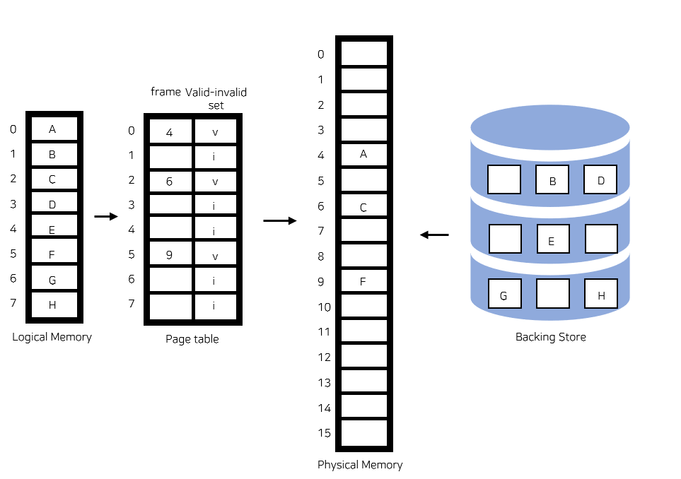

- 이미지출처: https://velog.io/@zzarbttoo/OSVirtual-MemoryPage-Fault-Page-Frame-Allocation-Page-Size

Demand paging은 page table에서 해당 page가 메모리에 있는지를 나타내는 valid-invalid bit를 사용한다. bit가 invalid라면 사용되지 않는 주소 영역이거나 페이지가 물리적 메모리에 없다는 것이다. 처음에는 모든 page entry가 invalid로 초기화되어있고, 주소 변환 시 bit가 invalid로 되어있다면 page fault라는 오류가 발생한다.<br/>
page fault 발생 시 invalid page에 접근하면 MMU가 trap(page fault trap)을 발생시킨다. 이후 kernel mode로 들어가서 page fault handler가 invoke된다. page fault의 자세한 처리 과정은 아래와 같다.

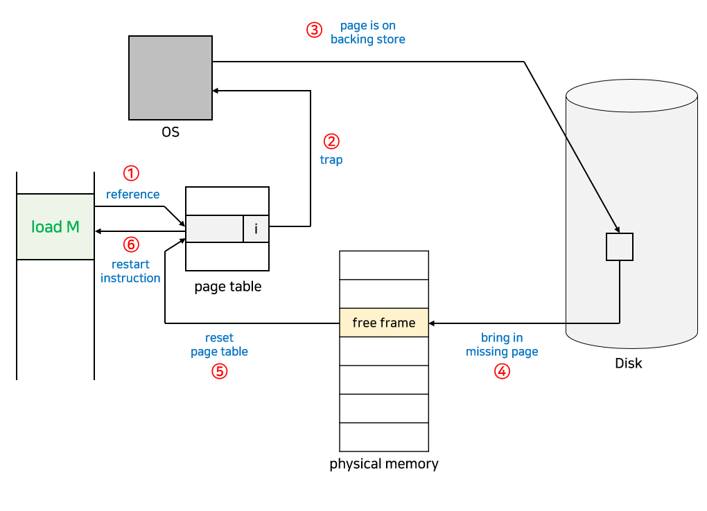

```
1. Invalid reference(ex-bad address, protection violation) 일 경우 process 중단
2. empty page frame을 가져온다(없으면 뺏어온다 : replace)
3. 해당 페이지를 disk 에서 memory로 읽어온다
    1. disk I/O가 끝나기까지 이 프로세스는 CPU를 preempt 당함(block)
    2. Disk read가 끝나면 page table entry 기록, valid/invalid bit을 valid 로 바꿈
    3. ready queue에 process를 insert -> dispatch later
4. 이 프로세스가 CPU를 잡고 다시 작동(running)시킨다.
5. 아까 중단 되었던 명령(instruction)을 재개한다.
```

<br/>

Page fault Rate = 0 ≤ p ≤ 1.0 이라고 할 때, p = 0이면 no page fault이고 p = 1이면 매 참조마다 page fault이다. 보통은 p가 매우 작은 편이기 때문에 page falut가 일어나지 않는다. 그러나 한 번 page fault가 발생하면 엄청난 시간을 소비해야 한다.

```
Effective Access Time(EAT) = 
   (1-p) × memory access 
   + p × (OS&HW page fault overhead 
         + [swap page out if needed] 
         + swap page in 
         + OS&HW restart overhead)
```

<br/>

#### 주소 변환 과정

```
1. CPU는 TLB를 확인한다.

2. TLB hit인 경우 곧바로 주소를 변환하고, TLB miss인 경우 page table을 확인한다. 

3. page table의 valid-invalid bit가 valid로 되어 있다면 주소를 변환하고 TLB에 page를 올린다. invalid라면 page fault가 발생한다.

4. page fault가 발생하면 MMU가 운영체제에 Trap을 걸고 커널 모드로 들어가서 page fault handler가 invoke된다.

5. 유효하지 않은 참조인 경우 프로세스를 종료시키고, 그렇지 않다면 빈 page frame을 얻는다. 빈 frame이 없다면 메모리에서 victim page를 선택하여 대체한다.

6. 운영체제는 참조된 page를 디스크에서 메모리로 로드(I/O)하고, disk I/O가 끝날 때까지 이 프로세스는 CPU를 빼앗긴다.

7. disk I/O가 끝나면 page table이 업데이트되고 valid-invalid bit가 valid로 바뀐다. 그리고 ready queue에 프로세스를 넣어준다.

8. 프로세스가 CPU를 잡게 되면 다시 이어서 수행한다.
```

<br/><br/>

<hr/>

## 2. Page Replacement

<br/>

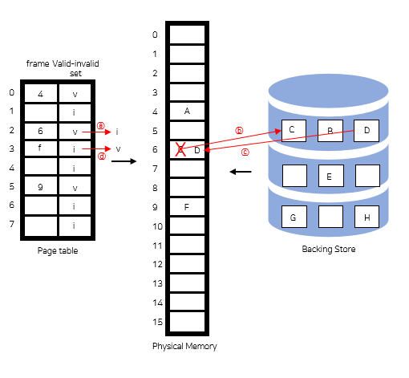

page frame이 존재하지 않는 경우에는 어떤 frame을 빼앗아올지 결정해야 한다. 웬만하면 바로 사용되지 않은 page를 쫓아내는 것이 좋을 것이다. 동일한 페이지가 여러 번 메모리에서 쫓겨났다가 다시 들어올 수 있다. <br/>
기본적으로 page fault rate를 최소화하는 것이 목표이고, 이에 대한 알고리즘을 Replacement Algorithm이라고 한다. 알고리즘의 성능 평가는 주어진 page reference string에 대해 page fault를 얼마나 내는지를 조사하는 방식으로 이루어진다. page reference string은 참조되는 일련의 page 번호다.


<br/>

<hr/>

### 2-1. Optimal Algorithm

<br/>

Optimal Algorithm은 가장 먼 미래에 참조되는 page를 대체하는 방법이다. page falut를 가장 적게 가져가는 방법이고 항상 최적의 결과를 갖는다. 다만, 미래의 참조를 모두 알고 있어야만 가능하므로 실제로 사용하기는 어렵다. 이 방식은 다른 알고리즘의 성능에 대한 `상한선 upper bound`을 제공하는 역할을 한다. Belady's optimal algorithm, OPT, MIN 등으로 불린다.

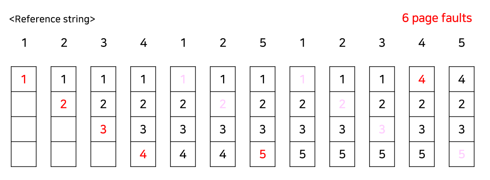

위의 빨간색 숫자는 page fault가 발생한 경우이고, 분홍색은 frame에 이미 존재해서 Hit된 경우, page fault가 발생하지 않은 경우이다. Optimal algorithm은 항상 최적의 해를 가지므로 위와 같은 reference string이 주어진 경우 6번 미만의 page fault가 발생하는 방법은 존재하지 않는다. 

<br/>

<hr/>

### 2-2. FIFO Algorithm

<br/>

`FIFO(First-In First-Out) 알고리즘`은 제일 먼저 들어온 것을 먼저 쫓아내는 방법이다. 미래를 모르는 경우에도 사용할 수 있다. 모든 page가 평등하게 frame에 존재하며, 구현하기 쉽다는 장점이 있다. 그러나 중요한 특정 page는 항상 필요할 수 있는데, 그런 경우에도 쫓아내버린다는 단점이 있다. <br/>
그런데 FIFO는 아래와 같이 frame이 늘어나도 page fault가 감소하지 않고 오히려 늘어나는 경우가 존재한다. 이러한 현상을 Belady's anomaly 현상이라고 한다.


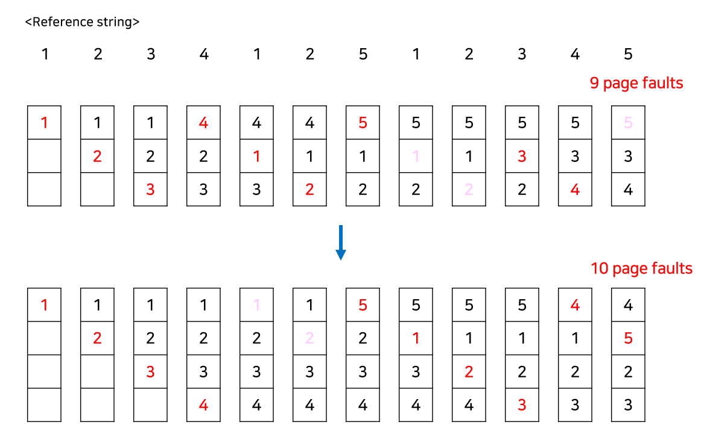

<br/>

<hr/>

### 2-3. LRU Algorithm

<br/>

`LRU(Least Recently Used) 알고리즘`은 가장 오래전에 참조된 페이지를 지우는 방법이다. Optimal에 가장 근접한 방법이며, FIFO와는 다르게 Belady's anomaly가 발생하지 않는다. 그러나 구현하기 어렵고 접근 빈도를 고려하지 않는다는 단점이 있다. 

<br/>

연결 리스트로 LRU를 구현하면 O(1)만에 page를 탐색하고 삽입할 수 있다. 제일 최근에 참조된 page를 가장 앞으로 옮기는 방식으로 연결 리스트를 구현하면 replace가 일어날 때 가장 뒤에 있는 page를 바꿔주면 된다. 

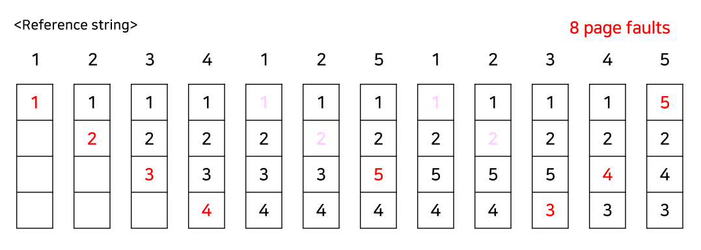

<br/>

<hr/>

### 2-4. LFU Algorithm

<br/>

LFU 알고리즘은 참조 횟수가 가장 적은 page를 지우는 방법이다. LRU에 비해 장기적인 시간 규모를 보기 때문에 page의 인기도를 조금 더 정확히 반영할 수 있다는 장점이 있는 반면, 최근성은 반영하지 못한고 LRU보다 구현이 복잡하다는 단점이 있다. 최저 참조 횟수인 page가 2개 이상인 경우에는 LFU 알고리즘 자체에서는 임의로 page를 선정하는데, 성능 향상을 위해 가장 오래전에 참조된 page를 지우는 식으로 구현할 수 있다. 

<br/>

LFU를 LRU처럼 연결 리스트를 이용해서 구현하면 쫓아내야할 page를 찾는데 O(n)의 시간이 걸리게 되어 느리다. 반면, 힙(heap)을 사용하면 최소 빈도를 갖는 page를 찾거나 삽입, 삭제하는데 O(logn)의 시간이 걸리게 되므로 훨씬 효율적으로 구현할 수 있다.

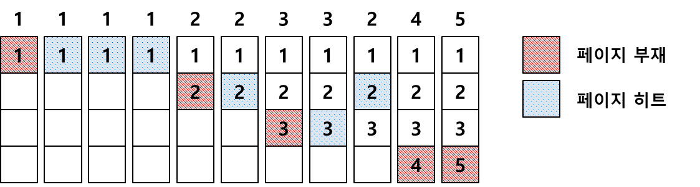

- 이미지출처: https://zangzangs.tistory.com/143

#### LRU vs LFU

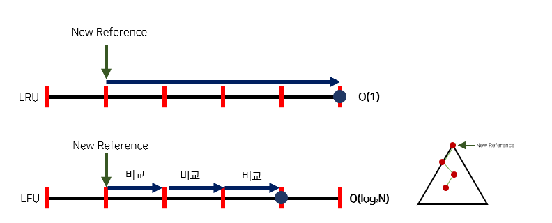

LRU는 방금 참조된 페이지가 가장 뒤로 가는 방식이고 연결리스트를 통해 구현한다. LFU는 참조 횟수를 비교하고, 힙을 이용해 구현하게 된다. 해당 힙은 최소힙이므로 많이 참조된 페이지일수록 아래쪽에 있고, 쫓아낼 때는 Root를 쫓아내고 재구성하게 된다. 이후 공부할 캐싱 기법 중 MRU는 LRU 알고리즘을, MFU는 LFU 알고리즘을 사용한다

<br/>

#### 캐싱 Caching

`캐싱 Caching`은 비용이 비싸고 용량이 적은 하드웨어(=캐쉬)에 요청된 데이터를 저장해두었다가 후속 요청 시 캐쉬로부터 직접 서비스하는 방식이다. paging system 외에도 cache memory, buffer caching, Web caching 등 다양한 분야에서 사용된다.<br/>
캐싱은 교체 알고리즘에서 삭제할 항목을 결정하는 일이 지나치게 많은 시간이 걸리는 경우 실제 시스템에서 사용할 수 없다. buffer caching, Web caching의 경우 O(1) ~ O(log n) 정도까지는 허용된다.

<br/>

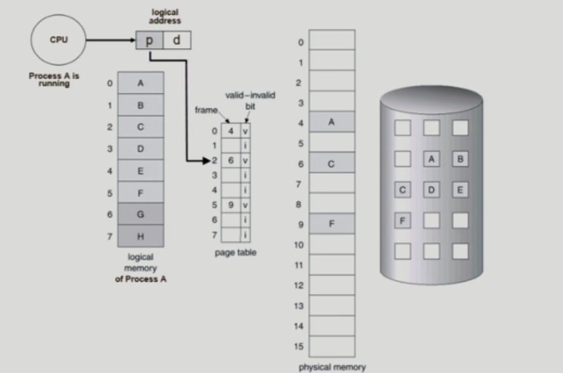

위 그림에서는 CPU가 Process A를 running하고 있다. Process A의 논리 메모리에서 매 순간마다 instruction을 하나씩 읽어서 실행을 할 것이고 page table을 이용해 논리적인 메모리를 물리적인 메모리로 변환하고 그 정보를 읽어와 CPU에 전달할 것이다.<br/>
만일 요청한 페이지가 메모리에 올라가 있다면 운영체제가 아닌 하드웨어의 동작만으로 작동될 것이다. 반면 invalid 상태라면(해당 정보가 물리적 메모리에 올라가있지 않다면) page falut가 발생할 것이다. 이제 CPU의 제어권이 운영체제에 넘어가게 되고 메모리에 올라가 있는 것을 쫓아내 요청한 페이지를 메모리에 올린다. <br/>
page fault일 때만 운영체제는 CPU 제어권을 가질 수 있기 때문에 해당 페이지가 메모리에 올라와 있다면 운영체제는 주요 정보인 참조횟수를 알 수 없고 CPU 접근 시간을 파악할 수 없다. 그렇기 때문에 Virtual memory system(Paging System)에서는 LRU와 LFU를 적용할 수 없다.

<br/>

<hr/>

### 2-5. Clock Algorithm(Second Chance Algorithm)

<br/>

`Clock Algorithm`은 Paging System에 LFU와 LRU를 적용할 수 없기 때문에 이에 대한 대안으로 나온 알고리즘이다. `Clock Algorithm`은 LRU의 근사(approximation) 알고리즘으로, 최근에 참조되었는지 여부를 나타내는 Reference bit이라는 정보를 사용한다. `NUR(Not Used Recently)` 또는 `NRU(Not Recently Used)`로도 불린다.
 
<br/>

Reference bit가 0인 것을 찾을 때까지 시계처럼 한 바퀴씩 포인터를 이동하다가 0인 것을 찾으면 해당 page를 교체하는 방식이다. Reference bit가 1인 page를 만나면 0으로 바꿔주고, 한 바퀴 되돌아와서도(Second Chance) 여전히 0이면 해당 page를 교체한다. 다시 bit가 1로 바뀌어있다면 그만큼 자주 사용되는 page라는 의미인 것이다. 


Enhanced Second Chance Algorithm은 위 알고리즘을 조금 더 개선한 방식이다. 최근에 해당 page가 변경이 되었는지를 나타내는 Modified bit(dirty bit)가 추가된 것이다. Modified bit가 1이라면 page가 변경되었기 때문에 교체를 하면 디스크에 해당 내용을 반영해야 한다. 즉, I/O 작업이 동반되므로 시간이 오래 걸린다. 따라서 "Reference bit == 0? → Modified bit == 0?" 순서로 우선순위를 가진다. 

<br/><br/>

<hr/>

## 3. Page Frame Allocation

<br/>

<br/>

<hr/>

### 3-1. Allocation Problem

<br/>

각 프로세스에 얼마만큼의 page frame을 할당할 것인지에 대한 문제이다. 메모리 참조 명령어 수행시 명령어, 데이터 등 여러 페이지를 동시에 참조하기 때문에 최소한 할당되어야 하는 frame의 수가 정해져 있다. 기본적으로, 사용할 수 있는 frame의 총 양보다 많게, 또는 최소한의 필요한 frame보다는 적게 할당하면 안 된다. loop를 구성하는 page들은 한 번에 하지 않는다면 매 loop마다 page fault가 발생할 수도 있기 때문에 한꺼번에 할당(allocate)해줘야 한다.

<br/>

page frame을 할당하는 방식으로는 프로세스마다 균일하게 할당하거나 특정 기준에 따라 할당하는 방법으로 나뉜다. `Equal allocation`은 균일하게 할당하는 방법으로 말 그대로 frame 수, 프로세스 수만큼 각 프로세스마다 frame을 할당한다. 특정 기준에 따라 할당하는 방법은 대표적으로 2가지가 있다. `Proportional allocation`은 프로세스 크기에 비례하여 할당하는 것을 말한다. `Priority allocation`은 프로세스의 priority에 따라 다르게 할당하는 방식이다.

<br/>

<hr/>

### 3-2. frame 그룹에 따른 Replacement

<br/>

프로세스가 page fault를 발생시켰을 때 대체될 frame의 그룹에 따라 Global Replacement와 Local Replacement로 나눌 수 있다. 

<br/>

- Global replacement
   - replace할 때 다른 process에 할당된 frame을 빼앗아올 수 있다.
   - Process별 할당량을 조절하는 방법이지만 자신의 page fault rate를 조절할 수 없다.
   - 우선 순위가 높은 프로세스에게 작은 프로세스를 희생하면서 할당된 프레임 수를 늘려줄 수 있다.
   - Working set PFF 알고리즘 사용
   - 일반적으로 좋은 처리량을 가지고 있어 <u>현재는 대부분 Global Replacement 를 사용</u>한다.

<br/>

- Local replacement
   - 자신에게 할당된 frame 내에서만 교체(replacement)하는 방법이다. 
   - FIFO, LRU, LFU 등의 알고리즘을 procees별로 운영시 사용한다.
   - 알고리즘을 프로세스마다 독자적으로 운영하는 경우 가능하다. 쉬고 있는 메모리를 사용할 수 없기 때문에 비교적 비효율적이다.

<br/><br/>

<hr/>

## 4. Thrashing

<br/>

<hr/>

### 4-1. Thrashing이란?

<br/>

`Thrashing`은 프로세스가 원활한 수행에 필요한 최소한의 page frame을 할당받지 못해서, <u>CPU excute 시간보다 Page fault를 처리하는 I/O 시간이 더 많아지는 것을 말한다.</u> page fault rate가 매우 높아지고 CPU 효율성이 낮아진다. 


<br/>

Thrashing의 과정은 아래와 같다.
 
```
1. page가 부족하여 page fault가 증가한다.
 
2. Swapping(I/O) 작업이 증가하여 CPU 효율성(Utilization)이 감소한다. 
 
3. OS는 MPD(Multiprogramming Degree)를 높여야 한다고 판단하여 또 다른 프로세스를 시스템에 추가한다. 
 
4. 결과적으로 MPD가 증가해 프로세스당 할당된 page frame이 더욱 감소하여 page fault가 더 증가한다.
 
5. 반면 프로세스는 Swapping(swap in과 swap out)으로 인해 매우 바빠져서 대부분의 시간에 CPU는 한가해진다.

6. CPU는 low throughput을 가지게 된다.
```

<br/>

<hr/>

### 4-2. Thrashing Prevention

<br/>

Thrashing을 방지하기 위해서는 Degree of Multiprogramming을 조절해야함과 동시에 메모리에 올라가는 프로세스의 개수 또한 조절해야 한다. 이를 통해 프로그램이 최소한의 메모리 확보를 할 수 있도록 도와줄 수 있다. Thrashing Prevention 알고리즘은 대표적으로 2가지가 있다. `Working-Set Algorithm`과 `PFF(Page-Fault Frequency) Algorithm`이다.


<br/>

#### Working-Set Algorithm

Working Set algorithm은 가능한 최대 Multiprogramming Degree를 유지하면서 Thrashing을 막는 방법이다. 여기서 `Locality of reference(참조 지역성의 원리)`가 중요한데, 이 원리는 프로세스가 특정 시간 동안 일정 장소를 집중적으로 참조하는 성질을 말한다.이 Locality에 기반하여 프로세스가 일정 시간 동안 원활히 수행되기 위해 한꺼번에 메모리에 올라와있어야 하는 page들의 집합을 Working set이라고 한다. 

<br/>

Working Set Model은 process의 working set 전체가 메모리에 올라와 있어야 수행되고 그렇지 않을 경우 모든 frame을 반납한 후 swap out해버린다. 예를 들어, 5개의 자원이 필요한 프로그램이 있는데 3개만 얻을 수 있는 상황이라면 진행하지 않고 swap out 시키고 suspend된다. 이를 통해 Thrashing을 아예 방지할 수 있다. 

<br/>

Working set은 Working set window라는 고정된 page 참조 횟수(시간)로 구할 수 있다.

$ WSS_i = working set size of process P_i$ <br/>
위의 식과 같이 가장 최근 window에서 프로세스 P<sub>i</sub>가 참조한 page의 총 개수라고 정의하자.(만약 window의 크기가 너무 작다면 전체적인 locality를 다룰 수 없고, 너무 크다면 여러 locality를 포함하게 된다. 크기가 무한이라면 프로그램 전체를 포함할 것이다) <br/>
WSS<sub>i</sub>의 총합인 ∑WSS<sub>i</sub>가 필요한 frame의 총 수가 되고, 이 값이 총 사용 가능한 frame의 수보다 더 크다면 Thrashing이 발생하게 된다. 이를 통해, 운영체제가 지속적으로 각 프로세스의 Working set을 지켜보면서 충분한 frame을 할당해주고, ∑WSS<sub>i</sub>가 총 사용 가능한 frame 수보다 크다면 프로세스 중에서 하나를 종료시키고 해당 프로세스의 frame을 다른 프로세스들에게 할당해준다. 이를 통해 Multiprogramming Degree를 줄여줄 수 있다.

<br/>

아래 그림은 working-set의 예시이다.

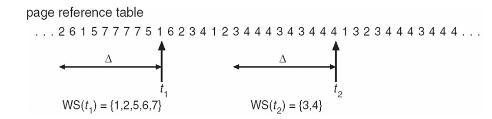

- window size = Δ
- Working-Set에 필요한 모든 자원을 할당받을 시에만 동작
- working-set을 제대로 탐지하려면 적절한 값의 window size를 정해야한다.

<br/>

#### PFF(Page-Fault Frequency) Algorithm

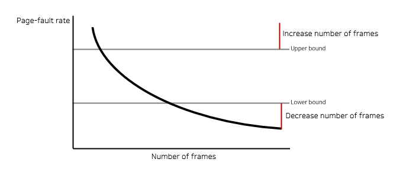

PFF는 page fault의 상한 값과 하한 값을 두고, page fault rate가 상한 값을 넘으면 frame을 더 할당하고, 하한 값보다 낮아지면 할당된 frame 수를 줄이는 방법이다. 만약 빈 frame이 없다면 일부 프로세스를 swap out한다.

<br/><br/>

<hr/>

### 5. Page Size 결정

<br/>

page size는 32비트 운영체제에서는 보통 4KB를 쓴다. 메모리 사이즈가 변화하면 페이지 사이즈도 함께 바뀌기 때문에 64비트에서는 더 큰 페이지 사이즈를 가져갈 것이다.

<br/>

Page Size가 감소하면 페이지 수 증가하고 entry가 많아지기 때문에 페이지 테이블 크게 증가하고 Internal fragmentation이 줄어든다. 또한, 필요한 정보만 메모리에 올리기 때문에 메모리 이용이 효율적이다. 
<br/>
그러나 Locality의 활용 측면에서는 좋지 않다. 오히려 페이지가 큰 것이 Locality에 더 좋다. Disk transfer의 효율성 또한 감소한다. Disk 자체는 Seek와 rotation을 통해 작동한다. 디스크 헤드가 이동하는 동작인 Seek의 작동 시간이 굉장히 길기 때문에 최대한 많은 양을 올리는 것이 Disk transfer의 효율성에 더 좋다. 그렇기 때문에 최근의 트렌드는 큰 page size를 사용한다고 한다.

<br/><br/>

<hr/>

## 출처

- 반효경, 운영체제와 정보기술의 원리

- Abraham Silberschatz, Operating System Concept

- https://rebro.kr/

- https://dailyheumsi.tistory.com/139

- https://velog.io/@zzarbttoo/OSVirtual-MemoryPage-Fault-Page-Frame-Allocation-Page-Size

<hr/>