# 08 메모리 관리 Memory Management

<hr/>

## 목차

1. [주소 Address](#1-주소-address) <br/>
   &nbsp; 1-1. [주소의 종류](#1-1-주소의-종류) <br/>
   &nbsp; 1-2. [주소 바인딩 address binding](#1-2-주소-바인딩-address-binding) <br/>

<br/>

2. [메모리 관리와 관련한 용어](#2-메모리-관리와-관련한-용어) <br/>
   &nbsp; 2-1. [동적 로딩 Dynamic Loading](#2-1-동적-로딩-dynamic-loading) <br/>
   &nbsp; 2-2. [동적 연결 Dynamic Linking](#2-2-동적-연결-dynamic-linking) <br/>
   &nbsp; 2-3. [중첩 Overlays](#2-3-중첩-overlays) <br/>
   &nbsp; 2-4. [Swapping](#2-4-swapping) <br/>

<br/>

3. [물리적 메모리의 관리 Allocation of Physical Memory](#3-물리적-메모리의-관리-allocation-of-physical-memory) <br/>
   &nbsp; 3-1. [물리적 메모리의 할당 방식](#3-1-물리적-메모리의-할당-방식) <br/>
   &nbsp; 3-2. [연속 할당 Contiguous Allocation](#3-2-연속-할당-contiguous-allocation) <br/>
   &nbsp; 3-3. [불연속 할당 Noncontiguous Allocation](#3-3-불연속-할당-noncontiguous-allocation) <br/>

<br/>

4. [불연속 할당의 기법](#4-불연속-할당의-기법) <br/>
   &nbsp; 4-1. [페이징 Paging](#4-1-페이징-paging) <br/>
   &nbsp; 4-2. [계층적 페이징 Multilevel Paging](#4-2-계층적-페이징-multilevel-paging) <br/>
   &nbsp; 4-3. [그외의 페이지 테이블](#4-3-그외의-페이지-테이블) <br/>
   &nbsp; 4-3. [세그멘테이션 Segmentation](#4-4-세그멘테이션-segmentation) <br/>
   &nbsp; 4-4. [페이지드 세그멘테이션 Paged Segmentation](#4-5-페이지드-세그멘테이션-paged-segmentation) <br/>

<br/><br/>

<hr/>

## 1. 주소 Address

<br/>

<hr/>

### 1-1. 주소의 종류

<br/>

컴퓨터에서 주소란 서로 다른 위치를 구분하기 위해 사용하는 일련의 숫자다. 32비트 컴퓨터에서는 총 2<sup>32</sup>개의 서로 다른 메모리 위치를 사용할 수 있고, 64비트 주소체계를 사용하면 2<sup>64</sup>바이트만큼 메몰리 공간에 서로 다른 주소를 할당할 수 있다.<br/>
실세계의 주소에서 행정 구역을 구와 동으로 나눠 구분하기 편하게 도와주듯 컴퓨터 상의 주소도 `페이지`라는 행정 구역을 사용한다. 즉, 32비트를 그대로 사용하지 않고 하위 12비트는 `페이지`를 표현하는 비트로 역할한다. 주소의 종류는 아래와 같다.

<br/>

- `Logical Address(=virtual Address)`
    - 프로세스마다 독립적으로 가지는 주소 공간
    - 각 프로세스마다 0번지부터 시작
    - CPU가 보는 주소는 logical address이다.

<br/>

- `Physical Address`
    - 실제 메모리(RAM)에 올라가는 위치

<br/>

<hr/>

### 1-2. 주소 바인딩 Address Binding

<br/>

주소 바인딩이란 주소를 결정하는 것을 의미한다. 어떤 프로그램이 메모리의 어느 위치에, 즉 어떤 물리적 주소에 load 될지를 결정하는 과정이다. <br/>
프로세스가 실행되기 위해서는 해당 프로그램이 물리적 메모리에 적재되어 있어야 한다. 또한 CPU가 기계어 명령을 수행하기 위해 논리적 주소를 통해 메모리 참조를 하게 되면 해당 논리적 주소가 물리적 메모리의 어느 위치에 매핑되는지를 확인해야 한다. 이렇게 논리적 주소를 물리적 메모리 주소로 연결시켜주는 작업을 주소 바인딩이라고 한다.

<br/>

주소 바인딩은 binding 하는 시점에 따라 분류된다. 


<br/>

- Compile time binding
    - 물리적 메모리 주소(Physical address)가 컴파일 시에 정해진다.
    - 컴파일러는 절대 코드(absolute code) 또는 절대 주소(Absolute address)라는 고정된 주소를 생성한다.
    - 시작 위치가 변경된다면 재컴파일해줘야 한다.
    - 컴파일 타임 주소 할당은 프로세스 내부에서 사용하는 논리적 주소와 물리적 주소가 동일하다. 
    - 현대의 시분할 방식에서는 사용하지 않는다.


<br/>

- Load time binding
    - 프로그램이 실행될 때 물리적 메모리 주소가 결정되는 방식이다.
    - Loader의 책임 하에 물리적 메모리 주소가 부여되며 프로그램이 종료될 때까지 물리적 메모리 상의 위치가 고정된다.
    - `Loader`란 사용자 프로그램을 메모리에 적재시키는 프로그램을 말한다.
    - 컴파일러가 재배치 가능 코드(Relocatable code)를 생성한 경우에 가능한 주소 바인딩 방식이다.
    - 컴파일 타임과 마찬가지로 현대의 시분할 방식에서는 사용하지 않는다.

<br/>

- Execution time binding(=Runtime binding)
    - 프로그램이 실행한 이후에도 그 프로그램이 위치한 물리적 메모리 상의 주소가 변경될 수 있는 바인딩 방식이다.
    - CPU가 주소를 참조할 때마다 해당 데이터가 물리적 메모리의 어느 위치에 존재하는지 주소 매핑 테이블(address mapping table)을 이용해 바인딩을 점검한다.
    - 런타임 주소 할당은 MMU(Memory Management Unit)라는 하드웨어 장치를 사용하여 논리적 주소를 물리적 주소로 바꿔준다. 
    - `MMU 기법`은 프로세스가 CPU에서 수행되면서 생성해내는 모든 주소값에 대해서 base register의 값을 더해주어 물리적 주소를 생성하는 방식이다. base register는 하나이므로 프로세스끼리 공유한다. 


- CPU가 logical address 상의 346번지의 정보를 요청한 그림이다.
- 해당 주소를 실제 메모리에서 얻기 위해 주소 변환 과정이 필요하다.
- relocation register와 limit register, 2개의 레지스터를 이용해 주소변환을 진행한다. virtual memory(logical memory)가 올라가 있는 위치에 logical memory 상에 존재하는 해당 번지의 위치를 더해주면 값을 얻어올 수 있다.

<br/>

#### limit register의 작동


`Limit register`는 논리적 주소의 범위이며, 잘못된 메모리를 참조하지 않도록 막아주는 기능을 한다. 그리고 Base register(Relocation register)는 접근할 수 있는 물리적 주소의 최솟값을 나타낸다. 만약 커널 모드인 경우에는 MMU가 물리적인 주소로 변환하지 않고 논리적 주소를 그대로 사용한다. 따라서 커널 모드인지 체크하는 과정도 포함되어 있다. 예를 들어 가상메모리의 최대크기가 3000인데 해당 logical memory에 있지도 않은 4000번지를 요구한다면 다른 프로그램의 위치를 요구하는 꼴이기 때문에 그 요구를 거절한다.

<br/><br/>

<hr/>

## 2. 메모리 관리와 관련한 용어

<br/>

<hr/>

### 2-1. 동적 로딩 Dynamic Loading

<br/>

Dynamic Loading이란 프로세스 전체를 메모리에 미리 다 올리는 것이 아니라 해당 루틴이 불려질 때 메모리에 load하는 것을 말한다. 이를 통해 메모리의 이용성(Utilization)을 향상시킬 수 있다. <br/>
가끔씩 사용되는 많은 양의 코드(ex-오류 처리 코드)가 메모리에 올라가는 것을 막아 메모리를 좀 더 효율적으로 사용할 수 있도록 한다. 즉, 프로세스의 주소 공간 전체를 물리적 메모리에 올리는 기존 방식에 비해 같은 크기의 물리적 메모리에 더 많은 프로그램을 적재할 수 있기 때문에 메모리 이용의 효율성이 향상된다.<br/>
운영체제의 특별한 지원 없이 프로그램 자체에서 구현이 가능하다.

<br/>

<hr/>

### 2-2. 동적 연결 Dynamic Linking

<br/>

`연결 Linking`이란 프로그래머가 작성한 소스 코드를 컴파일하여 생성된 목적 파일(object file)과 이미 컴파일된 라이브러리 파일들을 묶어 하나의 실행 파일을 생성하는 과정을 말한다.<br/>
`동적 연결 Dynamic Linking`은 컴파일을 통해 생성된 목적 파일과 라이브러리 파일 사이의 연결을 프로그램의 실행 시점까지 지연시키는 기법을 말한다. <br/>
동적 연결과 대비되는 개념인 `정적 연결 static linking`은 프로그래머가 작성한 코드와 라이브러리 코드가 모두 합쳐저 실행 파일이 되기 때문에 파일의 크기가 상대적으로 큰 편이다.<br/>
반면 동적 연결은 라이브러리 실행 시점에 연결된다. 즉, 실행 파일에 라이브러리를 포함하지 않으며 프로그램이 실행되면서 라이브러리 함수를 호출해야 라이브러리와 연결이 일어나는 것이다. 이를 위해 실행 파일의  라이브러리 호출 부분에 라이브러리 루틴 위치를 찾기 위한 `stub`이라는 작은 코드를 둔다. 라이브러리가 이미 메모리에 있으면 그 루틴의 주소로 가고, 없으면 디스크에서 읽어온다. 메모리의 효율을 높일 수 있는 대신 운영체제의 도움이 필요하다.

<br/>

<hr/>

### 2-3. 중첩 Overlays

<br/>

`Overlays`란 프로세스의 주소 공간을 분할해 실제 필요한 부분만을 적재하는 기법을 말한다. `Dynamic Loading`과 정확히 구분되어야하는 개념이다. 둘은 역사적으로 다르다. <br/>
`Overlays`는 초창기 시스템에서 메모리 제약이 컸을 때 하나의 프로세스조차도 메모리에 한꺼번에 올릴 수 없었기 때문에 프로세스의 주소 공간을 분할해서 당장 필요한 일부분을 메모리에 올려 실행하고 해당 부분이 끝나면 나머지 부분을 올려 실행하는 기법이었다. 즉, 프로세스의 크기가 메모리보다 클 때 유용한 방법이다.<br/>
반면 `Dynamic Loading`는 더 많은 프로세스를 동시에 올려놓고 실행하기 위한 기법이므로 둘의 결이 다르다고 볼 수 있다.

<br/>

<hr/>

### 2-4. Swapping

<br/>


`Swapping`은 메모리에 올라온 프로세스의 주소 공간 전체를 디스크의 스왑 영역(swap area)에 일시적으로 내려놓는 것을 말한다. 이 때 스왑 영역을 `backing store`라고도 부르며 디스크 내에 파일 시스템과는 벼로도 존재하는 영역이다.<br/>
스크로 내보내는 것을 `swap out`, 메모리로 들여보내는 것을 `swap in`이라고 한다. 우선순위(priority)를 기준으로 어떤 프로세스를 swap in/out 할지 결정한다. 우선순위가 낮은 프로세스를 swap out 시키고, 높은 프로세스를 메모리에 올린다. 일반적으로 `Swapper`라고 불리는 중기 스케줄러에 의해 swap out될 대상이 결정된다.<br/>
Swapping이 효율적으로 사용되려면 Runtime Binding 방법으로 주소를 할당하는 것이 swap in/out할 때 좋다.<br/>
프로세스의 메모리 양이 방대한 편이기 때문에 swap time은 대부분 transfer time, 즉 디스크 전송시간이다.

<br/>

<hr/>

## 3. 물리적 메모리의 관리 Allocation of Physical Memory

<br/>

<hr/>

### 3-1. 물리적 메모리의 할당 방식

<br/>

메모리는 일반적으로 `OS 상주 영역`과 `사용자 프로세스 영역`으로 나뉘어 사용된다. 운영체제 상주 영역은 Interrupt Vector와 함께 낮은 주소 영역을 사용하며 운영체제 커널이 이곳에 위치하게 된다. 반면, 사용자 프로세스 영역은 높은 주소 영역을 사용하며 사용자 프로세스들이 적재되어 실행된다.

<br/>

메모리는 일반적으로 커널 영역과 사용자 프로세스 영역으로 나뉘어서 사용된다. 그중 사용자 프로세스 영역의 할당 방법으로는 Contiguous Allocation(연속적 할당), Noncontiguous Allocation(비연속적 할당)으로 나뉜다.

<br/>

낭비되는 메모리 단편화는 아래와 같이 분류할 수 있다.

- `내부 조각 Internal Fragmentation (내부 단편화)`
    - 프로그램 크기보다 분할의 크기가 큰 경우
    - 하나의 분할 내부에서 발생하는 사용되지 않는 메모리 조각
    - 특정 프로그램에 배정되었지만 사용되지 않은 공간

<br/>

- `외부 조각 External Fragmentation (외부 단편화)`
    - 프로그램 크기보다 분할의 크기가 작은 경우
    - 아무 프로그램에도 배정되지 않은 빈 곳인데도 프로그램이 올라갈 수 없는 작은 분할

<br/>

<hr/>

### 3-2. 연속 할당 Contiguous Allocation

<br/>

`연속 할당 Contiguous Allocation`은 프로세스를 메모리에 올릴 때 그 주소 공간을 여러 개로 분할하지 않고 연속적인 메모리 공간을 차지하게 적재한다.<br/>
각 프로세스를 메모리에 담기 위해 메모리는 미리 공간을 분할해두는데, 고정된 크기로 나누는 고정 분할 방식과 프로세스의 크기를 고려해서 나누는 가변 분할 방식이 있다. 


#### 고정 분할 방식

`고정 분할 Fixed partition` 방식은 물리적 메모리를 주어진 개수만큼의 영구적인 분할(partition)으로 나누어 두고 각 분할에 하나의 프로세스를 적재해 실행시킨다. 분할 당 하나의 프로세스가 적재되기 때문에 동시에 메모리에 load 되는 프로세스의 수가 고정된다. 또 수행 가능한 프로세스의 최대 크기가 제한되어 융통성이 떨어진다. 내부 조각과 외부 조각이 모두 발생해 낭비가 심하다.

<br/>

#### 가변 분할 방식

`가변 분할 Variable partition`은 프로세스의 크기를 고려해서 할당하기 때문에 분할의 크기나 개수가 동적으로 변한다. 이를 위해서는 기술적인 관리 기법이 필요하다. 외부 조각만 발생한다.

<br/>


가변 분할 방식을 사용하면 `Hole`이라는 가용 메모리 공간이 생기게 된다. Contiguous Allocation에서 메모리를 분할하는 각 단위는 Block이고, 프로세스가 사용할 수 있는 Block을 Hole이라고 한다. 다양한 크기의 Hole들이 메모리 여러 곳에 흩어져 있고, 프로세스가 도착하면 수용 가능한 Hole을 할당시켜준다. <br/>
가변 분할 방식에서 크기가 n인 프로세스가 들어갈 가장 적절한 Hole을 찾는 문제를 Dynamic Storage-Allocation Problem이라고 한다. 3가지의 알고리즘이 존재한다.

- First-fit

크기가 n 이상인 Hole 중 최초로 발견한 Hole에 할당한다. 
 
<br/>

- Best-fit

크기가 n 이상인 가장 작은 Hole을 찾아 할당한다. Hole들이 크기순으로 정렬되지 않은 경우 모든 Hole을 탐색해야 한다는 부담이 있다. 항상 거의 딱 맞는 크기를 할당하기 때문에 할당 후에 아주 작은 Hole들이 많이 생성된다.

<br/>
 
-  Worst-fit

가장 큰 Hole에 할당하는 어리석은 방법이다. 마찬가지로 모든 Hole을 탐색해야 하고, 상대적으로 아주 큰 Hole들이 새로 생성된다. 
 
<br/>

First-fit과 Best-fit이 Worst-fit에 비해서는 속도나 공간 측면에서 효과적인 것으로 알려져 있다. 그러나 전체적으로 효율이 좋지 않은 편이다. 

<br/>

#### Compaction

위의 방법을 사용하지 않고 외부 단편화 문제를 해결하기 위해 `컴팩션 Compaction`을 사용할 수 있다. Compaction은 물리적 메모리 중에서 프로세스에 의해 사용 중인 메모리 영역을 한 곳으로 몰아 하나의 큰 가용 공간인 `Block`을 만드는 방법이다.<br/>
그러나 매우 많은 비용이 드므로 최소한의 메모리 이동으로 compaction을 수행하는 방법이 필요한데 이는 이론적으로 매우 어려운 문제이다. 또한 Compaction은 프로세스의 주소 실행 시간에 동적으로 재배치가 가능한 경우에만 수행될 수 있다는 제약조건도 있다.

<br/>

<br/>

<hr/>

### 3-3. 불연속 할당 Noncontiguous Allocation

<br/>

불연속 할당 방식은 분할 하는 기준에 따라 동일한 크기로 나누어 메모리에 올리는 `페이징 Paging` 기법, 크기가 일정하지 않지만 의미 단위로 나누어 메모리에 올리는 `세그멘테이션 Segmentation` 기법과 세그멘테이션 내에서 동일한 크기의 페이지로 나누어 메모리에 올리는 `페이지드 세그멘테이션 Paged Segmentation`기법으로 나눌 수 있다. 현대의 운영체제에서는 불연속 할당 기법을 사용한다. 

<br/><br/>

<hr/>

## 4. 불연속 할당의 기법

<br/>

<hr/>

### 4-1. 페이징 Paging

<br/>

`페이징 Paging` 기법은 프로세스의 주소 공간을 동일한 사이즈의 페이지 단위로 나누어 물리적 메모리에 불연속적으로 저장하는 방식이다. 메모리는 `프레임 Frame`, 프로세스는 `페이지 Page`라 불리는 고정 크기의 `블록 Block`으로 분리된다. 블록의 크기는 2의 거듭제곱 꼴이다. 한 프로세스가 사용하는 공간은 여러 page로 나뉘어 관리되고, 각각의 page는 순서와 관계없이 메모리의 frame에 mapping 되어 저장된다.


페이징 기법은 작업이 페이지 단위로 이루어져야 하기 때문에 연속 할당 방식에 비해 주소 변환 절차가 복잡하다. 프로세스가 순서대로 메모리에 저장되지 않기 때문에 프로세스를 실행하기 위해선 page가 몇 번째 frame에 들어 있는지에 대한 페이지별 주소 변환 정보를 유지해야 한다. 이에 대한 정보가 page table이라는 테이블에 저장되어 있고, 이를 사용하여 `논리적 주소 Logical address`를 `물리적 주소 physical address`로 변환한다.

<br/>

#### 페이징 기법의 장단점

페이징 기법은 외부 단편화의 압축 작업의 비효율성을 해결하고 앞의 연속 할당에서 발생했던 동적 메모리 할당 문제가 발생하지 않는다. 또한, page들이 연속할 필요가 없어 외부 단편화를 해결할 수 있다. 할당과 해제가 빠르고 swap out이 간단하다. 코드를 쉽게 공유(Shared pages)할 수 있다는 것도 장점이다. 코드가 pure code라면 공유가 가능하며 read-only로 프로세스 간에 하나의 코드만 메모리에 올린다. 

<br/>

하지만 페이징 기법은 내부 단편화를 해결하지 못하고, page table을 저장하기 위한 메모리가 추가로 소모된다. page table이 메모리에 상주하기 때문에 메모리에 접근하는 연산은 2번의 메모리 접근(page table에 접근 + 실제 연산)이 필요하게 되어 속도가 느리다는 부담도 있다. 따라서 속도 향상을 위해 `Associative register` 혹은 `TLB(Translation Look-aside Buffer)`라 불리는 고속의 <u>하드웨어 캐시</u>를 사용한다. 

<br/>

#### 주소 변환 기법

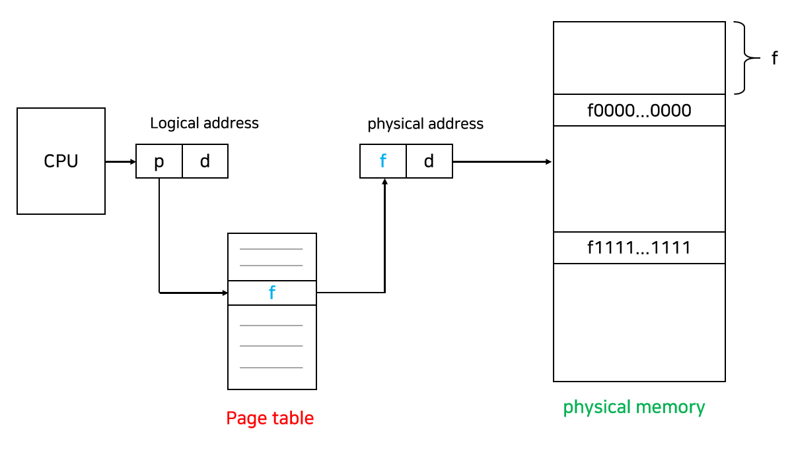

- p = 페이지 번호
- d = 페이지 오프셋

페이징 기법은 CPU가 사용하는 Logical address를 `페이지 번호 page number`와 `페이지 오프셋 page offset` 두 부분으로 나눠 `주소 변환 address translation`에 사용한다.
page number는 page table의 인덱스로 사용해 page table에 접근하고 해당 인덱스 항목(entry)에는 그 페이지의 물리적 메모리 상의 `기준 주소 base address`가 저장된다. page offset는 `변위 Displacement`를 알려준다. page table의 `기준 주소 base address`에 page offset(변위값)을 더하면 물리적 주소를 구할 수 있다.

<br/>

#### 페이지 테이블 구현

page table은 프로세스마다 존재하며 메인 메모리에 상주한다. page table은 매우 큰 메모리량을 필요로 하기 때문에 이를 구현하기 위해 비용이 비싼 register를 사용하는 것은 적절하지 않다. 따라서 page table은 메인 메모리에 저장하고, `PTBR(Page-Table Base Register)`라는 레지스터가 page table을 가리키도록 한다. 만약 `문맥 교환 Context Switch`이 발생하는 경우 이 레지스터의 내용만 변경하면 되기 때문에 효율적이다.

<br/>

위에서 언급했다시피 `TLB`라는 하드웨어 캐시를 이용해 페이징 기법의 성능을 개선할 수 있다.

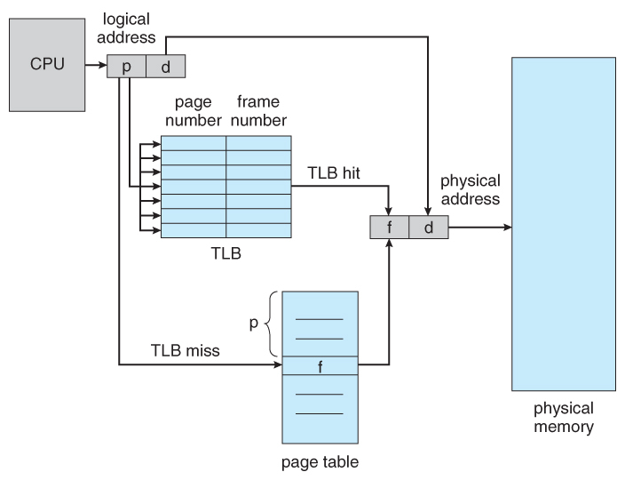

- `TLB`는 데이터를 보관을 위한 캐시가 아닌 <u>주소변환을 위한 캐시 메모리</u>이다. page table의 내용 일부만 가지고 있는다.
- CPU는 메모리 상의 page table에 접근하기 전에 `TLB` 전체를 먼저 검색해본다. 주소 변환 정보 중에 캐시에 이미 저장되어 있는 것이 있다면 바로 이용해 주소 변환을 실시한다.
- `TLB`는 parallel search, 즉 병렬적으로 탐색이 가능한 `Associative register`를 이용해 구현할 수 있다.
- `TLB`는 `문맥 교환 context switch` 발생 시 flush 명령을 하여 오래된 데이터를 제거한다. (remove old entry)
- `TLB`를 사용할 때 평균 메모리 접근 시간을 `EAT(Effective Memory-Access Time)`라고 한다. 아래과 같은 식으로 구할 수 있다.

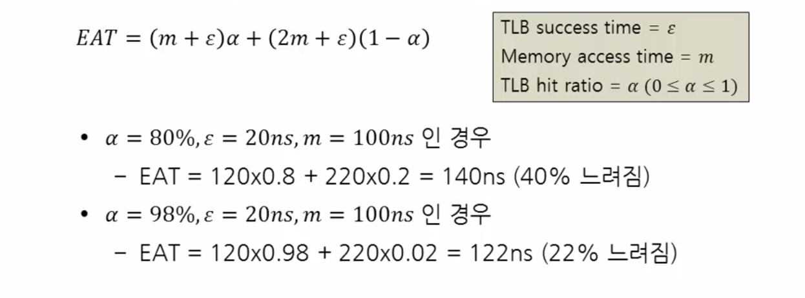

<br/>

page table의 각 엔트리(Entry)에는 정보를 담고 있는 bit가 포함되어 있다. 운영체제는 각 페이지마다 이 bit를 설정해 페이지에 대한 접근을 허용 또는 차단한다.

- Protection bit 
    - page에 대한 접근 권한 (read / write / read-only)

<br/>

- Valid-invalid bit 
    - valid는 해당 주소의 frame에 그 프로세스를 구성하는 유효한 내용이 있음. (접근 허용) 
    - invalid는 해당 주소의 frame에 유효한 내용이 없음을 뜻함. (접근 불허)


- 메모리 할당이 연속하는(contiguous) 경우 Limit만 비교해도 메모리를 보호할 수 있었지만, paging은 contiguous하지 않기 때문에 valid-invalid bit을 이용하여 valid면 해당 page에 접근할 수 있도록 한다.
- page의 크기가 작아질수록 내부 단편화가 감소하고 필요한 정보만 메모리에 있어서 메모리 이용에서 효율적이지만, page table의 크기가 증가하고 디스크 이동의 효율성이 감소한다. 따라서 현대의 운영체제는 page의 크기를 키워주는 것이 대세라고 한다.

<br/>

<hr/>

### 4-2 계층적 페이징 Multilevel Paging

<br/>

논리적 주소 공간을 여러 단계의 page table로 분할하여 현재 사용되고 있는 page의 page table만 할당하는 기법이다. 이를 통해 각각의 page table이 불연속하게(Noncontiguously) 할당되도록 하는 것이 목표이다.

<br/>

#### Two-Level Page Table

32비트 운영체제 기준으로 2<sup>32</sup>비트(4GB)에 달하는 주소 공간을 할당받는다. 일반적인 1단계 페이징 기법을 적용해보자. 페이지는 하위 12비트를 사용하므로 크기가 4KB이다. 주소 공간 4GB를 4KB 단위의 페이지로 나눠 사용하는 것이다. `4GB/4KB = 1M`이 되므로 1M개의 page table entry가 필요해진다. page table entry가 하나당 4byte라고 가정하면 해당 페이지 테이블을 만들기 위해 `4B*1M = 4MB`나 메모리 공간을 할당해야한다. 그러나 프로그램은 4GB 중 일부만 사용하므로 이 방식은 매우 비효율적이다.

- 참고: 단위 알아가기
    - 2<sup>10</sup> = K
    - 2<sup>20</sup> = M
    - 2<sup>30</sup> = G

<br/>

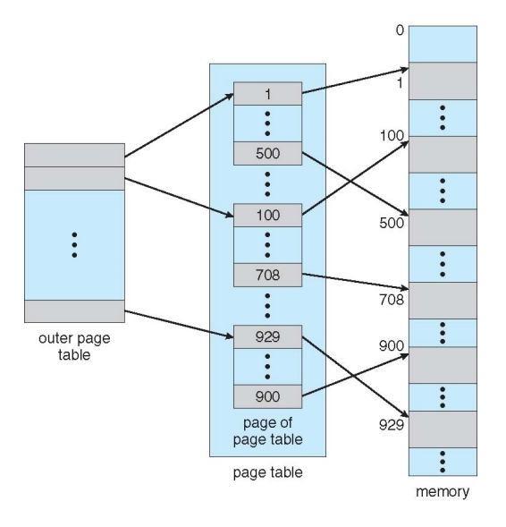

`2단계 페이징 Two-level paging` 기법은 page table과 메모리 사이에 page table을 하나 더 둠으로써 두 단계(outer & inner)를 거치는 방법이다. 사용되지 않는 주소 공간에 대해서는 `outer page table`의 항목을 NULL로 설정하며 이에 대응하는 `inner page table`을 생성하지 않는다. 이를 통해 모든 page를 로드해야 하는 부담을 줄일 수 있다.

<br/>

#### 주소 변환 과정

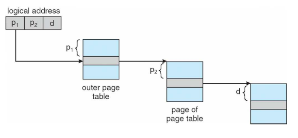

- 2단계 페이징에서의 `주소 변환 Address translation` 과정이다.
- 첫 번째 과정에서 p<sub>1</sub> `outer page table`에 접근해 주소 변환 정보를 얻는다. 해당 정보는 `inner page table`이 어떤 것인지에 대한 것이다.
- p<sub>2</sub>를 이용해 `inner page table`의 번지에 접근한다. 이를 통해 물리적인 주소를 얻어올 수 있다.
- 마지막으로 d를 이용해 원하는 정보를 가져온다.

`안쪽 페이지 테이블 inner page table`의 크기는 페이지 크기(4KB)와 동일하다는 특징이 있다. 페이지 테이블 항목 당 크기는 4byte이므로 내부 페이지 테이블은 `4KB/4byte = 1K`개의 항목을 가지게 된다.

<br/>

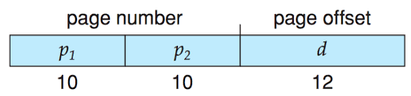

- 먼저 12비트로는 page offset을 표현한다.
- 위에 언급했다시피 inner page table의 entry 개수가 1K개로 밝혀졌다. 1K = 2<sup>10</sup>이므로 p<sub>2</sub>에 필요한 비트 개수는 10bit일 것이다. 
- 나머지 비트를 p<sub>1</sub>에 할당한다. 우연하게도 10비트이다. Two-Level Page는 총 20비트로 페이지 넘버를 나타낸다. 

<br/>

#### Multilevel Paging

`주소 공간 Address space`이 커질수록 페이지 테이블의 크기도 커지므로 주소 변환을 위한 메모리 공간 낭비도 심각해진다. 따라서 다단게 페이지 테이블이 필요해진다. 다단계 페이지 테이블을 사용하면 페이지 테이블을 위해 사용되는 메모리 공간의 소모는 줄일 수 있지만 그만큼 메모리에 대한 접근 횟수가 많아지기 때문에 메모리 접근 시간이 크게 늘어나는 문제가 생긴다. 

<br/>

메모리 접근 시간의 오버헤드를 줄이기 위해 TLB를 사용하면 아주 효과적이다. 다단계 페이지 테이블과 TLB를 사용하면 공간적인 이득을 얻음과 동시에 메모리 접근 시간도 그다지 늘어나지 않아 시간적인 효율성도 얻을 수 있다. 예를 들어 4단계 페이지 테이블을 사용하는 경우, 메모리 접근 시간이 100ns이고, TLB 접근 시간이 20ns이며 요청된 페이지에 대한 주소 변환 정보가 TLB에 존재할 확률이 98%라고 할 때 평균적인 메모리 접근 시간은 아래와 같다.

- EAT = 0.98 x 120 + 0.02 x 520 = 128ns

4단계 페이지 테이블을 사용할 경우 주소 변환을 위해 네 번의 메모리 접근이 필요하고 실제 데이터를 접근하기 위해 한 번의 메모리 접근이 필요하다. 따라서, 100ns가 소요되는 메모리 접근 연산을 한 번 수행하기 위해 총 <u>다섯 번의 메모리 접근이 필요하여 500ns가 소모</u>된다. 하지만 TLB를 사용하면 128ns의 시간이 소요되므로 시간적인 오버헤드가 크지 않다는 사실을 알 수 있다.

<br/>

<hr/>

### 4-3. 그외의 페이지 테이블

<br/>

#### 역 페이지 테이블 Inverted Page Table

페이지 테이블로 인해 메모리 공간의 낭비가 심한 이유는 모든 프로세스가 모든 페이지에 대해 페이지 테이블 항목을 구성해야 하기 때문이다. 이 문제를 해결하기 위한 방법 중 하나로 역 페이지 테이블이 사용될 수 있다.<br/>
`역 페이지 테이블 Inverted page table`은 메모리의 frame마다 한 항목씩 할당하는데, 그러면 physical frame에 대응하는 항목만 저장하면 되므로 메모리를 훨씬 적게 사용한다. 각 page table entry는 각각의 메모리의 frame이 담고 있는 내용(PID, logical address)을 표시한다. 다만 테이블 전체를 탐색해야 하므로 시간이 오래 걸리는 단점이 있어 대부분의 메모리는 Hashed page table과 Inverted page table의 결합으로 이루어져 있다.<br/>
테이블 전체를 탐색해야한다는 단점이 있기 때문에 associative register를 통한 병렬 검색 기법과 함께 사용하면 효욜성을 높일 수 있다.

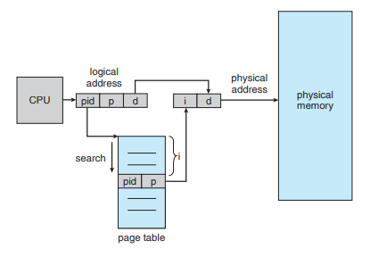

```
pid = 프로세스 번호
p = 논리적 페이지 번호
```

- 원래 페이징 기법을 뒤집어 놓은 방법이다.
- 기존 페이징 기법은 프로세스마다 페이지 테이블이 1개씩 있었고, `논리적 메모리 logical memory`와 대응한다. 이와 다르게 `inverted page table`은 시스템 안에 page table이 단 한 개만 존재한다. 대신 page table entry의 개수가 `물리적 메모리 physical memory`의 page frame 개수만큼 존재한다.
- pid와 p를 세트로 테이블에 저장하며, 탐색하는 pid와 p가 f번째에 있다는 것을 확인되면 해당 번지로 타고 들어가 정보를 얻을 수 있다.
- cf) 사실, 이 테이블은 physical address를 확인해 logical address로 바꿀 수 있는 테이블이다.

<br/>

#### Shared Pages

`공유 코드 shared code` 또는 `재진입 코드 Re-entrant Code`, `순수 코드 Pure Code`는 메모리 공간의 효율적인 사용을 위해 여러 프로세스에 의해 공통으로 사용될 수 있도록 작성된 코드이다. 읽기 전용(read-only)의 특성을 가지고 있다. `공유 페이지 Shared Pages`란 공유 코드를 담고 있는 페이지를 말한다.<br/>
이와 다르게 `Private code`는 각 프로세스가 독자적으로 메모리에 올린 코드를 뜻한다.

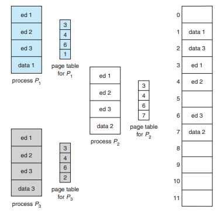

- 위의 프로세스 P<sub>1</sub>, P<sub>2</sub>, P<sub>3</sub>는 모두 동일하게 **ed1**, **ed2**, **ed3**라는 코드를 사용하는 프로세스이다.
- <u>각각의 공유 코드는 모든 프로세스의 logical address space에서 동일한 위치에 있어야 한다.</u> (동일한 물리적 메모리를 가지는 것은 당연함)
- 공유가 가능한 코드를 물리적 메모리에서 공유해 효율성을 높이기 기법이다.

<br/>

#### Hashed Page Table

hash table을 이용하여 page table을 관리하는 기법이다. 주소 공간이 32 bit보다 커지면 계층적 paging이 비효율적이므로 이 방식을 사용한다. virtual page number를 해싱하여 page table을 참조하는 데 사용한다. 연결 리스트를 따라가면서 page number를 비교하고 일치하면 대응되는 frame number를 얻는다. 구현하기가 어렵지만 속도는 매우 빠르다. <br/>
기존처럼 페이지 테이블에서 페이지 번호를 '인덱스'로 인식하여 페이지 테이블에 접근하는 것이 아니라, 페이지 테이블을 해시 테이블로 보고, 페이지 번호를 해싱하여 페이지 테이블에 접근한다.

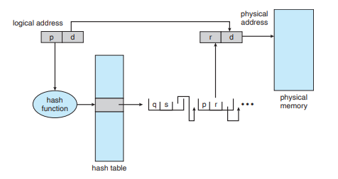


- 아래는 해시 페이지 테이블의 진행 과정이다.
    1. 논리 주소에서 페이지 번호를 해싱하여, 해싱 값을 만든다.
    2. 해싱 페이지 테이블에서 해당 해싱 값의 연결리스트를 탐색하며, 페이지 넘버가 일치하는지 탐색한다.
    3. 일치 하는 경우, 해당 프레임 번호를 반환한다.
    4. 일치 하지 않는 경우, 다음 노드로 이동해 2~3 반복


<br/>

<hr/>


### 4-4. 세그멘테이션 Segmentation

<br/>

Segmentation은 의미 단위로 하나의 프로세스를 여러 개으 segment로 나누는 것을 말한다. 작게는 프로그램을 구성하는 함수 하나하나를, 크게는 프로그램 전체를 하나의 Segment로 정의할 수 있다. 일반적으로는 code, data, stack 부분이 하나의 세그먼트로 정의된다. 

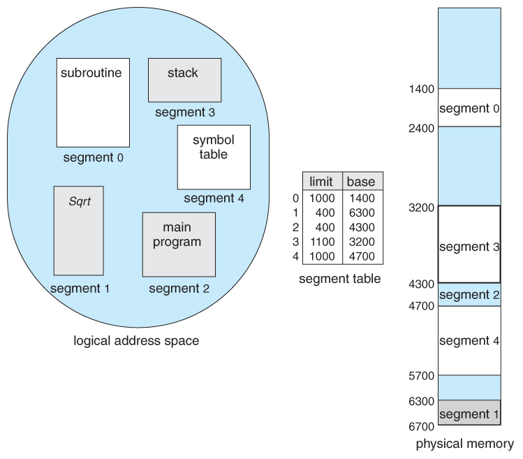

<br/> 

Segmentation의 논리적 주소는 `segment number`, `offset`으로 구성되며, 각각의 segment는 base, limit, protection bit을 가지고 있다.

<br/>

#### 세그먼트 테이블 Segment table

페이지 테이블과 비슷하게 세그먼트들의 물리 메모리 정보를 저장하는 테이블을 세그먼트 테이블이라고 한다. 이 테이블은 해당 세그먼트의 시작 물리 주소 base와 세그먼트 용량을 나타내는 limit의 정보를 담는다.<br/>
읽기, 쓰기, 실행 등의 권한을 담는 privilege 정보도 담는다. 세그먼트 테이블 역시 메모리에 올라와 있는데, 물리적 메모리리에서의 테이블 주소 정보를 `세그먼트 테이블 베이스 레지스터 Segment-table base register(STBR)`가 담고 있다. `세그먼트 테이블 길이 레지스터 Segment-table length register(STLR)`는 프로그램에 의해 사용되고 있는 세그먼트의 개수 정보를 가지고 있다.

<br/>

#### 주소 변환 기법

페이징 기법과 마찬가지로 세그멘테이션 기법에서도 세그먼트 테이블의 각 항목에 보호 비트와 유효 비트를 둔다. 

- `보호 비트 Protection bit`: 읽기/쓰기/실행 등의 권한이 있는지
- `유효 비트 Valid bit`: 주소 변환 정보가 유효한지

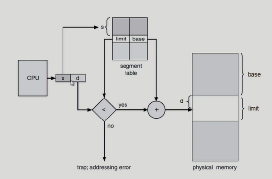

- CPU가 논리 주소를 넘기면 세그먼트번호(s)와 세그먼트오프셋(d)으로 나눈다.
- 세그먼트 시작 위치는 STBR이 가지고 있고 이를 참조해 `세그먼트번호 s`만큼의 위치로 이동하면 base와 limit을 얻을 수 있다.
- 이제 유효성 검증을 한다. STLR에 담긴 세그먼트의 개수 정보보다 s가 작아야 한다. 만약 s가 더 크다면 잘못된 메모리 참조 시도이므로 중단한다.
- limit의 범위를 넘어가지 않는지에 대한 유효성 검증이 끝났다면 base와 d를 더한 위치로 이동해 정보를 얻는다.

<br/>

#### Segmentation 기법의 장단점

Segmentation은 paging과 마찬가지로 segment들이 연속적으로 할당될 필요가 없고, stack과 heap이 독립적으로 커질 수 있으며, segment마다 protection을 따로 수행할 수 있는 등 paging과 유사한 장점을 가지고 있다. 다만, <u>segment는 의미 단위이기 때문에 공유와 보안에 있어서 paging 기법보다 훨씬 효과적이다.</u><br/>
하지만, 각각의 segment의 길이는 동일하지 않으므로 가변 분할 방식에서와 동일한 문제점(ex-외부 단편화)이 발생한다는 단점이 있다. 

<br/>

#### Sharing segment


- 해당 그림은 editor라는 부분을 공유하는 세그먼트의 예를 보여준다.

<br/>

<hr/>

### 4-5. 페이지드 세그멘테이션 Paged Segmentation

<br/>

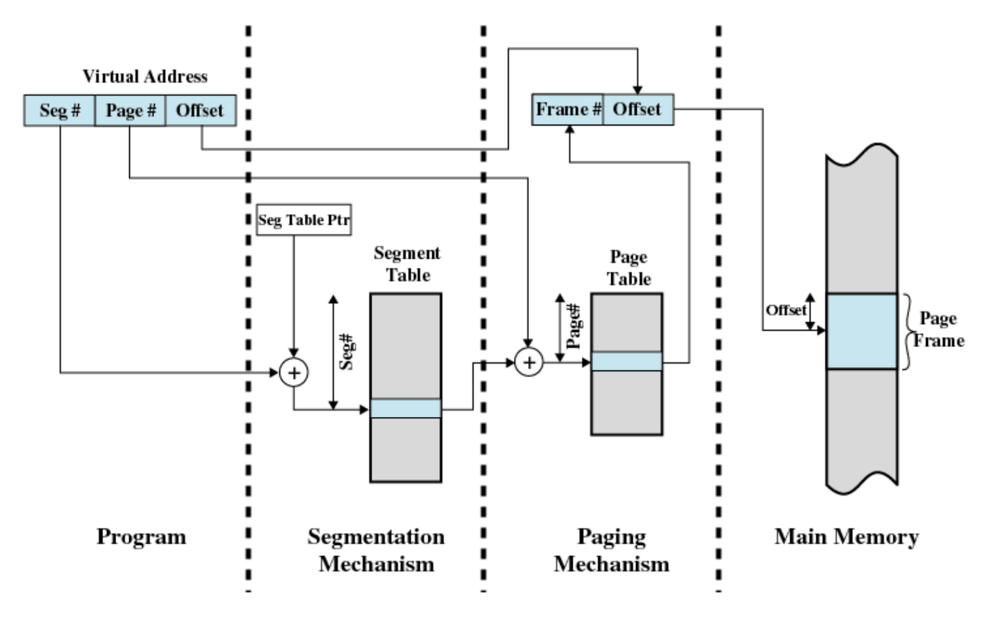

페이징 기법과 세그멘테이션 기법의 장점만 취한 방법이다. 세그멘테이션 기법과 같이 프로그램을 의미 단위로 나누되, segment가 임의의 길이가 아닌 반드시 동일한 크기의 페이지들의 집합으로 구성되도록 하는 것이다.이를 통해 외부 단편화 문제를 해결하며, 세그먼트 단위로 프로세스 간의 공유나 프로세스 내의 접근 권한 보호가 이루어지도록 만들어 페이징 기법의 약점도 해소한다.<br/>

- 위 그림과 동일한 그림이다.

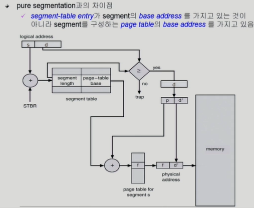

- 논리적 주소의 상위 비트인 세그먼트의 번호를 통해 세그먼트 테이블에 접근한다. 세그먼트의 길이와 페이지 테이블 시작 주소를 획득한다.
- 세그먼트의 길이값과 오프셋값을 비교하는 유효성 검증을 한다. 오프셋이 더 크다면 유효하지 않으므로 트랩을 발생시킨다.
- 페이지 테이블의 시작 위치를 얻었으므로 그 위치에서 페이지 번호만큼 떨어진 페이지 테이블 항목에서 물리적 메모리의 페이지 프레임 위치를 얻을 수 있다.

<br/>

<hr/>

## 출처

- 반효경, 운영체제와 정보기술의 원리

- Abraham Silberschatz, Operating System Concept

- https://rebro.kr/

- https://dailyheumsi.tistory.com/138

<hr/>

#### Edited by pythonstrup (myvelop.tistory.com)

<hr/>