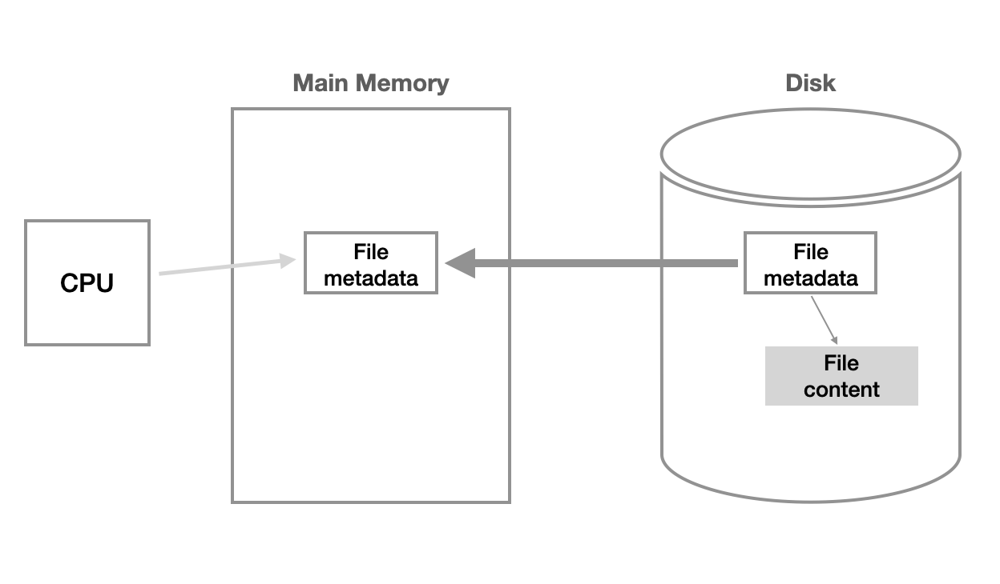
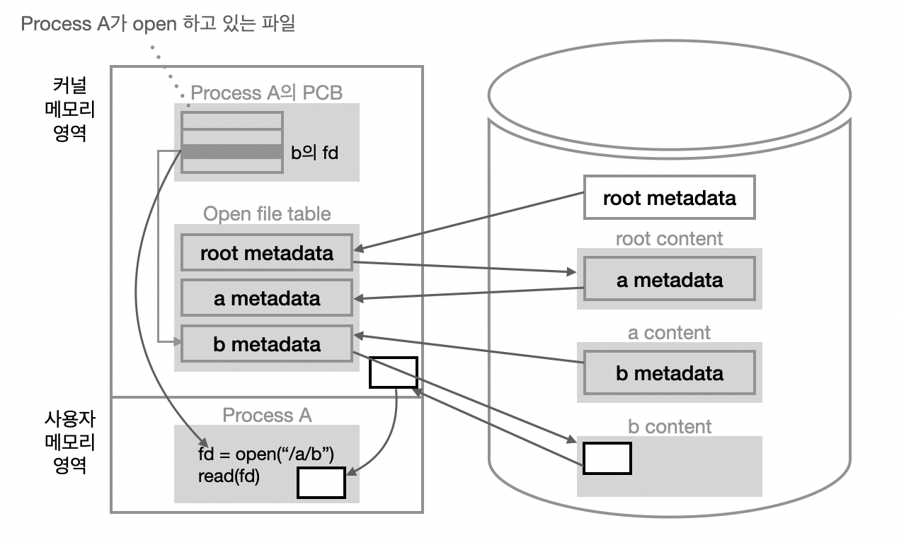
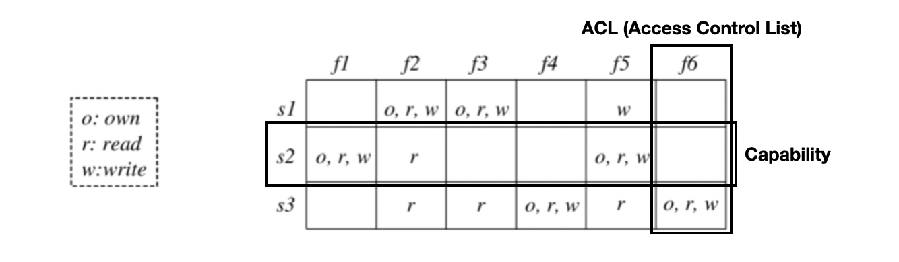
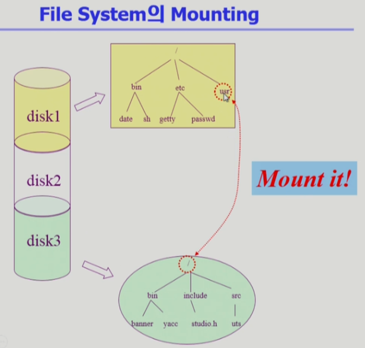
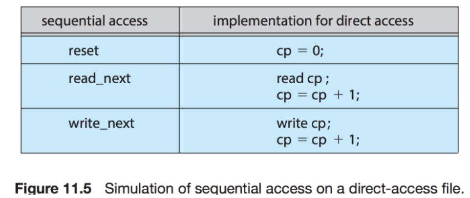
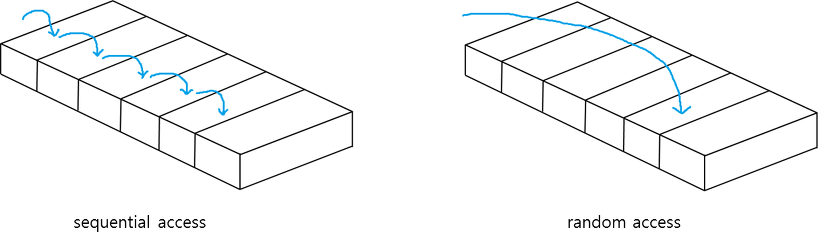
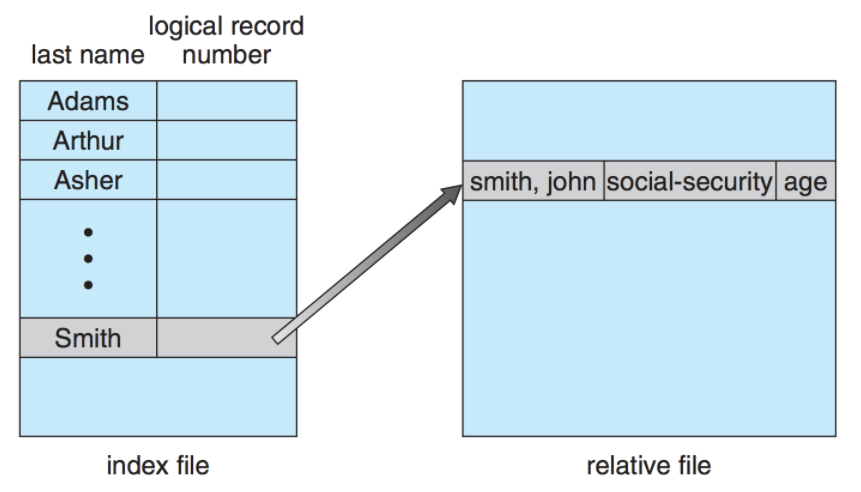

# 10 파일 시스템 File System

<hr/>

## 목차

1. [파일 시스템의 개념](#1-파일-시스템의-개념) <br/>
   &nbsp; 1-1. [파일과 파일 시스템](#1-1-파일과-파일-시스템) <br/>
   &nbsp; 1-2. [디렉토리와 파티션](#1-2-디렉토리와-파티션) <br/>
   &nbsp; 1-3. [파일 보호 File Protection](#1-3-파일-보호-file-protection) <br/>
   &nbsp; 1-4. [Mounting](#1-4-mounting) <br/>

<br/>

2. [Access Method](#2-access-method) <br/>
   &nbsp; 2-1. [순차 접근 Sequential Access](#2-1-순차-접근-sequential-access) <br/>
   &nbsp; 2-2. [직접 접근 Direct Access (Random Access)](#2-2-직접-접근-direct-access-random-access) <br/>
   &nbsp; 2-3. [색인 접근 Index Access](#2-3-색인-접근-index-access) <br/>

<br/><br/>

<hr/>

## 1. 파일 시스템의 개념

<br/>

<hr/>

### 1-1. 파일과 파일 시스템

<br/>

```
A named collection of related information
```

파일(File)은 저장 단위이며, 관련된 정보 자료들의 집합에 이름을 붙인 것이다. 일반적으로 레코드(Record) 혹은 블록(Block) 단위로 비휘발성 보조기억장치에 저장된다. 컴퓨터 시스템의 편리한 사용을 위해 운영체제는 다양한 저장 장치를 file이라는 동일한 논리적 단위로 볼 수 있게 해준다. create, read, write, reposition (lseek), delete, open, close 등의 연산이 있다.

<br/>

파일 속성(File attribute) 혹은 파일의 메타데이터(metadata)는  파일 자체의 내용은 아니라 파일을 관리하기 위한 각종 정보들이다. 파일 이름, 유형, 저장된 위치, 파일 사이즈, 접근 권한(읽기/쓰기/실행), 소유자, 시간(생성/변경/사용) 등 파일에 대한 전반적인 정보를 말한다. 

<br/>

파일 시스템(File System)은 운영체제와 모든 데이터, 프로그램의 저장과 접근을 위한 기법을 제공한다. 시스템 내의 모든 파일에 관한 정보를 제공하는 계층적 디렉터리 구조이고, 파일 및 파일의 메타데이터, 디렉터리 정보 등을 관리한다. 또한 파일의 저장 방법을 결정하고 파일을 보호해준다.

<br/>

<hr/>

### 1-2. 디렉토리와 파티션

<br/>

`Directory`는 파일의 메타데이터 중 일부를 보관하고 있는 일종의 특별한 파일이다. 그 디텍토리에 속한 파일 이름 및 파일 속성(attribute)을 가지고 있다. search for a file, create a file, delete a file, list a directory, rename a file, traverse the file system(파일 시스템 전체 탐색) 등의 연산을 수행할 수 있다.

<br/>

`파티션 Partition (= Logical Disk)`은 사무실의 칸막이라는 뜻이 있는데 컴퓨터에서의 파티션도 비슷한 의미이다. `파티션 Partition`이란 연속된 저장 공간을 하나 이상의 연속되고 독립적인 영역으로 나누어 사용할 수 있도록 정의한 논리적인 디스크이다. 하나의 물리적 디스크 안에 여러 파티션을 두는 게 일반적이다. 여러 물리적 디스크를 하나의 파티션으로 구성하기도 한다. 물리적 디스크를 파티션으로 구성한 뒤 각각의 파티션에 file system을 설치하거나 swapping 등 다른 용도로 사용할 수 있다.

<br/>

#### open()



- 이미지출처: https://velog.io/@ayoung0073/OS-File-System
- 파일 open이란 물리적 메모리에 파일의 metadata를 올려 놓는 것을 말한다.

<br/>

예를 들어, open("/a/b/c") 명령을 실행한다고 해보자. 디스크로부터 파일 c의 메타데이터를 물리적 메모리(RAM)로 가지고 온다. 이를 위해 directory path를 search를 진행한다. 그 과정은 아래와 같다.
1. 루트 디렉토리("/")를 open하고 그 안에서 파일 "a"의 위치를 획득한다.
2. 파일 "a"를 open한 후 read하여 그 안에서 파일 "b"의 위치를 획득한다.
3. 파일 "b"를 open한 후 read하여 그 안에서 파일 "c"의 위치를 획득한다.
4. 파일 "c"를 open한다.

위 과정에서 알 수 있듯이, Directory path의 search에 너무 많은 시간이 소요되기 때문에 open을 read/write과 별도로 두는 것이 효율적이다. 한번 open한 파일이 read/write 시 directory search을 실행하지 않도록 하는 것이다.<br/>
`Open file table`은 open()함수에 의해 open된 파일의 list 형태로 나타낸 테이블이며, 현재 open 된 파일들의 metadata 보관소이다. 디스크의 metadata에 `Open한 프로세스의 수`, `파일 어느 위치 접근 중인지 표시해주는 file offset` 등의 정보가 추가해 저장한다. `Open file table`은 `system-wide table`로 운영체제는 단 한 개만 가지고 있는다.<br/>
`File descriptor (file handle, file control block)`는 `Open file table`에 대한 프로세스별 위치 정보이다. `file descriptor table`은 `Open file table`과는 다르게 프로세스마다 가지고 있는다.



- 이미지출처: https://velog.io/@ayoung0073/OS-File-System
- `open()` 시스템콜을 통해 CPU 제어권이 운영체제로 넘어간다.
- 운영체제는 먼저 `root directory의 metadata`를 먼저 `file table`에 올린다.
- 이제 운영체제는 실제 root의 내용(content)를 알 수 있게 된다. a라는 파일의 metadata가 존재하고 이 또한 file table에 올린다.
- `a는 directory파일`이기 때문에 타고 들어간다. 이 안에 `file b`의 metadata가 있다. 이 metadata를 `file table`에 올린다.
- 이제 운영체제는 결과값을 반환해준다. 운영체제는 프로세스가 오픈한 파일들에 대한 metadata의 포인터를 가지고 있는 일종의 배열을 정의해 관리한다. <u>배열 중에 file b의 fd(file discriptor)를 가지고 있는 곳의 인덱스를 `프로세스 A`에게 반환한다.</u>
- 프로세스 A는 fd를 통해 `read()` 시스템 콜을 호출하면 운영체제는 프로세스로부터 받은 인덱스를 통해 b의 metadata를 찾고 metadata를 통해 `file b`를 읽어와 운영체제의 메모리 어딘가에 저장해놨다가 이 내용을 copy해 사용자 메모리 영역에 전달해준다.
- 나중에 해당 내용을 다시 요청하면, 운영체제에 이 내용이 저장되어있기 때문에 파일을 다시 찾을 필요없이 바로 전달해줄 수 있다.

<br/>

<hr/>

### 1-3. 파일 보호 File Protection

<br/>

파일에 대해 누구에게 어떤 유형의 접근(read/write/execution)을 허락할 것인지 판단하는 문제이다. 파일 시스템에서 접근 권한을 제어하는 방법은 크게 3가지가 존재한다.

#### Access Control Matrix



사용자와 파일 이름을 매칭해 사용자가 파일에 대해서 어떤 접근 권한을 가지고 있는지 표시하는 방법이다.
- Access Control List : 파일별로 누구에게 어떤 접근 권한이 있는지 파일 주체의 linked-list를 이용해 표시
- Capability : 사용자 주체의 linked-list를 만들어 자신이 접근 권한을 가진 파일 및 해당 권한 표시

<br/>

#### Grouping

<u>일반적인 운영체제는 Grouping 방식을 많이 사용한다.</u> 모든 사용자가 아닌 전체 user를 owner, group, public의 세 그룹으로 구분해 각 파일에 대해 세 그룹의 접근 권한(rwx)을 3비트씩으로 표현하는 방법이다. 유닉스와 리눅스에서 많이 쓰인다. 
- ex) `rwsr--r-- `


<br/>

#### Password

파일이나 디렉토리마다 password를 두는 방법이다. 
- 모든 접근 권한에 대해 하나의 password: all-or-nothing
- 접근 권한별 password: 암기 문제, 관리 문제

<br/>

<hr/>

### 1-4. Mounting

<br/>



루트 파일 시스템의 특정 디렉토리 이름에 또 다른 파티션에 있는 파일 시스템을 mounting 해준다. 그러면 mount된 디렉토리에 접근했을 때 또 다른 파일시스템의 루트 디렉토리에 접근하는 것이 된다. 이렇게 서로 다른 파티션에 존재하는 파일 시스템에 접근할 수 있다.

<br/>

<hr/>

## 2. Access Method

<br/>

시스템이 제공하는 파일 정보의 접근 방식은 순차 접근(Sequential Access)과 직접 접근(Direct Access, Random Access), 색인 접근(Index Access)으로 나뉜다. 

<br/>

<hr/>

### 2-1. 순차 접근 Sequential Access

<br/>

가장 단순한 방법으로 파일의 정보가 레코드 순서대로 처리된다. 카세트테이프를 사용하는 방식과 동일하다. 현재 위치에서 읽거나 쓰면 offset이 자동으로 증가하고, 뒤로 돌아가기 위해선 되감기가 필요하다.  


<br/>

<hr/>

### 2-2. 직접 접근 Direct Access (Random Access)

<br/>



파일을 구성하는 레코드를 임의의 순서로 접근할 수 있다. 원하는 데이터를 기억 장치로부터 호출할 때, 데이터가 저장된 위치나 접근 시간에 구애받지 않는다는 특징이 있다. LP 판을 사용하는 방식과 비슷하다. 읽기나 쓰기의 순서에 제약이 없으며 현재 위치를 유지할 수 있다면 이를 통해 순차 접근 기능도 구현할 수 있다.

<br/>

- 순차접근과 직접접근의 차이



<br/>

<hr/>

### 2-3. 색인 접근 Index Access

<br/>
 


파일에서 레코드를 찾기 위해 색인을 먼저 찾고 대응되는 포인터를 얻는다. 이를 통해 파일에 직접 접근하여 원하는 데이터를 얻을 수 있다. 따라서 크기가 큰 파일에서 유용하다. 

<br/><br/>

<hr/>

## 출처

- 반효경, 운영체제와 정보기술의 원리

- Abraham Silberschatz, Operating System Concept

- https://rebro.kr/

- https://woonys.tistory.com/m/entry/PintOS-Project-4-File-system-1-%EC%A0%95%EA%B8%80%EC%82%AC%EA%B4%80%ED%95%99%EA%B5%90-85%EC%9D%BC%EC%B0%A8-TIL

<hr/>

#### Edited by pythonstrup (myvelop.tistory.com)

<hr/>