# 11 파일 시스템 구현 File System Implementations

<hr/>

## 목차

1. [Allocation of File Data in Disk](#1-allocation-of-file-data-in-disk) <br/>
   &nbsp; 1-1. [연속 할당 Contiguous Allocation](#1-1-연속-할당-contiguous-allocation) <br/>
   &nbsp; 1-2. [링크 연결 할당 Linked Allocation](#1-2-링크-연결-할당-linked-allocation) <br/>
   &nbsp; 1-3. [인덱스 할당 Indexed Allocation](#1-3-인덱스-할당-indexed-allocation) <br/>

<br/>

2. [Allocation의 구현](#2-allocation의-구현) <br/>
   &nbsp; 2-1. [Unix 파일 시스템](#2-1-unix-파일-시스템) <br/>
   &nbsp; 2-2. [Fat 파일 시스템 구조](#2-2-fat-파일-시스템-구조) <br/>

<br/>

3. [Free Space Management](#3-free-space-management) <br/>
   &nbsp; 3-1. [Bit Map (Bit Vector)](#3-1-bit-map-bit-vector) <br/>
   &nbsp; 3-2. [연결 리스트 Linked List](#3-2-연결-리스트-linked-list) <br/>
   &nbsp; 3-3. [Grouping](#3-3-grouping) <br/>
   &nbsp; 3-4. [Counting](#3-4-counting) <br/>

<br/>

4. [디렉토리 구현 Directory Implementation](#4-디렉토리-구현-directory-implementation) <br/>

<br/>

5. [디렉토리 구조 Directory Structure](#5-디렉토리-구조-directory-structure) <br/>
   &nbsp; 5-1. [1단계 디렉터리 Single Level Directory](#5-1-1단계-디렉터리-single-level-directory) <br/>
   &nbsp; 5-2. [2단계 디렉터리 Two Level Directory](#5-2-2단계-디렉터리-two-level-directory) <br/>
   &nbsp; 5-3. [트리 구조 디렉터리 Tree Structured Directory](#5-3-트리-구조-디렉터리-tree-structured-directory) <br/>
   &nbsp; 5-4. [비순환 그래프 디렉터리 Acyclic Graph Directory](#5-4-비순환-그래프-디렉터리-acyclic-graph-directory) <br/>
   &nbsp; 5-5. [일반 그래프 디렉터리 General Graph Directory](#5-5-일반-그래프-디렉터리-general-graph-directory) <br/>

<br/>

6. [파일 시스템의 종류](#6-파일-시스템의-종류) <br/>
   &nbsp; 6-1. [가상 파일 시스템 Virtual File System](#6-1-가상-파일-시스템-virtual-file-system) <br/>
   &nbsp; 6-2. [네트워크 파일 시스템 Network File System](#6-2-네트워크-파일-시스템-network-file-system) <br/>

<br/>

7. [Page Cache & Buffer Cache](#7-page-cache--buffer-cache) <br/>
   &nbsp; 7-1. [Page Cache와 Buffer Cache](#7-1-page-cache와-buffer-cache) <br/>
   &nbsp; 7-2. [Unified Buffer Cache](#7-2-unified-buffer-cache) <br/>

<br/>

8. [프로그램 실행](#8-프로그램-실행) <br/>
   &nbsp; 8-1. [프로그램과 프로세스](#8-1-프로그램과-프로세스) <br/>
   &nbsp; 8-2. [Memory Mapped I/O를 사용한 프로그램](#8-2-memory-mapped-io를-사용한-프로그램) <br/>
   &nbsp; 8-3. [Read/Write 시스템 콜을 사용한 프로그램](#8-3-readwrite-시스템-콜을-사용한-프로그램) <br/>

<br/><br/>

<hr/>

## 1. Allocation of File data in Disk

<br/>

파일 데이터를 디스크에 할당하는 방법으로는 `Contiguous Allocation`, `Linked Allocation`, `Indexed Allocation` 등 3가지가 있다.

- 참고할 만한 자료: [geeks for geeks - file allocation methods](https://www.geeksforgeeks.org/file-allocation-methods/)

<br/>

<hr/>

### 1-1. 연속 할당 Contiguous Allocation

<br/>


- 파일을 `ㅁ`으로 나타나는 `논리적인 블록 logical block` 단위로 나누어 저장한 모습이다.

하나의 파일이 디스크 상에 연속적으로 저장되는 방식을 뜻한다. contiguous 방식으로 파일을 저장했을 때, 블럭 n개로 구성되는 파일은 디스크 상의 n개 블록이 서로 연속되도록 저장한다.

- 블록 2개로 구성된 파일: 0-1, 6-7
- 블록 3개로 구성된 파일: 14-16
- 블록 4개로 구성된 파일: 28-31
- 블록 6개로 구성된 파일: 19-24

디렉토리는 그 디렉토리 밑에 있는 파일들의 metadat를 내용으로 하고 있는데, 오른쪽에 나타난 `Directory`라고 표시된 표가 그 내용이다. 해당 디렉토리 내에는 디스크에 저장되어 있는 `파일의 이름`, 해당 파일이 디스크 상에서 어디에 위치해있는지에 대한 `시작 위치(start)`, 그리고 `파일의 길이(length)`를 보여주고 있다.

<br/>

메모리 관리에서 언급한 세그멘테이션 기법이 이와 비슷한 모습을 보여준다. 외부 단편화 문제가 발생하는 것도 똑같다. 그림에서 확인했다시피 파일의 크기는 균일하지 않기 때문에 연속으로 파일 데이터를 할당해버리면 4개 블록 차지하는 파일을 저장한다고 했을 때, 25-27에 해당하는 위치는 비어있음에도 불구하고 활용할 수 없다.

<br/>
 
`Contiguous Allocation`은 file grow가 어렵다는 단점을 가지고 있다. 파일은 중간에 크기가 변할 수 있다. 크기가 커질수도, 작아질 수도 있는데 파일을 수정해 크기를 변화시키기가 어렵다는 말이다. 뒷 블록에 다른 파일이 자리하고 있으면 연속 할당이라는 원칙 때문에 그곳을 넘어 크기를 늘릴 수 없기 때문이다. 이 문제를 해결하기 위해 빈 공간(hole)을 확보하는 전략이 있을 수 있다. 그러나 file 생성 시 얼마나 큰 hole을 배당할 것인지에 대한 문제가 있다. 만약 잘 배당해서 grow가 가능하게 하더라도 그만큼 내부 단편화가 발생해 공간을 낭비하게 된다는 문제가 있다.

<br/>
 
`Contiguous Allocation`은 2가지 장점을 가지고 있다. 먼저, Fast I/O이다. 하드디스크와 같은 저장 매체의 작업에서 대부분 차지하는 시간이 디스크 헤드가 이동하는 시간(seek/rotation)에 의해 소모된다. 읽거나 쓰는데 드는 시간은 큰 차이가 없다. 데이터를 불연속하게 저장하는 방식과 다르게 연속 저장 방식은 한 번의 seek/rotation으로 많은 바이트를 읽어 전송할 수 있다는 장점이 있다. 한 번 위치에 도달하면 인접 영역만 읽으면 되기 때문이다. 또한, 이미 실행되고 있는 프로세스의 Swapping용이나 Realtime file용으로 사용하기에 좋다.<br/>
두 번째 장점은 Direct access(Random Access)가 가능하다는 것이다. 위 그림에서 19-24번 블록으로 구성된 mail이라는 파일에서 23번 블록에 곧바로 접근한다고 하고자 한다면, 시작 위치인 19번에서 4만큼 더해 O(1)의 시간복잡도로 23번 블록에 도달할 수 있다.

- Random Access에 대한 내용: [링크](https://github.com/pythonstrup/TIL/blob/main/OS/10%20File%20Systems.md#2-2-%EC%A7%81%EC%A0%91-%EC%A0%91%EA%B7%BC-direct-access-random-access)

<br/>

<hr/>

### 1-2. 링크 연결 할당 Linked Allocation

<br/>

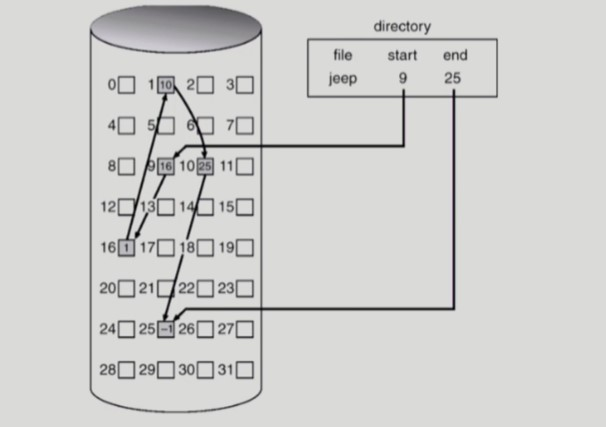

`Contiguous Allocation`은 중간에 작은 크기의 hole이 생겨 저장 공간을 효율적으로 사용하지 못한다는 단점이 이었다. 그림과 같이 임의 블록에 파일을 배치한 다음 각 블록을 연결하는 방식인 `Linked Allocation`을 사용하면 공간을 효율적으로 사용할 수 있다.

<br/>

그림 오른쪽의 디렉토리의 표를 보면 jeep 파일이 저장되어 있다. 이 jeep 파일은 시작 위치가 9번 블록이고 끝 위치가 25번 블록이다. 해당 파일을 읽기 위해 시작 블록인 9번으로 이동해서 linked-list로 연결된 블록을 하나씩 읽어들여 25번 블록에 도착하면 끝낸다. 이때, 각 블록에는 해당 파일 자체 정보뿐만 아니라 다음 블록의 위치 역시 저장되어 있다.

<br/>

`Linked Allocation`은 외부 단편화가 발생하지 않는다는 장점이 있지만 직접 접근이 되지 않는다는 단점이 있다. 만약 해당 파일의 중간에 있는 블록에 접근하려면 첫번째 블록부터 순차적으로 하나씩 탐색해 해당 블록까지 가야 접근할 수 있다. <br/>
또 다른 문제는 reliability 문제이다. 디스크에는 간혹 bad sector가 발생할 수 있다. 예를 들어, 파일을 구성하는 섹터 수가 1000개인데 중간에 있는 특정 섹터에 bad sector가 발생한다면, 그 이후 섹터에는 아예 접근을 할 수 없다. 600번 섹터가 bad sector가 발생하면 601번째 위치부터 전혀 알 수 없게 된다. 즉, 한 섹터만 고장나면 그 이후의 pointer가 유실되어 많은 내용을 잃게 된다.<br/>
Pointer를 위한 공간이 block의 일부가 되어 공간 효율성을 떨어뜨린다는 문제도 있다. 블록 하나당 크기가 512바이트일 때, 포인터 크기는 4바이트로 적지 않은 공간을 차지하게 된다. 여기서 `FAT (File-allocation table)` 파일 시스템을 잘 활용하면 포인터를 별도 위치에 보관해 reliability와 공간 효율성 문제를 해결할 수 있다.

<br/>

<hr/>

### 1-3. 인덱스 할당 Indexed Allocation

<br/>

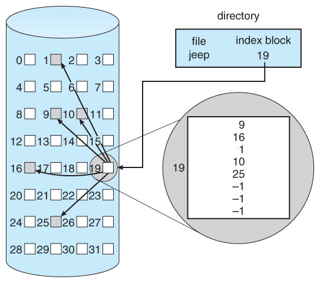

`인덱스 할당 Indexed Allocation` 방식은 디렉토리에 파일 위치 정보를 바로 저장하지 않고 별도의 인덱스 블록을 만들어 거기에 저장한다. 그림을 확인해보면 19번 블록에 인덱스를 저장해둔 것을 알 수 있다. 오른쪽 디렉토리 안에 들어있는 내용은 인덱스 블록의 `파일 이름`과 그 `위치`이다.

<br/>

인덱스 블록은 이 파일이 어디어디에 저장되어있다는 위치 정보를 갖고 있는 블록이다. 그림을 보면 블록 하나에 모든 위치 정보가 기록되어 있다. `Indexed Allocation`은 `Linked Allocation`와 다르게 직접 접근을 할 수 있다. 19번 블록에서 해당 인덱스만큼 이동하면 블록 번호를 알아낼 수 있기 때문이다. 또한, 순차 접근에서 생겼던 문제인 hole도 생기지 않아 외부 단편화 문제도 발생하지 않는다.

<br/>

하지만 최소 공간으로 2블록이 필요하다는 점에서 공간 비효율이 발생할 수 있다. 기본적으로 인덱스 블록은 무조건 필요하고 이어서 실제 파일을 저장하는 블록이 필요하다. 아무리 작은 파일이어도 2개의 블록(1KB)을 필요로 하기 때문이다. 파일 크기가 엄청 커도 문제이다. 일반적으로 하나의 블록은 512 바이트가 필요한데, 인덱스 개수가 매우 많으면 하나의 인덱스 블록만 가지고 모든 블록 위치를 다 저장할 수 없는 문제가 발생할 수 있다. 이를 해결하는 방안으로는 `linked scheme`과 인덱스 블록을 여러 개 두는 방식인 `multi-level index`을 사용할 수 있다.

<br/>

<hr/>

## 2. Allocation의 구현

<br/>

<br/>

<hr/>

### 2-1. UNIX 파일 시스템

<br/>

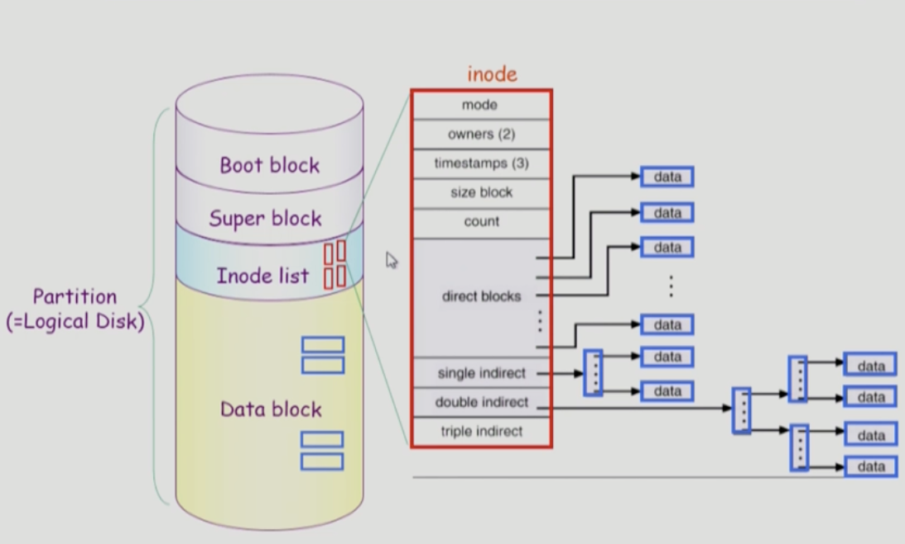

유닉스 파일 시스템은 물리 디스크를 4개의 논리 디스크인 파티션으로 구분한다. 차례대로 살펴보자.

#### Boot block 

부트 블록은 컴퓨터 부팅에 필요한 총체적인 정보가 들어있는 디스크로, 디스크 가장 앞쪽에 위치해있다. 유닉스를 포함한 대부분의 파일시스템의 Boot block은 가장 맨 앞에 있는 것이 일반적이다. 0번 블록에 부팅에 필요한 정보(Bootstrap loader)를 메모리에 올리면 복잡한 로직 없이 부팅을 바로 진행할 수 있기 때문이다.

<br/>

#### Super block

파일 시스템과 관련한 총체적인 정보를 담고 있다. 어떤 블록이 비어있는 블록이고 어떤 블록이 실제 사용 중인 블록인지에 대한 정보를 담고 있다.

<br/>

#### Inode list

파일 이름을 제외한 파일의 모든 메타 데이터를 저장하는 영역이다.
파일 메타데이터는 디렉토리 파일 내부에 저장되어 있다. 하지만 실제 파일 시스템에서는 파일의 메타데이터를 모두 디렉토리 파일이 갖고 있지 않다. 유닉스 파일 시스템의 경우 디렉토리는 지극히 일부분(ex-파일 이름 등)만 갖고 있고 실제 파일의 메타데이터는 별도 공간에 따로 보관한 곳이 존재한다. 바로 `Inode list`이다.<br/>
첫번째 이미지를 확인해보면 `Inode list` 내부에 작은 빨간 블록이 여러 개 들어있는데, 이것이 파일의 metadata이며 하나하나가 `inode`에 해당한다. inode 하나당 파일 하나가 매핑된다. <br/>
해당 `inode`를 자세히 살펴보면 매핑된 파일의 메타데이터가 들어있다. (파일의 이름은 디렉토리가 갖고 있지 `inode`에서 가지고 있지 않는다.) `direct blocks`은 파일 내 블록에 직접 접근할 수 있는 블록 위치를 저장하는 영역이다. `direct blocks`으로 각 블록 별 위치 정보를 저장하고 있으면 모든 데이터에 직접 접근이 가능해진다는 장점이 있다. list 중 가장 밑에 있는 `single indirect`, `double indirect`, `triple indirect` 블록은 파일의 크기가 클 경우 `Inode list`안에 모든 direct 블록을 다 담을 수 없기 때문에 중간에 거쳐갈 수 있는 자료구조를 담는 영역이다.

<br/>

#### Data block

파일의 실제 내용을 보관하는 영역이다.

<br/>


실제 작동 방식은 다음과 같다. 데이터 블록 내에 디렉토리 파일을 하나 열면, 해당 디렉토리 파일 내에는 파일 메타데이터가 들어있다. `file 이름`과 `inode 번호`이다. 나머지 메타데이터는 inode 번호를 통해 찾아갈 수 있는 `Inode list`에 보관되어 있다. 이제 `Inode list`에 있는 메타데이터를 이용해 해당 파일을 찾으면 된다.

<br/>

<hr/>

### 2-2. FAT 파일 시스템 구조

<br/>

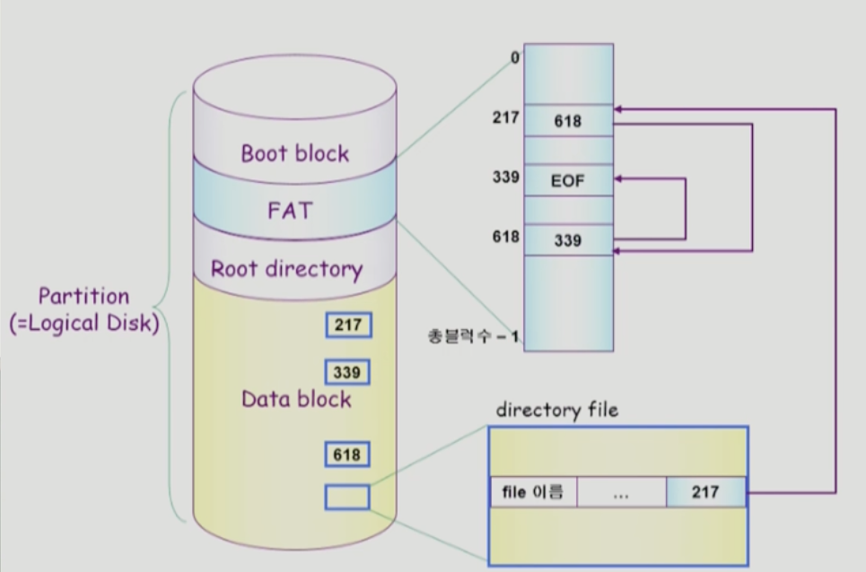

FAT 파일 시스템은 UNIX 파일 시스템 구조와 비슷해보이지만 약간 다르다. `Inode list` 대신 FAT을 사용하고 `super block` 대신 `Root directory`가 들어가 있다.

#### Boot block

부트 블록은 위의 유닉스 시스템과 동일하다.


#### FAT

파일 메타데이터 중 일부를 FAT에 저장한다. 여기서 FAT에 저장하는 일부 데이터는 파일 위치 정보에 해당하며, 나머지 메타데이터는 루트 디렉토리에 저장한다. FAT을 확인해보면, 데이터 블록에 있는 해당 파일 contents로 곧바로 접근이 가능하다. 직접 접근이 가능한 구조에 해당한다.<br/>
그림을 살펴보자. directory file은 217번지를 가리킨다. 217번지의 파일 확인했다면 다음 파일은 어떻게 알 수 있을까? FAT을 확인하면 된다 FAT의 217번지를 보면 다음에 확인해야할 file의 주소를 알 수 있다. 만약 마지막 파일이라면 EOF를 반환해 파일의 끝임을 알려준다. 여기서 핵심은 디스크 헤드를 움직이면서 확인하는 것이 아니라 FAT 테이블을 메모리에 올려놓고 메모리 안에서 탐색한다는 점이다.<br/>
FAT을 사용하면 포인터가 하나 유실되더라도 FAT에 위치 데이터가 보관되어 있으니 문제되지 않는다. 게다가, FAT은 매우 중요한 정보기 때문에 여러 copy를 디스크 내에 저장해두고 있다. <br/>
FAT을 이용해 `Linked Allocation`의 문제인 `reliability`를 개선할 수 있다. 또한, FAT를 통해 `직접 접근 Random Access`이 가능하다는 장점도 있다.


#### Root directory

FAT 구조에서는 루트 디렉토리에 위치를 제외한 나머지 파일 메타데이터를 저장하고 있다.


#### Data block

유닉스 시스템과 마찬가지로 파일 자체 정보를 갖고 있는 블록이다.

<br/><br/>

<hr/>

## 3. Free-Space Management

<br/>

디스크의 공간은 제한되어 있기 때문에 삭제된 파일들일 차지하던 공간을 새로운 파일들을 위하여 다시 재사용하여야 한다. 시스템은 빈 공간을 리스트로 유지하고 관리한다.

<br/>

<hr/>

<br/><br/>

### 3-1. Bit Map (Bit Vector)

<br/>

`비트 맵 bit map` 또는 `비트 벡터 bit vector` 방식은 각 블록을 1비트로 표현하여 Free-block에는 0, 사용중인 block에는 1을 부여하여 free-space를 관리하는 방식이다.<br/>
디스크 내에서 직관적으로 관리되어서 free-space에 찾아가기가 쉽고, 특히 첫번째 free-block과 n개의 연속된 free-space를 탐색하는데 유리하다. 그러나 부가적인 공간을 필요로 한다는 특징이 있다.

- 아래 예시는 0,1,4,5,8이 free-block이고 길이가 10인 bit map이다.

```
0011001101
```

<br/>

<hr/>

<br/><br/>

### 3-2. 연결 리스트 Linked List

<br/>

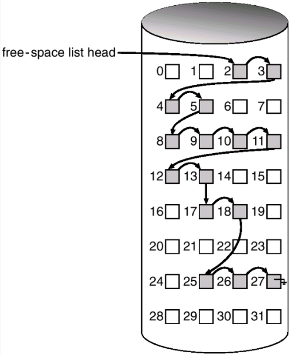

free-block을 linked-list로 연결하여 관리하는 방식이다.(free-list) 순서대로 접근하기 때문에 공간 낭비가 없다.즉,`단편화 fragmentation` 문제로부터 자유롭다. 하지만, 특정한 공간에 접근하려면 list의 헤더부터 탐색해야되기 때문에 비효율적이라는 단점이 있다.

<br/>

<hr/>

### 3-3. Grouping

<br/>

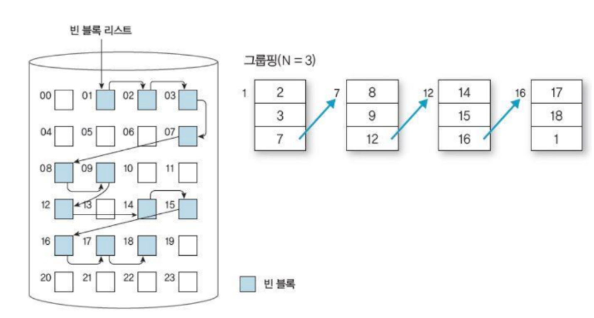

n개의 free-block을 하나의 그룹으로 묶고, 이 그룹을 Linked list로 연결시키는 방법이다. [Linked allocation](#1-2-링크-연결-할당-linked-allocation)의 변형이다. 이 방법은 연속되는 free-space를 쉽게 찾을 수 있는 장점이 있다.<br/>
첫 번째 free block이 `n 개`의 블록 주소를 가리키는 `Pointer`를 가진다. `n-1 개`의 pointer는 모두 `free data block`을 가리킨다. 마지막 Pointer 가리키는 block은 다시 자신과 마찬가지로 `n 개`의 Pointer를 가지고 있다. <br/>
이 방법은 연결 리스트 방법과는 달리 다수의 블록 주소들을 쉽게 찾을 수 있다는 점이 장점이 있지만 연속된 block을 찾기에 적합하지 않은 방법이다.

<br/>

<hr/>

### 3-4. Counting

<br/>

프로그램들이 종종 여러 개의 연속적인 block을 할당하고 반납한다는 성질에서 착안한 방식으로, 연속된 free-block들 중에서 첫번째 free-block의 주소와 해당 block 이후로의 free-block의 갯수를 count라는 변수에 저장하여 관리하는 방법이다. `몇번째 블록 뒤로는 free-block이 몇개가 있다`라는 걸 알려주는 방법이다. <br/>
특히 연속 할당 알고리즘이나 클러스터링을 통해 공간을 할당 할 경우 유용하다. 모든 블록을 일일이 추적할 필요가 없어 연속된 자유 블록의 첫 번째 블록의 주소와 연속된 블록의 계수(count)만 유지하면 보다 효율적으로 사용할 수 있다.

<br/>

<hr/>

## 4. 디렉토리 구현 Directory Implementation

<br/>

<br/>

먼저 디렉토리를 구현하기 위해 `Linear list`나 `Hash Table`을 사용할 수 있다.

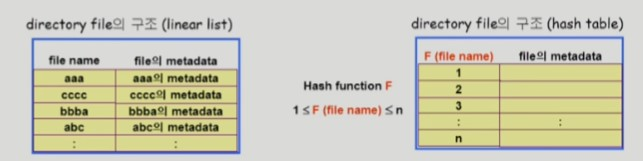

- Linear List
  - file name과 file의 metadata로 구성된 리스트
  - 구현이 간단하다.
  - 디렉토리 내의 파일을 찾기 위해 `선형 탐색 linear search`를 해야하는데 시간이 오래걸린다.

<br/>

- Hash Table
  - Linear list 방식과 `해싱 Hashing`을 합친 방법이다.
  - Hash Table은 file name을 이 파일의 linear list의 위치로 바꿔준다.
  - search의 시간복잡도가 O(1)이 된다.
  - 그러나 Collision이 발생할 수 있다는 단점이 있다.

<br/>

File의 meatadata의 `보관 위치`를 어떻게 하는냐에 따라 구현 방식을 나눌 수 있다. 디렉토리 내에 직접 보관할 수도 있고, 디렉토리에는 포인터를 두고 다른 곳에 보관(ex- `inode`, `FAT`)할 수도 있다.

<br/>

file name과 file의 metadata의 list에서 각 entry는 일반적으로 고정적인 크기가 정해져있다. 만약 그 고정 크기보다 file name이 길어지는 경우(Long file name), 긴 파일 이름을 지원하기 위해 entry의 마지막 부분에 이름의 뒷부분이 위치한 곳의 포인터를 두어 이름을 이어서 기록할 수 있는 방법이 있다.

<br/>

<hr/>

## 5. 디렉토리 구조 Directory Structure

<br/>

[File System](https://github.com/pythonstrup/TIL/blob/main/OS/10%20File%20Systems.md#2-2-%EC%A7%81%EC%A0%91-%EC%A0%91%EA%B7%BC-direct-access-random-access)에서 언급했다시피 `파티션 Partition`은 연속된 저장 공간을 하나 이상의 연속되고 독립적인 영역으로 나누어서 사용할 수 있도록 정의한 규약이다. `디렉터리 Directory`는 파일 이름을 해당 디렉터리 항목으로 변환해주는 심벌 테이블로 볼 수 있음, 파일 찾기, 생성, 삭제 등등 다양한 작업이 가능하다.


- 각 파티션에는 파티션 내의 파일에 대한 정보가 들어 있다. 이 정보는 장치 디렉터리 또는 볼륨에 저장된다.
- 각 파티션에는 해당 파티션에 저장된 파일에 대한 정보가 들어 있는 디렉터리 구조가 포함되어 있다. 디렉토리는 파일 이름을 디렉토리 및 디스크로 변환하는 테이블로 볼 수 있다.

<br/>

기본적으로 디렉터리의 파일을 빠르게 탐색할 수 있어야 하고 적절한 이름으로 사용자들이 편리하게 사용할 수 있어야 한다. 또, 파일들을 적절한 분류로 그룹화해두면 사용하기 편리할 것이다. 이를 위해 디렉터리의 논리적 구조를 정의하는 대표적인 방법이 5가지있다.

<br/>

<hr/>

### 5-1. 1단계 디렉터리 Single-Level Directory

<br/>

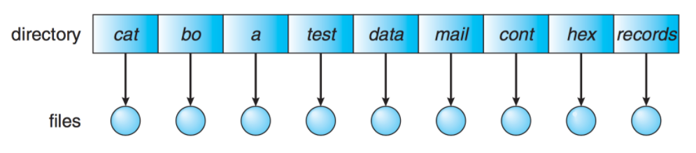

1단계 디렉터리는 모든 파일들이 디렉터리 밑에 있는 형태이다. 파일들은 서로 유일한 이름을 가지며 다른 사용자라도 같은 이름을 사용할 수 없다. 구현하기도 쉽고 이해하기도 쉽지만, 파일이 많아지거나 다수의 사용자가 사용하는 시스템에서는 이름의 중복이 불가하므로 제약이 있을 수밖에 없다.

<br/>

<hr/>

### 5-2. 2단계 디렉터리 Two-Level Directory

<br/>

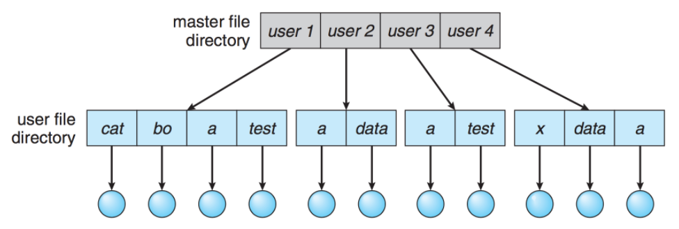

2단계 디렉터리는 각 사용자별로 별도의 디렉터리를 갖는 형태이다. 서로 다른 사용자가 같은 이름의 파일을 가질 수 있고 효율적인 탐색이 가능하다. 하지만 그룹화가 불가능하다는 단점이 있고, 다른 사용자의 파일에 접근해야 하는 경우에는 불리하다.

- UFD : 자신만의 사용자 파일 디렉터리
- MFD : 사용자의 이름과 계정 번호로 색인되어 있는 디렉터리.

<br/>

<hr/>

### 5-3. 트리 구조 디렉터리 Tree-Structured Directory

<br/>

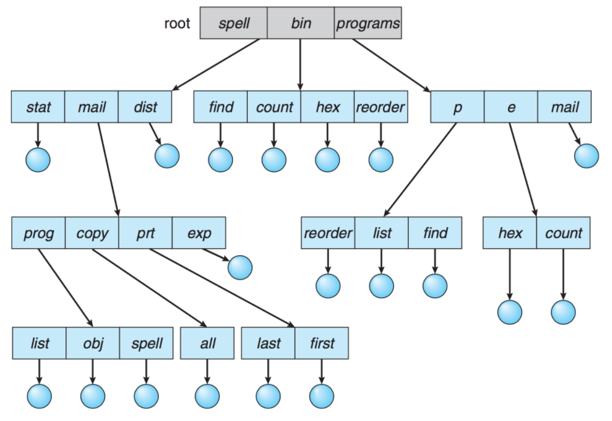

2단계 구조가 확장된 다단계 트리 구조로, 사용자들이 자신의 `서브 디렉터리 Sub-Directory`를 만들어서 파일을 구성할 수 있다. 하나의 루트 디렉터리를 가지며 모든 파일은 고유한 경로(절대 경로/상대 경로)를 가진다. 이를 통해 효율적인 탐색이 가능하고, 그룹화가 가능하다. 디렉터리는 일종의 파일이므로 일반 파일인지 디렉터리인지 구분할 필요가 있다. bit를 사용하여 0이면 일반 파일, 1이면 디렉터리로 구분한다.

<br/>

<hr/>

### 5-4. 비순환 그래프 디렉터리 Acyclic-Graph Directory

<br/>

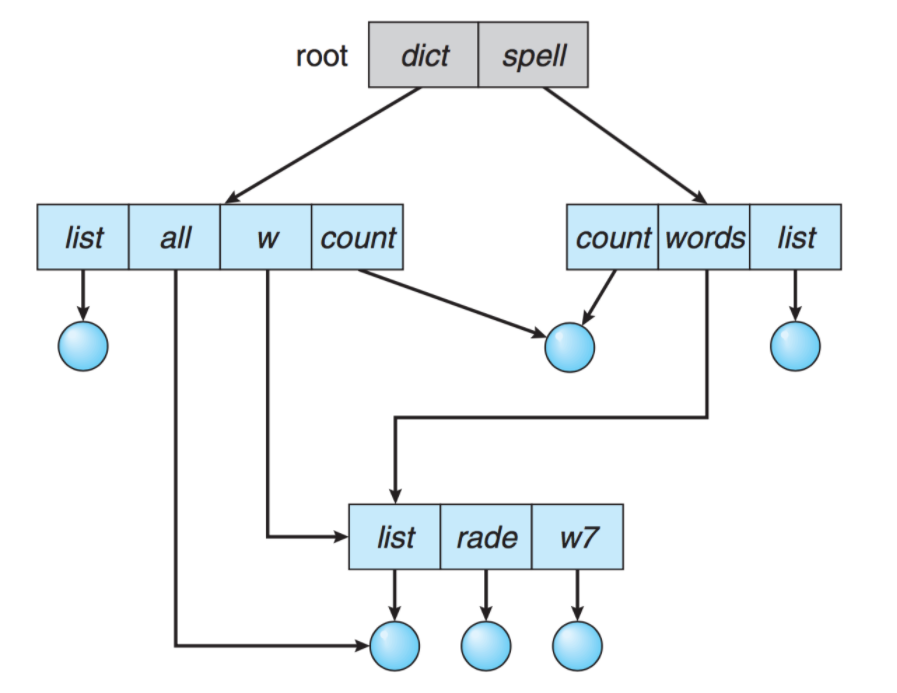

디렉터리들이 `서브 디렉터리 Sub-Directory`들과 파일을 공유할 수 있도록 한다. 트리 구조의 디렉터리를 일반화한 형태이다. 트리 구조보다 더 복잡한 구조이기 때문에 몇몇 문제가 발생할 수 있다. 파일을 무작정 삭제하게 되면 현재 파일을 가리키는 포인터는 대상이 사라지게 된다. 따라서 참조되는 파일에 참조 계수를 두어서, 참조 계수가 0이 되면 파일을 참조하는 링크가 존재하지 않는다는 의미이므로 그때 파일을 삭제할 수 있도록 한다.

<br/>

<hr/>

### 5-5. 일반 그래프 디렉터리 General Graph Directory

<br/>


순환을 허용하는 그래프 구조이다. 순환이 허용되면 무한 루프에 빠질 수 있다. 따라서, 하위 디렉터리가 아닌 파일에 대한 링크만 허용하거나 `가비지 컬렉션 Garbage Collection`을 통해 전체 파일 시스템을 순회하고, 접근 가능한 모든 것을 표시한다. 링크가 있으면 우회하여 순환을 피할 수 있다.

<br/>

<hr/>

## 6. 파일 시스템의 종류

<br/>

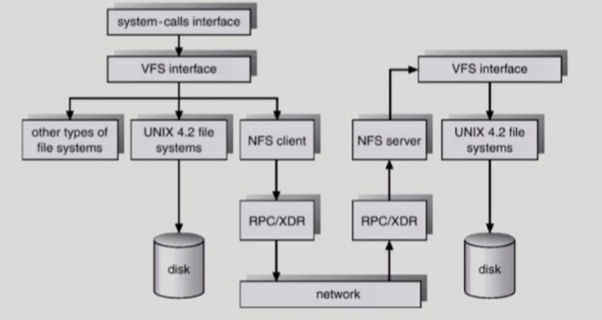

<br/>

<hr/>

### 6-1. 가상 파일 시스템 Virtual File System

<br/>

실제 파일 시스템에 관계 없이 공통된 인터페이스로 파일 시스템에 접근하도록 하는 계층을 `가상 파일시스템 Virtual Filesystem Switch, VFS`이라고 한다. <br/>
서로 다른 다양한 file system에 대해 동일한 시스템 콜 인터페이스(API)를 통해 접근할 수 있게 해주는 OS의 Layer이다.

<br/>

<hr/>

### 6-2. 네트워크 파일 시스템 Network File System

<br/>

`NFS`는 네트워크 상에서 파일시스템을 공유하도록 설계된 파일 시스템이다. 다른서버의 파티션을 마치 내 로컬영역인 것처럼 네트워크를 이용하여 사용할 수 있다. 해당 시스템을 통해 분산 시스템에서 네트워크를 통해 파일이 공유될 수 있다.

<br/>

<hr/>

## 7. Page Cache & Buffer Cache

<br/>

<hr/>

### 7-1. Page Cache와 Buffer Cache

<br/>

`Page cache`란 Virtual Memory의 Paging System에서 사용하는 page frame을 caching의 관점에서 설명하는 용어이다. Page Frame에다가 당장 필요한 내용을 메모리에 올려두고 필요하지 않은 내용들을 쫓아낸다. Memory-Mapped I/O를 쓰는 경우 file의 I/O에서도 page cache를 사용한다. 페이지 단위는 4KB이다.

<br/>

`Memory-Mapped I/O`란 파일 입출력을 read/write syscall을 통해 작업하지 않고, File의 일부를 virtual memory에 mapping시키는 것을 말한다. 이를 통해 매핑시킨 영역에 대한 메모리 접근 연산은 파일의 입출력을 수행이 가능해진다. 이미 메모리에 올라온 내용에 대해서는 운영체제를 호출하지 않고 자신의 메모리에 접근하듯이 읽고 쓸 수 있다는 말이다.

<br/>

`Buffer cache`는 파일 시스템을 통한 I/O연산에서 사용되는 저장공간이다. 운영체제가 사용자의 요청을 받아서 디스크에서 가져온 정보를 사용자에게 바로 주지 않고 `Buffer cache`에 저장한 뒤에 전달한다. 이후에 버퍼에 저장된 내용을 요청하면 다시 디스크까지 가지 않고 버퍼에서 데이터를 전달한다.(File 사용의 locality 활용) 모든 프로세스가 공용으로 사용하며, LRU와 LFU와 같은 Replacement algorithm이 필요하다. 블록은 논리적인 블록 디스크에서는 섹터를 의미하고 섹터는 512byte였으나 최근에는 Buffer Cache와 Page Cache가 통합되어 사용되면서 page단위(4KB)를 사용한다.

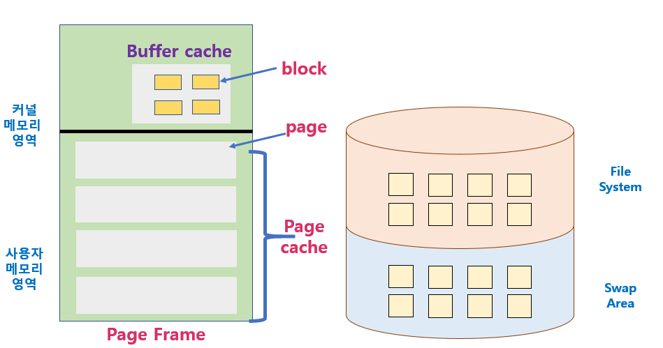

- 이미지 출처: https://jhi93.github.io/category/os/2019-12-28-operatingsystem-10-3/

<br/>

<hr/>

### 7-2. Unified Buffer Cache

<br/>

예전에는 버퍼 캐시와 페이지 캐시를 구분해서 사용했다면, 최근에는 Unified Buffer Cache를 많이 사용한다. `Unified Buffer Cache`은 버퍼와 페이지 캐시를 통합한 것이다. 버퍼 캐시의 단위도 작은 단위가 아닌 페이지와 동일(4KB)한 단위의 블록을 사용한다. 페이지를 용도에 맞춰서 할당해준다.

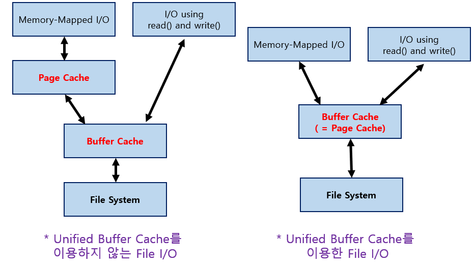

<br/>

#### Unified Buffer Cache를 이용하지 않는 File I/O

1. 파일을 open한 후 read, write 시스템 콜을 한다.
   - 시스템 콜이므로 운영체제가 해당하는 파일의 내용이 Buffer Cache에 있는 지 확인.
   - Buffer Cache에 존재한다면 전달해주고 없으면 디스크에서 읽어서 전달해준다.
   - 사용자 프로그램은 자신의 주소 영역중에 있는 Page에다가 Buffer Cache 내용을 카피해서 사용한다.

<br/>

2. Memory Mapped I/O
   - 운영체제에게 ‘Memory Mapped I/O 쓰겠다’라는 mmap 시스템 콜을 호출.
   - 자신의 주소공간 중 일부를 파일에다가 맵핑한다. (디스크에서 `Buffer Cache`로 읽어오는 것은 동일하다.)
   - 읽어온 내용을 `Page Cache`에다가 카피한다. (Page에 파일에 Mapped된 내용이 들어감. 맵핑 이후는 운영체제의 간섭없이 내 메모리 영역에다가 데이터를 읽거나 쓰는 방식으로 파일입출력이 가능하다.)
   - 만약 매핑만 해두고 메모리로 안 읽어왔다면 `Page Fault`가 발생한다.

1번 방식은 Buffer Cache에 있던 없던 운영체제에게 요청을 해서 받아와야하지만 2번의 경우는 일단 Page Cache에 있다면 운영체제에게 도움을 받지 않고 I/O가 가능하다는 점에서 차이가 있다.

<br/>

#### Unified Buffer Cache를 사용하는 File I/O

운영체제가 공간을 따로 나누어놓지 않고 필요에 따라서 Page Cache에 공간을 할당해서 사용한다. 위의 그림과 같이 `Buffer Cache`와 `Page Cache`를 sharing해 사용하는 방법이다.

1. 파일을 open한 후 read, write 시스템 콜을 한다.

   - 해당하는 내용이 Disk File System에 있던 Buffer Cache(=Page Cache)에 있던 상관없이 운영체제에게 CPU 제어권이 넘어간다.

2. Memory Mapped I/O
   - 처음에 운영체제에게 자신의 주소 영역중 일부를 파일에 매핑하는 단계를 거치고 나면 사용자 프로그램 주소 영역에 Page Cache가 매핑 된다. Buffer Cache가 별도로 존재하지 않고 Page Cache에다가 읽고 쓸 수 있다.

<br/>

<br/>

<hr/>

## 8. 프로그램 실행

<br/>

<hr/>

### 8-1. 프로그램과 프로세스

<br/>

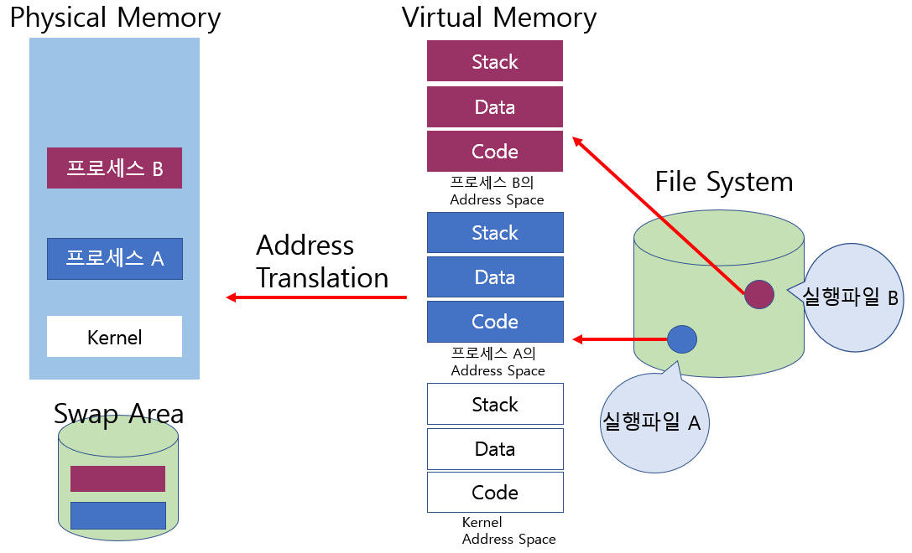

프로그램이 파일 시스템의 실행파일 형태(.exe)로 저장되어 있다가 실행시키면 프로세스가 된다. 프로세스는 독자적인 주소공간인 Virtual Memory라는 것을 생성한다. 주소변환을 해주는 하드웨어에 의해서 당장 필요한 부분은 물리적 메모리에 올라가고, 물리적 메모리는 공간이 한정되어 있으므로 나머지는 Disk의 Swap Area에 저장한다.

<br/>

Memory Mapped I/O를 쓰는 대표적인 방법이 실행파일에 해당하는 Code 부분이다. `Code 영역`은 `read-only`이며, 별도의 Swap Area 영역을 가지고 있지 않고 파일 시스템에 파일로 존재하는 내용이 그대로 프로세스 주소영역에 매핑이 되어있다.<br/>
만약, 이프로그램이 특정 Code에 접근하는데 메모리에 안올라와 있다면 Swap Area에서 올리는 것이 아니라 파일에서 올려 써야한다. `Code`은 메모리에 올라간 상태에서 쫓겨날 때도 Swap Area에 적재되지 않는다. `read-only`라서 File System에 저장되어 있기 때문이다.

<br/>

실행파일도 파일시스템에 저장되어 있지만 데이터 파일도 저장되어있다.
프로그램이 실행되다가 자신의 메모리 접근만 하는 것이 아니라 파일의 내용을 읽어오라는 read 시스템 콜을 할 수 있고, Memory Mapped I/O를 쓸 수 도 있다.

<br/>

<hr/>

### 8-2. Memory Mapped I/O를 사용한 프로그램

<br/>

데이터 파일을 읽을때 시스템 콜이 아닌 Memory Mapped I/O를 쓴다면, mmap 시스템 콜을 이용하여 데이터 파일의 일부를 자신의 주소공간 일부에 매핑해달라고 운영체제 요청해야한다.

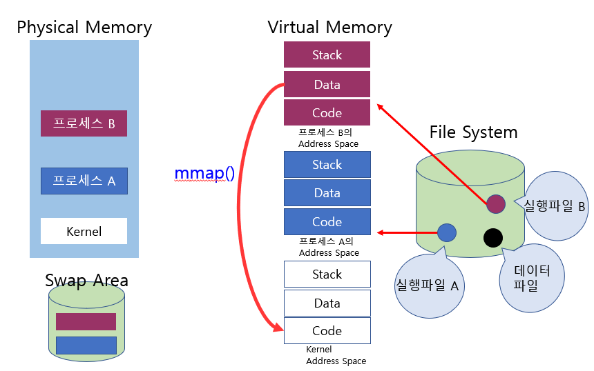

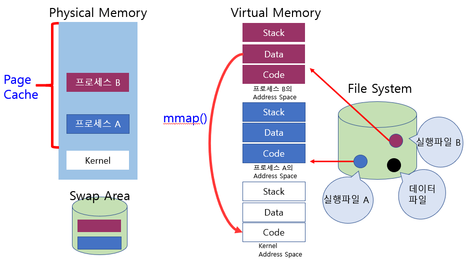

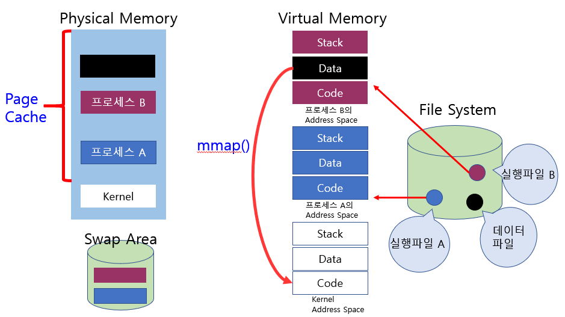

- 위의 검은색 블록은 Page Fault가 발생한 예시이다.

```
1. 운영체제가 데이터 파일의 일부를 Virtual Memory 주소공간 일부에 매핑을 해준다.

2. 프로그램이 실행되면서 이 메모리 위치를 접근했을 때 메모리에 적재되어 있지 않다면 Page Fault를 일으킨다.

3. Page Fault가 일어났다면 운영체제는 Page Fault가 일어난 Page를 물리적 메모리에 올려준다.

4. 가상 메모리 Page가 물리적 메모리의 Page와 Mapping이 되어 접근할때는 운영체제 도움을 받지 않아도 된다. 운영체제 도움없이 물리적 메모리에 읽거나 쓸 수 있다.

5. 메모리에 쫓겨날 때는 Swap Area에 쫓아내지 않고 File System에 수정된 내용을 써주고 메모리에서 쫓아낸다.
```

<br/>

<hr/>

### 8-3. read/write 시스템 콜을 사용한 프로그램

<br/>

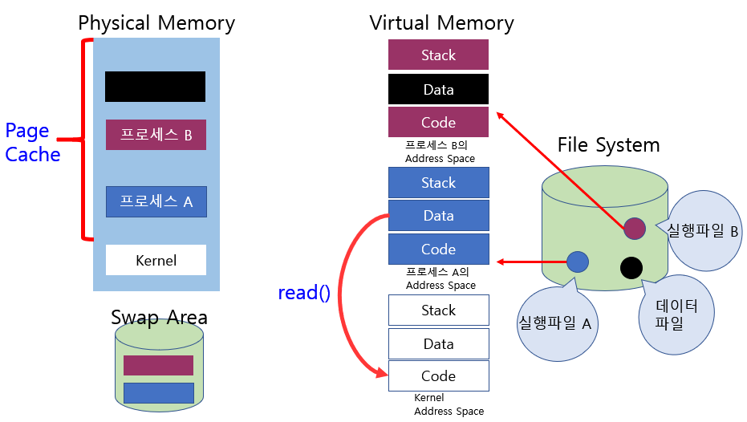

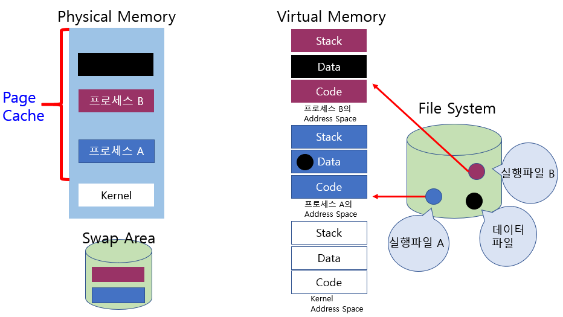

```
1. read 시스템콜로 파일 요청힌다. 운영체제에 CPU 제어권이 넘어간다.

2. 운영체제는 자신의 Buffer Cache에서 내용을 읽어온다.

3. Unified Buffer Cache는 요청한 데이터 파일의 내용이 이미 Buffer Cache에 올라와 있다면 그 내용을 카피해서 사용자 프로세스에게 전달한다.
```

<br/>

<hr/>

## 출처

- 반효경, 운영체제와 정보기술의 원리

- Abraham Silberschatz, Operating System Concept

- https://rebro.kr/

- https://woonys.tistory.com/entry/%EC%9A%B4%EC%98%81%EC%B2%B4%EC%A0%9CPintOS-Project-4-File-system-2-File-system-implementation-%EC%A0%95%EA%B8%80%EC%82%AC%EA%B4%80%ED%95%99%EA%B5%90-86%EC%9D%BC%EC%B0%A8-TIL

- https://velog.io/@gang_shik/%ED%8C%8C%EC%9D%BC-%EC%8B%9C%EC%8A%A4%ED%85%9CFile-System

- https://movahws.tistory.com/157

- https://jhi93.github.io/category/os/2019-12-28-operatingsystem-10-3/

<hr/>

#### Edited by pythonstrup (myvelop.tistory.com)

<hr/>
